# Core Workflows

**文档版本**: 1.0  
**生成时间**: 2026-01-24 08:59:33 UTC  
**系统名称**: Cowork Forge AI Agent System  

## 1. 工作流概述

### 1.1 系统核心工作流架构

Cowork Forge AI Agent System 采用基于多智能体协作的8阶段软件开发工作流架构，实现从需求收集到代码交付的完整自动化流程。系统核心工作流围绕软件开发生命周期设计，每个阶段由专业化智能体负责，通过统一的工作流编排器协调执行。

### 1.2 核心执行路径

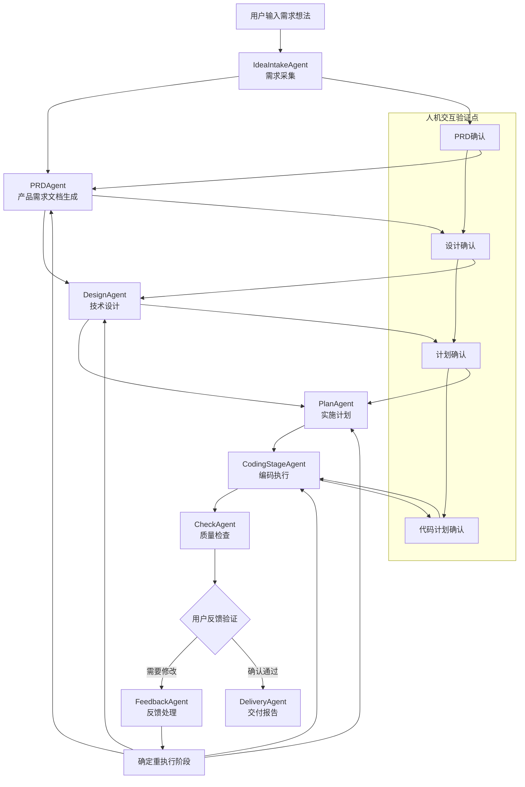

### 1.3 关键流程节点

系统包含以下关键流程节点：
- **需求结构化节点**：将用户非结构化需求转化为结构化IdeaSpec
- **文档生成节点**：基于LLM生成PRD、设计文档等专业文档
- **代码规划节点**：分析项目结构并生成详细的代码变更计划
- **代码执行节点**：安全执行代码变更操作
- **质量验证节点**：多语言项目验证和安全检查
- **反馈处理节点**：用户反馈分析和流程重定向决策

### 1.4 流程协调机制

系统采用分层协调机制：
- **编排层**：Orchestrator负责整体工作流调度和阶段依赖管理
- **执行层**：StageExecutor提供统一的智能体执行框架
- **智能体层**：各领域智能体负责具体业务逻辑处理
- **工具层**：文件工具和命令工具提供基础设施支持

## 2. 主要工作流程

### 2.1 软件开发全生命周期工作流

#### 2.1.1 流程启动阶段

**输入**: 用户自然语言需求描述  
**输出**: 结构化IdeaSpec工件  
**关键组件**: IdeaIntakeAgent, HitlController

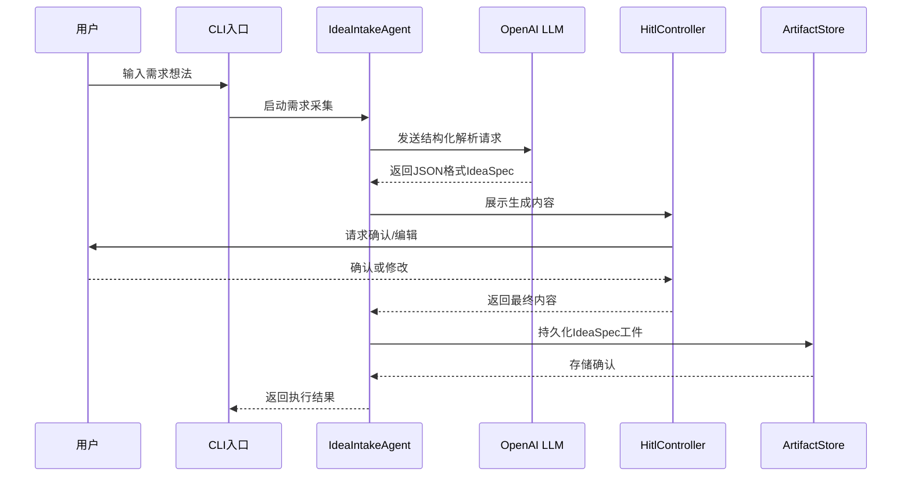

#### 2.1.2 文档生成阶段

**PRD生成流程**:
- 输入: IdeaSpec工件
- 处理: PRDAgent调用LLM生成产品需求文档
- 输出: PRD工件（包含需求、约束、HITL问题）
- HITL验证: 用户审查和确认PRD内容

**技术设计流程**:
- 输入: PRD工件
- 处理: DesignAgent生成技术架构和组件设计
- 输出: DesignDoc工件
- 关键技术: C4架构模型应用

#### 2.1.3 计划制定阶段

**输入**: DesignDoc工件  
**输出**: Plan工件（包含任务列表、里程碑）  
**关键处理**:
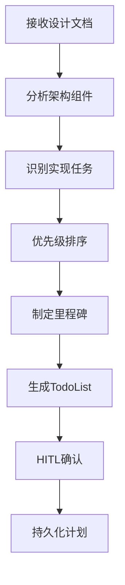

#### 2.1.4 代码生成和执行阶段

**代码规划子流程**:
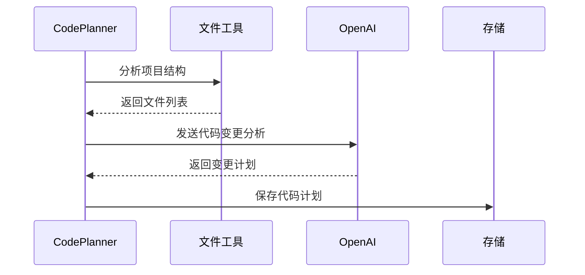

**代码执行子流程**:
- **单文件模式**: 针对≤3个文件的变更，使用单个LLM代理
- **批量模式**: 针对>3个文件的变更，使用多个子代理并行处理
- **安全机制**: WatchDog监控执行过程，防止目标偏离
- **验证集成**: 执行后自动触发构建和测试验证

#### 2.1.5 质量检查阶段

**检查维度**:
- 文件存在性和内容质量检查
- 语言特定编译验证（Rust, Python, JavaScript/TypeScript）
- 需求覆盖率分析
- 验证命令执行和结果分析

**验证执行流程**:
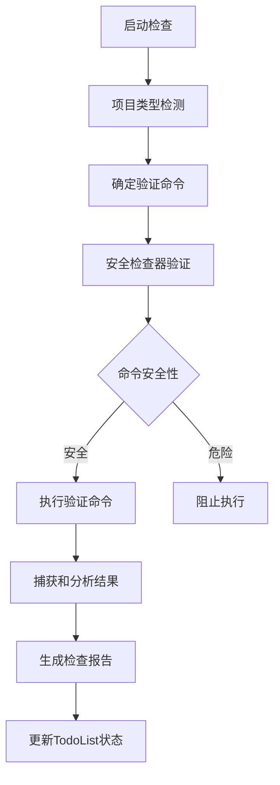

#### 2.1.6 反馈和迭代阶段

**反馈处理逻辑**:
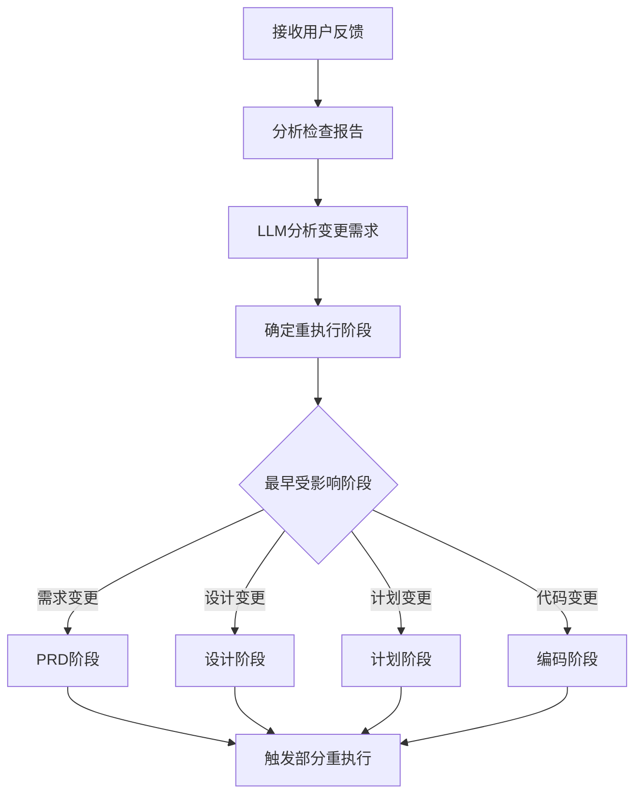

### 2.2 人机交互验证工作流

#### 2.2.1 HITL验证流程

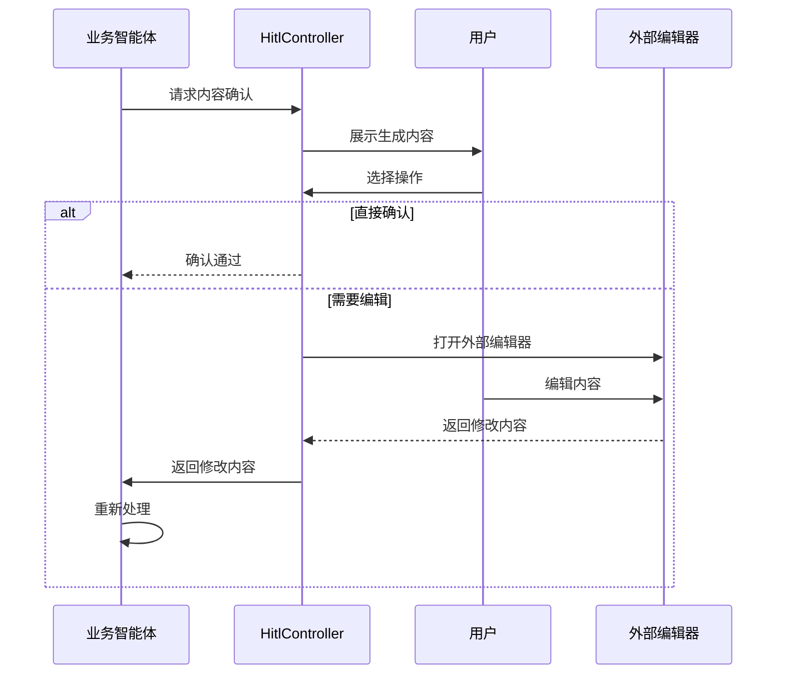

#### 2.2.2 关键验证点
- **PRD确认点**: 确认产品范围、需求定义是否准确
- **设计确认点**: 验证技术架构和组件设计的合理性
- **计划确认点**: 确认任务分解和里程碑设置的可行性
- **代码计划确认点**: 审查代码变更计划的安全性和完整性

### 2.3 代码变更管理工作流

#### 2.3.1 增量更新流程

**输入**: 变更后的PRD或设计文档  
**处理**: CodeUpdater分析变更差异，生成增量更新计划  
**输出**: 针对性的代码变更指令

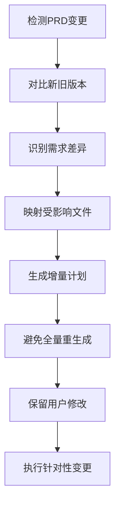

#### 2.3.2 代码执行安全机制

**多层安全保障**:
1. **命令安全检查**: 防止危险命令执行（rm -rf, sudo等）
2. **路径访问控制**: 限制对系统关键目录的访问
3. **构建工具白名单**: 只允许合法的开发工具执行
4. **超时控制**: 防止长时间运行的阻塞操作

### 2.4 智能体监控工作流

#### 2.4.1 WatchDog监控流程

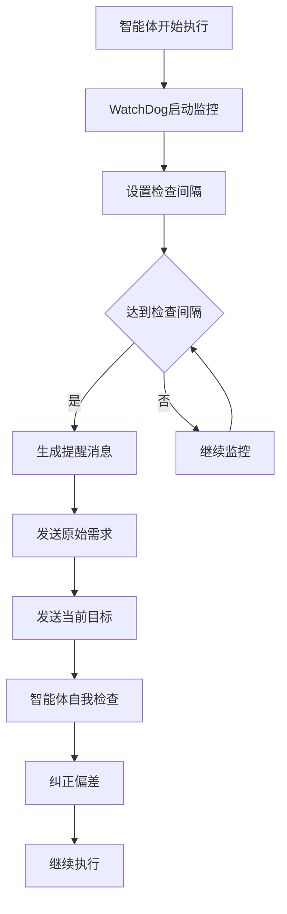

#### 2.4.2 监控指标
- **工具调用计数**: 防止无限循环和资源耗尽
- **目标一致性**: 确保执行方向与原始需求一致
- **执行进度**: 跟踪阶段完成状态
- **错误率监控**: 及时发现异常执行模式

## 3. 流程协调与控制

### 3.1 多模块协调机制

#### 3.1.1 编排器协调逻辑

Orchestrator作为系统核心协调器，实现以下协调功能：

**阶段依赖管理**:
```rust
// 伪代码示例：阶段依赖检查
fn check_stage_dependencies(current_stage: Stage) -> Result<(), Error> {
    match current_stage {
        Stage::PRD => require_artifact(Stage::IdeaIntake),
        Stage::Design => require_artifact(Stage::PRD),
        Stage::Plan => require_artifact(Stage::Design),
        Stage::Coding => require_artifact(Stage::Plan),
        Stage::Check => require_artifact(Stage::Coding),
        Stage::Feedback => require_artifact(Stage::Check),
        Stage::Delivery => require_artifact(Stage::Check),
        _ => Ok(())
    }
}
```

**会话生命周期管理**:
- 会话创建和初始化
- 阶段状态跟踪和持久化
- 中断恢复和继续执行
- 资源清理和会话关闭

#### 3.1.2 阶段执行器统一框架

StageExecutor提供标准化的智能体执行模板：

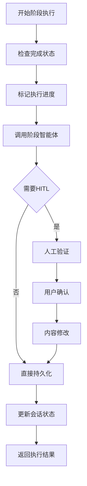

### 3.2 状态管理与同步

#### 3.2.1 工件状态机

每个工件经历的状态变迁：
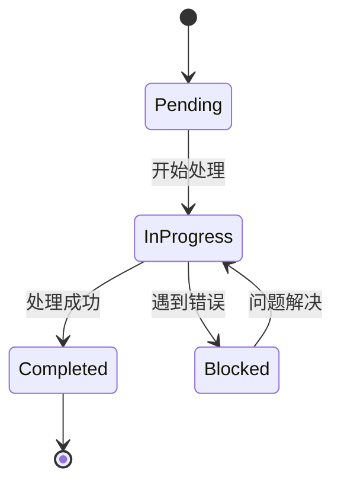

#### 3.2.2 TodoList状态管理

TodoListManager实现任务状态自动化跟踪：
- **状态推断**: 根据文件生成结果自动更新任务状态
- **阻塞检测**: 基于验证报告识别阻塞任务
- **进度统计**: 实时计算完成度和剩余工作量
- **报告生成**: 提供结构化的状态摘要

### 3.3 数据传递与共享

#### 3.3.1 工件数据流

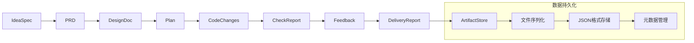

#### 3.3.2 上下文数据共享

BatchContext提供跨文件上下文管理：
- **文件元数据聚合**: 汇总导出、导入、关键类型信息
- **多语言支持**: Rust, Python, JavaScript, HTML语义分析
- **一致性维护**: 确保代码生成过程中的上下文一致性
- **摘要生成**: 生成指导后续代码生成的格式化摘要

## 4. 异常处理与恢复

### 4.1 错误检测与处理

#### 4.1.1 智能体执行异常处理

**常见异常类型**:
- LLM调用超时或失败
- 文件操作权限错误
- 命令执行失败
- 数据序列化错误

**处理策略**:
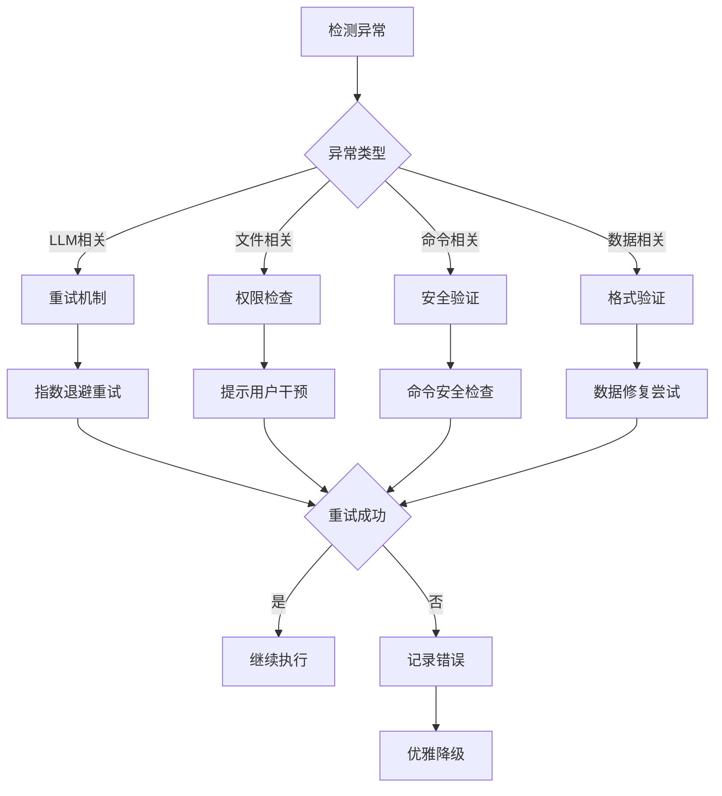

#### 4.1.2 错误分析器功能

ErrorAnalyzer提供结构化错误处理：
- **多语言错误解析**: 支持Rust, Python, JavaScript错误格式
- **影响分析**: 识别受影响文件和错误严重程度
- **分类统计**: 按类型和严重程度分类错误
- **修复指导**: 提供错误修复的建议和指导

### 4.2 异常恢复机制

#### 4.2.1 会话恢复机制

**中断恢复流程**:
1. **状态检查**: 读取持久化的会话状态
2. **工件验证**: 检查各阶段工件的完整性
3. **依赖重建**: 重新建立阶段间的依赖关系
4. **继续执行**: 从中断点继续工作流执行

#### 4.2.2 部分重执行机制

FeedbackAgent实现的智能重执行：
```rust
// 伪代码：重执行阶段决策
fn determine_rerun_stages(feedback: FeedbackArtifact) -> Vec<Stage> {
    let mut stages = Vec::new();
    
    if feedback.requires_requirements_change {
        stages.push(Stage::PRD);
    }
    if feedback.requires_design_change {
        stages.push(Stage::Design);
    }
    if feedback.requires_plan_change {
        stages.push(Stage::Plan);
    }
    if feedback.requires_code_change {
        stages.push(Stage::Coding);
    }
    
    // 返回需要重执行的最早阶段
    stages.sort();
    stages.dedup();
    stages
}
```

### 4.3 容错策略设计

#### 4.3.1 多层次容错

**工具层容错**:
- 文件操作: 自动重试和权限处理
- 命令执行: 超时控制和输出捕获
- 网络请求: 连接重试和故障转移

**业务层容错**:
- 数据验证: 输入验证和格式检查
- 状态一致性: 事务性操作和状态回滚
- 资源管理: 自动清理和资源回收

#### 4.3.2 降级策略

**LLM服务降级**:
- 本地缓存响应
- 简化处理逻辑
- 人工干预模式

**系统资源降级**:
- 限制并发执行
- 优先关键操作
- 资源使用监控

## 5. 关键流程实现

### 5.1 核心算法流程

#### 5.1.1 代码规划算法

CodePlanner的核心算法流程：

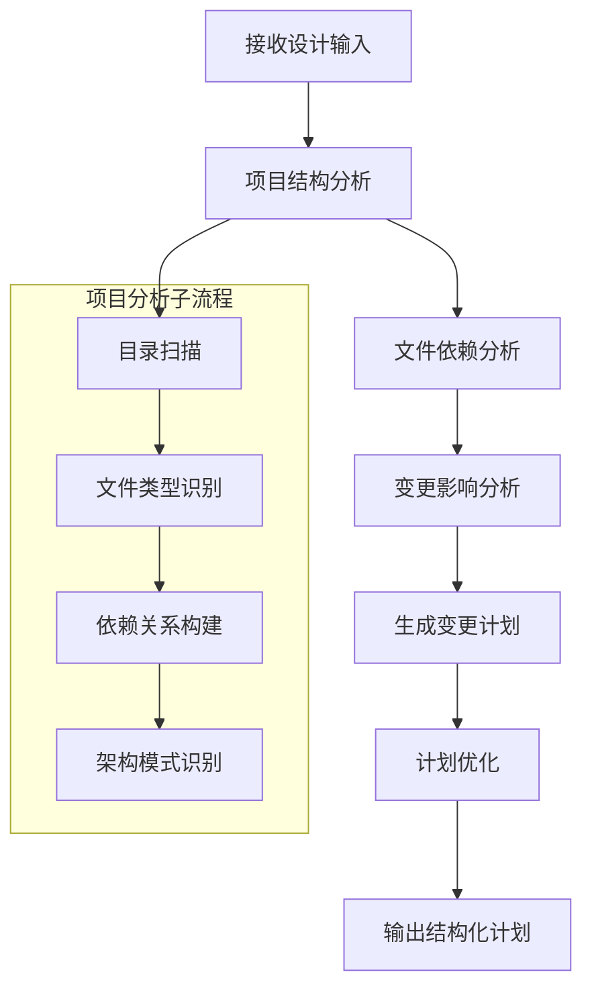

#### 5.1.2 需求追踪算法

**需求-代码映射**:
```python
# 伪代码：需求覆盖率计算
def calculate_requirement_coverage(prd_artifact, code_files):
    total_requirements = len(prd_artifact.requirements)
    covered_requirements = 0
    
    for requirement in prd_artifact.requirements:
        if is_requirement_implemented(requirement, code_files):
            covered_requirements += 1
    
    coverage_rate = covered_requirements / total_requirements
    return coverage_rate
```

### 5.2 数据处理管道

#### 5.2.1 工件处理管道

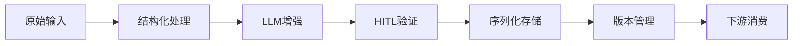

#### 5.2.2 文件处理管道

FileTools提供的安全文件操作：
- **原子操作**: 确保文件操作的原子性
- **冲突检测**: 防止并发写入冲突
- **回滚机制**: 操作失败时自动回滚
- **性能优化**: 大文件的分块处理

### 5.3 业务规则执行

#### 5.3.1 安全规则执行

Safety组件实现的多层安全规则：

**命令安全规则**:
```rust
// 伪代码：命令安全检查
fn check_command_safety(command: &str) -> SafetyLevel {
    if contains_dangerous_patterns(command) {
        return SafetyLevel::Blocked;
    }
    
    if accesses_sensitive_paths(command) {
        return SafetyLevel::Suspicious;
    }
    
    if is_whitelisted_tool(command) {
        return SafetyLevel::Safe;
    }
    
    SafetyLevel::Suspicious
}
```

#### 5.3.2 质量规则执行

CheckAgent执行的质量检查规则：
- **代码质量规则**: 空文件检测、TODO标记检查
- **编译规则**: 语言特定编译验证
- **测试规则**: 测试覆盖率和通过率
- **安全规则**: 安全漏洞和最佳实践

### 5.4 技术实现细节

#### 5.4.1 异步处理架构

系统采用异步处理模式提高并发性能：

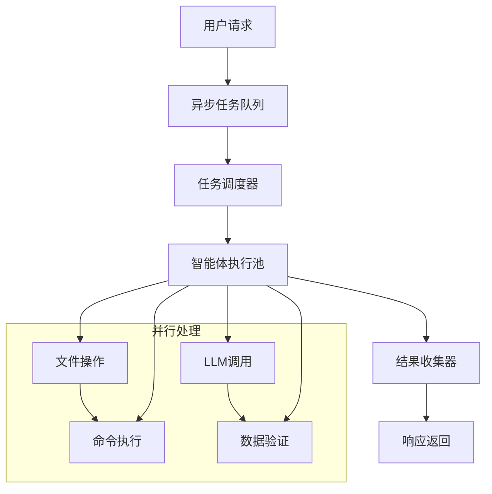

#### 5.4.2 性能优化策略

**资源管理优化**:
- 连接池管理: LLM连接复用
- 内存优化: 大文件流式处理
- 缓存策略: 频繁访问数据缓存
- 并发控制: 任务并行度优化

**执行效率优化**:
- 批量处理: 多个文件同时处理
- 增量更新: 避免全量重生成
- 懒加载: 按需加载大型工件
- 预处理: 提前计算复杂操作

## 6. 流程监控与优化

### 6.1 执行监控指标

#### 6.1.1 关键性能指标(KPI)

**工作流级别KPI**:
- 阶段执行时间分布
- 成功率/失败率统计
- 用户交互频率分析
- 资源使用效率

**智能体级别KPI**:
- LLM调用响应时间
- 工具使用频率分析
- 错误类型分布
- 缓存命中率

#### 6.1.2 质量监控指标

**代码质量指标**:
- 需求覆盖率
- 测试通过率
- 编译错误率
- 安全漏洞数量

**用户体验指标**:
- HITL确认时间
- 用户满意度评分
- 反馈处理效率
- 交付物质量评价

### 6.2 流程优化建议

#### 6.2.1 性能优化方向

**并行化优化**:
- 阶段间并行执行探索
- 智能体任务拆分优化
- 资源竞争减少策略
- 缓存策略优化

**响应性优化**:
- LLM调用预加载
- 增量处理优化
- 用户交互流程简化
- 错误恢复加速

#### 6.2.2 质量提升方向

**准确性提升**:
- LLM提示工程优化
- 上下文信息增强
- 验证规则完善
- 反馈机制改进

**可靠性提升**:
- 异常处理覆盖完善
- 恢复机制强化
- 监控告警完善
- 测试覆盖提升

---

**文档总结**: 本核心工作流文档详细描述了Cowork Forge AI Agent System的完整工作流程，涵盖了从需求收集到代码交付的全生命周期管理。系统采用智能体协作架构，通过精细的流程协调和异常处理机制，确保软件开发过程的高效性和可靠性。文档为开发团队提供了清晰的流程实现指导，为运维团队提供了完善的监控和故障处理方案。