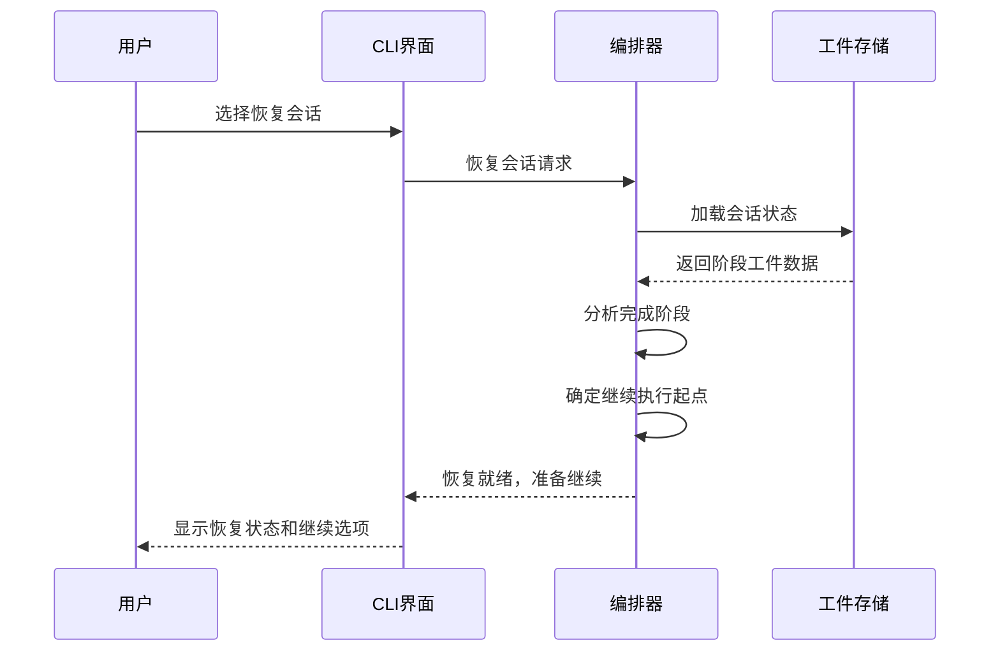

# Core Workflows

## 1. 工作流概览

### 1.1 系统主工作流
Cowork AI 多智能体软件开发系统实现了完整的8阶段AI驱动开发工作流，从创意输入到最终交付形成一个闭环的迭代开发流程。系统以工作流编排器为核心，协调多个专业智能体协同工作，每个智能体负责特定的开发阶段任务。

### 1.2 核心执行路径
```mermaid
flowchart TD
   [用户创意输入] --> B[创意输入智能体]
    B --> C[PRD生成智能体]
    C --> D[设计智能体]
    D --> E[计划智能体]
    E --> F[代码执行智能体]
    F --> G[检查智能体]
    G --> H{质量检查通过?}
    H -->|否| I[反馈智能体]
    I --> F
    H -->|是| J[交付智能体]
    J --> K[最终交付物]
    
    L[人工介入点] --> C
    L --> D
    L --> E
    L --> F
    L --> G
    
    M[会话恢复] --> N[加载会话状态]
    N --> O[识别当前阶段]
    O --> P[从指定阶段继续]
    P --> Q[继续后续流程]
    
    style A fill:#e1f5fe
    style K fill:#c8e6c9
    style L fill:#fff3e0
    style M fill:#f3e5f5
```

### 1.3 关键流程节点
系统包含以下核心流程节点：
- **创意输入节点**：将非结构化用户输入转化为结构化IdeaSpec
- **需求分析节点**：基于创意规范生成结构化PRD
- **技术设计节点**：生成系统架构和技术方案
- **实施计划节点**：制定详细的代码实现计划
- **代码生成节点**：执行代码生成和文件修改
- **质量检查节点**：多维度验证代码质量
- **反馈处理节点**：分析反馈并确定重做阶段
- **交付报告节点**：生成最终交付物

### 1.4 流程协调机制
系统通过工作流编排器实现流程协调，采用基于会话的状态管理机制，支持流程中断恢复和阶段重定向。智能体之间通过标准化的工件数据格式进行数据传递，确保流程的连续性和一致性。

## 2. 主要工作流

### 2.1 AI驱动软件开发主流程

#### 2.1.1 流程启动阶段
**执行入口**：`crates/cowork-cli/src/main.rs`
- 用户通过CLI输入创意描述或选择恢复现有会话
- 系统初始化日志、加载模型配置、创建编排器和工件存储
- 根据用户命令路由到相应执行模式（新建会话/恢复会话）

#### 2.1.2 创意输入阶段
**执行智能体**：`crates/cowork-core/src/agents/idea_intake.rs`


**关键处理逻辑**：
- 使用LLM将自然语言描述解析为结构化IdeaSpec
- 提取背景、目标、非目标、约束条件、成功标准等字段
- 生成摘要信息并建立工件元数据和版本跟踪

#### 2.1.3 PRD生成阶段
**执行智能体**：`crates/cowork-core/src/agents/prd_agent.rs`

**输入输出数据流**：
- **输入**：IdeaSpec工件（包含创意背景、目标等）
- **处理**：构建详细上下文提示，调用LLM生成结构化PRD
- **输出**：PRD工件（包含范围、需求、约束、HITL问题）

**执行细节**：
- 从IdeaSpec构建详细的上下文提示字符串
- 使用严格的JSON输出模式调用LLM代理
- 通过内存会话服务捕获生成的输出
- 验证和解析JSON响应，确保数据完整性
- 保存PRD工件并建立与IdeaSpec的关联关系

#### 2.1.4 技术设计阶段
**执行智能体**：`crates/cowork-core/src/agents/design_agent.rs`

**处理流程**：


**设计内容覆盖**：
- CLI模式和操作界面设计
- 工作流阶段和状态转换设计
- 架构层次和组件关系设计
- 输入输出规范和数据格式设计

#### 2.1.5 实施计划阶段
**执行智能体**：`crates/cowork-core/src/agents/plan_agent.rs`

**计划生成逻辑**：
- **C4架构建模**：上下文、容器、组件、代码层次规划
- **任务分解**：优先级划分、依赖关系分析、工作量评估
- **里程碑设定**：完成标准和验收条件定义
- **待办清单**：具体实施任务和验证方法制定

**关键技术实现**：
- 从设计文档构建详细的规划上下文
- 使用严格的JSON输出模式确保结构化输出
- 通过内存会话服务管理规划状态
- 生成可执行的计划工件用于后续代码生成

#### 2.1.6 代码执行阶段
**执行智能体**：`crates/cowork-core/src/agents/code_executor.rs`

**代码生成策略**：


**智能执行特性**：
- **动态提示构建**：基于项目上下文、文件数量和批次上下文
- **文件工具集成**：丰富的文件操作工具（读写、追加、删除等）
- **执行监控**：WatchDog机制确保符合原始需求
- **人工确认**：HITL控制器支持用户审核和确认

#### 2.1.7 质量检查阶段
**执行智能体**：`crates/cowork-core/src/agents/check_agent.rs`

**多层验证机制**：
1. **需求覆盖验证**：检查修改文件是否映射到PRD需求
2. **文件存在性验证**：确认生成文件的完整性和可访问性
3. **内容质量检查**：检测空文件、TODO标记等质量问题
4. **语言编译检查**：执行语言特定的编译和语法验证

**检查报告生成**：
- 通过/失败检查结果汇总
- 问题详细描述和定位信息
- 待办清单完成状态跟踪
- 覆盖率指标和质量管理

#### 2.1.8 反馈处理和交付阶段
**反馈处理智能体**：`crates/cowork-core/src/agents/feedback_agent.rs`
- 分析用户反馈和检查报告
- 确定必要的变更和重做阶段
- 生成反馈工件指导迭代改进

**交付智能体**：`crates/cowork-core/src/agents/delivery_agent.rs`
- 汇总所有阶段成果生成最终交付报告
- 包含功能说明、使用指南、已知限制等
- 建立完整的交付工件链

### 2.2 会话恢复和管理流程

#### 2.2.1 会话状态恢复机制
**执行组件**：`crates/cowork-core/src/orchestrator/mod.rs`



#### 2.2.2 状态识别和流程重定向
**关键技术实现**：
- **会话状态分析**：通过工件存储读取所有阶段工件
- **完成阶段识别**：基于工件存在性和完整性判断进度
- **智能重定向**：从最后一个完整阶段继续执行
- **数据一致性保证**：确保恢复后流程数据连续性

### 2.3 增量代码更新流程

#### 2.3.1 需求变更检测和处理
**执行智能体**：`crates/cowork-core/src/agents/code_updater.rs`

**更新策略**：


#### 2.3.2 智能合并机制
- **需求映射分析**：基于原始需求到文件的映射关系
- **变更影响评估**：识别需要修改的具体代码部分
- **用户修改保护**：避免覆盖用户自定义的实现
- **冲突检测和解决**：提供冲突解决指导策略

### 2.4 人工介入控制流程

#### 2.4.1 HITL交互模式
**执行组件**：`crates/cowork-core/src/hitl/mod.rs`

**支持的交互类型**：
- **文本输入收集**：获取用户自由格式输入
- **是/否确认**：关键决策点的用户确认
- **JSON内容编辑**：结构化内容的可视化编辑和验证
- **内容审核**：简化版的内容审查界面
- **反馈收集**：带默认值的反馈信息收集
- **菜单选择**：多选项的用户选择界面

#### 2.4.2 介入点决策逻辑


## 3. 流程协调和控制

### 3.1 多模块协调机制

#### 3.1.1 编排器核心协调逻辑
**核心组件**：`crates/cowork-core/src/orchestrator/mod.rs`

**协调策略**：
- **阶段顺序管理**：确保8个开发阶段按正确顺序执行
- **智能体调用协调**：根据阶段需求调用相应智能体
- **数据流管理**：确保工件数据在阶段间正确传递
- **状态同步**：维护全局会话状态的一致性

#### 3.1.2 智能体执行框架
**统一接口**：`crates/cowork-core/src/agents/mod.rs`

**框架特性**：
- **标准化执行接口**：所有智能体实现统一的Agent trait
- **执行上下文管理**：提供一致的执行环境和参数传递
- **结果格式标准化**：确保智能体输出格式的一致性
- **错误处理统一**：统一的异常处理和重试机制

### 3.2 状态管理和同步

#### 3.2.1 会话状态管理
**数据持久化**：`crates/cowork-core/src/memory/mod.rs`

**状态管理机制**：
- **会话级别隔离**：每个开发会话独立的状态空间
- **工件版本控制**：支持工件的多版本管理和回溯
- **元数据跟踪**：完整的操作历史和时间戳记录
- **关系链维护**：建立工件之间的关联关系链

#### 3.2.2 实时状态同步
**状态同步策略**：
- **增量状态更新**：只同步发生变化的状态数据
- **一致性检查**：定期验证状态数据的一致性
- **冲突解决**：检测和解决状态冲突的机制
- **恢复点设置**：关键操作点的状态快照保存

### 3.3 数据传递和共享

#### 3.3.1 工件数据模型
**数据定义**：`crates/cowork-core/src/artifacts/mod.rs`

**数据传递机制**：


#### 3.3.2 数据共享策略
- **结构化数据格式**：所有工件使用统一的JSON格式
- **元数据 enrichment**：每个工件包含完整的上下文信息
- **版本依赖管理**：建立清晰的版本依赖关系
- **数据验证机制**：确保传入数据的完整性和有效性

### 3.4 执行控制和调度

#### 3.4.1 工作流调度算法
**调度策略**：
- **阶段依赖分析**：基于数据依赖关系的智能调度
- **资源优化分配**：根据任务复杂度分配计算资源
- **优先级管理**：关键路径任务的优先执行
- **并发控制**：支持并行执行的任务调度

#### 3.4.2 执行控制机制
**控制特性**：
- **中断恢复支持**：从任意阶段恢复执行的机制
- **进度跟踪**：实时监控各阶段执行进度
- **超时处理**：执行超时的检测和处理
- **资源限制**：计算资源和存储资源的限制管理

## 4. 异常处理和恢复

### 4.1 错误检测和处理

#### 4.1.1 多层错误检测机制
**错误分析智能体**：`crates/cowork-core/src/agents/error_analyzer.rs`

**错误检测层次**：
1. **语法错误检测**：代码编译和语法检查错误
2. **逻辑错误检测**：业务逻辑和流程逻辑错误
3. **数据错误检测**：数据格式和完整性错误
4. **性能错误检测**：执行性能和资源使用错误

#### 4.1.2 实时错误监控
**监控机制**：
- **WatchDog监控**：`crates/cowork-core/src/agents/watchdog.rs`
- **定期健康检查**：系统组件健康状态监控
- **性能指标收集**：关键性能指标的实时收集
- **异常模式识别**：基于历史数据的异常模式识别

### 4.2 异常恢复机制

#### 4.2.1 智能重试策略
**重试逻辑**：


#### 4.2.2 状态回滚机制
**回滚策略**：
- **事务性操作**：关键操作的原子性保证
- **状态快照**：重要操作前的状态备份
- **增量回滚**：只回滚失败操作的影响
- **一致性验证**：回滚后的状态一致性检查

### 4.3 容错策略设计

#### 4.3.1 组件级容错
**容错机制**：
- **智能体隔离**：单个智能体故障不影响整体系统
- **服务降级**：主要功能不可用时的降级方案
- **备用路径**：关键路径故障时的备用执行路径
- **资源隔离**：计算资源和存储资源的隔离保护

#### 4.3.2 系统级容错
**系统容错特性**：
- **分布式状态**：状态数据的多副本存储
- **故障转移**：主要组件故障时的自动转移
- **负载均衡**：工作负载的智能分配和平衡
- **容量规划**：基于历史数据的资源容量预测

### 4.4 失败重试和降级

#### 4.4.1 自适应重试算法
**重试算法实现**：
- **基于错误类型的重试策略**：不同错误类型采用不同重试策略
- **动态重试间隔**：根据系统负载动态调整重试间隔
- **重试次数限制**：防止无限重试的资源浪费
- **重试优先级**：关键操作的高优先级重试

#### 4.4.2 优雅降级机制
**降级策略**：
- **功能降级**：非核心功能的临时禁用
- **性能降级**：降低服务质量保证系统可用性
- **人工介入降级**：自动流程故障时转为人工处理
- **数据降级**：使用缓存数据或简化数据模型

## 5. 关键流程实现

### 5.1 核心算法流程

#### 5.1.1 代码规划规范化算法
**执行组件**：`crates/cowork-core/src/agents/code_plan_normalizer.rs`

**规范化算法**：
```rust
// 伪代码示例：代码规划数据规范化流程
fn normalize_code_plan(raw_plan: Json) -> NormalizedPlan {
    // 1. 项目布局规范化
    let layout = normalize_project_layout(raw_plan.layout);
    
    // 2. 模块结构规范化
    let modules = normalize_modules(raw_plan.modules);
    
    // 3. 命令数组规范化
    let commands = normalize_commands(raw_plan.commands);
    
    // 4. 构建规范化计划
    NormalizedPlan {
        layout,
        modules,
        commands,
        metadata: generate_metadata()
    }
}
```

**关键技术**：
- **启发式推断**：基于命名模式和内容分析的智能推断
- **模式匹配**：常见schema偏差的模式识别和修正
- **数据完整性**：缺失字段的智能填充和验证

#### 5.1.2 批次上下文生成算法
**执行组件**：`crates/cowork-core/src/agents/batch_context.rs`

**上下文生成流程**：
1. **文件分析**：多语言源代码的语义信息提取
2. **结构汇总**：公共声明、导入导出关系的结构化汇总
3. **标记生成**：人类可读的Markdown格式汇总生成
4. **指令优化**：AI代理指令的优化和一致性保证

### 5.2 数据处理管道

#### 5.2.1 工件数据处理管道
**数据流架构**：


#### 5.2.2 实时数据处理
**处理特性**：
- **流式处理**：支持实时数据流的处理和分析
- **增量更新**：只处理发生变化的数据部分
- **状态管理**：实时状态的一致性维护
- **性能优化**：大数据量下的处理性能优化

### 5.3 业务规则执行

#### 5.3.1 开发阶段规则引擎
**规则类型**：
- **阶段顺序规则**：开发阶段的执行顺序约束
- **数据依赖规则**：阶段间数据传递的依赖关系
- **质量门禁规则**：进入下一阶段的质量标准
- **资源分配规则**：计算资源和存储资源的分配策略

#### 5.3.2 规则执行引擎
**执行机制**：
- **规则解析**：业务规则的结构化解析和验证
- **条件评估**：规则前提条件的动态评估
- **动作执行**：规则触发时的具体动作执行
- **结果反馈**：规则执行结果的反馈和记录

### 5.4 技术实现细节

#### 5.4.1 异步执行架构
**技术实现**：基于Rust async/await的异步执行模型

**架构优势**：
- **高并发处理**：支持大量并发任务的并行处理
- **资源高效**：非阻塞I/O操作提高资源利用率
- **响应迅速**：快速响应用户交互和系统事件
- **可扩展性**：易于扩展新的处理模块和功能

#### 5.4.2 文件操作工具实现
**核心组件**：`crates/cowork-core/src/tools/file_tools.rs`

**工具特性**：
- **原子操作**：文件操作的原子性保证
- **增量编辑**：支持行级的精确文件编辑
- **参数验证**：基于JSON Schema的参数验证
- **错误处理**：完善的错误处理和恢复机制

#### 5.4.3 配置管理系统
**配置管理**：`crates/cowork-core/src/config.rs`

**配置特性**：
- **多源配置**：支持文件配置和环境变量配置
- **类型安全**：强类型的配置数据访问
- **热重载**：配置变更的热重载支持
- **验证机制**：配置数据的完整性和有效性验证

通过以上详细的流程分析和实现细节描述，Cowork AI系统展现了一个高度自动化、智能化的软件开发工作流体系，为开发团队提供了从创意到交付的完整AI辅助开发解决方案。