# CLI Entry Point Documentation

## Overview

The CLI Entry Point serves as the primary user interface for the Cowork Forge system, providing command-line access to all AI-powered software development workflows. This module acts as a thin facade layer that handles user input, configuration loading, and command routing while delegating core business logic to the underlying `cowork-core` module.

## Architecture and Design

### Dual Implementation Strategy

Cowork Forge maintains two CLI implementations to support evolutionary development:

1. **cowork-cli-v2** (Primary): Modern implementation using the ADK (Agent Development Kit) framework
2. **cowork-cli** (Legacy): Original implementation with custom orchestration logic

Both versions implement the same core functionality but differ in their architectural approach and dependency structure.

### Core Responsibilities

The CLI Entry Point handles the following key responsibilities:

- **Command Parsing**: Processes user input via `clap` argument parsing
- **Configuration Management**: Loads system configuration from TOML files or environment variables
- **Session Management**: Creates and manages development sessions
- **Pipeline Orchestration**: Initiates appropriate workflow pipelines based on user commands
- **User Experience**: Provides real-time feedback, streaming output, and progress indicators

## Command Structure

### Available Commands

The CLI supports multiple subcommands to manage the complete software development lifecycle:

| Command | Description | Usage |
|---------|-------------|--------|
| `new` | Start a new project from an idea | `cowork new "Build a REST API service"` |
| `resume` | Resume interrupted session | `cowork resume` |
| `modify` | Modify project from specific stage | `cowork modify --from design` |
| `status` | Show project artifacts and status | `cowork status` |
| `init` | Initialize configuration file | `cowork init` |

### Global Flags

- `--config`: Custom configuration file path
- `--verbose`: Enable detailed logging
- `--stream`: Show real-time LLM thinking process

## Implementation Details

### V2 Architecture (cowork-cli-v2)

The V2 implementation leverages the ADK framework for agent orchestration:

```rust[derive(Parser)]
#[command(name = "cowork-v2")]
struct Cli {
    #[command(subcommand)]
    command: Commands,
    
    #[arg(short, long, global = true)]
    config: Option<String>,
    
    #[arg(short, long, global = true)]
    verbose: bool,
    
    #[arg(short, long, global = true)]
    stream: bool,
}
```

**Key Features:**
- Built on `adk_runner` and `adk_session` for agent execution
- Uses `InMemorySessionService` for session state management
- Implements real-time streaming with `futures::StreamExt`
- Provides enhanced error handling with `anyhow::Result`

### Legacy Architecture (cowork-cli)

The legacy implementation uses custom orchestration logic:

```rust
struct Cli {
    #[command(subcommand)]
    command: Option<Commands>,
    
    #[arg(long, default_value = "config.toml")]
    config: String,
}
```

**Key Features:**
- Custom `Orchestrator` and `ArtifactStore` implementations
- Interactive mode with console styling
- Session-based workflow management
- Built-in inspection and export capabilities

## Workflow Integration

### New Project Creation

```mermaid
sequenceDiagram
    participant User
    participant CLI
    participant Pipeline
    participant ADK_Runner
    
    User->>CLI: cowork new "Project idea"
    CLI->>CLI: Validate .cowork directory doesn't exist
    CLI->>Pipeline: create_cowork_pipeline(config)
    Pipeline-->>CLI: Arc<dyn Agent>
    CLI->>ADK_Runner: execute_pipeline(idea, enable_stream)
    ADK_Runner->>User: Stream LLM output (if enabled)
    CLI->>User: "✅ Project creation complete!"
```



### Project Resumption

```mermaid
sequenceDiagram
    participant User
    participant CLI
    participant Storage
    participant Pipeline
    
    User->>CLI: cowork resume
    CLI->>Storage: cowork_dir_exists()
    Storage-->>CLI: true/false
    alt Directory exists
        CLI->>Pipeline: create_resume_pipeline(config)
        Pipeline-->>CLI: Resume pipeline
        CLI->>User: "🔄 Resuming project..."
    else Directory missing
        CLI->>User: Error: "No project found"
    end
```



## Configuration Management

The CLI handles configuration loading with fallback mechanisms:

```rust
fn load_config(path: &str) -> Result<ModelConfig> {
    if Path::new(path).exists() {
        ModelConfig::from_file(path)
    } else {
        ModelConfig::from_env()
    }
}
```

**Configuration Sources:**
1. Primary: `config.toml` file
2. Fallback: Environment variables
3. Default values for missing parameters

## Error Handling and Validation

### Pre-execution Validation

The CLI performs several validation checks before executing workflows:

- **Project Existence**: Validates `.cowork` directory state for `new`/`resume` commands
- **Configuration Integrity**: Ensures valid LLM configuration before agent execution
- **Stage Validity**: Validates stage names for `modify` command
- **Session Management**: Ensures session consistency across operations

### Error Recovery

- Graceful fallback from file-based to environment-based configuration
- Clear error messages with actionable suggestions
- Session state preservation during failures
- Comprehensive logging for debugging

## User Experience Features

### Real-time Feedback

- **Streaming Output**: Optional real-time display of LLM reasoning process
- **Progress Indicators**: Visual status updates with emojis and color coding
- **Structured Logging**: Configurable verbosity levels with `tracing_subscriber`

### Session Management

- **Session Persistence**: Automatic saving of intermediate artifacts
- **State Inspection**: Built-in commands to review session progress
- **Resumable Workflows**: Ability to pause and continue development sessions

## Integration Points

### External Dependencies

The CLI integrates with several external systems:

- **LLM Services**: OpenAI API via `ModelConfig`
- **File System**: Artifact storage in `.cowork/` directory
- **Shell Environment**: Command execution for verification
- **Code Editors**: HITL integration for manual review

### Internal Modules

Key internal dependencies:

- **cowork-core-v2**: Pipeline creation and agent orchestration
- **adk_runner**: Agent execution framework
- **adk_session**: Session state management
- **clap**: Command-line argument parsing

## Best Practices

### Configuration Management

1. **Environment Override**: Use environment variables for sensitive data
2. **Version Control**: Exclude `config.toml` from version control
3. **Validation**: Validate configuration before pipeline execution

### Session Management

1. **State Consistency**: Always validate session state before operations
2. **Error Recovery**: Implement graceful degradation for session failures
3. **Cleanup**: Provide mechanisms for session cleanup and archival

### User Experience

1. **Progressive Disclosure**: Show detailed info only when requested (`--verbose`)
2. **Real-time Feedback**: Use streaming for long-running operations
3. **Clear Messaging**: Provide actionable error messages and success indicators

## Evolution and Migration

The dual CLI implementation strategy supports smooth migration:

- **V2 Features**: ADK integration, improved streaming, enhanced error handling
- **Backward Compatibility**: Maintains same command structure and workflows
- **Gradual Migration**: Allows parallel testing and validation

The CLI Entry Point exemplifies the system's commitment to user-centered design while maintaining technical excellence through modular architecture and robust error handling.