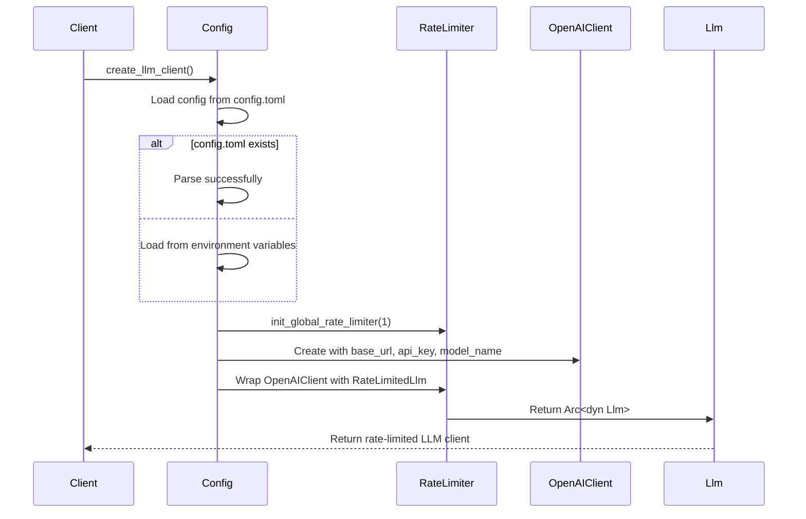

# LLM Infrastructure Domain Documentation

## Overview

The **LLM Infrastructure Domain** in Cowork Forge is a foundational infrastructure component responsible for managing the configuration, initialization, and rate-limited access to Large Language Model (LLM) services. This domain ensures that all AI-driven development activities—ranging from requirement generation to code production—are executed in a controlled, sustainable, and compliant manner with external LLM providers such as OpenAI or compatible APIs.

As a critical enabler of the system’s AI-powered workflow, the LLM Infrastructure Domain abstracts the complexity of LLM client management, providing a unified, safe, and scalable interface for all pipeline stages and agent-driven tools. It enforces operational constraints (e.g., request throttling) to prevent API quota violations, supports flexible configuration via both files and environment variables, and ensures consistent client behavior across CLI and GUI interfaces.

This domain is not a business logic component but a vital infrastructure layer that underpins the reliability and performance of the entire AI-assisted development pipeline.

---

## Architecture and Design Principles

The LLM Infrastructure Domain follows a **clean architecture** pattern, decoupling configuration logic from client instantiation and rate-limiting enforcement. It adheres to the following key design principles:

### 1. **Separation of Concerns**
- **Configuration**: Handles parsing and fallback strategies for LLM settings.
- **Client Creation**: Instantiates the actual LLM client (e.g., OpenAI-compatible).
- **Rate Limiting**: Enforces global concurrency and inter-request delays independently of the client.

### 2. **Dependency Inversion**
- The domain exposes a generic `Arc<dyn Llm>` interface, allowing downstream components (e.g., Pipeline Domain) to interact with LLMs without knowledge of the underlying implementation (OpenAI, Anthropic, etc.).
- This enables future extensibility to other LLM providers without modifying pipeline logic.

### 3. **Fail-Safe Configuration**
- Configuration is loaded in a prioritized fallback sequence:
  1. `config.toml` (project-local, version-controlled)
  2. Environment variables (for deployment or CI/CD)
- If both fail, the system fails fast with a clear error, preventing silent misconfigurations.

### 4. **Concurrency Safety**
- Uses a global semaphore-based rate limiter to enforce strict concurrency limits.
- All LLM requests are serialized through a single-threaded, delay-enforced wrapper, ensuring compliance with API rate limits.

### 5. **Immutability and Shared Ownership**
- LLM clients are wrapped in `Arc<T>` (atomic reference counting) to allow safe, shared access across threads and pipeline stages.
- Configuration is loaded once at startup and remains immutable during runtime.

---

## Core Components

### 1. **LLM Configuration (`config.rs`)**

#### Purpose
Responsible for loading, parsing, and validating LLM configuration from multiple sources with fallback semantics.

#### Key Structures

```rust
#[derive(Debug, Clone, Serialize, Deserialize)]
pub struct LlmConfig {
    pub model: ModelConfig,
}

#[derive(Debug, Clone, Serialize, Deserialize)]
pub struct ModelConfig {
    pub base_url: String,
    pub api_key: String,
    pub model_name: String,
    pub temperature: Option<f32>,
    pub max_tokens: Option<u32>,
}
```

#### Configuration Sources (Priority Order)

| Source | Format | Example |
|-------|--------|---------|
| **1. config.toml** | TOML file in project root | `[llm]\nmodel.base_url = "https://api.openai.com/v1"\nmodel.api_key = "sk-..."` |
| **2. Environment Variables** | Standard OS env vars | `COWORK_LLM_BASE_URL`, `COWORK_LLM_API_KEY`, `COWORK_LLM_MODEL_NAME` |

#### Behavior
- If `config.toml` exists and is valid, it takes precedence.
- If `config.toml` is missing or malformed, the system attempts to load values from environment variables.
- Missing required fields (e.g., `api_key`, `base_url`) result in a `anyhow::Error` with actionable guidance.
- Optional fields (e.g., `temperature`, `max_tokens`) default to sensible values if not specified.

#### Example `config.toml`
```toml
[llm]
model.base_url = "https://api.openai.com/v1"
model.api_key = "sk-xxxxxxxxxxxxxxxxxxxxxxxxxxxxxxxx"
model.model_name = "gpt-4o"
model.temperature = 0.3
model.max_tokens = 2048
```

#### Implementation Notes
- Uses `serde` and `serde-toml` for robust deserialization.
- Supports environment variable overrides using `std::env::var()` with `anyhow::Context` for meaningful error messages.
- Unit tests validate parsing of valid/invalid configurations, including edge cases (empty strings, malformed URLs).

---

### 2. **Rate Limiter (`rate_limiter.rs`)**

#### Purpose
Prevents exceeding LLM API quotas by enforcing global concurrency limits and mandatory delays between requests.

#### Key Mechanisms

| Feature | Implementation |
|--------|----------------|
| **Concurrency Control** | Uses `tokio::sync::Semaphore` with a capacity of **1** (strictly serializes all LLM calls). |
| **Request Delay** | Enforces a **minimum 2-second interval** between consecutive requests using `tokio::time::sleep`. |
| **Global Singleton** | Initialized once at application startup via `init_global_rate_limiter()`. |
| **Transparent Wrapper** | Wraps the base `OpenAIClient` in `RateLimitedLlm`, which implements the `Llm` trait. |

#### RateLimitedLlm Implementation

```rust
pub struct RateLimitedLlm {
    client: OpenAIClient,
    semaphore: Arc<Semaphore>,
    delay: Duration,
}

impl Llm for RateLimitedLlm {
    async fn generate_content(&self, prompt: &str, system_prompt: Option<&str>) -> Result<String, LlmError> {
        let _permit = self.semaphore.acquire().await.map_err(|_| LlmError::SemaphoreAcquireFailed)?;
        tokio::time::sleep(self.delay).await;
        self.client.generate_content(prompt, system_prompt).await
    }
}
```

#### Why This Design?
- **Prevents Rate Limit Errors**: Most LLM APIs (e.g., OpenAI) impose 60 RPM (requests per minute) or 3 RPM for free tiers. A 2-second delay ensures compliance even under aggressive usage.
- **Avoids Threading Issues**: A global semaphore ensures no two threads can simultaneously call the LLM, eliminating race conditions and token exhaustion.
- **Non-Blocking**: Uses async/await with `tokio`, allowing other tasks to proceed while waiting for the delay or semaphore.

#### Configuration
- The concurrency limit and delay are hardcoded for now (`max_concurrent = 1`, `delay = 2 seconds`) to ensure safety.
- Future versions may support dynamic configuration via `config.toml`.

---

### 3. **LLM Client Factory (`create_llm_client`)**

#### Purpose
The central entry point for initializing a fully configured, rate-limited LLM client. This function is called once during system startup (e.g., in `main.rs` or Tauri app initialization).

#### Function Signature
```rust
pub fn create_llm_client() -> Result<Arc<dyn Llm>, LlmError>
```

#### Workflow


#### Key Features
- **Unified Interface**: Returns `Arc<dyn Llm>`, hiding implementation details from pipeline stages.
- **Error Handling**: Uses `anyhow::Result` with contextual errors (e.g., “Failed to parse API key from env var COWORK_LLM_API_KEY”).
- **Extensibility**: The `Llm` trait can be implemented for other providers (e.g., Anthropic, Mistral) without changing pipeline code.

#### Usage in Pipeline Domain
```rust
// In IterationExecutor::new()
let llm_client = create_llm_client().map_err(|e| PipelineError::LlmInitFailed(e))?;
let executor = IterationExecutor {
    llm: llm_client,
    // ... other dependencies
};
```

---

## Integration with Other Domains

| Domain | Interaction Type | Description |
|--------|------------------|-------------|
| **Pipeline Domain** | Service Call | Uses `Arc<dyn Llm>` to generate content in `IdeaStage`, `PRDStage`, `CodingStage`, etc. |
| **Tool Support Domain** | Service Call | Tools like `SavePrdDocTool` and `CodingStage` invoke LLM via the same client to generate artifacts. |
| **Storage Domain** | Indirect | No direct dependency; LLM output is persisted via file tools, but configuration is not stored. |
| **Interaction Domain** | Indirect | UI may display LLM status (e.g., “Waiting for AI response”) via event bus, but does not interact with LLM directly. |

> **Note**: The LLM Infrastructure Domain is **not** directly accessed by the GUI or CLI. Instead, both interfaces rely on the core engine’s `InteractiveBackend` and `PipelineExecutor`, which internally use the rate-limited LLM client.

---

## Configuration Best Practices

### For Developers
- Always define `config.toml` in your project root for reproducible environments.
- Use `.env` files (e.g., `dotenv`) for local development secrets, but **never commit them**.
- Validate your configuration before running `cowork run`:
  ```bash
  cargo run -- init
  # Checks config.toml and exits if invalid
  ```

### For Production / CI/CD
- Use environment variables for secrets:
  ```bash
  export COWORK_LLM_API_KEY="sk-..."
  export COWORK_LLM_BASE_URL="https://api.anthropic.com/v1"
  export COWORK_LLM_MODEL_NAME="claude-3-5-sonnet-20240620"
  cowork run
  ```
- Set `COWORK_LOG_LEVEL=debug` to trace LLM configuration loading.

### Security Considerations
- API keys are stored in plaintext in `config.toml` or environment variables. **Do not commit these to version control**.
- Future enhancements may integrate with system keyrings (e.g., macOS Keychain, Windows Credential Manager) or Vault.

---

## Error Handling and Observability

### Common Errors
| Error | Cause | Resolution |
|-------|-------|------------|
| `LLMConfigNotFound` | `config.toml` missing and env vars not set | Create `config.toml` or set environment variables |
| `InvalidBaseUrl` | Malformed URL (e.g., missing `https://`) | Ensure URL is valid and includes scheme |
| `MissingApiKey` | API key not provided | Set `COWORK_LLM_API_KEY` or add to `config.toml` |
| `SemaphoreAcquireFailed` | System panic during semaphore lock | Rare; indicates internal concurrency bug; report to maintainers |
| `LlmApiError` | LLM provider returned 4xx/5xx | Check API key permissions, model availability, or network connectivity |

### Logging
- All configuration loading and client creation events are logged at `INFO` level.
- LLM request failures are logged at `ERROR` level with full context (prompt hash, model name, status code).
- Enable verbose logging:
  ```bash
  COWORK_LOG_LEVEL=debug cowork run
  ```

---

## Testing and Validation

### Unit Tests
- `config.rs`: Tests for TOML parsing, environment variable override, and error cases.
- `rate_limiter.rs`: Tests for semaphore behavior, delay enforcement, and wrapper correctness.
- Integration test: `create_llm_client()` returns a valid `Arc<dyn Llm>` with no panics.

### Mocking for Pipeline Tests
Pipeline stages use `MockLlm` (implementing `Llm` trait) to avoid real API calls during unit tests:
```rust
#[cfg(test)]
mod tests {
    use super::*;
    use mockall::mock;

    mock! {
        pub Llm {}
        impl Llm for Llm {
            async fn generate_content(&self, prompt: &str, system_prompt: Option<&str>) -> Result<String, LlmError>;
        }
    }
}
```

---

## Future Enhancements

| Enhancement | Rationale |
|-----------|-----------|
| **Dynamic Rate Limiting** | Allow per-model or per-user rate limits via config (e.g., `max_requests_per_minute`). |
| **Fallback LLM Providers** | If primary LLM fails, auto-try secondary (e.g., OpenAI → Mistral). |
| **Token Usage Tracking** | Log tokens consumed per request for cost monitoring. |
| **Caching Layer** | Cache frequent prompts (e.g., boilerplate PRD templates) to reduce cost and latency. |
| **Key Rotation Support** | Integrate with secret rotation tools (e.g., AWS Secrets Manager, HashiCorp Vault). |
| **Health Check Endpoint** | Expose `/health/llm` endpoint in GUI to verify LLM connectivity. |

---

## Conclusion

The **LLM Infrastructure Domain** is a critical, low-level component that ensures the reliability, safety, and compliance of Cowork Forge’s AI-driven development workflow. By abstracting configuration, enforcing rate limits, and providing a clean interface to LLM services, it enables the higher-order domains (Pipeline, Tool Support, Memory) to focus on business logic without worrying about API quotas, network failures, or credential management.

Its design exemplifies modern Rust engineering practices: type safety, async concurrency, immutable configuration, and separation of concerns. With minimal code and maximum impact, this domain is a quiet but indispensable pillar of the Cowork Forge architecture.

> **Key Takeaway**: *You don’t need to understand how the LLM works—you just need to know that it’s safe, slow, and always available when you call it.*