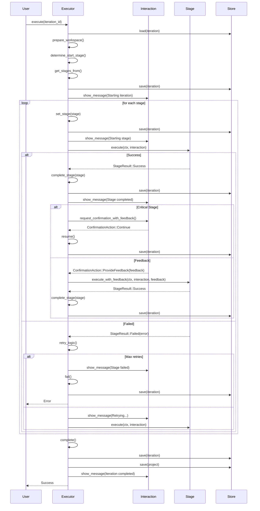

# Pipeline Domain Documentation

## Overview

The Pipeline Domain is the central orchestrator of Cowork Forge's AI-powered software development workflow. It implements the end-to-end iterative development process that transforms user requirements into fully documented, validated, and delivered software artifacts. This domain serves as the engine that coordinates the seven-stage development pipeline (Idea → PRD → Design → Plan → Coding → Check → Delivery), managing state transitions, human-in-the-loop interactions, retry logic, and workspace inheritance across iterations.

The Pipeline Domain follows a clean, modular architecture with a clear separation between the controller (IterationExecutor) and individual stage implementations. This design enables extensibility, testability, and maintainability while ensuring consistent behavior across CLI and GUI interfaces through the unified InteractiveBackend abstraction.

## Core Architecture

### Pipeline Executor: The Workflow Controller

The `IterationExecutor` is the central controller component responsible for managing the complete lifecycle of development iterations. It coordinates between persistence layers, interactive interfaces, and individual pipeline stages to execute the development workflow with sophisticated feedback and retry mechanisms.

#### Key Responsibilities:
- **Iteration Lifecycle Management**: Creates both genesis (first) and evolution (subsequent) iterations with inheritance support
- **Workspace Preparation**: Sets up isolated workspaces with configurable inheritance modes (Full, Partial, None)
- **Stage Orchestration**: Executes pipeline stages in sequence with error handling and retry logic
- **Human-in-the-Loop Coordination**: Manages confirmation requests and feedback loops at critical stages
- **State Persistence**: Updates iteration and project state after each stage completion
- **Progress Tracking**: Communicates execution status to the user interface through the InteractiveBackend

#### Implementation Details:
```rust
pub struct IterationExecutor {
    project_store: ProjectStore,
    iteration_store: IterationStore,
    interaction: Arc<dyn InteractiveBackend>,
}
```

The executor uses async/await patterns for non-blocking I/O operations and handles errors through the `anyhow` crate. It maintains a clean separation of concerns by delegating stage-specific logic to individual `Stage` implementations while managing the overall workflow.

#### Workspace Inheritance Logic:
The executor supports three inheritance modes to enable efficient iteration evolution:
- **None**: Fresh workspace (used for genesis iterations)
- **Full**: Copies all files from base iteration workspace
- **Partial**: Copies only non-code files (configurations, assets, documentation) and artifacts, excluding generated code

This approach ensures that each iteration starts with appropriate context while avoiding unnecessary code duplication and enabling targeted regeneration of artifacts.

### Pipeline Stages: Atomic Development Units

The Pipeline Domain implements seven distinct stages, each representing a specific phase of the software development lifecycle. Each stage is implemented as a separate Rust struct that implements the `Stage` trait, ensuring consistent interfaces and enabling easy extension.

#### Stage Implementation Pattern:
```rust
#[async_trait::async_trait]
impl Stage for IdeaStage {
    fn name(&self) -> &str { "idea" }
    fn description(&self) -> &str { "Idea - Capture and structure requirements" }
    
    async fn execute(&self, ctx: &PipelineContext, interaction: Arc<dyn InteractiveBackend>) -> StageResult {
        self.generate_idea(ctx, interaction, None).await
    }
    
    async fn execute_with_feedback(&self, ctx: &PipelineContext, interaction: Arc<dyn InteractiveBackend>, feedback: &str) -> StageResult {
        // Handle revision with user feedback
        self.generate_idea(ctx, interaction, Some(feedback)).await
    }
}
```

Each stage follows a consistent pattern:
1. **Load LLM configuration** from system settings
2. **Create LLM client** using the configured model
3. **Gather context** from previous artifacts and iteration data
4. **Generate prompt** tailored to the stage's purpose
5. **Call LLM** with structured request
6. **Process streaming response** from the LLM
7. **Write output** to artifact file in the iteration's workspace
8. **Notify UI** of completion status

#### Stage-Specific Implementations:

| Stage | Purpose | Key Artifacts Generated |
|-------|---------|------------------------|
| **Idea** | Captures and structures initial requirements | `idea.md` |
| **PRD** | Generates detailed product requirements document | `prd.md` |
| **Design** | Creates architectural design and component specifications | `design.md` |
| **Plan** | Produces implementation plan with tasks and timelines | `plan.md` |
| **Coding** | Generates source code files based on plan | `.rs`, `.js`, `.py`, etc. |
| **Check** | Performs automated quality assurance and code review | `check_report.md` |
| **Delivery** | Generates final delivery report and copies code to project root | `delivery_report.md` |

#### Critical Stages:
The `is_critical_stage()` function identifies stages that require human confirmation before proceeding:
```rust
pub fn is_critical_stage(stage_name: &str) -> bool {
    matches!(stage_name, "idea" | "prd" | "design" | "plan" | "coding")
}
```
These stages represent decision points where human oversight is essential to ensure alignment with project goals and quality standards.

### Pipeline Utilities: Supporting Infrastructure

The `pipeline/mod.rs` module provides essential utilities that enable the pipeline's operation:

#### Stage Enumeration:
```rust
pub fn get_all_stages() -> Vec<Box<dyn Stage>> {
    vec![
        Box::new(stages::IdeaStage),
        Box::new(stages::PrdStage),
        Box::new(stages::DesignStage),
        Box::new(stages::PlanStage),
        Box::new(stages::CodingStage),
        Box::new(stages::CheckStage),
        Box::new(stages::DeliveryStage),
    ]
}
```

#### Stage Sequencing:
```rust
pub fn get_stages_from(start_stage: &str) -> Vec<Box<dyn Stage>> {
    let all = get_all_stages();
    let start_idx = all.iter().position(|s| s.name() == start_stage).unwrap_or(0);
    all.into_iter().skip(start_idx).collect()
}
```

These utilities enable:
- **Resume functionality**: Restarting from any stage after interruption
- **Change request processing**: Modifying the pipeline to start from affected stages
- **Workflow flexibility**: Supporting different development approaches

#### Pipeline Context:
The `PipelineContext` struct provides a shared state container for all stages:
```rust
pub struct PipelineContext {
    pub project: Project,
    pub iteration: Iteration,
    pub workspace_path: std::path::PathBuf,
}
```
This context is passed to each stage, providing access to project metadata, iteration state, and the current workspace location without requiring direct dependencies on persistence layers.

## Workflow Execution Process

### Iteration Lifecycle

The Pipeline Domain orchestrates two primary iteration types:

#### Genesis Iteration (First Iteration)
1. **Create Project**: Initialize project entity with auto-generated ID
2. **Create Iteration**: Generate first iteration with provided description
3. **Prepare Workspace**: Create isolated `.cowork/sessions/<id>/` directory
4. **Execute Pipeline**: Run all seven stages sequentially
5. **Persist State**: Save iteration and update project reference

#### Evolution Iteration (Subsequent Iterations)
1. **Select Base**: Choose previous iteration as foundation
2. **Create Iteration**: Generate new iteration inheriting from base
3. **Prepare Workspace**: Apply inheritance mode (Full, Partial, or None)
4. **Execute Pipeline**: Run stages from start or resume point
5. **Persist State**: Save new iteration and update project reference

### Stage Execution Flow

The execution process follows a robust, fault-tolerant pattern:



### Retry and Feedback Mechanisms

The Pipeline Domain implements sophisticated error handling:

#### Retry Logic:
- Maximum of 3 retry attempts per stage
- 2-second delay between retries
- Automatic recovery from transient LLM failures
- Clear user feedback during retry attempts

#### Feedback Loops:
- Up to 5 revisions per critical stage
- Human-in-the-loop confirmation at key decision points
- Feedback injection into subsequent LLM prompts
- Artifact review capability before proceeding

## Integration with Other Domains

### Interaction Domain
The Pipeline Domain relies on the `InteractiveBackend` trait for all user communication:
- **Progress Updates**: `show_message()` and `show_progress()`
- **Human Confirmation**: `request_confirmation_with_feedback()`
- **Input Collection**: `request_input()` for custom feedback
- **Event Broadcasting**: Through the EventBus for UI synchronization

This abstraction enables consistent behavior across CLI and GUI interfaces while maintaining separation of concerns.

### Tool Support Domain
Pipeline stages interact with the system through the Tool Support Domain:
- **File Operations**: `WriteFileTool`, `ReadFileTool` for artifact management
- **Artifact Management**: `SavePrdDocTool`, `SaveDeliveryReportTool`
- **Memory Context**: `QueryMemoryIndexTool` for historical knowledge retrieval
- **Control**: `ProvideFeedbackTool`, `RequestReplanningTool`

This tool-based approach ensures safety boundaries and prevents direct access to system state by AI agents.

### Persistence Domain
The Pipeline Domain coordinates with persistence layers:
- **IterationStore**: Load/save iteration state and artifacts
- **ProjectStore**: Update project's current iteration and history
- **Session Storage**: Manage workspace isolation and inheritance

All persistence operations use the `.cowork/sessions/<id>/` directory structure for session-scoped isolation.

### Memory Domain
Pipeline stages leverage historical knowledge through memory tools:
- **Project Memory**: Access architectural decisions and patterns across iterations
- **Session Memory**: Utilize insights from previous stages within the same iteration
- **Context Injection**: Retrieved memory content is injected into LLM prompts to enhance consistency and quality

## Technical Implementation Details

### Stage Execution Protocol
Each stage follows a standardized execution protocol:

1. **Configuration Loading**: Load LLM model configuration from `config.toml` or environment variables
2. **Client Creation**: Initialize LLM client with rate limiting
3. **Context Gathering**: Collect relevant artifacts from previous stages
4. **Prompt Generation**: Create stage-specific prompts with structured requirements
5. **LLM Invocation**: Call LLM with streaming response handling
6. **Response Processing**: Aggregate streaming output into complete content
7. **Artifact Writing**: Save generated content to designated artifact path
8. **UI Notification**: Inform user of completion status
9. **Result Return**: Return `StageResult::Success` with artifact path or `StageResult::Failed` with error message

### Error Handling Strategy
The Pipeline Domain employs a comprehensive error handling strategy:
- **Graceful Degradation**: Failed stages return `StageResult::Failed` with descriptive messages
- **Retry Mechanism**: Automatic retries for transient failures
- **User Notification**: Clear error messages displayed through InteractiveBackend
- **State Preservation**: Iteration state is saved after each stage to prevent data loss
- **Failure Marking**: Iterations are marked as `Failed` after max retries

### Performance Considerations
The implementation prioritizes reliability over speed:
- **Streaming Responses**: LLM responses are processed incrementally to reduce memory usage
- **File System Optimization**: Non-code files are selectively copied during partial inheritance
- **Concurrency Control**: Rate limiting prevents exceeding LLM API quotas
- **Async/Await**: Non-blocking I/O operations maintain responsiveness

## Key Architectural Patterns

### Pipeline Pattern
The Pipeline Domain implements a classic pipeline pattern with:
- **Sequential Stage Execution**: Each stage produces output consumed by the next
- **Stage-Specific Responsibilities**: Clear separation of concerns
- **State Tracking**: Iteration status is updated after each stage
- **Feedback Loops**: Revisions are handled as first-class operations

### Tool-Based Agent Architecture
Following the ADK (Agent Development Kit) pattern:
- **No Direct Access**: AI agents cannot directly manipulate files or state
- **Mediated Interaction**: All system interactions occur through tool calls
- **Safety Boundaries**: Path validation and access control prevent security issues
- **Extensibility**: New tools can be added without modifying core logic

### Session-Based Isolation
Each iteration runs in an isolated workspace:
- **Clean Environment**: No contamination from previous iterations
- **Artifact Isolation**: Generated files are contained within session directory
- **Safe Inheritance**: Controlled copying of context between iterations
- **Traceability**: Complete audit trail of changes per iteration

### Event-Driven Communication
The system uses an event bus for real-time updates:
- **Pipeline Events**: `stage_started`, `agent_completed`, `iteration_completed`
- **UI Synchronization**: GUI updates in real-time without polling
- **Decoupled Components**: Pipeline execution independent of UI rendering

## Conclusion

The Pipeline Domain represents the core innovation of Cowork Forge, transforming the traditional software development lifecycle into an automated, AI-assisted workflow. By implementing a robust, extensible pipeline architecture with sophisticated human-in-the-loop mechanisms, the system enables developers to focus on high-value tasks while automating repetitive, error-prone activities.

The domain's success lies in its balanced approach:
- **Automation**: AI agents handle documentation, design, and code generation
- **Human Oversight**: Critical decisions require human confirmation
- **Traceability**: Complete audit trail of all changes and decisions
- **Consistency**: Standardized processes ensure quality across projects

The Pipeline Domain's clean architecture, well-defined interfaces, and comprehensive error handling make it a reliable foundation for AI-assisted software development, capable of evolving with emerging AI capabilities while maintaining stability and trustworthiness.