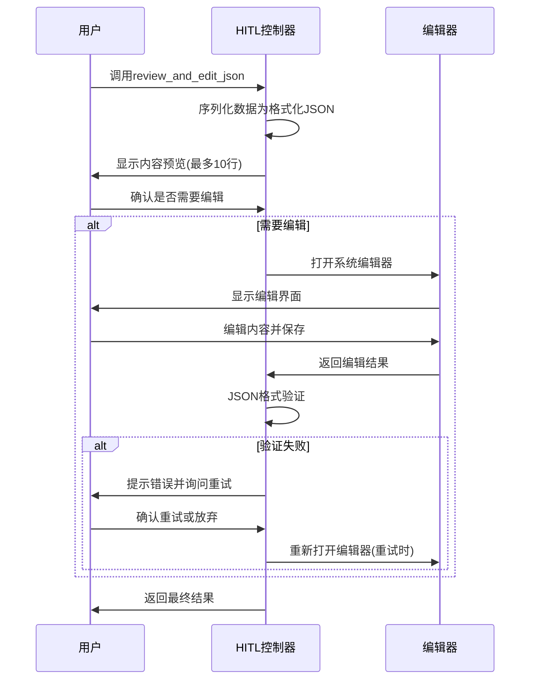
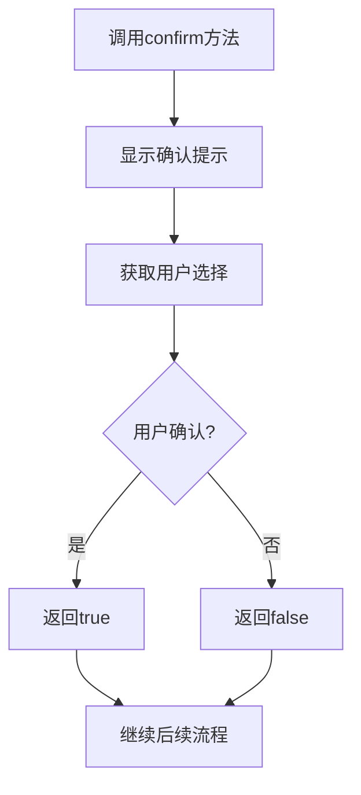

# Cowork AI 系统人工介入域技术文档

## 1. 模块概述

### 1.1 模块定位
人工介入域（Human-in-the-Loop Domain）是 Cowork AI 多智能体软件开发系统的核心业务组件，负责在自动化流程的关键决策点引入人工监督和确认。该模块作为 AI 决策与用户期望之间的桥梁，确保系统生成的内容符合用户需求和质量标准。

### 1.2 核心功能
- **用户输入收集**：提供多种交互方式收集用户输入
- **内容审核确认**：在关键决策点允许用户审核 AI 生成的内容
- **JSON 编辑验证**：支持用户编辑和验证结构化数据
- **反馈收集**：收集用户对生成结果的反馈意见
- **菜单选择**：提供选项菜单供用户选择

## 2. 架构设计

### 2.1 模块结构
```
人工介入域
├── HITL控制器 (HitlController)
│   ├── 输入收集 (input)
│   ├── 确认交互 (confirm)
│   ├── JSON审查编辑 (review_and_edit_json)
│   ├── 简化内容审查 (review)
│   ├── 反馈收集 (collect_feedback)
│   └── 菜单选择 (select)
```

### 2.2 技术栈
- **编程语言**: Rust
- **核心依赖**:
  - `dialoguer`: 命令行交互组件库
  - `serde`: 序列化/反序列化框架
  - `anyhow`: 错误处理库

## 3. 核心组件详细设计

### 3.1 HITL控制器 (HitlController)

#### 3.1.1 类定义
```rust
pub struct HitlController;

impl HitlController {
    pub fn new() -> Self { ... }
}
```

#### 3.1.2 设计模式
- **单例模式**: 通过 `new()` 方法创建控制器实例
- **默认实现**: 实现 `Default` trait 支持默认实例创建

### 3.2 交互方法详解

#### 3.2.1 文本输入收集 (`input`)
```rust
pub fn input(&self, prompt: &str) -> Result<String>
```
- **功能**: 收集用户文本输入
- **参数**: `prompt` - 输入提示信息
- **返回值**: 用户输入的字符串
- **实现**: 使用 `dialoguer::Input` 组件

#### 3.2.2 确认交互 (`confirm`)
```rust
pub fn confirm(&self, prompt: &str) -> Result<bool>
```
- **功能**: 获取是/否确认
- **默认值**: 设置为 `true` (默认同意)
- **使用场景**: 关键决策点确认、审核通过判断

#### 3.2.3 JSON 审查编辑 (`review_and_edit_json`)
```rust
pub fn review_and_edit_json<T>(&self, title: &str, data: &T) -> Result<Option<String>>
where T: Serialize
```

**流程设计**:
1. **内容预览**: 显示格式化的 JSON 预览（最多10行）
2. **编辑确认**: 询问用户是否需要修改
3. **编辑器集成**: 使用系统默认编辑器
4. **格式验证**: 自动验证 JSON 语法正确性
5. **重试机制**: 验证失败时提供重试选项

**返回值语义**:
- `Ok(Some(modified_json))`: 用户修改了内容
- `Ok(None)`: 用户接受原始内容
- `Err(_)`: 发生错误

#### 3.2.4 简化内容审查 (`review`)
```rust
pub fn review<T>(&self, title: &str, data: &T) -> Result<bool>
where T: Serialize + Display
```
- **功能**: 快速内容审查确认
- **特点**: 简化版审查，适合非结构化内容
- **显示格式**: 使用边框格式增强可读性

#### 3.2.5 反馈收集
提供两种反馈收集方式：
- `collect_feedback`: 空白编辑器收集反馈
- `collect_feedback_with_default`: 带默认内容的反馈收集

#### 3.2.6 菜单选择 (`select`)
```rust
pub fn select(&self, prompt: &str, options:[&str]) -> Result<usize>
```
- **功能**: 显示选项菜单供用户选择
- **默认选项**: 设置为第一个选项 (索引0)
- **返回值**: 选中项的索引位置

## 4. 交互流程设计

### 4.1 JSON 编辑验证流程


### 4.2 确认交互流程


## 5. 错误处理机制

### 5.1 错误类型
- **用户输入错误**: 输入验证失败
- **编辑器错误**: 无法打开或保存编辑器
- **JSON 解析错误**: 格式验证失败
- **序列化错误**: 数据转换失败

### 5.2 容错设计
- **重试机制**: JSON 验证失败时提供重试选项
- **默认回退**: 编辑失败时使用原始内容
- **优雅降级**: 简化版审查作为备选方案

## 6. 用户体验优化

### 6.1 视觉提示
- **表情符号**: 使用 📝、✅、❌、⚠️ 等增强可读性
- **边框格式**: 审查内容使用边框格式化显示
- **进度提示**: 明确指示当前操作状态

### 6.2 交互设计
- **默认值设置**: 合理设置默认选项减少用户操作
- **内容预览**: 限制预览行数避免信息过载
- **明确提示**: 清晰的操作指引和状态反馈

## 7. 集成使用场景

### 7.1 在工作流中的使用
人工介入域主要在工作流的以下关键点被调用：

1. **PRD 生成后**: 用户确认需求文档内容
2. **技术设计阶段**: 审核系统架构设计方案  
3. **代码生成前**: 确认实施计划
4. **质量检查后**: 审核检查报告和修改建议
5. **交付前**: 最终确认交付内容

### 7.2 与其他域的协作
- **工作流编排域**: 接收编排器的调用指令
- **智能体执行域**: 为智能体提供用户反馈输入
- **数据模型域**: 处理结构化数据的序列化/反序列化

## 8. 性能考虑

### 8.1 资源使用
- **内存占用**: JSON 序列化时注意大文件处理
- **编辑器启动**: 系统编辑器启动可能有性能开销
- **用户体验**: 交互响应时间应保持在可接受范围内

### 8.2 优化策略
- **懒加载**: 只在需要时进行数据序列化
- **分块处理**: 大文件内容分块显示和编辑
- **缓存机制**: 重复使用已序列化的数据

## 9. 扩展性设计

### 9.1 接口设计
所有交互方法遵循统一的错误处理模式和返回值约定，便于扩展新的交互类型。

### 9.2 可配置性
未来可考虑增加配置选项：
- 编辑器选择配置
- 预览行数配置
- 默认行为配置

## 10. 总结

人工介入域作为 Cowork AI 系统的关键组件，实现了自动化流程与人工监督的有效结合。通过精心设计的交互模式和用户体验优化，该模块确保了 AI 生成内容的质量控制和用户参与度，为系统的可靠性和实用性提供了重要保障。

该模块的设计体现了现代 AI 系统的典型特征：在保持自动化效率的同时，通过适度的人工介入确保最终结果符合用户期望，实现了人机协同的最佳平衡。