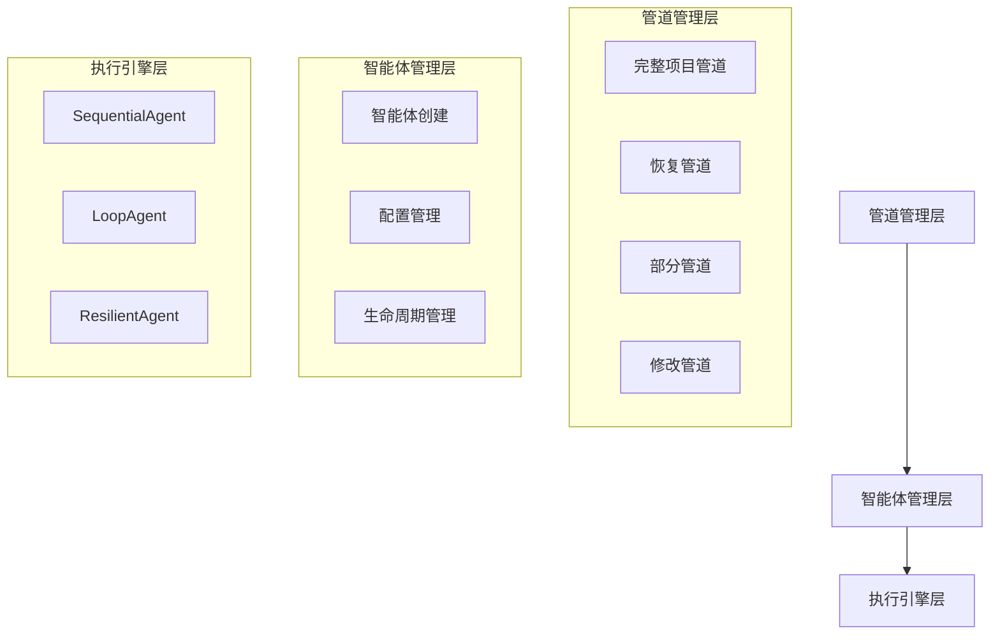
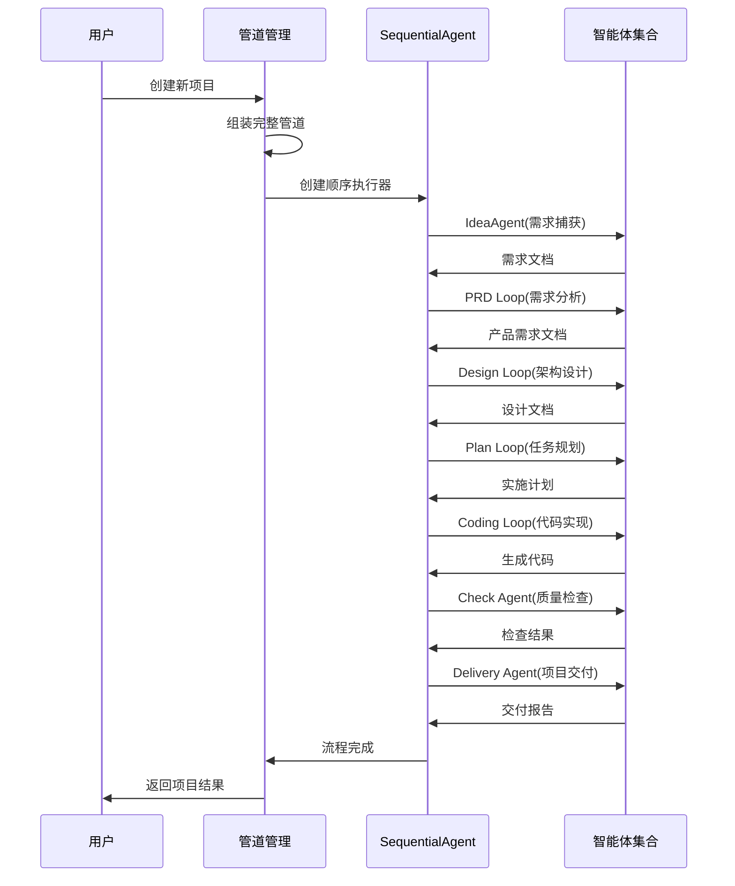
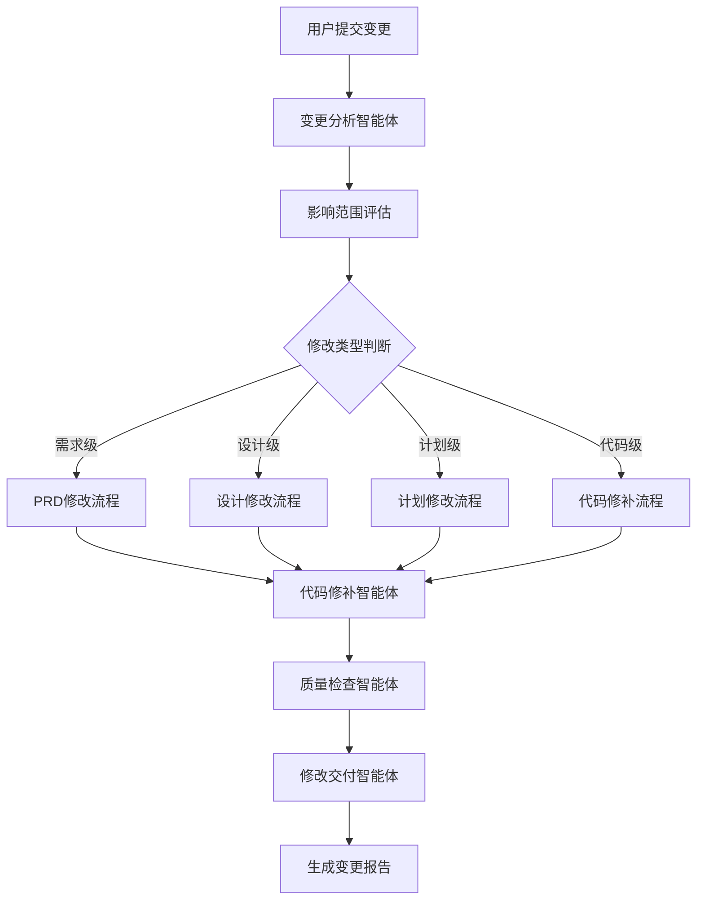
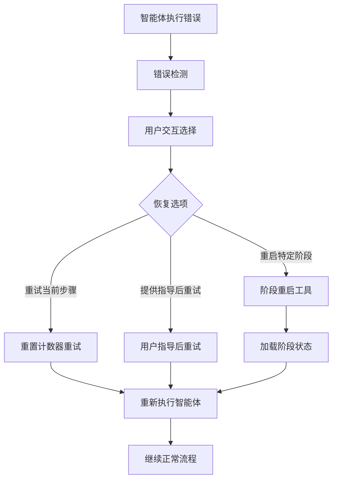

# Cowork Forge 工作流编排域技术文档

## 1. 域概述

工作流编排域是 Cowork Forge 系统的核心调度引擎，负责管理和协调AI智能体之间的协作流程。该域采用模块化架构设计，支持多种工作流模式，包括完整项目开发、增量修改、阶段恢复等复杂场景。

## 2. 架构设计

### 2.1 分层架构

工作流编排域采用三层架构设计：



### 2.2 核心模块

#### 2.2.1 管道管理模块 (`crates/cowork-core/src/pipeline/mod.rs`)

**职责范围：**
- 工作流管道的组装和配置
- 多种管道类型的支持
- 会话状态管理和流程控制

**核心功能：**

1. **完整项目管道** (`create_cowork_pipeline`)
   - 组装从需求捕获到项目交付的完整智能体序列
   - 包含7个核心阶段：Idea → PRD → Design → Plan → Coding → Check → Delivery

2. **恢复管道** (`create_resume_pipeline`)
   - 基于文件存在性检测确定恢复起点
   - 智能判断已完成阶段，避免重复执行
   - 支持从任意阶段继续执行

3. **部分管道** (`create_partial_pipeline`)
   - 支持从指定阶段开始执行
   - 适用于需求变更、架构重构等场景
   - 灵活的阶段组合机制

4. **修改管道** (`create_modify_pipeline`)
   - 增量修改专用管道
   - 包含变更分析、代码修补、质量检查等阶段
   - 支持对现有项目的安全修改

#### 2.2.2 智能体执行模块 (`crates/cowork-core/src/agents/mod.rs`)

**职责范围：**
- AI智能体的创建和配置
- 智能体间协作模式管理
- 执行流程控制和错误处理

**核心智能体类型：**

1. **简单智能体** (IdeaAgent, CheckAgent, DeliveryAgent)
   - 单一职责的智能体实现
   - 使用LlmAgentBuilder构建
   - 配备专用工具集

2. **循环智能体** (PRD Loop, Design Loop, Plan Loop, Coding Loop)
   - Actor-Critic模式的循环执行
   - 支持多轮迭代改进
   - 配备反馈机制和最大迭代次数控制

**关键技术实现：**

```rust
// Actor-Critic循环智能体构建示例
let mut loop_agent = LoopAgent::new(
    "prd_loop",
    vec![Arc::new(prd_actor), Arc::new(prd_critic)],
);
loop_agent = loop_agent.with_max_iterations(3); // 允许最多3次迭代
```

#### 2.2.3 人工介入模块 (`crates/cowork-core/src/agents/hitl.rs`)

**职责范围：**
- 人工介入循环(HITL)支持
- 错误恢复和重试机制
- 用户交互和决策支持

**核心组件：**

1. **ResilientAgent包装器**
   - 包装底层智能体提供错误恢复能力
   - 支持用户选择重试、指导或中止
   - 保持执行上下文的状态一致性

2. **错误处理机制**
   - 检测最大迭代次数错误
   - 提供多种恢复选项
   - 支持流程重启和状态恢复

## 3. 工作流模式

### 3.1 完整开发工作流



### 3.2 增量修改工作流



### 3.3 错误恢复工作流



## 4. 关键技术实现

### 4.1 智能体协作模式

**Actor-Critic循环模式：**
- Actor负责内容生成和执行
- Critic负责质量评估和反馈
- 通过LoopAgent实现多轮迭代
- 最大迭代次数控制避免无限循环

**关键技术问题解决：**
- 修复了SequentialAgent在LoopAgent调用exit_loop()后停止的问题
- 使用max_iterations=1替代exit_loop工具调用
- 确保流程的连续性和完整性

### 4.2 会话状态管理

**文件存在性检测：**
```rust
// 恢复起点检测逻辑
let start_stage = if has_code_files(base_session_id)? {
    "check"  // 代码文件存在 → 从检查阶段恢复
} else if has_implementation_plan(base_session_id)? 
    && has_design_spec(base_session_id)? 
    && has_requirements(base_session_id)? {
    "coding" // 计划、设计、需求存在 → 从编码阶段恢复
} else if has_design_spec(base_session_id)? && has_requirements(base_session_id)? {
    "plan"   // 设计、需求存在 → 从计划阶段恢复
} else if has_requirements(base_session_id)? {
    "design" // 需求存在 → 从设计阶段恢复
} else {
    "prd"    // 无数据或只有想法 → 从PRD阶段开始
};
```

### 4.3 工具集成机制

**智能体工具配置：**
- 每个智能体配备专用工具集
- 工具按功能域分类管理
- 支持会话感知的工具实例化

**示例工具配置：**
```rust
let coding_actor = LlmAgentBuilder::new("coding_actor")
    .instruction(CODING_ACTOR_INSTRUCTION)
    .model(model.clone())
    .tool(Arc::new(GetPlanTool::new(session.clone())))
    .tool(Arc::new(UpdateTaskStatusTool::new(session.clone())))
    .tool(Arc::new(ReadFileTool))
    .tool(Arc::new(WriteFileTool))
    .tool(Arc::new(RunCommandTool))
    .build()?;
```

## 5. 性能与可靠性

### 5.1 错误处理策略

**多层错误处理：**
1. **智能体级别错误处理** - 单个智能体的异常捕获
2. **循环智能体错误恢复** - Actor-Critic模式的错误反馈机制
3. **管道级别错误处理** - SequentialAgent的流程控制
4. **用户介入错误恢复** - HITL机制的人工干预

### 5.2 性能优化

**资源管理：**
- LLM客户端复用和连接池管理
- 智能体实例的按需创建
- 会话数据的懒加载机制

**执行效率：**
- 并行智能体执行的优化
- 大文件处理的流式处理
- 缓存机制的合理应用

## 6. 扩展性设计

### 6.1 新智能体集成

**扩展接口：**
- 标准化的智能体构建接口
- 工具集的模块化设计
- 配置驱动的智能体行为

### 6.2 工作流定制

**管道组合机制：**
- 灵活的智能体序列组装
- 支持自定义阶段组合
- 条件执行路径的支持

## 7. 总结

工作流编排域作为Cowork Forge系统的核心调度引擎，通过精心的架构设计和实现，提供了强大而灵活的工作流管理能力。该域的成功实现解决了AI智能体协作中的关键技术挑战，为自动化软件开发流程奠定了坚实基础。

**核心价值：**
- 支持多种复杂工作流场景
- 提供可靠的错误恢复机制
- 具备良好的扩展性和维护性
- 确保了开发流程的质量和效率

该域的技术实现体现了现代软件工程的最佳实践，为类似AI驱动系统的开发提供了有价值的参考。