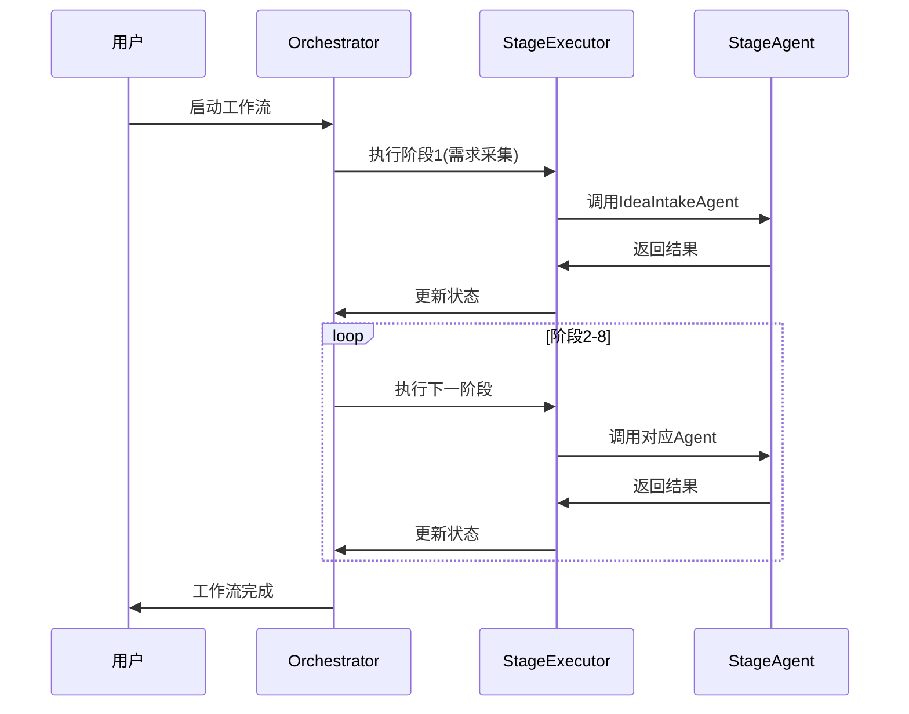

# Cowork Forge AI Agent System - 工作流编排域技术文档

## 概述

工作流编排域是Cowork Forge AI Agent System的核心模块，负责协调和管理整个软件开发工作流的执行。该模块通过统一的编排引擎，实现8阶段软件开发流程的有序执行、状态管理和迭代反馈机制。

## 架构设计

### 核心组件

#### 1. Orchestrator（工作流编排器）

**职责**：工作流会话生命周期管理和阶段依赖关系协调

**关键数据结构**：
```rust
pub struct SessionMeta {
    pub session_id: String,
    pub current_stage: Option<Stage>,
    pub stage_status: HashMap<Stage, StageStatus>,
    pub feedback_iterations: usize,
    pub max_feedback_iterations: usize,
    pub modification_context: Option<String>,
}
```

**核心功能**：
- 会话创建和管理
- 8阶段工作流调度（需求采集→PRD生成→技术设计→实施计划→编码执行→检查验证→反馈处理→交付报告）
- 阶段依赖关系管理
- 错误恢复和重试机制
- 反馈循环控制（最大20次迭代）

#### 2. StageExecutor（阶段执行器）

**职责**：统一执行各阶段智能体的标准化执行器

**核心流程**：
```rust
// 执行流程：检查 → 执行 → HITL → 保存 → 标记完成
pub async fn execute_stage<A: StageAgent>(
    &self,
    agent: &A,
    session_id: &str,
    meta: &mut SessionMeta,
    skip_if_completed: bool,
) -> Result<StageExecutionResult>
```

**状态管理**：
- `StageStatus::NotStarted` - 未开始
- `StageStatus::InProgress` - 执行中
- `StageStatus::Completed` - 已完成
- `StageStatus::Failed` - 失败

### 工作流编排模式

#### 1. 线性执行模式


#### 2. 反馈循环模式
```rust
// 支持多轮迭代反馈
pub feedback_iterations: usize,
pub max_feedback_iterations: usize,

// 修改上下文管理
pub modification_context: Option<String>,
```

#### 3. HITL集成模式
```rust
// HITL审查集成
let should_continue = if agent.requires_hitl_review() {
    self.hitl.confirm(&format!("继续到下一阶段？"))?
} else {
    true
};
```

## 技术实现细节

### 会话管理机制

**会话创建**：
```rust
pub fn create_session(&self) -> Result<String> {
    let session_id = uuid::Uuid::new_v4().to_string();
    // 创建会话元数据并持久化
    self.save_session_meta(&meta)?;
    Ok(session_id)
}
```

**会话恢复**：
```rust
pub async fn run_workflow_from_stage(
    &self,
    session_id: &str,
    model_config: &ModelConfig,
    resume_from: Option<Stage>,
) -> Result<()> {
    // 从指定阶段恢复执行
    let start_stage = resume_from.unwrap_or(Stage::IdeaIntake);
    // 显示恢复状态
    self.print_resume_status(&meta, start_stage)?;
}
```

### 阶段执行流程

**标准化执行接口**：
```rust
pub trait StageAgent {
    fn stage(&self) -> Stage;
    fn requires_hitl_review(&self) -> bool;
    async fn execute(&self, context: &StageAgentContext) -> Result<StageAgentResult>;
}
```

**执行上下文**：
```rust
pub struct StageAgentContext {
    pub session_id: String,
    pub store: Arc<ArtifactStore>,
    pub hitl: Arc<HitlController>,
}
```

### 状态持久化机制

**文件系统存储**：
```rust
fn save_session_meta(&self, meta: &SessionMeta) -> Result<()> {
    let session_dir = PathBuf::from(".cowork").join(&meta.session_id);
    let meta_path = session_dir.join("meta.json");
    let content = serde_json::to_string_pretty(meta)?;
    fs::write(&meta_path, content)?;
    Ok(())
}
```

**JSON序列化格式**：
```json
{
  "session_id": "uuid-string",
  "current_stage": "IdeaIntake",
  "stage_status": {
    "IdeaIntake": {
      "status": "completed",
      "artifact_id": "artifact-uuid",
      "completed_at": "2024-01-01T00:00:00Z",
      "verified": true
    }
  },
  "feedback_iterations": 0
}
```

## 错误处理和容错机制

### 阶段失败处理
```rust
fn mark_stage_failed(
    &self,
    meta: &mut SessionMeta,
    stage: Stage,
    error: String,
    can_retry: bool
) -> Result<()> {
    meta.stage_status.insert(
        stage,
        StageStatus::Failed {
            error,
            failed_at: chrono::Utc::now(),
            can_retry,
        }
    );
    self.save_session_meta(meta)
}
```

### 重试机制
- 可配置的最大重试次数
- 智能的重试起点选择
- 错误日志记录和分析

## 性能优化策略

### 1. 异步执行
```rust
pub async fn run_workflow_from_stage_impl(...) -> Result<()> {
    // 使用异步执行提高并发性能
}
```

### 2. 状态缓存
- 内存中的会话状态缓存
- 智能的阶段跳过机制
- 增量更新避免全量重执行

### 3. 资源管理
- Arc共享引用减少内存复制
- 文件系统操作的批量化
- 连接池和资源复用

## 集成接口

### 与智能体域的交互
```rust
// 依赖注入智能体
let idea_agent = IdeaIntakeAgent::new(&model_config.llm, self.store.clone())?;
executor.execute_stage(&idea_agent, session_id, &mut meta, true).await?;
```

### 与HITL控制器的集成
```rust
let hitl = Arc::new(HitlController::new());
let executor = StageExecutor::new(self.store.clone(), hitl.clone());
```

### 与存储系统的交互
```rust
pub struct Orchestrator {
    store: Arc<ArtifactStore>,  // 共享工件存储
}
```

## 配置管理

### 环境配置
```rust
pub struct ModelConfig {
    pub llm: LLMConfig,
    // 其他配置参数
}
```

### 运行时配置
- 最大反馈迭代次数（默认20）
- 阶段超时设置
- 重试策略配置

## 监控和日志

### 结构化日志
```rust
tracing::info!("Session created: {}", session_id);
tracing::error!("Agent execution failed for stage {:?}: {}", stage, e);
```

### 性能指标
- 阶段执行时间统计
- 资源使用监控
- 错误率跟踪

## 扩展性和维护性

### 插件化架构
- 统一的StageAgent接口
- 新阶段智能体的无缝集成
- 配置驱动的行为调整

### 测试策略
```rust
[cfg(test)]
mod tests {
    // 单元测试覆盖核心功能
    // 集成测试验证工作流完整性
}
```

工作流编排域通过模块化设计、标准化接口和强大的状态管理机制，为Cowork Forge AI Agent System提供了可靠的工作流执行引擎，确保了软件开发过程的自动化、可控性和高质量交付。