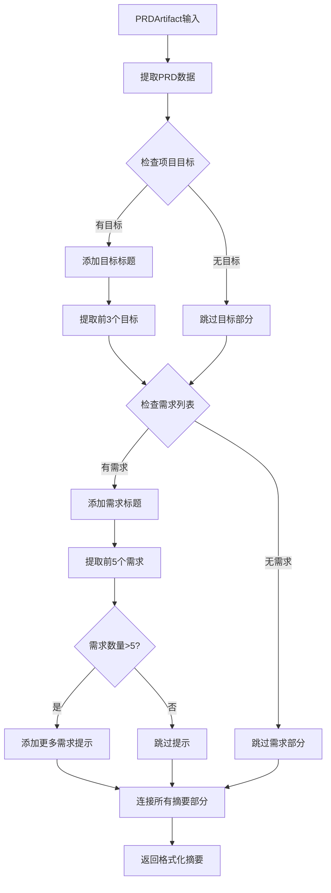
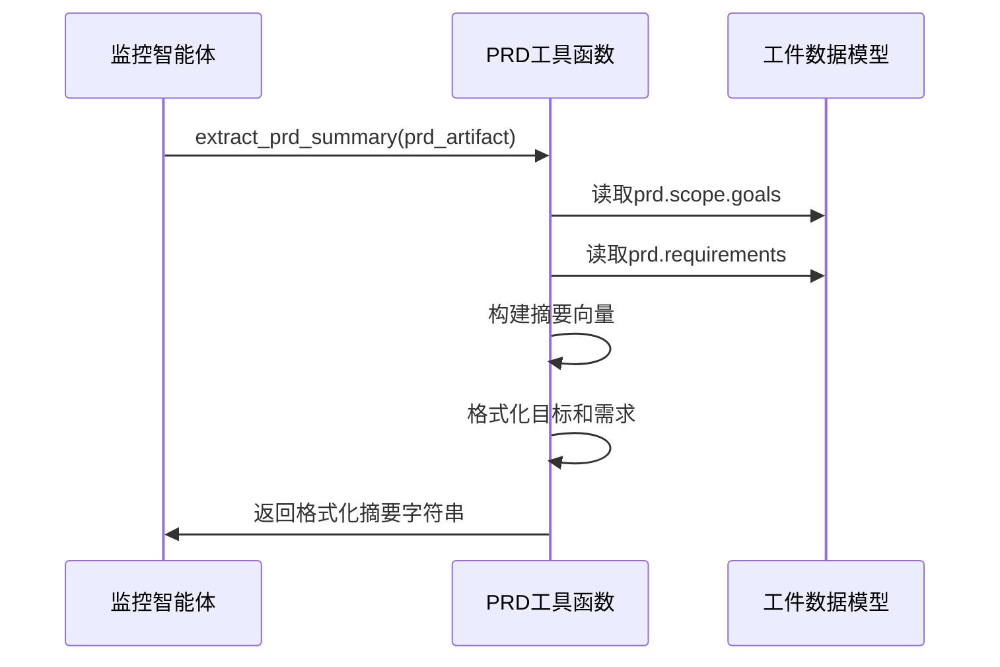

# 工具函数域技术文档

## 1. 模块概述

### 1.1 模块定位
工具函数域是Cowork AI系统中的工具支持域模块，提供通用的工具函数和辅助功能，为其他业务域模块提供基础功能支持。该域作为系统的底层工具层，专注于实现可复用的通用功能。

### 1.2 模块组成
工具函数域包含以下两个子模块：

| 子模块名称 | 文件路径 | 主要功能 | 重要性 |
|----------|----------|----------|--------|
| PRD工具函数 | `crates/cowork-core/src/utils/prd_utils.rs` | PRD摘要提取，为监控系统提供结构化摘要 | 5.0 |
| 工具函数管理 | `crates/cowork-core/src/utils/mod.rs` | 工具函数模块的统一管理和接口导出 | 4.0 |

## 2. 核心功能实现

### 2.1 PRD摘要提取功能

#### 2.1.1 功能设计
`extract_prd_summary`函数是工具函数域的核心功能，主要作用是从PRD（产品需求文档）Artifact中提取人类可读的结构化摘要，为监控系统提供简洁的项目概览。

**功能特性：**
- 智能提取项目目标和需求信息
- 支持摘要内容数量限制（目标最多3个，需求最多5个）
- 自动处理空数据场景
- 生成格式化的Markdown风格摘要

#### 2.1.2 实现逻辑
```rust
pub fn extract_prd_summary(prd_artifact: &PRDArtifact) -> String {
    let prd = &prd_artifact.data;
    let mut summary_parts =[];
    
    // 项目范围目标提取
    if !prd.scope.g.is_empty() {
        summary_parts.push("**Goals**:".to_string());
        for goal in prd.scope.g.iter().take(3) {
            summary_parts.push(format!("- {}", goal));
        }
    }
    
    // 需求列表摘要提取
    if !prd.reqs.is_empty() {
        summary_parts.push("\n**Requirements**:".to_string());
        for req in prd.reqs.iter().take(5) {
            summary_parts.push(format!("- {}: {}", req.id, req.desc));
        }
        
        // 处理超限提示
        if prd.reqs.len() > 5 {
            summary_parts.push(format!("... and {} more requirements", prd.reqs.len() - 5));
        }
    }
    
    summary_parts.join("\n")
}
```

#### 2.1.3 处理流程


### 2.2 模块管理功能

#### 2.2.1 模块组织
工具函数管理模块负责统一管理所有工具函数的导出和访问：

```rust
pub mod prd_utils;
pub use prd_utils::extract_prd_summary;
```

#### 2.2.2 设计原则
- **最小化暴露**：只导出必要的公共函数
- **模块化组织**：支持未来扩展新的工具函数
- **接口统一**：提供一致的函数调用方式

## 3. 技术实现细节

### 3.1 数据结构依赖
工具函数域主要依赖以下核心数据结构：

```rust
use crate::artifacts::*;  // 导入工件数据模型

// 主要处理的PRD数据结构
pub struct PRDArtifact {
    pub meta: ArtifactMeta,
    pub summary: Vec<String>,
    pub links: ArtifactLinks,
    pub data: PRD,  // 核心PRD数据
}

pub struct PRD {
    pub scope: Scope,     // 项目范围
    pub reqs: Vec<Requirement>,  // 需求列表
    pub cons: Vec<String>,  // 约束条件
    pub hitl: Vec<String>,  // 人工介入点
}
```

### 3.2 错误处理策略
当前实现采用保守的错误处理策略：
- **空数据安全**：自动检测空数据并跳过处理
- **边界检查**：使用`.iter().take(n)`限制处理数量
- **格式化安全**：使用`format!`宏确保字符串格式化安全

### 3.3 性能优化考虑
- **惰性处理**：只在必要时构建摘要内容
- **向量预分配**：使用`Vec`收集摘要部分，避免多次内存分配
- **字符串拼接优化**：使用`join("\n")`进行高效字符串连接

## 4. 测试覆盖

### 4.1 单元测试设计
模块包含完整的单元测试，验证核心功能的正确性：

```rust
#[cfg(test)]
mod tests {
    use super::*;

    #[test]
    fn test_extract_prd_summary() {
        // 构建测试数据
        let prd_artifact = ArtifactEnvelope {
            meta: ArtifactMeta { /* ... */ },
            data: PRD {
                scope: Scope {
                    g: vec!["Create a todo app".to_string()],
                    ng: vec![],
                },
                reqs: vec![
                    Requirement { id: "REQ-001".to_string(), desc: "User can create todos".to_string(), /* ... */ },
                    Requirement { id: "REQ-002".to_string(), desc: "User can delete todos".to_string(), /* ... */ },
                ],
                // ... 其他字段
            },
        };

        let summary = extract_prd_summary(&prd_artifact);
        
        // 验证摘要内容
        assert!(summary.contains("Goals"));
        assert!(summary.contains("REQ-001"));
        assert!(summary.contains("REQ-002"));
    }
}
```

### 4.2 测试覆盖场景
- **正常数据场景**：验证完整PRD数据的正确处理
- **边界条件**：测试空数据、单条数据、超限数据等边界情况
- **格式验证**：确保生成的摘要格式符合预期

## 5. 系统集成与交互

### 5.1 依赖关系分析
工具函数域与其他域的交互关系：

| 交互域 | 交互类型 | 强度 | 描述 |
|--------|----------|------|------|
| 数据模型域 | 数据依赖 | 8.0 | 依赖artifacts模块的PRD数据结构定义 |
| 智能体执行域 | 工具支持 | 5.0 | 为监控智能体(WatchDog)提供摘要提取功能 |

### 5.2 调用序列


### 5.3 接口规范
```rust
// 公共接口定义
pub fn extract_prd_summary(prd_artifact: &PRDArtifact) -> String

// 输入：PRDArtifact引用
// 输出：格式化的摘要字符串
// 异常：无panic，空数据返回空字符串
```

## 6. 架构优势与设计考量

### 6.1 设计优势
1. **单一职责**：专注于PRD摘要提取，功能边界清晰
2. **无状态设计**：纯函数实现，无副作用，易于测试
3. **可复用性**：通用工具函数，可被多个智能体复用
4. **性能优化**：轻量级实现，适合高频调用场景

### 6.2 扩展性考虑
当前设计支持以下扩展方向：
- **新增工具函数**：在utils模块中添加新的功能函数
- **配置化参数**：支持摘要长度等参数的可配置化
- **多格式支持**：扩展支持JSON、XML等不同输出格式

### 6.3 兼容性保证
- **向后兼容**：函数签名稳定，不影响现有调用方
- **数据兼容**：基于稳定的artifacts数据模型
- **接口兼容**：简单的输入输出接口，易于集成

## 7. 使用示例

### 7.1 基本使用
```rust
use crate::utils::extract_prd_summary;
use crate::artifacts::PRDArtifact;

// 在监控智能体中使用
pub fn generate_monitoring_report(prd: &PRDArtifact) -> String {
    let summary = extract_prd_summary(prd);
    format!("PRD Summary:\\n{}", summary)
}
```

### 7.2 预期输出格式
```
**Goals**:
- Create a todo application
- Support basic CRUD operations

**Requirements**:
- REQ-001: User can create todos
- REQ-002: User can delete todos
- REQ-003: User can mark todos as completed
... and 2 more requirements
```

## 8. 总结

工具函数域作为Cowork AI系统的底层支持模块，通过简洁高效的PRD摘要提取功能，为上层智能体提供了重要的工具支持。该模块体现了良好的软件设计原则，包括单一职责、无状态设计和可测试性，为系统的可维护性和扩展性奠定了坚实基础。

模块当前的实现虽然功能相对简单，但其模块化设计和清晰的接口定义为未来功能扩展提供了良好的框架。随着系统演进，可以在此基础上添加更多通用的工具函数，逐步丰富工具函数域的功能集合。