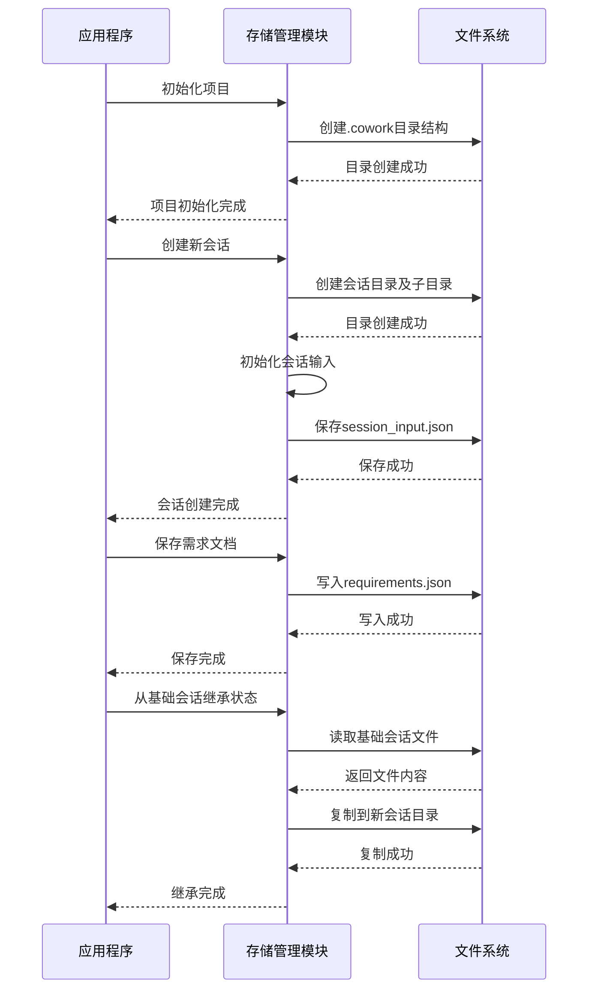

# 数据存储域技术文档

## 1. 概述

数据存储域是Cowork Forge系统的核心数据管理层，负责项目状态的持久化存储、会话管理和版本控制。该域采用基于会话的隔离存储架构，为AI驱动的软件开发工作流提供可靠的数据支撑。

## 2. 架构设计

### 2.1 存储架构概览

数据存储域采用分层存储架构，核心设计理念包括：

- **会话隔离**：每个开发会话拥有独立的存储空间，避免数据污染
- **状态持久化**：支持工作流中断恢复和增量修改
- **版本控制**：通过会话继承机制实现项目状态的版本管理
- **模块化存储**：按数据类型和用途划分存储区域

### 2.2 目录结构设计

```
.cowork/
├── index.json                    # 项目索引文件
└── sessions/                     # 会话存储目录
    └── {session_id}/             # 单个会话目录
        ├── input.json            # 会话输入配置
        ├── change_request.json   # 变更请求（仅修改会话）
        ├── artifacts/            # 生成文档存储
        │   ├── idea.md
        │   ├── prd.md
        │   ├── design.md
        │   └── delivery_report.md
        ├── state/                # 结构化状态数据
        │   ├── requirements.json
        │   ├── feature_list.json
        │   ├── design_spec.json
        │   ├── implementation_plan.json
        │   └── code_metadata.json
        ├── patch/                # 补丁元数据
        └── logs/                 # 执行日志
```

## 3. 核心模块实现

### 3.1 存储管理模块（`storage/mod.rs`）

#### 3.1.1 目录管理功能

```rust
/// 获取或创建.cowork目录
pub fn get_cowork_dir() -> Result<PathBuf> {
    let path = PathBuf::from(COWORK_DIR);
    fs::create_dir_all(&path)?;
    fs::create_dir_all(path.join(SESSIONS_DIR))?;
    Ok(path)
}

/// 获取会话目录并创建子目录结构
pub fn get_session_dir(session_id: &str) -> Result<PathBuf> {
    let session_path = get_cowork_dir()?.join(SESSIONS_DIR).join(session_id);
    
    // 创建标准子目录
    fs::create_dir_all(&session_path)?;
    fs::create_dir_all(session_path.join("artifacts"))?;
    fs::create_dir_all(session_path.join("state"))?;
    fs::create_dir_all(session_path.join("patch"))?;
    fs::create_dir_all(session_path.join("logs"))?;
    
    Ok(session_path)
}
```

#### 3.1.2 项目索引管理

项目索引负责跟踪所有会话和当前项目状态：

```rust
pub fn save_project_index(index: &ProjectIndex) -> Result<()> {
    let path = get_cowork_dir()?.join(INDEX_FILE);
    let content = serde_json::to_string_pretty(index)?;
    fs::write(&path, content)?;
    Ok(())
}

pub fn load_project_index() -> Result<ProjectIndex> {
    let path = PathBuf::from(COWORK_DIR).join(INDEX_FILE);
    let content = fs::read_to_string(&path)?;
    let index: ProjectIndex = serde_json::from_str(&content)?;
    Ok(index)
}
```

#### 3.1.3 会话状态管理

支持完整的会话生命周期管理：

```rust
/// 检查会话是否包含特定状态文件
pub fn state_file_exists(session_id: &str, filename: &str) -> Result<bool> {
    Ok(state_path(session_id, filename)?.exists())
}

/// 保存需求文档
pub fn save_requirements(session_id: &str, requirements: &Requirements) -> Result<()> {
    let path = state_path(session_id, "requirements.json")?;
    let content = serde_json::to_string_pretty(requirements)?;
    fs::write(&path, content)?;
    Ok(())
}
```

### 3.2 数据模型模块（`data/models.rs`）

#### 3.2.1 核心数据结构

**项目索引模型**
```rust
[derive(Debug, Clone, Serialize, Deserialize)]
pub struct ProjectIndex {
    pub schema_version: String,
    pub project_name: String,
    pub created_at: DateTime<Utc>,
    pub updated_at: DateTime<Utc>,
    pub latest_successful_session: Option<String>,
    pub sessions: Vec<SessionRecord>,
}
```

**需求模型**
```rust
#[derive(Debug, Clone, Serialize, Deserialize)]
pub struct Requirements {
    pub schema_version: String,
    pub created_at: DateTime<Utc>,
    pub updated_at: DateTime<Utc>,
    pub requirements: Vec<Requirement>,
}

#[derive(Debug, Clone, Serialize, Deserialize)]
pub struct Requirement {
    pub id: String,  // REQ-001, REQ-002等
    pub title: String,
    pub description: String,
    pub priority: Priority,
    pub category: RequirementCategory,
    pub acceptance_criteria: Vec<String>,
    pub related_features: Vec<String>,
}
```

**设计规范模型**
```rust
#[derive(Debug, Clone, Serialize, Deserialize)]
pub struct DesignSpec {
    pub schema_version: String,
    pub architecture: Architecture,
    pub technology_stack: TechnologyStack,
    pub deployment: DeploymentInfo,
}

#[derive(Debug, Clone, Serialize, Deserialize)]
pub struct Architecture {
    pub style: String,
    pub components: Vec<DesignComponent>,
    pub data_models: Vec<DataModel>,
}
```

#### 3.2.2 变更管理模型

**变更请求模型**
```rust
#[derive(Debug, Clone, Serialize, Deserialize)]
pub struct ChangeRequest {
    pub id: String,
    pub session_id: String,
    pub created_at: DateTime<Utc>,
    pub idea: String,
    pub base_session_id: String,
    pub scope: ChangeScope,
    pub acceptance_criteria: Vec<String>,
    pub constraints: Vec<String>,
    pub analysis: Option<ChangeAnalysis>,
}
```

**补丁元数据模型**
```rust
#[derive(Debug, Clone, Serialize, Deserialize)]
pub struct PatchMetadata {
    pub session_id: String,
    pub base_session_id: String,
    pub created_at: DateTime<Utc>,
    pub added_files: Vec<String>,
    pub modified_files: Vec<String>,
    pub deleted_files: Vec<String>,
    pub artifact_updates: Vec<ArtifactUpdate>,
}
```

### 3.3 模式验证模块（`data/schemas/`）

提供数据验证支持，确保存储数据的完整性和一致性：

```rust
// JSON Schema验证定义
pub mod validation;
```

## 4. 关键技术特性

### 4.1 会话继承机制

支持增量修改的会话继承功能：

```rust
/// 从基础会话复制状态到新会话
pub fn init_session_from_base(
    new_session_id: &str, 
    base_session_id: &str
) -> Result<()> {
    // 复制状态文件
    copy_state_files(base_session_id, new_session_id)?;
    // 复制工件文件
    copy_artifacts(base_session_id, new_session_id)?;
    Ok(())
}
```

### 4.2 状态完整性检查

提供完整的状态检查机制：

```rust
/// 检查编码阶段是否已生成代码文件
pub fn has_code_files(session_id: &str) -> Result<bool> {
    if !has_code_metadata(session_id)? {
        return Ok(false);
    }
    
    let metadata = load_code_metadata(session_id)?;
    Ok(!metadata.files.is_empty())
}
```

### 4.3 错误恢复支持

支持工作流中断的恢复机制：

```rust
/// 加载会话状态，支持空状态初始化
pub fn load_requirements(session_id: &str) -> Result<Requirements> {
    let path = state_path(session_id, "requirements.json")?;
    if !path.exists() {
        return Ok(Requirements::new());  // 返回空状态
    }
    // ...加载逻辑
}
```

## 5. 数据流设计

### 5.1 存储操作序列



### 5.2 数据一致性保证

- **原子性操作**：每个存储操作都是原子的，避免部分写入
- **完整性验证**：加载时验证数据格式和完整性
- **错误回滚**：操作失败时清理部分写入的文件

## 6. 性能优化

### 6.1 延迟加载策略

采用按需加载策略，避免一次性加载所有会话数据：

```rust
/// 仅检查文件存在性，不加载完整内容
pub fn has_requirements(session_id: &str) -> Result<bool> {
    state_file_exists(session_id, "requirements.json")
}
```

### 6.2 序列化优化

使用高效的JSON序列化库，支持紧凑格式和美化格式：

```rust
let content = serde_json::to_string_pretty(requirements)?;  // 开发调试
let content = serde_json::to_string(requirements)?;        // 生产环境
```

## 7. 安全考虑

### 7.1 文件路径安全

防止路径遍历攻击：

```rust
/// 安全的文件路径构建
fn artifact_path(session_id: &str, filename: &str) -> Result<PathBuf> {
    // 验证文件名不包含路径分隔符
    if filename.contains('/') || filename.contains('\\') {
        anyhow::bail!("Invalid filename: {}", filename);
    }
    Ok(get_session_dir(session_id)?.join("artifacts").join(filename))
}
```

### 7.2 数据验证

在存储前验证数据完整性：

```rust
/// 保存前验证数据模型
pub fn save_requirements(session_id: &str, requirements: &Requirements) -> Result<()> {
    // 验证schema版本
    if requirements.schema_version != SCHEMA_VERSION {
        anyhow::bail!("Invalid schema version");
    }
    // ...保存逻辑
}
```

## 8. 扩展性设计

### 8.1 插件化存储支持

架构设计支持未来扩展不同的存储后端：

```rust
/// 存储接口抽象（未来扩展）
pub trait StorageBackend {
    fn save_artifact(&self, session_id: &str, artifact_type: &str, content: &str) -> Result<()>;
    fn load_artifact(&self, session_id: &str, artifact_type: &str) -> Result<String>;
}
```

### 8.2 版本兼容性

通过schema版本管理支持数据格式演进：

```rust
pub struct Requirements {
    pub schema_version: String,  // 支持版本迁移
    // ...其他字段
}
```

## 9. 总结

数据存储域作为Cowork Forge系统的核心数据管理层，通过精心设计的会话隔离架构和完整的数据模型体系，为AI驱动的软件开发工作流提供了可靠的数据支撑。其模块化设计、错误恢复机制和扩展性考虑，确保了系统在复杂开发场景下的稳定性和可维护性。