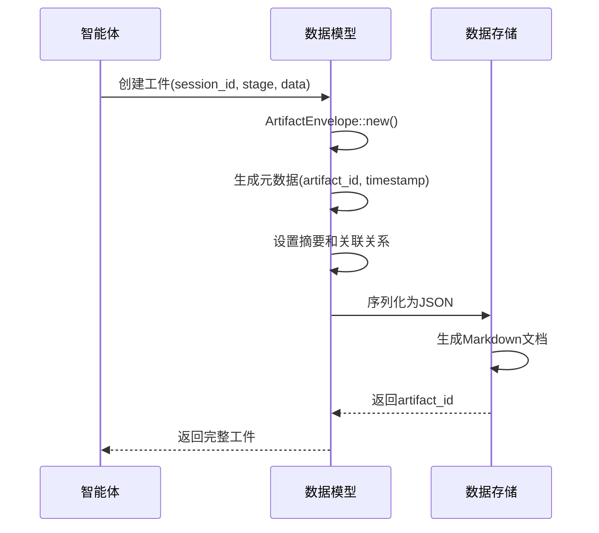
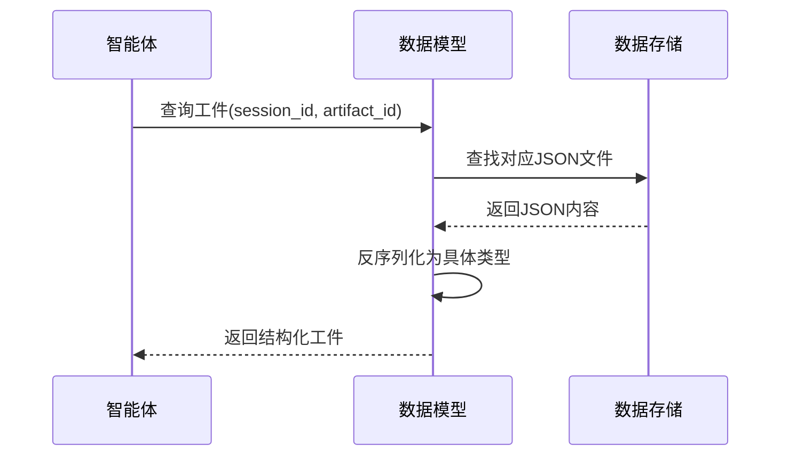

# Cowork AI 多智能体软件开发系统 - 数据模型域技术文档

## 1. 概述

数据模型域是 Cowork AI 多智能体软件开发系统的核心业务域之一，负责管理软件开发过程中产生的所有结构化数据。作为系统的"数据大脑"，该域定义了完整的软件开发工件数据模型，支持8个开发阶段的工件定义、存储和检索机制。

## 2. 架构设计

### 2.1 整体架构

数据模型域采用三层架构设计：

```
┌─────────────────────────────────┐
│         工件数据模型层           │
│    ├─ ArtifactEnvelope<T>      │
│    ├─ 8阶段数据结构定义         │
│    └─ 元数据管理系统           │
├─────────────────────────────────┤
│         工件存储系统层           │
│    ├─ ArtifactStore            │
│    ├─ FileArtifactStore        │
│    └─ 双格式持久化机制          │
├─────────────────────────────────┤
│         数据访问层（待实现）     │
│    └─ 嵌入式数据管理           │
└─────────────────────────────────┘
```

### 2.2 核心设计模式

#### 2.2.1 泛型信封模式 (Generic Envelope Pattern)
系统采用 `ArtifactEnvelope<T>` 泛型设计，为所有开发阶段提供统一的数据封装接口：

```rust
[derive(Debug, Clone, Serialize, Deserialize)]
pub struct ArtifactEnvelope<T> {
    pub meta: ArtifactMeta,      // 元数据
    pub summary: Vec<String>,    // 摘要信息
    pub links: ArtifactLinks,    // 关联关系
    pub data: T,                 // 阶段特定数据
}
```

#### 2.2.2 枚举驱动阶段管理
通过 `Stage` 枚举明确定义8个开发阶段：

```rust
pub enum Stage {
    IdeaIntake,    // 创意输入
    Requirements,  // 需求分析
    Design,        // 技术设计
    Plan,          // 实施计划
    Coding,        // 代码生成
    Check,         // 质量检查
    Feedback,      // 反馈处理
    Delivery,      // 交付报告
}
```

## 3. 核心组件详细分析

### 3.1 工件数据模型 (artifacts/mod.rs)

#### 3.1.1 元数据系统
- **ArtifactMeta**: 包含会话ID、工件ID、阶段、版本和时间戳
- **ArtifactLinks**: 支持工件间的关联关系追踪
- **版本控制**: 通过 `v` 字段实现工件版本管理

#### 3.1.2 8阶段数据结构

**阶段1：创意输入 (IdeaIntake)**
```rust
pub struct IdeaSpec {
    pub bg: String,        // 背景描述
    pub g: Vec<String>,    // 目标
    pub ng: Vec<String>,   // 非目标
    pub c: Vec<String>,    // 约束条件
    pub sc: Vec<String>,   // 成功标准
    pub r: Vec<String>,    // 风险
    pub q: Vec<String>,    // 质量要求
}
```

**阶段2：需求分析 (Requirements)**
```rust
pub struct PRD {
    pub scope: Scope,              // 范围定义
    pub reqs: Vec<Requirement>,    // 需求列表
    pub cons: Vec<Constraint>,     // 约束条件
    pub hitl: Vec<HitlQuestion>,   // 人工介入问题
}
```

**阶段3：技术设计 (Design)**
```rust
pub struct DesignDoc {
    pub cli: CliDesign,        // CLI设计
    pub wf: Workflow,          // 工作流设计
    pub arch: Architecture,    // 架构设计
    pub io: IoConfig,          // I/O配置
}
```

**阶段4：实施计划 (Plan)**
```rust
pub struct Plan {
    pub c4: C4Design,              // C4模型设计
    pub tasks: Vec<Task>,          // 任务列表
    pub milestones: Vec<Milestone>, // 里程碑
    pub todo_list: Option<TodoList>, // 任务分解列表
}
```

**阶段5：代码生成 (Coding)**
```rust
pub struct CodeChange {
    pub target: TargetProject,           // 目标项目
    pub project: ProjectStructure,       // 项目结构
    pub changes: Vec<Change>,            // 变更列表
    pub cmds: Vec<Command>,              // 执行命令
    pub requirement_mapping: Vec<RequirementMapping>, // 需求映射
}
```

**阶段6：质量检查 (Check)**
```rust
pub struct CheckReport {
    pub checks: Vec<CheckResult>,           // 检查结果
    pub ac_results: Vec<AcceptanceResult>,  // 验收结果
    pub issues: Vec<Issue>,                 // 问题列表
    pub todo_completion: Option<TodoCompletion>,      // 任务完成度
    pub requirement_coverage: Option<RequirementCoverage>, // 需求覆盖度
}
```

**阶段7-8：反馈与交付**
包含反馈分析和最终交付报告的数据结构。

### 3.2 工件存储系统 (memory/mod.rs)

#### 3.2.1 存储架构
```
session_id/
├── artifacts/
│   ├── idea_intake.{artifact_id}.json
│   ├── idea_intake.{artifact_id}.md
│   ├── requirements.{artifact_id}.json
│   └── ...
└── session_metadata.json
```

#### 3.2.2 双格式存储策略
- **JSON格式**: 机器可读，用于程序处理
- **Markdown格式**: 人工可读，用于查看和审阅

#### 3.2.3 核心接口
```rust
pub struct ArtifactStore {
    store: FileArtifactStore,
}

impl ArtifactStore {
    pub fn put<T: Serialize>(&self, session_id: &str, stage: Stage, artifact: &T) -> Result<String>;
    pub fn get<T: DeserializeOwned>(&self, session_id: &str, artifact_id: &str) -> Result<T>;
    pub fn list(&self, session_id: &str) -> Result<Vec<ArtifactMeta>>;
    pub fn session_exists(&self, session_id: &str) -> bool;
}
```

## 4. 数据流设计

### 4.1 工件创建流程


### 4.2 工件检索流程


## 5. 关键技术特性

### 5.1 类型安全设计
- 使用Rust的强类型系统确保数据完整性
- 泛型设计避免运行时类型错误
- 枚举类型确保阶段状态的有效性

### 5.2 序列化优化
- 采用 `serde` 框架实现高效序列化
- 支持自定义序列化格式（如时间戳处理）
- 可选的字段序列化减少存储开销

### 5.3 版本兼容性
```rust
#[serde(default, skip_serializing_if = "Option::is_none")]
pub todo_list: Option<TodoList>,  // 向后兼容的字段
```

### 5.4 错误处理机制
- 使用 `anyhow::Result` 统一错误处理
- 详细的错误信息和上下文
- 文件操作的安全性检查

## 6. 与其他域的集成关系

### 6.1 与智能体执行域的交互
```rust
// 智能体通过数据模型域读写工件
impl Agent for PrdAgent {
    fn execute(&self, context: &AgentContext) -> Result<AgentOutput> {
        // 读取输入工件
        let idea_spec: ArtifactEnvelope<IdeaSpec> = 
            context.artifact_store.get(&context.session_id, &input_artifact_id)?;
        
        // 生成PRD工件
        let prd_artifact = ArtifactEnvelope::new(
            &context.session_id,
            Stage::Requirements,
            prd_data
        );
        
        // 保存工件
        context.artifact_store.put(&context.session_id, Stage::Requirements, &prd_artifact)?;
    }
}
```

### 6.2 与工作流编排域的交互
- 编排器依赖数据模型域管理会话状态
- 通过工件版本追踪流程进度
- 支持从任意阶段恢复工作流

### 6.3 与文件工具域的依赖
- 依赖文件工具域进行底层文件操作
- 异步文件读写支持大文件处理
- 目录结构和权限管理

## 7. 扩展性和维护性

### 7.1 扩展机制
- 新增阶段只需扩展 `Stage` 枚举和对应数据结构
- 泛型设计支持自定义工件类型
- 插件式存储后端支持多种存储方案

### 7.2 测试策略
```rust
#[cfg(test)]
mod tests {
    use super::*;
    
    #[test]
    fn test_artifact_envelope_creation() {
        // 测试工件创建和序列化
    }
    
    #[test]
    fn test_stage_enum_serialization() {
        // 测试阶段枚举的序列化行为
    }
}
```

### 7.3 性能优化
- 惰性加载减少内存占用
- 增量更新避免全量序列化
- 缓存机制提升读取性能

## 8. 最佳实践和约束

### 8.1 数据建模原则
- **单一职责**: 每个数据结构只负责一个阶段的业务逻辑
- **不变性**: 工件一旦创建不应修改，通过版本控制管理变更
- **可追溯性**: 通过关联链接追踪工件间的依赖关系

### 8.2 存储约束
- 单个会话的所有工件存储在统一目录
- JSON文件大小限制避免内存溢出
- 文件名格式标准化便于检索

### 8.3 安全考虑
- 输入验证防止路径遍历攻击
- 序列化安全检查防止注入攻击
- 文件权限管理保护敏感数据

## 9. 未来演进方向

### 9.1 短期优化
- 实现数据访问层 (`data.rs`) 的嵌入式数据管理
- 增加工件索引提升检索性能
- 完善Markdown文档生成模板

### 9.2 长期规划
- 支持分布式存储后端（如数据库、对象存储）
- 实现工件压缩和归档策略
- 增加数据迁移和版本升级工具

数据模型域作为Cowork AI系统的核心数据基础设施，通过精心设计的架构和严格的数据建模，为整个多智能体软件开发流程提供了可靠的数据支撑。其模块化设计和扩展性保证了系统能够适应未来业务需求的演进。