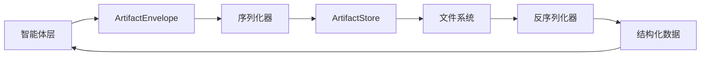

# Cowork Forge AI Agent System 数据管理域技术文档

## 1. 概述

数据管理域是Cowork Forge AI Agent System的重要组成部分，负责系统核心数据结构的定义、序列化格式规范以及软件开发全生命周期各阶段产出物的存储管理。该模块为整个系统提供统一的数据模型和持久化机制，确保各智能体之间数据交换的一致性和可靠性。

## 2. 架构设计

### 2.1 核心组件架构

数据管理域采用分层架构设计，包含两大核心模块：

```
数据管理域
├── 数据模型模块 (artifacts)
│   ├── ArtifactEnvelope<T> - 通用数据封装器
│   ├── 各阶段数据结构定义
│   └── 类型别名和便捷方法
└── 工件存储模块 (memory)
    ├── ArtifactStore - 抽象存储接口
    ├── FileArtifactStore - 文件存储实现
    └── ArtifactMeta - 存储元数据
```

### 2.2 数据流架构



## 3. 核心数据结构

### 3.1 通用数据封装器

系统采用`ArtifactEnvelope<T>`泛型结构体作为统一的数据封装接口：

```rust
#[derive(Debug, Clone, Serialize, Deserialize)]
pub struct ArtifactEnvelope<T> {
    pub meta: ArtifactMeta,      // 元数据
    pub summary: Vec<String>,    // 摘要信息
    pub links: ArtifactLinks,    // 关联链接
    pub data: T,                 // 具体阶段数据
}
```

**元数据结构：**
```rust
pub struct ArtifactMeta {
    pub session_id: String,      // 会话标识
    pub artifact_id: String,     // 工件唯一标识
    pub stage: Stage,            // 所属阶段
    pub v: u32,                  // 版本号
    pub ts: DateTime<Utc>,       // 时间戳
}
```

### 3.2 软件开发阶段枚举

系统定义了完整的软件开发生命周期阶段：

```rust
pub enum Stage {
    IdeaIntake,     // 需求采集
    Requirements,   // 需求分析
    Design,         // 技术设计
    Plan,           // 实施计划
    Coding,         // 编码执行
    Check,          // 检查验证
    Feedback,       // 反馈处理
    Delivery,       // 交付报告
}
```

## 4. 各阶段数据模型详解

### 4.1 需求采集阶段 (IdeaIntake)

**IdeaSpec 结构体：**
```rust
pub struct IdeaSpec {
    pub bg: String,      // 背景信息
    pub g: Vec<String>,  // 目标
    pub ng: Vec<String>, // 非目标
    pub c: Vec<String>,  // 约束条件
    pub sc: Vec<String>, // 成功标准
    pub r: Vec<String>,  // 风险因素
    pub q: Vec<String>,  // 待澄清问题
}
```

### 4.2 需求分析阶段 (Requirements)

**PRD 结构体：**
```rust
pub struct PRD {
    pub scope: Scope,               // 范围定义
    pub reqs: Vec<Requirement>,     // 需求列表
    pub cons: Vec<Constraint>,      // 约束条件
    pub hitl: Vec<HitlQuestion>,    // HITL交互问题
}
```

**需求优先级和类型：**
```rust
pub enum Priority { P0, P1, P2 }    // 优先级定义
pub enum RequirementType { Func, Nfr, Constraint }  // 需求类型
```

### 4.3 技术设计阶段 (Design)

**设计文档结构：**
```rust
pub struct DesignDoc {
    pub cli: CliDesign,        // CLI设计
    pub wf: Workflow,          // 工作流设计
    pub arch: Architecture,    // 架构设计
    pub io: IoConfig,          // IO配置
}
```

### 4.4 实施计划阶段 (Plan)

**计划结构体：**
```rust
pub struct Plan {
    pub c4: C4Design,                // C4设计模型
    pub tasks: Vec<Task>,            // 任务列表
    pub milestones: Vec<Milestone>,  // 里程碑
    pub todo_list: Option<TodoList>, // 任务分解列表
}
```

**任务管理系统：**
```rust
pub struct TodoList {
    pub items: Vec<TodoItem>,        // 任务项列表
}

pub struct TodoItem {
    pub id: String,                          // 任务ID
    pub description: String,                 // 任务描述
    pub status: TodoStatus,                  // 任务状态
    pub related_requirements: Vec<String>,   // 关联需求
    pub related_files: Vec<String>,          // 关联文件
    pub verification_method: String,         // 验证方法
}
```

### 4.5 编码阶段 (Coding)

**代码变更结构：**
```rust
pub struct CodeChange {
    pub target: TargetProject,            // 目标项目
    pub project: ProjectStructure,        // 项目结构
    pub changes: Vec<Change>,             // 变更列表
    pub cmds: Vec<Command>,               // 执行命令
    pub requirement_mapping: Vec<RequirementMapping>,  // 需求映射
}
```

### 4.6 检查验证阶段 (Check)

**检查报告结构：**
```rust
pub struct CheckReport {
    pub checks: Vec<CheckResult>,             // 检查结果
    pub ac_results: Vec<AcceptanceResult>,    // 验收结果
    pub issues: Vec<Issue>,                   // 问题列表
    pub todo_completion: Option<TodoCompletion>,      // 任务完成度
    pub requirement_coverage: Option<RequirementCoverage>,  // 需求覆盖度
}
```

## 5. 存储实现机制

### 5.1 ArtifactStore 接口

系统提供统一的存储接口：

```rust
pub struct ArtifactStore {
    store: FileArtifactStore,
}

impl ArtifactStore {
    pub fn put<T: Serialize>(&self, session_id: &str, stage: Stage, artifact: &T) -> Result<String>;
    pub fn get<T: DeserializeOwned>(&self, session_id: &str, artifact_id: &str) -> Result<T>;
    pub fn list(&self, session_id: &str) -> Result<Vec<ArtifactMeta>>;
    pub fn session_exists(&self, session_id: &str) -> bool;
}
```

### 5.2 文件存储策略

**目录结构：**
```
base_dir/
├── session_id_1/
│   └── artifacts/
│       ├── idea_intake.{uuid}.json
│       ├── idea_intake.{uuid}.md
│       ├── requirements.{uuid}.json
│       └── ...
└── session_id_2/
    └── artifacts/
        └── ...
```

**文件命名规范：**
- JSON文件：`{stage}.{artifact_id}.json`
- Markdown文件：`{stage}.{artifact_id}.md`

### 5.3 序列化机制

系统采用Serde框架实现数据的序列化和反序列化：

```rust
// 序列化示例
let json_str = serde_json::to_string_pretty(artifact)?;
fs::write(&json_path, json_str)?;

// 反序列化示例  
let content = fs::read_to_string(&path)?;
let artifact: T = serde_json::from_str(&content)?;
```

## 6. 数据类型别名和便捷方法

### 6.1 类型别名

为简化使用，系统为每个阶段定义了类型别名：

```rust
pub type IdeaSpecArtifact = ArtifactEnvelope<IdeaSpec>;
pub type PRDArtifact = ArtifactEnvelope<PRD>;
pub type DesignDocArtifact = ArtifactEnvelope<DesignDoc>;
pub type PlanArtifact = ArtifactEnvelope<Plan>;
pub type CodeChangeArtifact = ArtifactEnvelope<CodeChange>;
pub type CheckReportArtifact = ArtifactEnvelope<CheckReport>;
pub type FeedbackArtifact = ArtifactEnvelope<Feedback>;
pub type DeliveryReportArtifact = ArtifactEnvelope<DeliveryReport>;
```

### 6.2 便捷构造方法

```rust
impl<T> ArtifactEnvelope<T> where T: Serialize {
    pub fn new(session_id: String, stage: Stage, data: T) -> Self;
    pub fn with_summary(mut self, summary: Vec<String>) -> Self;
    pub fn with_prev(mut self, prev: Vec<String>) -> Self;
}
```

## 7. 关键技术特性

### 7.1 类型安全性

- 使用Rust的强类型系统确保数据完整性
- 泛型设计避免运行时类型错误
- 枚举类型限制有效值的范围

### 7.2 版本管理

- 内置版本号字段支持数据演化
- 时间戳记录确保数据时效性
- 唯一标识符保证数据可追溯性

### 7.3 关联关系管理

- 支持工件间的关联链接
- 需求到任务的映射关系
- 文件到需求的追踪能力

### 7.4 多格式支持

- JSON格式用于机器处理
- Markdown格式用于人工阅读
- 支持增量更新和部分序列化

## 8. 集成关系

### 8.1 与智能体协作域的集成

数据管理域为所有智能体提供统一的数据接口：
- 需求采集智能体生成`IdeaSpecArtifact`
- PRD智能体生成`PRDArtifact`
- 设计智能体生成`DesignDocArtifact`
- 编码智能体生成`CodeChangeArtifact`

### 8.2 与工具支持域的集成

- 依赖文件工具集进行文件操作
- 利用序列化工具进行数据转换
- 集成路径操作功能管理存储目录

### 8.3 与验证安全域的集成

- 提供结构化数据供验证模块使用
- 支持安全检查所需的数据格式
- 集成错误分析和报告生成

## 9. 最佳实践

### 9.1 数据建模原则

1. **单一职责**：每个数据结构只负责一个阶段的业务逻辑
2. **可扩展性**：使用Option类型支持可选字段
3. **向后兼容**：版本控制确保数据格式演进兼容

### 9.2 存储优化策略

1. **懒加载**：按需读取工件数据，避免内存浪费
2. **缓存机制**：高频访问数据的内存缓存
3. **清理策略**：定期清理过期会话数据

### 9.3 错误处理机制

1. **类型安全**：利用Rust类型系统预防常见错误
2. **回滚机制**：支持事务性操作的原子性
3. **恢复策略**：损坏数据的检测和修复能力

## 10. 总结

数据管理域作为Cowork Forge AI Agent System的核心基础设施，通过精心设计的数据模型和存储机制，为整个软件开发自动化流程提供了可靠的数据支撑。其模块化设计、类型安全性和扩展性确保了系统能够适应复杂的业务需求，同时保持代码的可维护性和可测试性。

该模块的成功实现为后续的功能扩展和性能优化奠定了坚实基础，是系统整体架构中的关键组成部分。
