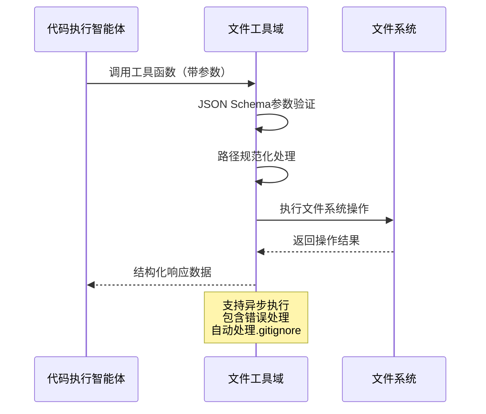

# Cowork AI 文件工具域技术文档

## 1. 模块概述

文件工具域是 Cowork AI 多智能体软件开发系统的核心基础设施模块，为代码执行智能体组提供完整的文件系统操作支持。该模块实现了异步文件处理能力，支持基本的文件读写、目录操作以及高级的增量编辑功能，是系统与本地文件系统交互的关键桥梁。

## 2. 架构设计

### 2.1 模块结构

文件工具域采用分层设计，包含参数模型层、工具实现层和接口适配层：

```mermaid
graph TB
   [文件工具域] --> B[参数模型层]
    A --> C[工具实现层]
    A --> D[接口适配层]
    
    B --> B1[ReadFileParams]
    B --> B2[WriteFileParams]
    B --> B3[ListDirParams]
    B --> B4[文件操作参数模型]
    
    C --> C1[基础文件操作]
    C --> C2[目录操作工具]
    C --> C3[增量编辑功能]
    
    D --> D1[FunctionTool接口]
    D --> D2[FileToolsBundle]
    D --> D3[工具注册管理]
```

### 2.2 核心组件交互



## 3. 核心功能实现

### 3.1 基础文件操作工具

#### 3.1.1 文件读取工具（read_file）
- **功能描述**：读取文件内容，返回文件内容字符串
- **实现要点**：
  ```rust
  match std::fs::read_to_string(&params.path) {
      Ok(content) => Ok(json!({
          "success": true,
          "path": params.path,
          "content": content,
          "size": content.len()
      })),
      // 错误处理...
  }
  ```
- **特性**：支持UTF-8编码，自动处理文件不存在异常

#### 3.1.2 文件写入工具（write_file）
- **功能描述**：写入内容到文件，自动创建父目录
- **关键实现**：
  ```rust
  // 确保父目录存在
  if let Some(parent) = Path::new(&params.path).parent() {
      if !parent.exists() {
          std::fs::create_dir_all(parent)?;
      }
  }
  ```
- **安全特性**：自动目录创建，防止写入失败

### 3.2 目录操作工具

#### 3.2.1 目录列表工具（list_directory）
- **核心特性**：集成 `ignore` crate 自动处理 `.gitignore` 规则
- **实现机制**：
  ```rust
  let mut builder = ignore::WalkBuilder::new(root);
  builder.git_ignore(true).git_global(true).git_exclude(true);
  if !recursive { builder.max_depth(Some(1)); }
  ```
- **过滤能力**：默认排除隐藏文件，支持递归遍历

#### 3.2.2 目录创建工具（create_directory）
- **递归创建**：支持多级目录创建
- **参数控制**：通过 `recursive` 参数控制是否创建父目录

### 3.3 增量编辑功能

#### 3.3.1 行级精确操作
所有增量编辑工具采用 1-based 行号索引，确保操作精确性：

```rust
let lines: Vec<String> = content.lines().map(|s| s.to_string()).collect();
let start_idx = params.start_line - 1; // 转换为0-based索引
```

#### 3.3.2 替换行范围工具（replace_line_range）
- **功能**：替换指定行范围内的内容
- **实现策略**：读取全部内容→按行分割→替换指定范围→重新写入

#### 3.3.3 插入行工具（insert_lines）
- **特殊处理**：`after_line=0` 表示在文件开头插入
- **批量插入**：支持多行内容一次性插入

#### 3.3.4 删除行范围工具（delete_line_range）
- **范围验证**：严格检查行号有效性
- **统计信息**：返回删除行数和更新后的总行数

## 4. 技术特性

### 4.1 异步处理架构
所有工具函数均支持异步执行，避免阻塞主线程：
```rust
|_ctx, args| async move {
    // 异步操作实现
}
```

### 4.2 参数验证机制
基于 JSON Schema 的强类型参数验证：
```rust
.with_parameters_schema::<ReadFileParams>()
```

### 4.3 错误处理策略
统一的错误处理模式，提供详细的错误信息：
```rust
Err(AdkError::Tool(format!("Failed to read file '{}': {}", params.path, e)))
```

### 4.4 Git集成支持
智能处理版本控制相关文件：
- 自动遵循 `.gitignore` 规则
- 排除 `.git` 目录内容
- 支持全局git排除规则

## 5. 数据结构定义

### 5.1 参数模型
所有工具函数都有对应的参数结构体，确保类型安全：

```rust
#[derive(JsonSchema, Serialize, Deserialize)]
pub struct ReadFileRangeParams {
    pub path: String,
    pub start_line: usize,      // 1-based，包含
    pub end_line: Option<usize>, // 1-based，包含
}
```

### 5.2 响应格式
统一的JSON响应结构，包含操作状态和详细统计信息：
```json
{
    "success": true,
    "path": "file.txt",
    "lines_inserted": 3,
    "total_lines_after": 15
}
```

## 6. 性能优化策略

### 6.1 大文件处理
- **分段读取**：`read_file_range` 支持大文件的分段读取
- **内存优化**：增量编辑避免一次性加载超大文件

### 6.2 目录遍历优化
- **深度控制**：支持非递归遍历减少IO操作
- **并行处理**：`ignore` crate 提供高效的文件系统遍历

## 7. 安全考虑

### 7.1 路径安全
- **相对路径处理**：基于项目根目录的相对路径解析
- **路径遍历防护**：防止恶意路径遍历攻击

### 7.2 文件权限
- **创建权限检查**：目录创建前检查写权限
- **读写权限分离**：明确区分读操作和写操作

## 8. 集成使用示例

### 8.1 代码执行智能体集成
```rust
// 在代码执行智能体中使用文件工具
let file_tools = create_file_tools();
let result = file_tools.write_file.execute(ctx, write_params).await?;
```

### 8.2 工具链组合使用
典型的文件操作流程：
1. 检查文件是否存在 (`file_exists`)
2. 读取文件内容 (`read_file` 或 `read_file_range`)
3. 修改内容（增量编辑工具）
4. 写回文件 (`write_file`)

## 9. 测试策略

### 9.1 单元测试覆盖
- 参数验证测试
- 文件操作边界条件测试
- 错误场景处理测试

### 9.2 集成测试
- 与真实文件系统交互测试
- 并发操作安全性测试
- Git集成功能验证

## 10. 扩展性设计

### 10.1 工具扩展机制
新的文件操作工具可以通过实现 `FunctionTool` trait 轻松集成：
```rust
pub struct FileToolsBundle {
    pub read_file: Arc<FunctionTool>,
    // ... 其他工具
    // 新工具可在此添加
}
```

### 10.2 参数模型扩展
支持新的操作类型只需定义对应的参数结构体并实现工具函数。

## 总结

文件工具域作为 Cowork AI 系统的核心基础设施，提供了强大而灵活的文件系统操作能力。通过精心设计的API接口、完备的错误处理机制和高效的性能优化，该模块为上层智能体提供了可靠的底层支持，是系统实现自动化代码生成和管理的技术基石。模块的模块化设计和扩展性架构为后续功能演进奠定了坚实基础。