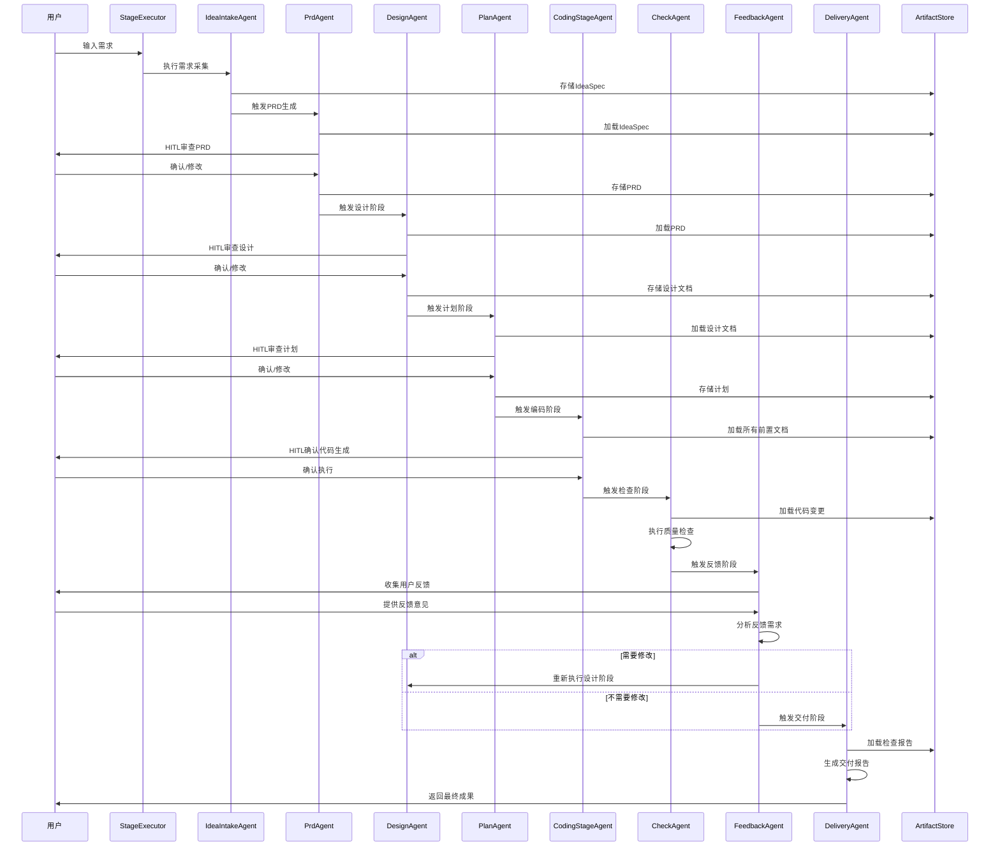

# Cowork AI Agent System - 智能体协作域技术文档

## 概述

智能体协作域是Cowork AI Agent System的核心业务域，负责实现软件开发生命周期的完整自动化流程。该域包含8个专业化智能体，通过统一的工作流编排器协调执行，实现从需求采集到代码交付的全流程智能化管理。

## 核心架构

### 统一接口设计

系统采用统一的`StageAgent`接口，确保所有智能体遵循相同的执行规范：

```rust
[async_trait]
pub trait StageAgent: Send + Sync {
    fn stage(&self) -> Stage;
    async fn execute(&self, context: &StageAgentContext) -> Result<StageAgentResult>;
    fn dependencies(&self) -> Vec<Stage>;
    fn requires_hitl_review(&self) -> bool;
    fn description(&self) -> &str;
}
```

### 模块组成

#### 1. 需求采集智能体 (IdeaIntakeAgent)
**职责**：将非结构化用户需求转化为结构化的IdeaSpec规格
- 支持多种需求输入格式
- 基于LLM的需求理解和结构化
- 生成初始的需求规格文档

#### 2. PRD智能体 (PrdAgent)
**职责**：基于IdeaSpec生成产品需求文档
- 定义产品范围和边界
- 详细需求规格定义
- 验收标准制定
- HITL审查点管理

#### 3. 设计智能体 (DesignAgent)
**职责**：基于PRD生成技术设计方案
- 系统架构设计
- 组件定义和接口设计
- 技术选型和实现策略
- 工作流程设计

#### 4. 计划智能体 (PlanAgent)
**职责**：制定实施计划和任务分解
- 任务优先级划分
- 里程碑规划
- 依赖关系管理
- 资源分配建议

#### 5. 编码阶段智能体 (CodingStageAgent)
**职责**：协调代码规划和执行的综合智能体
- 代码变更计划生成
- 代码执行协调
- HITL验证点管理
- 增量更新支持

#### 6. 检查智能体 (CheckAgent)
**职责**：代码质量检查和验证
- 静态代码分析
- 编译验证
- 需求覆盖度检查
- 测试执行验证

#### 7. 反馈智能体 (FeedbackAgent)
**职责**：收集和处理用户反馈
- 反馈内容分析
- 变更需求识别
- 重新执行决策
- 迭代流程管理

#### 8. 交付智能体 (DeliveryAgent)
**职责**：生成最终交付报告
- 功能完成度评估
- 使用说明生成
- 限制条件文档
- 验收标准汇总

## 技术实现

### 智能体执行流程



### 核心数据结构

#### StageAgentContext
智能体执行上下文，包含所有共享资源：
```rust
pub struct StageAgentContext {
    pub session_id: String,
    pub store: Arc<ArtifactStore>,
    pub hitl: Arc<HitlController>,
    pub user_input: Option<String>,
}
```

#### StageAgentResult
智能体执行结果标准化：
```rust
pub struct StageAgentResult {
    pub artifact_id: String,
    pub stage: Stage,
    pub verified: bool,
    pub summary: Vec<String>,
}
```

### 关键技术特性

#### 1. 模块化智能体设计
- 每个智能体职责单一，高度专业化
- 统一的接口规范，便于扩展和维护
- 支持智能体间的松耦合协作

#### 2. 人机交互(HITL)集成
- 关键决策点的人工验证
- 支持内容确认、编辑和修改
- 确保AI生成内容的质量和准确性

#### 3. 状态管理和持久化
- 基于工件的状态跟踪
- 版本化的产出物存储
- 支持断点续传和错误恢复

#### 4. 错误处理和容错机制
- 完善的错误处理策略
- 智能体执行状态监控
- 失败重试和降级处理

## 依赖关系

### 内部依赖
- **工作流编排域**：协调智能体执行顺序和依赖关系
- **工具支持域**：提供文件操作、命令执行等基础能力
- **验证安全域**：代码质量验证和安全检查
- **数据管理域**：工件存储和状态持久化

### 外部依赖
- **OpenAI LLM服务**：提供大语言模型推理能力
- **文件系统**：项目文件读写和配置管理
- **命令行环境**：构建、测试和验证命令执行

## 扩展性和维护性

### 智能体扩展机制
新智能体只需实现`StageAgent` trait即可集成到系统中：
```rust
impl StageAgent for NewAgent {
    fn stage(&self) -> Stage { Stage::NewStage }
    async fn execute(&self, context: &StageAgentContext) -> Result<StageAgentResult> {
        // 实现具体逻辑
    }
}
```

### 配置驱动行为
智能体行为可通过配置文件调整：
- LLM模型选择和参数配置
- 执行策略和超时设置
- HITL触发条件和审查流程

## 性能优化

### 异步执行模型
- 采用async/await异步编程
- 支持并发智能体执行
- 高效的资源利用

### 缓存和优化
- 智能体结果缓存机制
- 增量更新和局部重执行
- 批量处理和流水线优化

## 总结

智能体协作域是Cowork AI Agent System的核心引擎，通过8个专业化智能体的协同工作，实现了软件开发全生命周期的智能化管理。该域采用模块化设计、统一接口规范和标准化执行流程，确保了系统的可扩展性、可靠性和易维护性。通过HITL机制和状态管理策略，在保证自动化效率的同时，确保了开发过程的质量控制和用户参与度。