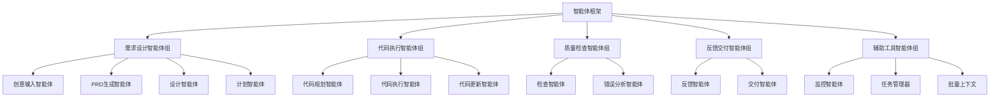
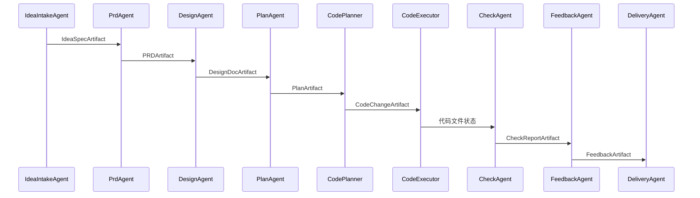

# Cowork AI 智能体执行域技术文档

## 1. 模块概述

智能体执行域是 Cowork AI 多智能体软件开发系统的核心业务组件，负责实现从创意输入到最终交付的完整 AI 驱动开发流程。该模块通过 15 个专业智能体协作完成软件开发的不同阶段任务，每个智能体基于标准化的 Agent 接口实现特定功能。

### 1.1 模块定位
- **核心业务域**：实现 AI 驱动的自动化软件开发核心逻辑
- **智能体协调**：通过标准化接口管理多个专业智能体的执行
- **LLM 集成**：基于 adk_rust 框架集成 OpenAI 兼容的大语言模型服务
- **工作流执行**：支撑 8 阶段软件开发工作流的具体实现

## 2. 架构设计

### 2.1 核心架构模式



### 2.2 统一接口设计

智能体执行域采用统一的 `Agent` trait 设计，确保所有智能体的标准化交互：

```rust
#[async_trait]
pub trait Agent: Send + Sync {
    /// Agent 名称
    fn name(&self) -> &str;

    /// 执行 Agent 逻辑
    async fn execute(&self, context: &AgentContext) -> Result<AgentOutput>;
}
```

## 3. 智能体组件详解

### 3.1 需求设计智能体组

#### 3.1.1 IdeaIntakeAgent（创意输入智能体）
**功能职责**：将用户非结构化输入转化为结构化的 IdeaSpec
- 输入处理：用户创意、需求描述等文本输入
- 输出生成：标准化的 IdeaSpecArtifact
- 关键特性：支持背景、目标、非目标、约束等结构化提取

#### 3.1.2 PrdAgent（PRD生成智能体）
**功能职责**：基于 IdeaSpec 生成产品需求文档
- 需求分析：将创意转化为具体的产品需求
- 优先级管理：支持 P0/P1/P2 优先级分类
- 验收标准：为每个需求定义明确的验收条件

#### 3.1.3 DesignAgent（设计智能体）
**功能职责**：基于 PRD 生成技术设计文档
- 架构设计：定义系统分层架构和组件关系
- 工作流设计：制定开发阶段和状态转换
- 接口规范：确定工件存储格式和交互接口

#### 3.1.4 PlanAgent（计划智能体）
**功能职责**：基于设计文档生成实施计划
- 任务分解：将设计转化为具体的实施任务
- 依赖管理：识别任务间的依赖关系
- 里程碑定义：设置关键节点和完成标准

### 3.2 代码执行智能体组

#### 3.2.1 CodePlanner（代码规划智能体）
**功能职责**：生成具体的代码变更计划
- 分阶段策略：避免 LLM 迭代限制问题
- 项目分析：分析现有项目结构和依赖关系
- 变更规划：制定详细的文件修改计划

#### 3.2.2 CodeExecutor（代码执行智能体）
**功能职责**：实际执行代码生成和文件修改
- **智能执行策略**：
  - 单个 Agent 模式（≤3 个文件）
  - 分批 Sub-Agent 模式（>3 个文件）
- **文件工具集成**：挂载文件操作工具实现自动化
- **上下文管理**：支持批次间上下文传递和 WatchDog 监控

#### 3.2.3 CodeUpdater（代码更新智能体）
**功能职责**：支持需求变更时的增量代码更新
- 差异分析：比较新旧需求识别变更点
- 影响评估：分析变更对现有代码的影响
- 合并策略：制定保护用户修改的智能合并方案

### 3.3 质量检查智能体组

#### 3.3.1 CheckAgent（检查智能体）
**功能职责**：多层级代码质量验证
- **文件存在性检查**：验证计划文件是否实际创建
- **内容质量检查**：代码规范性和完整性验证
- **编译语法检查**：语言特定的编译验证
- **需求覆盖验证**：检查代码是否满足 PRD 要求

#### 3.3.2 ErrorAnalyzer（错误分析智能体）
**功能职责**：深度分析代码错误和问题
- 错误分类：识别错误类型和严重程度
- 根因分析：追溯错误产生的根本原因
- 修复建议：提供具体的修复方案

### 3.4 反馈交付智能体组

#### 3.4.1 FeedbackAgent（反馈智能体）
**功能职责**：处理用户反馈并决策迭代策略
- 反馈分析：解析用户反馈的意图和需求
- 迭代决策：确定需要重做的开发阶段
- 变更跟踪：记录反馈驱动的变更历史

#### 3.4.2 DeliveryAgent（交付智能体）
**功能职责**：生成最终交付报告和总结
- 成果汇总：整合所有阶段的输出工件
- 质量评估：提供整体质量评价
- 文档生成：生成用户友好的交付文档

### 3.5 辅助工具智能体组

#### 3.5.1 WatchDogAgent（监控智能体）
**功能职责**：监控智能体执行过程和防止偏差
- 执行监控：实时监控 Agent 执行状态
- 偏差检测：识别执行过程中的偏离行为
- 质量保证：确保执行结果符合原始需求

#### 3.5.2 TodoListManager（任务管理器）
**功能职责**：管理开发任务的执行状态
- 任务追踪：跟踪每个任务的完成状态
- 状态更新：根据检查结果自动更新任务状态
- 进度报告：生成可视化的任务进度报告

#### 3.5.3 BatchContext（批量上下文）
**功能职责**：支持批量处理的上下文管理
- 批次管理：组织文件处理的批次逻辑
- 上下文传递：确保批次间的信息连续性
- 摘要生成：为每个文件生成执行摘要

## 4. 核心技术实现

### 4.1 LLM 集成架构

智能体执行域基于 adk_rust 框架实现 LLM 集成：

```rust
// 统一的 LLM 客户端配置
let config = OpenAIConfig::compatible(
    llm_config.api_key.clone(),
    llm_config.api_base_url.clone(),
    llm_config.model_name.clone(),
);
```

### 4.2 执行策略优化

#### 4.2.1 分批处理机制
```rust
// 根据文件数量选择执行策略
if changes.len() <= 3 {
    // 单个 Agent 处理模式
    self.execute_single_agent(...).await
} else {
    // 分批 Sub-Agent 模式
    self.execute_with_batches(...).await
}
```

#### 4.2.2 上下文感知执行
- **项目结构分析**：在执行前分析现有代码库
- **需求上下文**：保持原始需求的一致性
- **批次上下文**：支持多批次执行的连贯性

### 4.3 错误处理与容错

```rust
// 统一的错误处理模式
match self.execute_phase().await {
    Ok(result) => {
        // 成功处理逻辑
        self.store_artifact(result)?;
    }
    Err(error) => {
        // 错误恢复逻辑
        tracing::error!("Phase execution failed: {}", error);
        self.handle_execution_error(error).await?;
    }
}
```

## 5. 数据流与工件管理

### 5.1 工件传递流程



### 5.2 工件数据结构

每个智能体产生标准化的工件数据：
- **元数据**：会话ID、阶段标识、时间戳等
- **业务数据**：阶段特定的结构化数据
- **关系数据**：前置工件的引用关系
- **摘要信息**：用于监控和报告的关键信息

## 6. 性能与扩展性

### 6.1 性能优化策略

1. **异步执行**：所有智能体操作支持异步处理
2. **批量处理**：支持文件批量处理减少 LLM 调用次数
3. **缓存机制**：智能体状态和中间结果缓存
4. **资源管理**：LLM 连接池和并发控制

### 6.2 扩展性设计

1. **插件化架构**：新智能体只需实现标准 Agent trait
2. **配置驱动**：智能体行为可通过配置灵活调整
3. **模块化设计**：各智能体职责明确，支持独立演进
4. **接口标准化**：确保智能体间的无缝协作

## 7. 运维与监控

### 7.1 执行监控

- **进度追踪**：实时监控每个智能体的执行状态
- **性能指标**：收集执行时间、成功率等关键指标
- **错误日志**：详细的错误记录和堆栈跟踪
- **质量指标**：代码质量、需求覆盖率等业务指标

### 7.2 调试支持

- **详细日志**：结构化日志支持问题诊断
- **中间状态**：支持检查执行过程中的中间结果
- **重放能力**：支持从特定阶段重新执行
- **人工介入**：关键决策点支持人工审核

## 8. 最佳实践

### 8.1 开发指导

1. **智能体设计原则**：单一职责、明确输入输出、错误处理完备
2. **提示工程优化**：针对不同阶段优化 LLM 提示词
3. **测试策略**：单元测试 + 集成测试确保质量
4. **性能考量**：合理设计批量大小和并发控制

### 8.2 部署建议

1. **资源配置**：根据负载合理配置 LLM 服务资源
2. **监控告警**：设置关键指标告警阈值
3. **备份策略**：定期备份工件数据和配置
4. **版本管理**：智能体版本与系统版本同步管理

## 9. 总结

智能体执行域作为 Cowork AI 系统的核心引擎，通过精心设计的智能体架构和标准化的执行框架，实现了 AI 驱动软件开发的自动化流程。该模块不仅提供了强大的功能能力，还通过模块化设计和扩展性考虑，为系统的长期演进奠定了坚实基础。

关键优势包括：
- **完整的开发流程覆盖**：支持从创意到交付的全流程
- **智能的协作机制**：多智能体间的无缝协作
- **强大的扩展能力**：支持新智能体的快速集成
- **完善的监控体系**：确保执行过程的可观测性

该模块的成功实现为 AI 驱动的自动化软件开发提供了可靠的技术基础，展示了现代 AI 系统在复杂软件开发任务中的实际应用价值。