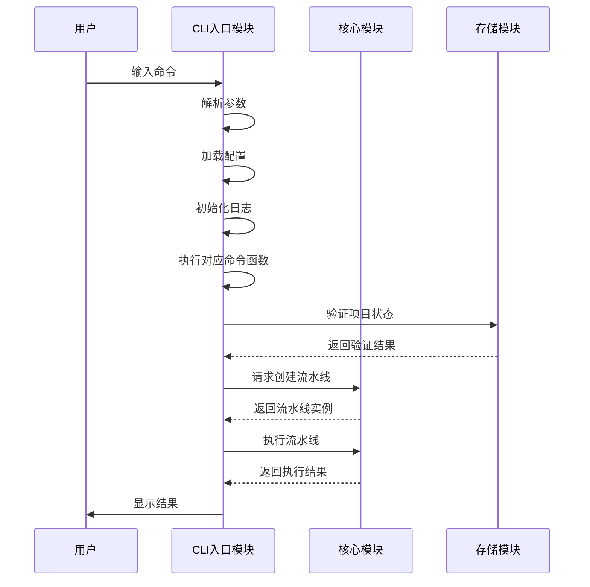

# Cowork Forge 用户接口域技术文档

## 1. 模块概述

### 1.1 模块定位
用户接口域是Cowork Forge系统的入口层，负责处理用户交互和系统入口点管理。作为AI驱动的软件开发编排器的命令行界面，该域承担着用户命令解析、会话初始化和流程协调的核心职责。

### 1.2 核心价值
- **用户友好性**：提供直观的命令行接口，降低用户使用门槛
- **流程协调**：作为系统入口点，协调各业务域模块的协同工作
- **会话管理**：负责项目会话的生命周期管理
- **错误处理**：提供清晰的错误反馈和恢复机制

## 2. 架构设计

### 2.1 模块结构
```
用户接口域
├── CLI入口模块 (crates/cowork-cli/src/main.rs)
│   ├── 命令行参数解析
│   ├── 会话初始化管理
│   ├── 命令分发路由
│   └── 执行结果展示
```

### 2.2 技术栈
- **编程语言**：Rust
- **命令行解析**：Clap库
- **异步运行时**：Tokio
- **日志系统**：tracing
- **配置文件**：TOML格式

## 3. 核心功能实现

### 3.1 命令行接口设计

#### 3.1.1 命令结构
```rust
[derive(Parser)]
#[command(name = "cowork")]
struct Cli {
    #[command(subcommand)]
    command: Commands,
    
    // 全局选项
    #[arg(short, long, global = true)]
    config: Option<String>,
    #[arg(short, long, global = true)]
    verbose: bool,
    #[arg(short, long, global = true)]
    stream: bool,
}

#[derive(Subcommand)]
enum Commands {
    /// 新建项目
    New { idea: String },
    
    /// 恢复项目
    Resume { base: Option<String> },
    
    /// 回滚项目
    Revert { from: String },
    
    /// 修改项目
    Modify { idea: String, base: Option<String> },
    
    /// 查看状态
    Status { sessions: bool },
    
    /// 初始化配置
    Init,
}
```

#### 3.1.2 配置文件管理
```rust
fn load_config(path: &str) -> Result<ModelConfig> {
    if Path::new(path).exists() {
        info!("Loading configuration from {}", path);
        ModelConfig::from_file(path)
    } else {
        info!("Config file not found, attempting to load from environment variables");
        ModelConfig::from_env()
    }
}
```

### 3.2 命令执行流程

#### 3.2.1 主执行流程


#### 3.2.2 新建项目流程 (cmd_new)
```rust
async fn cmd_new(idea: String, config: &ModelConfig, enable_stream: bool) -> Result<()> {
    // 1. 验证项目初始化状态
    if is_project_initialized() {
        error!(".cowork directory already initialized. Use 'resume' or 'modify' instead.");
        anyhow::bail!("Project already initialized");
    }
    
    // 2. 初始化项目索引
    let project_name = idea.split_whitespace().take(3).collect::<Vec<_>>().join("_");
    let mut index = init_project_index(project_name)?;
    
    // 3. 创建会话记录
    let session_id = format!("session-{}", chrono::Utc::now().timestamp());
    let session_record = SessionRecord { /* ... */ };
    index.add_session(session_record);
    save_project_index(&index)?;
    
    // 4. 创建流水线并执行
    let pipeline = create_cowork_pipeline(config, &session_id)?;
    execute_pipeline(pipeline, &idea, enable_stream).await?;
    
    // 5. 更新会话状态
    mark_session_completed(&session_id)?;
    Ok(())
}
```

### 3.3 会话管理机制

#### 3.3.1 会话类型支持
- **新建会话 (New)**：全新项目创建
- **恢复会话 (Resume)**：从检查点继续执行
- **回滚会话 (Revert)**：从特定阶段重新开始
- **修改会话 (Modify)**：增量修改现有项目

#### 3.3.2 会话状态跟踪
```rust
enum SessionStatus {
    InProgress,    // 执行中
    Completed,     // 已完成
    Failed,        // 执行失败
}

struct SessionRecord {
    session_id: String,
    session_type: SessionType,
    created_at: DateTime<Utc>,
    completed_at: Option<DateTime<Utc>>,
    status: SessionStatus,
    base_session_id: Option<String>,
    input_description: String,
    change_request_id: Option<String>,
}
```

## 4. 交互设计

### 4.1 用户反馈机制

#### 4.1.1 实时进度显示
- 启用stream选项时显示AI思考过程
- 分阶段显示执行进度
- 关键决策点的用户介入提示

#### 4.1.2 错误处理策略
```rust
match result {
    Ok(_) => {
        mark_session_completed(&session_id)?;
        println!("\n✅ Project creation complete!");
        println!("Session ID: {}", session_id);
        println!("Check .cowork/sessions/{}/artifacts/ for outputs", session_id);
    }
    Err(e) => {
        mark_session_failed(&session_id)?;
        return Err(e);
    }
}
```

### 4.2 配置管理

#### 4.2.1 配置加载策略
1. **文件优先**：优先从config.toml加载配置
2. **环境变量备用**：文件不存在时从环境变量加载
3. **默认值保障**：确保系统有基本可用的配置

#### 4.2.2 日志级别控制
```rust
let log_filter = if cli.verbose {
    "debug".to_string()  // 详细模式：显示所有日志
} else {
    "info,adk_agent=warn,adk_core=warn,adk_runner=warn".to_string()  // 正常模式：过滤内部日志
};
```

## 5. 技术实现细节

### 5.1 异步执行模型
```rust
#[tokio::main]
async fn main() -> Result<()> {
    let cli = Cli::parse();
    
    // 异步执行命令
    match cli.command {
        Commands::New { idea } => cmd_new(idea, &config, enable_stream).await?,
        Commands::Resume { base } => cmd_resume(base, &config, enable_stream).await?,
        // ... 其他命令
    }
    
    Ok(())
}
```

### 5.2 错误处理策略
- 使用anyhow::Result统一错误类型
- 分层错误处理：参数验证→业务逻辑→系统错误
- 友好的错误消息和恢复建议

### 5.3 资源管理
- 会话文件的自动清理机制
- 配置文件的版本兼容性处理
- 临时文件的生命周期管理

## 6. 集成关系

### 6.1 与工作流编排域的集成
```rust
// 依赖工作流编排域创建不同类型的流水线
use cowork_core::pipeline::{
    create_cowork_pipeline,      // 完整流水线
    create_partial_pipeline,     // 部分流水线  
    create_resume_pipeline,      // 恢复流水线
    create_modify_pipeline       // 修改流水线
};
```

### 6.2 与数据存储域的集成
```rust
// 依赖数据存储域进行会话管理
use cowork_core::storage::*;
use cowork_core::data::*;

// 会话状态持久化
save_project_index(&index)?;
save_session_input(&session_id, &session_input)?;
mark_session_completed(&session_id)?;
```

## 7. 最佳实践

### 7.1 命令行设计原则
1. **一致性**：命令命名和参数风格统一
2. **可发现性**：提供清晰的帮助信息
3. **容错性**：合理的默认值和错误提示
4. **可扩展性**：支持新的命令和选项扩展

### 7.2 用户体验优化
- 进度指示器显示长时间操作
- 颜色和格式化的输出增强可读性
- 详细的错误信息和解决建议
- 会话ID的持久化记录便于后续操作

## 8. 扩展性考虑

### 8.1 新命令支持
通过扩展Commands枚举和添加对应的命令处理函数，可以轻松支持新的操作类型。

### 8.2 配置扩展
ModelConfig结构支持从多种来源加载配置，便于集成新的LLM服务商或调整系统参数。

### 8.3 输出格式定制
支持不同的输出格式（JSON、YAML等）便于与其他工具集成。

## 9. 总结

用户接口域作为Cowork Forge系统的入口点，通过精心设计的命令行接口为用户提供直观、高效的操作体验。模块采用模块化设计，与系统其他域保持清晰的边界，同时通过完善的错误处理和用户反馈机制确保系统的可用性和可靠性。

该域的成功实现为整个AI驱动的软件开发编排系统奠定了坚实的用户交互基础，使得复杂的多智能体协作流程能够以简单直观的方式呈现给最终用户。