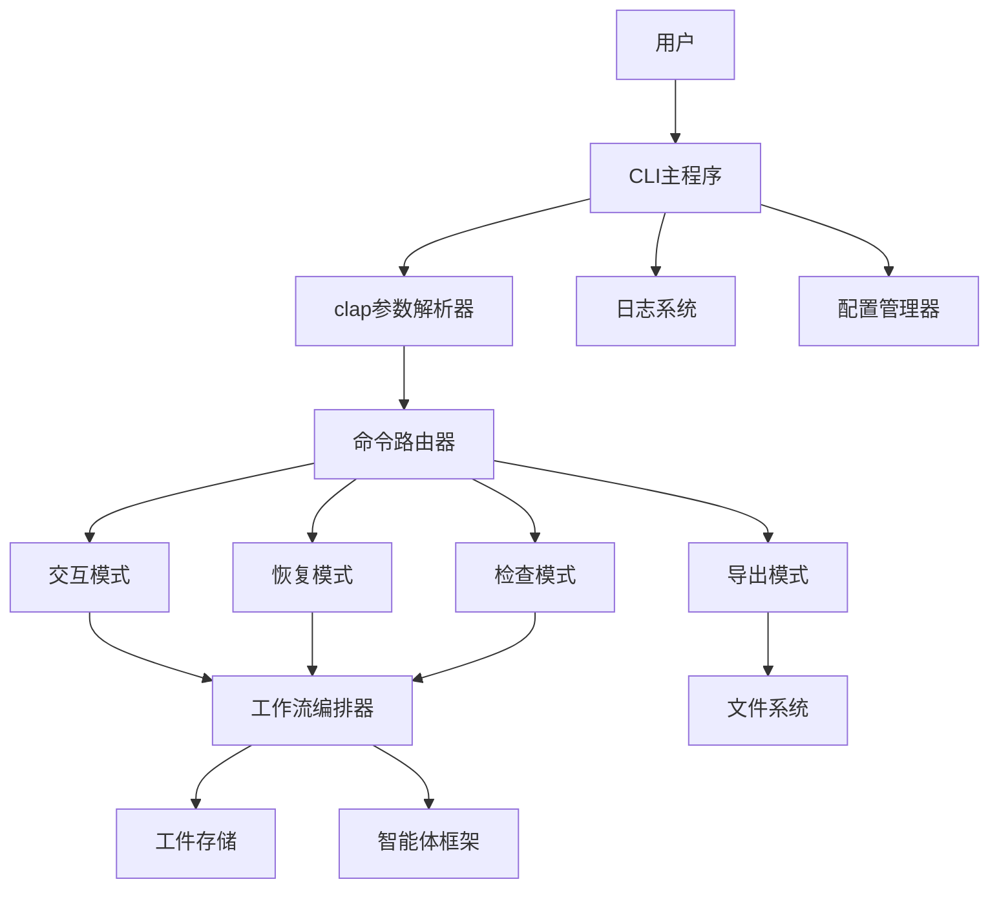
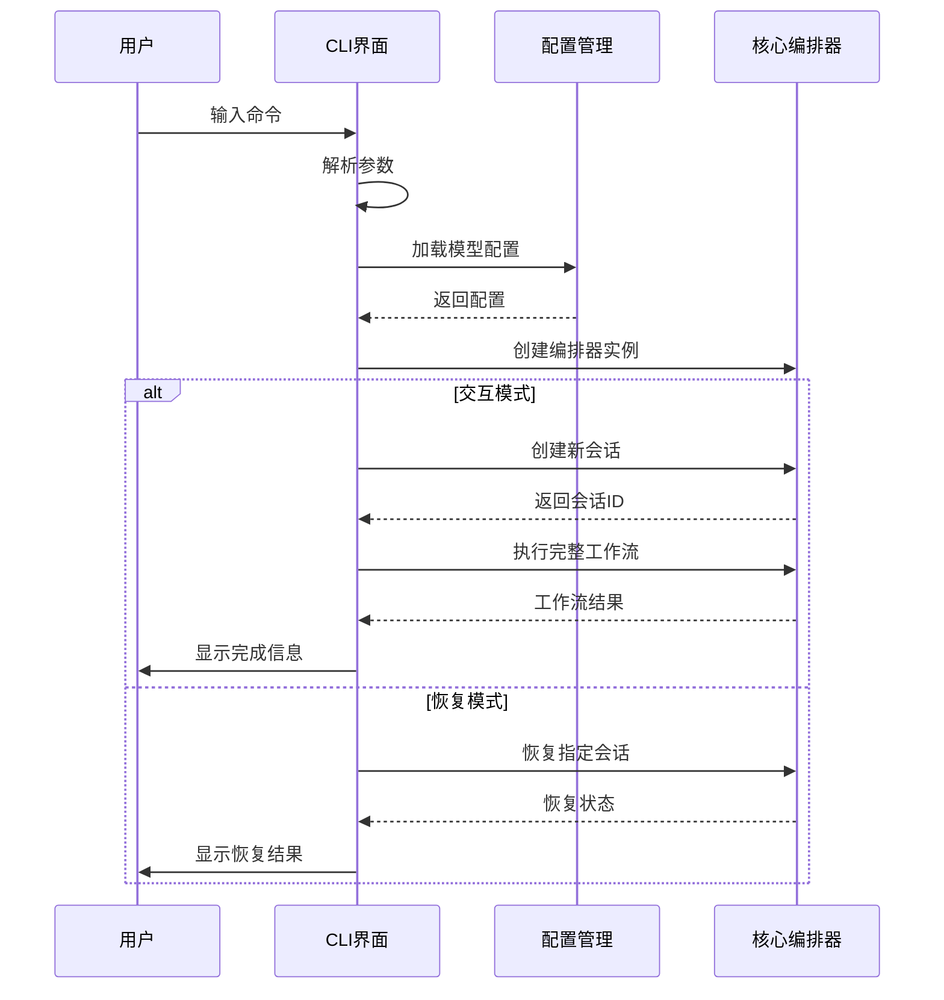

# Cowork AI 多智能体软件开发系统 - 用户界面域技术文档

## 1. 模块概述

**用户界面域**是Cowork AI多智能体软件开发系统的入口层，负责提供命令行界面(CLI)作为用户与系统交互的主要通道。该域作为系统的"门面"，承担着命令解析、会话管理、用户交互和结果展示等核心职责。

### 1.1 模块定位
- **层次位置**: 基础设施域
- **重要性评分**: 6.0/10.0
- **复杂度评分**: 5.0/10.0
- **核心职责**: 用户交互接口、命令路由、会话生命周期管理

### 1.2 技术栈
```rust
// 核心技术依赖
clap           // 命令行参数解析
console        // 终端美化输出
dialoguer      // 交互式对话框
tracing        // 结构化日志
tokio          // 异步运行时
cowork-core    // 核心业务逻辑
```

## 2. 架构设计

### 2.1 模块结构
```
用户界面域
├── CLI主程序 (main.rs)
│   ├── 命令解析层
│   ├── 会话管理控制器
│   ├── 交互式界面组件
│   └── 导出工具模块
└── 服务器模块 (server.rs) - 待实现
```

### 2.2 核心组件交互关系



## 3. 核心功能实现

### 3.1 命令架构设计

```rust
#[derive(Parser)]
#[command(name = "cowork")]
#[command(about = "AI-powered multi-agent software development system")]
struct Cli {
    #[command(subcommand)]
    command: Option<Commands>,
    
    /// 模型配置文件路径
    #[arg(long, default_value = "项目材料/大模型配置说明.md")]
    config: String,
}

#[derive(Subcommand)]
enum Commands {
    /// 恢复会话
    Resume { session_id: String },
    /// 检查会话工件
    Inspect { session_id: String },
    /// 导出最终交付物
    Export { session_id: String },
}
```

### 3.2 四种操作模式

#### 3.2.1 交互模式（默认）
**功能描述**: 创建新会话并执行完整的8阶段工作流
```rust
async fn interactive_mode(orchestrator: Orchestrator, model_config: ModelConfig) -> Result<()> {
    // 1. 欢迎界面和初始化
    println!("{}", style("Welcome to Cowork!").bold().cyan());
    
    // 2. 创建新会话
    let session_id = orchestrator.create_session()?;
    
    // 3. 执行完整工作流
    orchestrator.run_full_workflow(&session_id, &model_config).await?;
    
    // 4. 结果展示
    println!("Session ID: {}", session_id);
    println!("Artifacts saved to: .cowork/{}/artifacts/", session_id);
}
```

#### 3.2.2 恢复模式
**功能描述**: 从指定阶段恢复中断的会话
```rust
async fn resume_session(orchestrator: Orchestrator, session_id: &str, model_config: ModelConfig) -> Result<()> {
    println!("{}", style(format!("🔄 恢复会话: {}", session_id)).bold().cyan());
    orchestrator.resume_session(session_id, &model_config).await?;
    println!("{}", style("✅ 会话恢复完成！").bold().green());
}
```

#### 3.2.3 检查模式
**功能描述**: 查看会话元数据和工件状态
```rust
fn inspect_session(orchestrator: Orchestrator, session_id: &str) -> Result<()> {
    // 1. 加载会话元数据
    let meta = orchestrator.load_session_meta(session_id)?;
    
    // 2. 显示会话信息
    println!("📊 会话信息:");
    println!("  创建时间: {}", meta.created_at);
    println!("  当前阶段: {:?}", meta.current_stage);
    
    // 3. 列出所有工件
    let artifacts = orchestrator.list_artifacts(session_id)?;
    for artifact in artifacts {
        println!("  ┌─ {} ({:?})", artifact.artifact_id, artifact.stage);
        println!("  │  JSON: {}", artifact.path_json.display());
        println!("  └─ MD:   {}", artifact.path_md.display());
    }
    
    // 4. 提供下一步建议
    let next_stage = cowork_core::Stage::all()
        .iter()
        .find(|s| !meta.completed_stages.contains(s));
}
```

#### 3.2.4 导出模式
**功能描述**: 将会话结果导出到本地目录
```rust
fn export_session(session_id: &str) -> Result<()> {
    // 1. 验证会话存在
    let session_dir = PathBuf::from(".cowork").join(session_id);
    
    // 2. 创建导出目录
    let export_dir = PathBuf::from("exports").join(session_id);
    fs::create_dir_all(&export_dir)?;
    
    // 3. 复制工件文件
    let artifacts_dir = session_dir.join("artifacts");
    for entry in fs::read_dir(&artifacts_dir)? {
        let path = entry?.path();
        if path.extension().and_then(|s| s.to_str()) == Some("md") {
            fs::copy(&path, export_dir.join(path.file_name().unwrap()))?;
        }
    }
    
    // 4. 复制元数据
    fs::copy(session_dir.join("meta.json"), export_dir.join("meta.json"))?;
}
```

### 3.3 配置管理
```rust
// 配置加载策略：文件优先，环境变量备选
let model_config = ModelConfig::from_file(&cli.config)
    .or_else(|e| {
        tracing::warn!("Failed to load config from file: {}, trying environment variables", e);
        ModelConfig::from_env()
    })?;
```

### 3.4 日志系统集成
```rust
// 初始化结构化日志系统
tracing_subscriber::fmt()
    .with_env_filter(EnvFilter::from_default_env().add_directive(tracing::Level::INFO.into()))
    .init();
```

## 4. 工作流程

### 4.1 主执行流程


### 4.2 错误处理流程
```rust
// 统一的错误处理策略
#[tokio::main]
async fn main() -> Result<()> {
    // 初始化工作...
    
    match cli.command {
        None => interactive_mode(orchestrator, model_config).await?,
        Some(Commands::Resume { session_id }) => {
            resume_session(orchestrator, &session_id, model_config).await?
        }
        // 其他命令处理...
    }
    
    Ok(()) // 统一返回Result类型
}
```

## 5. 用户体验设计

### 5.1 界面美化
- **彩色输出**: 使用`console`库提供视觉层次
- **表情符号**: 使用Unicode表情增强可读性
- **格式化文本**: 清晰的缩进和分隔符

### 5.2 交互体验
- **渐进式反馈**: 每个操作都有明确的状态指示
- **上下文感知**: 根据会话状态提供智能建议
- **错误友好**: 详细的错误信息和恢复指导

### 5.3 多语言支持
```rust
// 支持中英文混合界面
println!("{}", style("🔄 恢复会话: {}").bold().cyan());  // 中文界面
println!("Session created: {}", style(&session_id).green()); // 英文关键信息
```

## 6. 技术实现细节

### 6.1 异步处理
```rust
#[tokio::main]
async fn main() -> Result<()> {
    // 异步主函数，支持长时间运行的工作流
    // ...
}
```

### 6.2 内存管理
- **轻量级设计**: CLI作为薄层包装器，主要逻辑在core模块
- **资源释放**: 正确管理文件句柄和网络连接
- **会话隔离**: 每个会话独立，避免状态污染

### 6.3 文件操作安全
```rust
// 安全的文件操作模式
if !session_dir.exists() {
    return Err(anyhow::anyhow!("Session {} not found", session_id));
}
fs::create_dir_all(&export_dir)?; // 确保目录存在
```

## 7. 扩展性和维护性

### 7.1 命令扩展机制
```rust
// 易于添加新子命令
#[derive(Subcommand)]
enum Commands {
    Resume { session_id: String },
    Inspect { session_id: String },
    Export { session_id: String },
    // 未来可添加：List, Clean, Config 等命令
}
```

### 7.2 配置灵活性
- **多配置源**: 文件配置与环境变量并存
- **配置验证**: 类型安全的配置加载
- **热重载支持**: 为未来扩展预留接口

## 8. 性能考量

### 8.1 启动性能
- **延迟初始化**: 按需加载核心组件
- **配置缓存**: 避免重复的配置解析
- **异步启动**: 并行初始化各个子系统

### 8.2 响应性能
- **命令路由优化**: 快速识别和分发命令
- **错误快速失败**: 尽早发现和处理错误
- **资源懒加载**: 会话数据按需加载

## 9. 总结

用户界面域作为Cowork AI系统的入口点，成功实现了以下设计目标：

1. **简洁易用**: 提供直观的命令行接口，降低用户学习成本
2. **功能完整**: 支持完整的会话生命周期管理
3. **健壮可靠**: 完善的错误处理和恢复机制
4. **扩展性强**: 模块化设计便于未来功能扩展
5. **用户体验佳**: 美观的输出和友好的交互提示

该域的设计体现了现代CLI工具的最佳实践，为Cowork AI系统的用户交互提供了坚实的基础。通过清晰的架构分层和标准化的接口设计，确保了系统整体的可维护性和可扩展性。