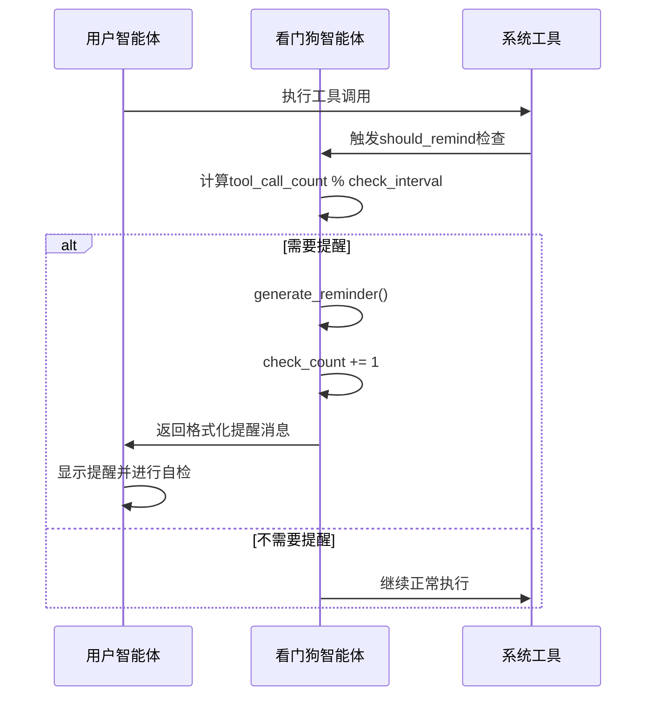
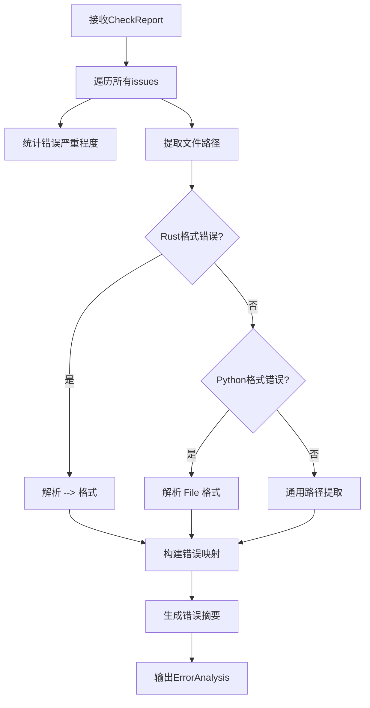

# 监控辅助域技术文档

## 模块概述

监控辅助域是Cowork AI Agent System中的运维支持模块，负责系统运行时的行为监控和错误分析。该域包含两个核心组件：**看门狗智能体**和**错误分析器**，共同确保系统在执行过程中保持正确的行为轨迹和及时的问题诊断能力。

## 模块架构

### 1. 看门狗智能体 (WatchDogAgent)

#### 1.1 核心功能
看门狗智能体是一个智能监控组件，负责跟踪和指导其他智能体的执行行为：

- **周期性行为监控**：每隔N次工具调用检查智能体行为
- **目标偏离预防**：防止智能体在执行过程中偏离原始需求
- **目标更新管理**：支持动态切换子任务目标
- **统计追踪**：记录检查次数和监控历史

#### 1.2 技术实现

**数据结构定义：**
```rust
pub struct WatchDogAgent {
    /// 用户原始需求
    original_requirements: String,
    
    /// 当前阶段目标
    current_objective: String,
    
    /// 检查间隔（每N次工具调用检查一次）
    check_interval: usize,
    
    /// 已检查次数
    check_count: usize,
}

/// 统计信息结构
pub struct WatchDogStats {
    pub check_count: usize,
    pub check_interval: usize,
}
```

**关键算法逻辑：**
```rust
// 检查触发条件：工具调用次数为检查间隔的整数倍
pub fn should_remind(&self, tool_call_count: usize) -> bool {
    tool_call_count > 0 && tool_call_count % self.check_interval == 0
}
```

### 2. 错误分析器 (ErrorAnalyzer)

#### 2.1 核心功能
错误分析器负责从检查报告中提取结构化错误信息：

- **多语言错误解析**：支持Rust、Python等多种编程语言的错误格式
- **智能文件路径提取**：从错误信息中自动识别受影响文件
- **错误分类统计**：按严重程度（错误、警告）进行分类统计
- **详细错误信息生成**：为智能体重试提供结构化错误数据

#### 2.2 技术实现

**错误分析结果结构：**
```rust
pub struct ErrorAnalysis {
    /// 受影响的文件列表
    pub affected_files: Vec<String>,
    
    /// 每个文件的详细错误
    pub error_details_by_file: HashMap<String, Vec<String>>,
    
    /// 错误摘要
    pub summary: String,
    
    /// 详细错误信息（用于传递给Agent）
    pub detailed_errors: String,
    
    /// 是否有严重错误
    pub has_critical_errors: bool,
}
```

**多语言错误解析算法：**
```rust
// Rust错误格式：error[E0XXX]: ... --> src/main.rs:42:5
if line.contains(" --> ") {
    // 提取文件路径逻辑
}

// Python错误格式：File "main.py", line 10
if line.contains("File \"") {
    // 提取文件路径逻辑
}
```

## 工作流程

### 看门狗智能体工作流程



### 错误分析器工作流程



## 关键技术特性

### 1. 智能提醒机制

看门狗智能体采用基于工具调用次数的智能提醒策略：

- **可配置间隔**：支持动态调整检查频率（默认每3次工具调用检查一次）
- **渐进式提醒**：提醒消息包含检查次数标识，便于追踪监控历史
- **上下文保持**：始终包含原始需求和当前目标，确保上下文一致性

### 2. 多语言错误解析

错误分析器具备强大的多语言错误解析能力：

- **Rust编译错误**：解析 `--> src/main.rs:42:5` 格式
- **Python运行时错误**：解析 `File "main.py", line 10` 格式
- **通用错误格式**：支持 `path.ext:line:col` 的标准格式
- **跨语言适应性**：通过正则表达式和模式匹配实现语言无关解析

### 3. 结构化错误报告

错误分析器生成的错误报告具有高度结构化特性：

```rust
// 错误报告示例
ErrorAnalysis {
    affected_files: vec!["src/main.rs", "src/lib.rs"],
    error_details_by_file: {
        "src/main.rs": vec!["[error] cannot find value `x`"],
        "src/lib.rs": vec!["[error] mismatched types"]
    },
    summary: "2 total issues (2 errors, 0 warnings)",
    detailed_errors: "- ISSUE-COMPILE-RUST: cannot find value `x`\n  Fix hint: ...",
    has_critical_errors: true,
}
```

## 集成与交互

### 1. 与工作流编排域的集成

监控辅助域通过以下方式与工作流编排域交互：

- **阶段切换通知**：在新阶段开始时重置看门狗计数器
- **目标更新协调**：编排器通知看门狗更新当前目标
- **错误处理协调**：错误分析结果反馈给编排器决定后续流程

### 2. 与智能体协作域的协同

- **行为监控**：看门狗监控所有业务智能体的工具调用行为
- **错误反馈**：错误分析器为编码和检查智能体提供结构化错误信息
- **质量保证**：共同确保开发过程的质量和正确性

## 配置与调优

### 看门狗配置参数

```rust
// 推荐配置示例
let watchdog = WatchDogAgent::new(
    "构建Web应用程序".to_string(),     // 原始需求
    "生成HTML文件".to_string(),        // 当前目标  
    3                                  // 检查间隔
);
```

**配置建议：**
- **检查间隔**：根据任务复杂度调整（简单任务：5-10，复杂任务：3-5）
- **目标描述**：保持具体性和可衡量性
- **需求描述**：保留原始需求的完整上下文

### 错误分析调优

错误分析器支持以下调优策略：

- **路径识别灵敏度**：通过`looks_like_path`算法调整文件路径识别规则
- **错误分类阈值**：根据项目类型调整错误严重程度判断标准
- **多语言支持扩展**：通过添加新的解析模式支持更多编程语言

## 测试覆盖

监控辅助域具有完整的单元测试覆盖：

### 看门狗智能体测试
- `test_watchdog_should_remind()`：验证提醒触发逻辑
- `test_watchdog_generate_reminder()`：测试提醒消息生成
- `test_watchdog_update_objective()`：验证目标更新功能

### 错误分析器测试  
- `test_extract_file_path()`：验证文件路径提取算法
- `test_extract_files_from_compilation_errors()`：测试编译错误解析

## 性能考虑

### 1. 内存效率
- 看门狗智能体采用轻量级数据结构，内存占用最小化
- 错误分析器使用HashMap进行高效的文件-错误映射

### 2. 计算效率
- 提醒检查采用模运算，计算复杂度O(1)
- 错误解析采用线性扫描，支持大文本处理

### 3. 扩展性设计
- 模块化设计支持单独扩展看门狗或错误分析功能
- 接口设计允许替换不同的监控策略或分析算法

## 最佳实践

### 1. 监控策略配置
```rust
// 复杂任务配置（频繁监控）
let complex_watchdog = WatchDogAgent::new(requirements, objective, 3);

// 简单任务配置（较少监控）  
let simple_watchdog = WatchDogAgent::new(requirements, objective, 10);
```

### 2. 错误处理集成
```rust
// 在检查阶段集成错误分析
let analysis = ErrorAnalyzer::analyze(&check_report);
if analysis.has_critical_errors {
    // 触发重试或人工干预流程
}
```

监控辅助域作为系统的"质量守门员"，通过智能监控和错误分析，确保AI驱动开发过程的可靠性、可控性和高质量交付。