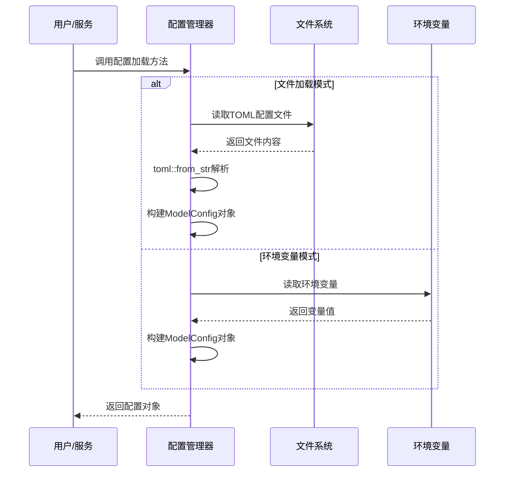
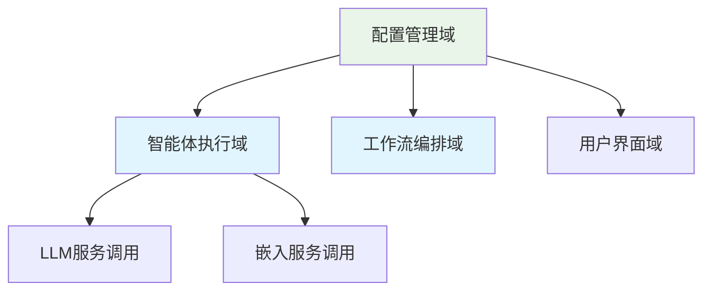

# 配置管理域技术文档

## 1. 模块概述

配置管理域是Cowork AI多智能体软件开发系统的核心基础设施模块，负责集中管理系统运行所需的各类配置参数。该模块作为AI服务的中央配置中心，为整个系统提供统一、类型安全的配置管理能力。

### 1.1 模块定位
- **所属层级**：基础设施域
- **功能定位**：LLM服务和嵌入服务配置管理中心
- **重要性评级**：7.0/10.0
- **代码路径**：`crates/cowork-core/src/config.rs`

### 1.2 核心职责
- 定义配置数据结构模型
- 支持多源配置加载（文件+环境变量）
- 提供类型安全的配置访问接口
- 统一管理AI服务相关配置参数

## 2. 架构设计

### 2.1 配置层次结构

配置管理域采用分层配置模型，包含三个主要配置层级：

```rust
ModelConfig (顶级配置容器)
├── LlmConfig (大语言模型配置)
│   ├── api_base_url: String
│   ├── api_key: String
│   └── model_name: String
└── EmbeddingConfig (嵌入服务配置)
    ├── api_base_url: String
    ├── api_key: String
    └── model_name: String
```

### 2.2 配置加载流程



## 3. 核心实现

### 3.1 数据结构定义

#### 3.1.1 LlmConfig结构
```rust[derive(Debug, Clone, Serialize, Deserialize)]
pub struct LlmConfig {
    pub api_base_url: String,   // LLM服务API端点
    pub api_key: String,        // API认证密钥
    pub model_name: String,     // 模型名称标识
}
```

#### 3.1.2 EmbeddingConfig结构
```rust
#[derive(Debug, Clone, Serialize, Deserialize)]
pub struct EmbeddingConfig {
    pub api_base_url: String,   // 嵌入服务API端点
    pub api_key: String,        // API认证密钥
    pub model_name: String,     // 嵌入模型名称
}
```

#### 3.1.3 ModelConfig容器
```rust
#[derive(Debug, Clone, Serialize, Deserialize)]
pub struct ModelConfig {
    pub llm: LlmConfig,         // 大模型配置组
    pub embedding: EmbeddingConfig, // 嵌入服务配置组
}
```

### 3.2 配置加载方法

#### 3.2.1 文件配置加载
```rust
pub fn from_file(path: &str) -> Result<Self> {
    let content = std::fs::read_to_string(path)?;  // 读取文件内容
    Ok(toml::from_str(&content)?)                 // TOML反序列化
}
```

**技术特点：**
- 使用`std::fs::read_to_string`进行文件IO操作
- 通过`toml::from_str`实现TOML格式解析
- 返回`anyhow::Result`确保错误处理统一性

#### 3.2.2 环境变量配置加载
```rust
pub fn from_env() -> Result<Self> {
    Ok(Self {
        llm: LlmConfig {
            api_base_url: std::env::var("LLM_API_BASE_URL")?,
            api_key: std::env::var("LLM_API_KEY")?,
            model_name: std::env::var("LLM_MODEL_NAME")?,
        },
        embedding: EmbeddingConfig {
            api_base_url: std::env::var("EMBEDDING_API_BASE_URL")?,
            api_key: std::env::var("EMBEDDING_API_KEY")?,
            model_name: std::env::var("EMBEDDING_MODEL_NAME")?,
        },
    })
}
```

**技术特点：**
- 使用`std::env::var`读取系统环境变量
- 支持容器化部署和云原生配置管理
- 提供文件配置的备用方案

### 3.3 序列化支持

模块通过`serde`库提供完整的序列化/反序列化能力：

```rust
use serde::{Deserialize, Serialize};

#[derive(Debug, Clone, Serialize, Deserialize)]
pub struct ModelConfig {
    // ...
}
```

**序列化特性：**
- `Serialize`: 支持配置导出和持久化
- `Deserialize`: 支持配置加载和解析
- `Debug`: 调试信息输出
- `Clone`: 配置对象复制支持

## 4. 配置管理策略

### 4.1 多源配置支持

| 配置源 | 适用场景 | 优先级 | 技术实现 |
|--------|----------|--------|----------|
| TOML文件 | 本地开发、固定配置 | 高 | `toml::from_str` |
| 环境变量 | 容器部署、敏感配置 | 中 | `std::env::var` |

### 4.2 错误处理机制

配置管理域采用统一的错误处理策略：

```rust
use anyhow::Result;

pub fn from_file(path: &str) -> Result<Self> {
    // 统一错误类型，便于调用方处理
}
```

**错误类型涵盖：**
- 文件不存在或权限错误
- TOML格式解析错误
- 环境变量未设置错误
- 类型转换错误

### 4.3 安全考虑

1. **敏感信息保护**：API密钥通过环境变量管理，避免硬编码
2. **配置验证**：运行时配置完整性检查
3. **访问控制**：配置对象提供只读访问接口

## 5. 系统集成

### 5.1 依赖关系分析

配置管理域作为基础设施组件，被多个核心业务域依赖：



### 5.2 典型使用场景

#### 5.2.1 智能体初始化
```rust
// 在智能体执行域中的使用示例
impl PrdAgent {
    pub async fn new() -> Result<Self> {
        let config = ModelConfig::from_file("config.toml")?;
        Ok(PrdAgent { config })
    }
}
```

#### 5.2.2 工作流编排器配置
```rust
// 工作流编排域中的配置加载
impl Orchestrator {
    pub fn with_config(config: ModelConfig) -> Self {
        Orchestrator { config }
    }
}
```

## 6. 配置示例

### 6.1 TOML配置文件格式

```toml
[llm]
api_base_url = "https://api.openai.com/v1"
api_key = "sk-xxxxxxxxxxxxxxxx"
model_name = "gpt-4"

[embedding]
api_base_url = "https://api.openai.com/v1"
api_key = "sk-xxxxxxxxxxxxxxxx"
model_name = "text-embedding-ada-002"
```

### 6.2 环境变量配置

```bash
export LLM_API_BASE_URL="https://api.openai.com/v1"
export LLM_API_KEY="sk-xxxxxxxxxxxxxxxx"
export LLM_MODEL_NAME="gpt-4"
export EMBEDDING_API_BASE_URL="https://api.openai.com/v1"
export EMBEDDING_API_KEY="sk-xxxxxxxxxxxxxxxx"
export EMBEDDING_MODEL_NAME="text-embedding-ada-002"
```

## 7. 最佳实践

### 7.1 配置管理建议

1. **开发环境**：使用TOML文件管理固定配置
2. **生产环境**：使用环境变量管理敏感信息
3. **版本控制**：配置文件模板纳入版本管理，敏感信息使用.env文件
4. **配置验证**：应用启动时进行配置完整性检查

### 7.2 性能优化考虑

- 配置对象实现`Clone` trait，支持高效复制
- 使用惰性初始化避免重复配置加载
- 考虑引入配置缓存机制提升访问性能

## 8. 扩展性设计

### 8.1 未来扩展方向

1. **配置热重载**：支持运行时配置更新
2. **配置验证**：增加配置项合法性校验
3. **多环境支持**：开发/测试/生产环境配置隔离
4. **配置模板**：提供配置生成和模板管理

### 8.2 接口扩展性

当前设计为未来扩展预留了良好的接口基础：

```rust
// 可扩展的配置加载接口
pub trait ConfigLoader {
    fn load() -> Result<ModelConfig>;
}

// 支持新的配置源实现
impl ConfigLoader for DatabaseConfigLoader {
    // ...
}
```

## 9. 总结

配置管理域作为Cowork AI系统的核心基础设施组件，通过简洁而强大的设计实现了：

1. **统一管理**：集中管理所有AI服务相关配置
2. **多源支持**：灵活的文件和环境变量配置支持
3. **类型安全**：基于Rust强类型系统的安全配置访问
4. **易于集成**：清晰的接口设计便于系统各模块使用

该模块的设计体现了现代软件系统的配置管理最佳实践，为系统的稳定运行和灵活部署提供了坚实基础。