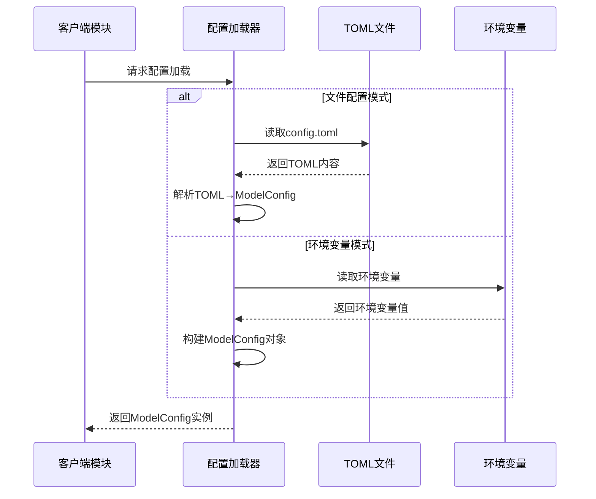

# Cowork AI Agent System 配置管理域技术文档

## 1. 概述

配置管理域是Cowork AI Agent System的基础设施支持域，负责系统配置的统一管理和加载。该域采用类型安全的配置模型，支持从TOML配置文件和环境变量两种方式加载配置，为其他业务域提供标准化的配置访问接口。

## 2. 架构设计

### 2.1 核心组件结构

配置管理域采用分层结构设计，包含三个主要配置结构体：

```rust
/// 配置层次结构
ModelConfig (顶级配置容器)
├── LlmConfig (大语言模型配置)
│   ├── api_base_url: String
│   ├── api_key: String
│   └── model_name: String
└── EmbeddingConfig (嵌入服务配置)
    ├── api_base_url: String
    ├── api_key: String
    └── model_name: String
```

### 2.2 配置加载策略

系统支持双模式配置加载机制：

- **文件配置模式**：优先从TOML配置文件加载，提供结构化配置管理
- **环境变量模式**：作为备用方案，适用于容器化部署环境

## 3. 技术实现

### 3.1 核心数据结构

```rust
/// 大模型配置（从文件加载[derive(Debug, Clone, Serialize, Deserialize)]
pub struct LlmConfig {
    pub api_base_url: String,    // API基础URL
    pub api_key: String,         // API密钥
    pub model_name: String,      // 模型名称
}

/// 嵌入服务配置
#[derive(Debug, Clone, Serialize, Deserialize)]
pub struct EmbeddingConfig {
    pub api_base_url: String,    // 嵌入API基础URL
    pub api_key: String,         // 嵌入API密钥
    pub model_name: String,      // 嵌入模型名称
}

/// 统一配置包装器
#[derive(Debug, Clone, Serialize, Deserialize)]
pub struct ModelConfig {
    pub llm: LlmConfig,          // LLM配置
    pub embedding: EmbeddingConfig, // 嵌入配置
}
```

### 3.2 配置加载接口

```rust
impl ModelConfig {
    /// 从TOML文件加载配置（主要方式）
    pub fn from_file(path: &str) -> Result<Self> {
        let content = std::fs::read_to_string(path)?;
        Ok(toml::from_str(&content)?)
    }

    /// 从环境变量加载配置（备用方式）
    pub fn from_env() -> Result<Self> {
        Ok(Self {
            llm: LlmConfig {
                api_base_url: std::env::var("LLM_API_BASE_URL")?,
                api_key: std::env::var("LLM_API_KEY")?,
                model_name: std::env::var("LLM_MODEL_NAME")?,
            },
            embedding: EmbeddingConfig {
                api_base_url: std::env::var("EMBEDDING_API_BASE_URL")?,
                api_key: std::env::var("EMBEDDING_API_KEY")?,
                model_name: std::env::var("EMBEDDING_MODEL_NAME")?,
            },
        })
    }
}
```

### 3.3 配置文件格式

系统使用标准的TOML格式配置文件：

```toml
[llm]
api_base_url = "https://wanqing-api.corp.kuaishou.com/api/gateway/v1/endpoints"
api_key = "fs2wzco3o7haz38df1jo4vavnvauxtuz3f0b"
model_name = "ep-f3wkby-1769054358148733852"

[embedding]
api_base_url = "https://wanqing-api.corp.kuaishou.com/api/gateway/v1/endpoints"
api_key = "fs2wzco3o7haz38df1jo4vavnvauxtuz3f0b"
model_name = "ep-9kf01g-1762237999831608613"
```

## 4. 工作流程

### 4.1 配置加载流程



### 4.2 错误处理机制

配置管理域采用anyhow::Result进行错误处理：

- **文件读取错误**：文件不存在、权限不足、格式错误
- **环境变量错误**：环境变量未设置、格式不正确
- **序列化错误**：TOML解析失败、类型转换错误

## 5. 依赖关系

### 5.1 技术栈依赖

```toml
[dependencies]
serde = { version = "1.0", features = ["derive"] }
toml = "0.8"
anyhow = "1.0"
```

### 5.2 系统模块依赖

配置管理域为以下业务域提供配置支持：

- **智能体协作域**：各智能体需要LLM配置进行AI推理
- **工具支持域**：可能需要配置工具行为参数
- **验证安全域**：可能需要安全相关的配置项

## 6. 设计特点

### 6.1 类型安全

- 使用Rust强类型系统确保配置数据的类型安全
- 编译时检查配置字段的存在性和类型正确性
- 避免运行时配置错误导致的系统异常

### 6.2 序列化兼容

- 基于serde框架实现TOML序列化/反序列化
- 支持配置的持久化存储和版本管理
- 便于配置的导入导出和迁移

### 6.3 灵活的加载策略

- 支持文件和环境变量双重配置源
- 便于不同部署环境的配置管理
- 提供配置加载失败时的优雅降级机制

### 6.4 模块化设计

- 配置结构体职责单一，易于扩展
- 支持未来添加新的配置模块
- 配置加载逻辑与业务逻辑分离

## 7. 使用示例

### 7.1 基本用法

```rust
use cowork_core::config::ModelConfig;

// 从文件加载配置
let config = ModelConfig::from_file("config.toml")?;

// 从环境变量加载配置（备用）
let config = ModelConfig::from_env()?;

// 使用配置
println!("LLM Model: {}", config.llm.model_name);
println!("Embedding API: {}", config.embedding.api_base_url);
```

### 7.2 错误处理

```rust
match ModelConfig::from_file("config.toml") {
    Ok(config) => {
        // 正常使用配置
    }
    Err(e) => {
        // 尝试环境变量备用方案
        match ModelConfig::from_env() {
            Ok(config) => { /* 使用环境变量配置 */ }
            Err(env_e) => { /* 处理双重失败 */ }
        }
    }
}
```

## 8. 扩展性考虑

### 8.1 未来扩展点

- **配置验证**：添加配置值的有效性验证
- **配置热重载**：支持运行时配置更新
- **多环境配置**：支持开发、测试、生产环境配置
- **配置加密**：敏感配置项的加密存储

### 8.2 配置项扩展

可以轻松添加新的配置模块：

```rust
#[derive(Debug, Clone, Serialize, Deserialize)]
pub struct ModelConfig {
    pub llm: LlmConfig,
    pub embedding: EmbeddingConfig,
    pub database: DatabaseConfig,      // 新增数据库配置
    pub cache: CacheConfig,           // 新增缓存配置
}
```

## 9. 总结

配置管理域作为Cowork AI Agent System的基础设施组件，提供了统一、安全、灵活的配置管理方案。通过类型安全的配置模型和双模式加载机制，确保了系统的可配置性和部署灵活性。该域的设计体现了现代软件系统的配置管理最佳实践，为系统的稳定运行和可维护性提供了坚实基础。