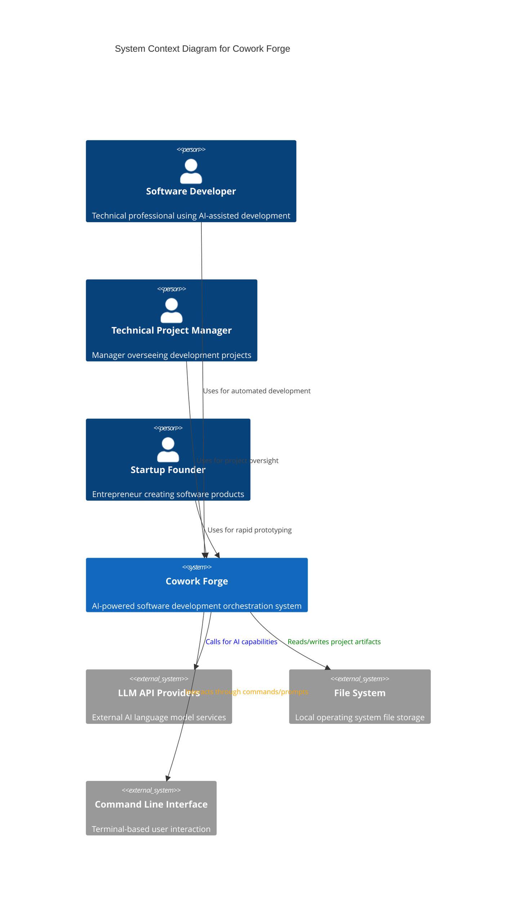

# Cowork Forge - System Context Architecture Document

*Document Version: 1.0*  
*Generated: 2026-01-27 14:33:18 (UTC)*  
*Timestamp: 1769524398*

## 1. Project Introduction

### 1.1 Project Overview
**Cowork Forge** is an AI-powered software development orchestration system that transforms the traditional software development lifecycle by automating repetitive tasks and enabling collaborative AI-human development workflows. The system serves as an intelligent development partner, guiding users from initial idea conception through to final project delivery.

### 1.2 Core Business Value
The system accelerates software development by:
- **Automating repetitive development tasks** through specialized AI agents
- **Providing structured development workflows** that ensure consistent quality and process adherence
- **Enabling collaborative AI-human development** with human-in-the-loop validation at critical stages
- **Reducing development time** from weeks to days through intelligent automation
- **Ensuring quality assurance** through built-in validation and review mechanisms

### 1.3 Technical Characteristics
- **Architecture Type**: Command-line interface (CLI) tool with modular, domain-driven design
- **Development Approach**: AI-agent orchestration with human oversight
- **Integration Model**: External LLM service integration with local file system operations
- **Workflow Model**: Sequential pipeline execution with resumption capabilities
- **Data Management**: File-based artifact storage with structured data validation

## 2. Target Users

### 2.1 Primary User Roles

#### 2.1.1 Software Developers
**Description**: Technical professionals requiring rapid prototyping, development automation, and AI-assisted coding capabilities.

**Key Needs**:
- Automated code generation for accelerated development
- Structured workflows that enforce best practices
- Quality validation mechanisms for code and architecture
- Project management automation to reduce administrative overhead

**Usage Scenarios**:
- Rapid prototyping of new software ideas
- Automated implementation of complex features
- Quality-assured code generation with human review
- Structured project development from concept to delivery

#### 2.1.2 Technical Project Managers
**Description**: Managers overseeing software development projects who need visibility, structured deliverables, and progress tracking.

**Key Needs**:
- Automated project status tracking and reporting
- Documentation generation for requirements and specifications
- Quality assurance automation throughout the development lifecycle
- Progress monitoring with milestone validation

**Usage Scenarios**:
- Generating comprehensive project documentation
- Tracking development progress across multiple stages
- Ensuring quality standards through automated validation
- Managing team workflows with AI-assisted coordination

#### 2.1.3 Startup Founders
**Description**: Entrepreneurs requiring rapid idea validation, prototype creation, and MVP development.

**Key Needs**:
- Rapid prototyping capabilities for idea validation
- Technical specification generation from business concepts
- Minimal viable product creation with reduced technical overhead
- Iterative development with AI-guided improvements

**Usage Scenarios**:
- Transforming business ideas into technical specifications
- Creating functional prototypes for investor demonstrations
- Developing MVPs with reduced development resources
- Iterative improvement based on user feedback

## 3. System Boundaries

### 3.1 System Scope Definition
Cowork Forge operates as an **AI-powered development orchestration system** that manages the complete software development lifecycle from idea generation to final delivery. The system boundary encompasses the orchestration logic, AI agent management, workflow coordination, and development artifact management.

### 3.2 Included Core Components

| Component | Description | Domain Responsibility |
|-----------|-------------|----------------------|
| CLI Interface | User command processing and interaction layer | Presentation Layer |
| AI Agent Orchestrator | Coordinates specialized agents for development stages | Pipeline Orchestration |
| Development Pipeline | Sequential workflow management with stage transitions | Workflow Management |
| File Management Tools | Secure file system operations and project artifact handling | Infrastructure |
| Validation Systems | Quality assurance and data validation mechanisms | Quality Assurance |
| Human-in-the-Loop Workflows | User feedback integration and review processes | Collaboration |
| Configuration Management | System settings and LLM configuration handling | Infrastructure |
| Session Management | Workflow state persistence and resumption capabilities | Data Management |

### 3.3 Excluded External Dependencies
The system explicitly excludes the following components from its boundary:
- **Code Execution Environments**: Runtime environments for executing generated code
- **Version Control Systems**: Git or other source code management systems
- **Deployment Infrastructure**: Cloud platforms or deployment pipelines
- **External Database Systems**: Persistent data storage beyond local file system
- **Web Interfaces**: Graphical user interfaces or web-based dashboards
- **Mobile Applications**: Mobile-specific interfaces or applications

## 4. External System Interactions

### 4.1 External Systems Overview

#### 4.1.1 LLM API Providers
**Interaction Type**: API Integration  
**Description**: External language model services (OpenAI-compatible) that provide AI capabilities for code generation, analysis, and natural language processing.

**Key Interactions**:
- Code generation and completion requests
- Requirement analysis and specification generation
- Architecture design suggestions and validation
- Natural language processing for user instructions

**Dependency Level**: High - Core AI capabilities depend on external LLM services

#### 4.1.2 File System
**Interaction Type**: Read/Write Operations  
**Description**: Local operating system file storage for project artifacts, code files, configuration, and development metadata.

**Key Interactions**:
- Reading and writing project files and code artifacts
- Storing development session data and workflow state
- Managing project directory structures and organization
- Persisting configuration settings and user preferences

**Dependency Level**: High - All artifact storage and project management relies on file system

#### 4.1.3 Command Line Interface
**Interaction Type**: User Interface  
**Description**: Terminal-based user interaction through commands and prompts for workflow control and system operation.

**Key Interactions**:
- Command parsing and validation
- User input collection and processing
- Progress reporting and status updates
- Error handling and user feedback

**Dependency Level**: Medium - Primary user interaction channel

### 4.2 Dependency Analysis

| External System | Criticality | Interaction Frequency | Failure Impact |
|-----------------|-------------|----------------------|----------------|
| LLM API Providers | High | Continuous during agent execution | Workflow interruption, reduced functionality |
| File System | High | Continuous throughout workflow | Data loss, workflow state corruption |
| Command Line Interface | Medium | User-initiated interactions | User experience degradation |

## 5. System Context Diagram

### 5.1 C4 SystemContext Visualization

### 5.2 Key Interaction Flows

#### 5.2.1 Development Initiation Flow
1. **User Interaction**: Developer executes CLI command to start new project
2. **System Processing**: Cowork Forge initializes development session
3. **External Integration**: System configures LLM API connections
4. **Storage Setup**: Creates project directory structure in file system
5. **Workflow Initiation**: Starts sequential AI agent pipeline

#### 5.2.2 AI Agent Execution Flow
1. **Agent Selection**: Pipeline orchestrator selects appropriate AI agent
2. **LLM Integration**: Agent utilizes external LLM services for task execution
3. **File Operations**: Agent reads/writes artifacts through file system tools
4. **User Interaction**: System collects feedback through CLI interface
5. **Validation**: Results validated before progressing to next stage

#### 5.2.3 Workflow Resumption Flow
1. **Session Detection**: System detects existing project artifacts
2. **State Recovery**: Loads previous session data from file system
3. **Pipeline Reconstruction**: Builds partial pipeline from detected stage
4. **Continuation**: Resumes workflow from appropriate development stage

## 6. Technical Architecture Overview

### 6.1 Main Technology Stack
- **Programming Language**: Rust for performance and safety
- **CLI Framework**: Clap for command-line interface management
- **AI Integration**: OpenAI-compatible API clients for LLM services
- **Data Handling**: Serde for serialization/deserialization
- **Validation**: JSON Schema for structured data validation
- **File Operations**: Standard library with security wrappers

### 6.2 Architecture Patterns

#### 6.2.1 Layered Architecture
The system employs a clean separation between:
- **Presentation Layer**: CLI interface for user interaction
- **Application Layer**: Pipeline orchestration and workflow management
- **Domain Layer**: Specialized AI agents and business logic
- **Infrastructure Layer**: External integrations and tooling

#### 6.2.2 Domain-Driven Design
System organized around cohesive domain modules:
- **Core Domains**: Pipeline orchestration, agent management, data modeling
- **Supporting Domains**: Tool infrastructure, storage management
- **Generic Domains**: LLM integration, CLI interface

#### 6.2.3 Modular Agent Architecture
Specialized AI agents for each development stage:
- **Idea Agent**: Concept capture and structuring
- **PRD Agent**: Requirements documentation generation
- **Design Agent**: Architecture and technology stack design
- **Coding Agent**: Implementation and code generation
- **Validation Agent**: Quality assurance and testing

### 6.3 Key Design Decisions

#### 6.3.1 Human-in-the-Loop Workflow
**Decision**: Integrate human validation at critical development stages rather than fully automated execution.

**Rationale**:
- Ensures quality control and alignment with user intent
- Maintains human oversight for critical architectural decisions
- Provides opportunities for course correction and refinement
- Builds user trust in AI-generated artifacts

#### 6.3.2 File-Based Artifact Storage
**Decision**: Use local file system for artifact storage rather than external databases.

**Rationale**:
- Simplifies deployment and reduces external dependencies
- Provides transparent artifact inspection and manual intervention
- Supports version control integration through standard file formats
- Enables offline operation capabilities

#### 6.3.3 Modular Agent Design
**Decision**: Implement specialized agents for each development stage rather than monolithic AI approach.

**Rationale**:
- Enables focused expertise and optimized prompts per stage
- Supports incremental development and error recovery
- Facilitates independent improvement of individual agents
- Provides clear separation of concerns and responsibilities

#### 6.3.4 CLI-First Interface
**Decision**: Prioritize command-line interface over graphical interfaces.

**Rationale**:
- Aligns with developer workflows and tooling preferences
- Enables scripting and automation integration
- Reduces development complexity and maintenance overhead
- Supports remote and headless operation scenarios

---

*This document provides a comprehensive System Context overview of Cowork Forge, establishing the foundation for more detailed Container and Component level documentation. The architecture emphasizes AI-human collaboration, modular design, and practical development acceleration while maintaining clear system boundaries and external integration patterns.*