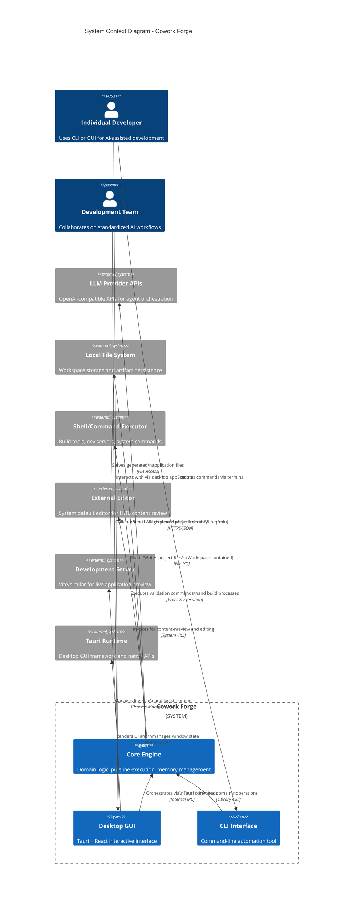

**Generation Time:** 2026-02-14 05:07:50 (UTC)  
**Timestamp:** 1771045670

---

# Project Overview: Cowork Forge System Context

## 1. Executive Summary

**Cowork Forge** is an AI-native iterative software development platform that orchestrates autonomous multi-agent workflows through a structured seven-stage development pipeline. The system transforms natural language ideas into production-ready software by leveraging Large Language Models (LLMs) while maintaining project continuity through a sophisticated memory management system.

Operating as a self-contained desktop application built on a Rust-based architecture, Cowork Forge provides dual interaction modes: a command-line interface for automation-focused workflows and a Tauri-based graphical interface for interactive development. The platform implements Domain-Driven Design (DDD) principles with a Hexagonal Architecture pattern, ensuring clear separation between core business logic, infrastructure concerns, and presentation layers.

## 2. System Overview

### 2.1 Core Objectives

Cowork Forge addresses the challenge of maintaining architectural consistency and contextual continuity in AI-assisted software development. The system's primary objectives include:

- **Autonomous Development Orchestration**: Automating the complete software development lifecycle from conceptualization to delivery through a deterministic 7-stage pipeline (Idea → PRD → Design → Plan → Coding → Check → Delivery)
- **Contextual Memory Preservation**: Maintaining institutional knowledge across development iterations through persistent memory aggregation, enabling evolutionary development with three inheritance modes (Full, Partial, None)
- **Human-in-the-Loop Governance**: Implementing validation gates at critical stages where human oversight ensures quality control and architectural alignment
- **Dual-Interface Accessibility**: Supporting both automated CLI workflows and interactive GUI experiences through a shared core domain

### 2.2 Business Value

The platform delivers measurable value through:

| Value Proposition | Description |
|-------------------|-------------|
| **Development Acceleration** | Reduces boilerplate generation time by automating requirements documentation, architectural design, and initial code scaffolding |
| **Architectural Consistency** | Enforces standardized workflows through the Actor-Critic pattern, where critic agents validate outputs against quality standards |
| **Knowledge Retention** | Preserves architectural decisions, design patterns, and technical insights across iterations, preventing context loss in long-running projects |
| **Standardized Methodology** | Provides teams with consistent development practices through structured stage gates and validation protocols |
| **Local Execution** | Operates entirely on local infrastructure without cloud dependencies, ensuring data privacy and reducing operational costs |

### 2.3 Technical Characteristics

**Architecture Pattern**: Hexagonal/Ports and Adapters with Domain-Driven Design  
**Core Technology Stack**: 
- **Backend**: Rust (Tokio async runtime) with adk-rust agent framework
- **Frontend**: React 18 with Ant Design (GUI), clap (CLI)
- **Desktop Shell**: Tauri runtime for cross-platform native capabilities
- **Persistence**: JSON-based file storage with workspace containment

**Key Technical Features**:
- **Rate-Limited LLM Integration**: Decorator-pattern implementation enforcing 30 requests/minute with single concurrency control
- **Event-Driven Communication**: Real-time bidirectional IPC between Tauri backend and React frontend via event emission
- **Security-First Operations**: Path validation and workspace containment for all file system operations
- **Memory-Centric Design**: Project continuity through persistent memory aggregation (decisions, patterns, knowledge snapshots)

## 3. Target Users and Stakeholders

### 3.1 Individual Developers

**Profile**: Software developers and technical leads seeking productivity gains in prototype development and boilerplate reduction.

**Usage Scenarios**:
- Rapid prototyping from natural language descriptions
- Automated generation of project requirements and technical documentation
- Iterative refinement of existing codebases through evolution iterations
- Local development environment management with integrated preview capabilities

**Key Needs**:
- Dual interface flexibility (CLI for scripting, GUI for exploration)
- Minimal configuration overhead with technology auto-detection
- Ability to pause and intervene during automated execution
- Local artifact storage with full transparency of generated outputs

### 3.2 Development Teams

**Profile**: Small to medium-sized development teams requiring standardized workflows and knowledge preservation across multiple projects.

**Usage Scenarios**:
- Onboarding new team members with standardized project initialization
- Maintaining architectural consistency across multiple microservices or modules
- Preserving design decisions and patterns for organizational knowledge bases
- Collaborative review of AI-generated artifacts through shared project memory

**Key Needs**:
- Multi-project management with technology stack detection
- Standardized development methodology enforcement
- Knowledge retention between team members and iterations
- Human-in-the-loop validation for critical architectural decisions

### 3.3 AI-Augmented Developers

**Profile**: Technical early adopters exploring AI-assisted development methodologies who require visibility into AI decision-making processes.

**Usage Scenarios**:
- Experimenting with AI-generated architecture designs with full audit trails
- Providing feedback to AI agents for iterative refinement of outputs
- Studying AI reasoning patterns through stage-by-stage execution monitoring
- Validating AI-generated code against security and performance standards

**Key Needs**:
- Transparent agent workflows with real-time progress monitoring
- Comprehensive artifact visibility (requirements, designs, plans, code)
- Feedback loops for Actor-Critic pattern interaction
- Control mechanisms for proceeding or regenerating at each pipeline stage

## 4. System Scope and Boundaries

### 4.1 System Scope Definition

Cowork Forge operates as a **self-contained AI-assisted development environment** that generates project artifacts, writes code, validates implementations, and manages project evolution. The system functions entirely on the local machine, orchestrating AI agents through external LLM APIs while maintaining all project state, iteration history, and generated artifacts in local storage.

### 4.2 Included Components

The system boundary encompasses the following core architectural components:

| Component Category | Specific Components |
|-------------------|---------------------|
| **Core Domain Logic** | Project and Iteration aggregates, lifecycle management, inheritance mode logic |
| **AI Pipeline Engine** | 7-stage workflow controller, Stage Executor with ADK integration, Actor-Critic pattern implementation |
| **Agent Instruction System** | ~2000 lines of prompt engineering (Actor/Critic instructions per stage, knowledge generation) |
| **Tool Ecosystem** | 30+ ADK Tools (File Tools, Data Tools, Validation Tools, HITL Tools, Memory Tools, Deployment Tools) |
| **Memory Management** | ProjectMemory and IterationKnowledge domains, query indexing, knowledge promotion workflows |
| **Persistence Layer** | ProjectStore, IterationStore, MemoryStore with JSON-based storage and workspace directory structure (`.cowork-v2`) |
| **User Interfaces** | CLI interface (clap-based), Tauri-based GUI (React frontend with 8-panel interface) |
| **Infrastructure Services** | Rate-limited LLM client factory, InteractiveBackend trait implementations (CLI and Tauri), ProcessRunner for development servers |

### 4.3 Excluded Components

The following components operate outside the system boundary and are treated as external dependencies:

- **Version Control Systems**: Git operations and repository management
- **Cloud Infrastructure**: Hosted services, cloud deployment platforms, remote compute resources
- **CI/CD Pipelines**: Continuous integration and delivery automation
- **Package Registries**: npm, crates.io, PyPI, and other external dependency repositories
- **LLM Training Infrastructure**: Model training, fine-tuning, or hosting infrastructure

## 5. External System Interactions

### 5.1 External Systems Landscape

### 5.2 Interaction Details

#### 5.2.1 LLM Provider APIs
- **Interaction Type**: Outbound API Calls (HTTPS/JSON)
- **Purpose**: Agent-based code generation, document creation, architectural decisions, and critic validation
- **Constraints**: Rate-limited to 30 requests/minute with concurrency control (single semaphore) to ensure API quota compliance and cost control
- **Data Exchange**: Prompts containing project context and instructions; streaming responses containing generated artifacts

#### 5.2.2 Local File System
- **Interaction Type**: Local File I/O
- **Purpose**: Workspace management, artifact storage, project file operations, and memory persistence
- **Security Model**: Path validation and workspace containment ensuring all operations remain within designated project directories (`.cowork-v2` convention)
- **Data Exchange**: JSON metadata files, markdown documentation, source code files, and knowledge snapshots

#### 5.2.3 Shell/Command Executor
- **Interaction Type**: Process Execution
- **Purpose**: Project validation (compilation, testing), dependency installation, build processes, and development server management
- **Execution Context**: Cross-platform command execution with working directory isolation within project workspaces
- **Data Exchange**: Command stdin/stdout/stderr streams, exit codes for success/failure determination

#### 5.2.4 External Editor
- **Interaction Type**: External Process Invocation
- **Purpose**: Human-in-the-Loop content review workflows where users edit generated content in preferred editors
- **Integration**: System default editor detection and invocation for temporary files containing stage outputs
- **Data Exchange**: File paths to temporary content files; user modifications saved back to system

#### 5.2.5 Development Server
- **Interaction Type**: Process Management and Monitoring
- **Purpose**: Live preview of generated frontend applications (e.g., Vite, Webpack dev servers)
- **Lifecycle Management**: Process spawning, log streaming via Tauri events, graceful shutdown coordination
- **Data Exchange**: Real-time stdout/stderr log streaming, HTTP serving of application assets

#### 5.2.6 Tauri Runtime
- **Interaction Type**: Runtime Framework Dependency
- **Purpose**: Desktop GUI capabilities, window management, cross-platform native APIs, and secure IPC between Rust backend and JavaScript frontend
- **Architecture Role**: Provides the presentation layer container for the React frontend, enabling system tray integration, native menus, and secure context isolation
- **Data Exchange**: Command invocations (invoke), event emissions (agent events, streaming responses), and binary asset management

## 6. Key Architectural Decisions

### 6.1 Multi-Stage Pipeline with Actor-Critic Pattern
The system implements a deterministic 7-stage workflow (Idea → PRD → Design → Plan → Coding → Check → Delivery) where each stage employs an Actor-Critic pattern. This ensures that AI-generated outputs undergo validation before proceeding, with feedback loops enabling regeneration when quality criteria are not met.

### 6.2 Dual Interface Strategy with Shared Core
The architecture supports both CLI and GUI interfaces through the `InteractiveBackend` trait abstraction, ensuring that business logic remains interface-agnostic. This enables automation-focused users to leverage scripting capabilities while interactive users benefit from real-time visualization and control.

### 6.3 Memory-Centric Evolutionary Development
Rather than treating each development session as isolated, the system maintains persistent memory aggregates (ProjectMemory, IterationKnowledge) that capture decisions, patterns, and insights. This supports three inheritance modes (Full, Partial, None) for evolution iterations, enabling sophisticated refactoring and incremental development workflows.

### 6.4 Workspace Containment and Security
All file operations are constrained to designated workspace directories with path validation mechanisms. This security-first approach prevents AI agents from accessing or modifying files outside the intended project scope, addressing safety concerns in autonomous code generation.

### 6.5 Event-Driven GUI Architecture
The Tauri-based GUI employs an event-driven model for real-time execution monitoring. Backend events (agent messages, tool calls, streaming responses, progress updates) are emitted to the React frontend, enabling live visualization of AI agent activities without polling overhead.

## 7. Technology Stack Summary

| Layer | Technology | Purpose |
|-------|-----------|---------|
| **Core Domain** | Rust, Tokio, adk-rust | Async agent orchestration, domain logic |
| **Persistence** | JSON, File System | Entity storage, memory indexing |
| **LLM Integration** | OpenAI-compatible APIs, Custom Rate Limiter | Agent capabilities with quota management |
| **CLI** | clap, dialoguer, colored | Command-line interface with interactive prompts |
| **GUI Backend** | Tauri, Rust | Desktop runtime, system integration |
| **GUI Frontend** | React 18, Ant Design, Monaco Editor | Interactive user interface, code editing |
| **Process Management** | Tokio process, cross-platform shells | Development server control, build execution |

---

**Document Version**: 1.0  
**Classification**: Architecture Documentation (C4 System Context Level)  
**Next Steps**: Refer to Container and Component Level diagrams for detailed internal architecture documentation.