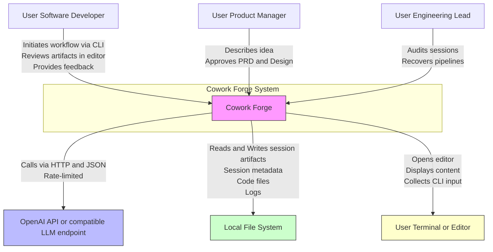

# System Context Overview

## 1. Project Introduction

**Project Name**: Cowork Forge  
**Project Type**: CLI-Based AI Agent Framework  
**Generation Time**: 2026-01-29 13:10:11 (UTC)  
**Timestamp**: 1769692211

Cowork Forge is an AI-powered, human-in-the-loop (HITL) software development orchestration system designed to automate the end-to-end software delivery lifecycle—from capturing a high-level project idea to delivering production-ready, validated code. It operates as a lightweight, locally executed command-line interface (CLI) tool that leverages large language models (LLMs) to guide, generate, and validate software artifacts while ensuring strict human oversight at critical decision points.

The system is built around a modular, agent-driven architecture that decomposes software development into structured, sequential stages: **Idea → PRD → Design → Plan → Code → Check → Delivery**, with optional **Modify** and **Resume** pathways. Each stage is executed by specialized AI agents (Actor-Critic pairs) that generate content and validate it against predefined quality, simplicity, and traceability criteria. Human approval is required before progressing between stages, ensuring alignment between user intent and system output.

### Core Functionality
- **Automated Workflow Orchestration**: Coordinates multi-agent pipelines that execute development stages in sequence, with conditional branching based on validation outcomes.
- **Human-in-the-Loop Validation**: Enforces mandatory review and feedback cycles at every major milestone using interactive CLI/editor integration.
- **Session-Based State Persistence**: Maintains full auditability by storing all artifacts (ideas, PRDs, designs, tasks, code, reports) in a local, hierarchical `.cowork/sessions/` directory.
- **Simplicity Enforcement**: Critic agents actively reject non-core features, over-engineering, and scope creep, promoting minimal viable solutions.
- **Incremental Modification**: Supports targeted updates to existing projects without restarting the entire pipeline, preserving historical context and traceability.

### Technical Characteristics Overview
- **Architecture Style**: Modular, event-driven, agent-based orchestration with strict separation of concerns.
- **Execution Model**: Sequential, stateful, file-backed workflows with deterministic transitions.
- **State Management**: Local file system as the single source of truth; no external databases.
- **LLM Integration**: Rate-limited, OpenAI-compatible API calls via configurable endpoints.
- **Tooling Philosophy**: All external interactions (file I/O, validation, user feedback) are mediated through a controlled, sandboxed toolset to ensure safety and reproducibility.
- **Language & Stack**: Built in Rust for performance, safety, and modularity; uses Serde for structured data serialization and async runtime for agent streaming.

Cowork Forge delivers significant business value by reducing cognitive load, minimizing misalignment between requirements and implementation, and accelerating delivery of high-quality, minimal software products—without sacrificing control or auditability.

---

## 2. Target Users

Cowork Forge serves three primary user roles, each with distinct needs and interaction patterns within the system.

### 2.1 Software Developers
**Description**: Developers seeking to accelerate the early stages of development—idea refinement, requirement specification, design, and implementation—while retaining full control over technical decisions.  
**Usage Scenarios**:
- Initiates a new project by describing a high-level idea via CLI.
- Reviews and edits AI-generated PRDs and system designs before approval.
- Observes incremental code generation per task, validates output, and provides feedback via editor integration.
- Uses `--goto-stage` to resume or restart stalled pipelines after debugging.
- Leverages `RequestReplanningTool` to trigger workflow recovery when code quality degrades.

**Key Needs**:
- Automate repetitive planning and boilerplate coding tasks.
- Ensure architectural simplicity and avoid over-engineering.
- Receive structured, stage-gated feedback from AI agents.
- Maintain a complete, local audit trail of all decisions and changes.

### 2.2 Product Managers
**Description**: Non-technical or lightly technical stakeholders who need to translate business ideas into executable software without deep involvement in implementation details.  
**Usage Scenarios**:
- Provides a high-level concept (e.g., “I want a task manager with reminders”) and lets the system generate a formal PRD.
- Reviews and approves AI-generated requirements and design documents via interactive editor prompts.
- Confirms that only core features are included, rejecting scope creep.
- Tracks progress from idea to delivery via generated reports.

**Key Needs**:
- Convert vague ideas into structured, actionable Product Requirements Documents (PRDs).
- Review and approve AI-generated artifacts without needing to read code.
- Ensure the system prioritizes essential features and avoids unnecessary complexity.
- Gain visibility into the evolution of the product from concept to delivery.

### 2.3 Engineering Leads
**Description**: Technical leaders responsible for standardizing development practices, enforcing quality gates, and mentoring junior engineers.  
**Usage Scenarios**:
- Deploys Cowork Forge as a team-wide development standard to enforce consistent workflows.
- Audits session histories to review how AI agents interpreted requirements and made decisions.
- Uses HITL feedback loops to correct agent behavior and improve future outputs.
- Recovers from failed pipelines by manually intervening at validation stages.

**Key Needs**:
- Enforce consistent, repeatable development patterns across teams.
- Prevent scope creep and architectural drift through automated validation.
- Observe, audit, and refine AI-driven workflows for reliability and safety.
- Enable rapid onboarding of junior developers via guided, structured workflows.

---

## 3. System Boundaries

Cowork Forge defines a clear and intentional system boundary that separates its autonomous control plane from external infrastructure and services. This boundary ensures safety, reproducibility, and auditability.

### 3.1 System Scope
Cowork Forge is a **CLI-based AI agent framework** that orchestrates the software development lifecycle from idea to delivery using modular agents, structured tools, and persistent session state. It is designed to run entirely on a developer’s local machine, with no dependency on cloud-based development environments or continuous integration systems.

### 3.2 Included Components
The following components are **within the system boundary** and are owned, maintained, and executed by Cowork Forge:

| Component | Description |
|---------|-------------|
| `cowork-cli` | The entry point CLI application that initiates workflows, accepts user commands (`--goto-stage`, `modify`, etc.), and manages session lifecycle. |
| `cowork-core` | The core engine containing all business logic: agents, instructions, tools, pipeline orchestration, data models, and storage. |
| Agent Instructions | Prompt templates and workflow rules for all actor-critic agents (Idea, PRD, Design, Plan, Coding, Check, Delivery, Modify). |
| Tooling Layer | All 20+ session-scoped tools: file I/O, validation, HITL feedback, control, artifact persistence, and change management. |
| Data Models | Structured serializable types (e.g., `ProjectIdea`, `PRD`, `ImplementationTask`, `SessionMetadata`) defining the contract between agents and storage. |
| Storage Layer | File-based CRUD operations managing `.cowork/sessions/<session-id>/` directory structure for artifacts, logs, and metadata. |
| LLM Configuration & Rate Limiter | Local configuration loader (`config.rs`) and middleware (`rate_limiter.rs`) that abstracts and throttles external LLM API calls. |
| Module Aggregation Facade | Re-exports in `lib.rs` and submodule `mod.rs` files enabling clean external access to core functionality. |

### 3.3 Excluded Components
The following components are **explicitly out of scope** and not part of Cowork Forge:

| Component | Reason for Exclusion |
|---------|----------------------|
| External LLM Provider Infrastructure (e.g., OpenAI servers) | Cowork Forge interacts with these via API but does not own, manage, or host them. |
| CI/CD Pipelines | No integration with GitHub Actions, GitLab CI, Jenkins, etc. Delivery is local and manual. |
| Deployment Infrastructure (e.g., Docker, Kubernetes, cloud runtimes) | Does not build, containerize, or deploy applications. |
| Frontend Web Interfaces | Purely CLI-based; no web UI, dashboard, or browser interaction. |
| Database Servers (e.g., PostgreSQL, MySQL) | All state is persisted to local files; no external database dependency. |
| Testing Frameworks (beyond validation tools) | Includes basic feature coverage and dependency checks, but does not run unit/integration tests. |
| Network Services (beyond LLM API and local file I/O) | No HTTP servers, WebSockets, gRPC, or external service discovery. |

> **Architectural Decision**: By excluding external infrastructure and relying solely on local file storage and CLI interaction, Cowork Forge ensures **reproducibility**, **auditability**, and **security**. Every artifact is versionable, inspectable, and portable—enabling full traceability without vendor lock-in.

---

## 4. External System Interactions

Cowork Forge interacts with three external systems, each playing a critical role in enabling its core functionality. These interactions are strictly bounded, well-defined, and mediated through controlled interfaces.

### 4.1 OpenAI API (or OpenAI-Compatible LLM Endpoint)
- **Interaction Type**: Asynchronous API Call (HTTP/JSON over TLS)
- **Purpose**: Provides the reasoning, generation, and decision-making capabilities for all AI agents.
- **Interaction Details**:
  - Agents invoke LLMs via structured prompts (defined in `instructions/` modules) to generate PRDs, designs, code, and validation feedback.
  - All requests are wrapped by the **Rate Limiter Middleware**, which enforces token and request limits to prevent API throttling.
  - Configuration is loaded from `~/.cowork/config.yaml` or environment variables (`OPENAI_API_KEY`, `LLM_ENDPOINT`).
  - Responses are parsed into structured outputs matching data models (e.g., `PRD`, `DesignComponent`).
- **Dependency Analysis**:  
  High dependency. The system is functionally paralyzed without LLM access. However, it is **not tightly coupled**—any OpenAI-compatible endpoint (e.g., Anthropic, Mistral via Ollama, local LLMs) can be substituted via configuration.

### 4.2 Local File System
- **Interaction Type**: File I/O (Read/Write/Delete/Create)
- **Purpose**: Serves as the **single source of truth** for all persistent state, artifacts, and audit trails.
- **Interaction Details**:
  - All session data is stored under `.cowork/sessions/<session-id>/` with subdirectories for:
    - `artifacts/`: `idea.md`, `prd.md`, `design.md`, `delivery.md`
    - `metadata/`: `session.json`, `tasks.json`, `feedback.json`
    - `code/`: Source files generated during coding loop
    - `logs/`: Agent interaction logs and tool execution traces
  - Tools like `SavePrdDocTool` and `WriteFileTool` perform path validation to prevent directory traversal attacks.
  - Session state is serialized using Serde (JSON) and written atomically to ensure consistency.
- **Dependency Analysis**:  
  Critical dependency. The system cannot function without local file system access. However, it is **self-contained**—no external storage or cloud sync is required. This enables offline operation and full data ownership.

### 4.3 User Terminal / Editor (e.g., vim, VS Code, iTerm2)
- **Interaction Type**: Interactive Input / Output (TTY/Stdin-Stdout)
- **Purpose**: Enables Human-in-the-Loop (HITL) validation, feedback, and control.
- **Interaction Details**:
  - During HITL stages (e.g., `ReviewAndEditContentTool`, `ReviewWithFeedbackTool`), the system opens the user’s default editor (configurable) to display content (e.g., `idea.md`) for manual review.
  - User edits are saved back to disk, and the system resumes execution upon editor closure.
  - CLI prompts collect free-form feedback (e.g., “This feature is too complex”) which is serialized into `feedback.json` for agent learning.
  - All user input is captured as structured feedback events, enabling iterative agent improvement.
- **Dependency Analysis**:  
  High dependency. Without user interaction, the system cannot progress past validation gates. However, it is **non-intrusive**—no plugins or IDE integrations are required; standard terminal editors suffice.

> **Architectural Insight**: These three external systems form a **closed-loop interaction model**:  
> **User → (CLI/Editor) → Cowork Forge → (LLM) → Artifacts → (File System) → User Review → Feedback → Loop**  
> This loop ensures that human judgment remains the ultimate authority, while automation handles repetitive, structured work.

---

## 5. System Context Diagram

Below is the **C4 SystemContext diagram** for Cowork Forge, depicting the system boundary and its interactions with external entities.

### Key Interaction Flows

1. **User → Cowork Forge**:  
   A user invokes `cowork-cli idea "Build a task manager"` to start a new project. The system prompts for clarification, then opens the user’s editor to display and refine the idea.

2. **Cowork Forge → OpenAI API**:  
   The Idea Agent sends a structured prompt to the LLM to generate a draft PRD. The response is parsed into a `PRD` data model.

3. **Cowork Forge → Local File System**:  
   The `SavePrdDocTool` writes the validated PRD to `.cowork/sessions/abc123/artifacts/prd.md`. Session metadata is updated to reflect stage completion.

4. **Cowork Forge → User Terminal/Editor**:  
   The system invokes `ReviewWithFeedbackTool`, opening `prd.md` in the user’s editor. The user adds comments, saves, and closes the editor. Feedback is recorded in `feedback.json`.

5. **Cowork Forge → Cowork Forge (Internal)**:  
   The Core Workflow Orchestration module detects the user’s approval and transitions to the Design stage, triggering the Design Actor and Critic agents.

### Architecture Decision Descriptions

- **Decision**: *Use local file system as the single source of truth.*  
  **Rationale**: Ensures full auditability, portability, and offline operation. Eliminates dependency on cloud state management and enables version control via Git.

- **Decision**: *Enforce HITL at every major stage.*  
  **Rationale**: Prevents autonomous AI drift. Human approval is mandatory before proceeding, ensuring alignment with intent and business goals.

- **Decision**: *Use agent-critic pairs with structured prompts.*  
  **Rationale**: Separates generation (Actor) from validation (Critic), enabling iterative refinement and enforcing simplicity. Reduces hallucination risk.

- **Decision**: *Do not integrate with CI/CD or deployment tools.*  
  **Rationale**: Focuses the system on the *creation* phase of software, not delivery. Keeps scope narrow and ensures reliability.

- **Decision**: *Rate-limit all LLM calls.*  
  **Rationale**: Prevents API throttling, ensures predictable performance, and reduces cost. Enables use of free-tier or limited API keys.

---

## 6. Technical Architecture Overview

### 6.1 Main Technology Stack

| Layer | Technology | Role |
|-------|------------|------|
| **Language** | Rust | Primary implementation language for safety, concurrency, and modularity |
| **Serialization** | Serde (JSON) | Structured data persistence for all artifacts and metadata |
| **LLM Interface** | OpenAI-compatible HTTP API | External reasoning engine; abstracted via `llm/mod.rs` |
| **Concurrency** | Tokio async runtime | Enables streaming agent responses and concurrent tool execution |
| **Configuration** | Configurable YAML + Environment Variables | Manages LLM endpoints, API keys, editor preferences |
| **Tooling** | Custom Rust modules | Sandboxed, validated operations (file I/O, validation, feedback) |
| **Storage** | File System (POSIX) | Persistent, hierarchical session storage under `.cowork/sessions/` |
| **CLI Framework** | Clap | Command-line argument parsing and subcommand handling |

### 6.2 Architecture Patterns

- **Actor-Critic Pattern**:  
  Each development stage employs paired agents: an *Actor* generates content, and a *Critic* validates it against rules (e.g., “reject non-core features”). This ensures iterative refinement and quality control.

- **Pipeline Orchestration Pattern**:  
  The Core Workflow Orchestration domain acts as a state machine, transitioning between stages based on agent outcomes and user feedback. Resumption and modification are implemented as pipeline variants (`create_resume_pipeline`, `create_modify_pipeline`).

- **Tool-Based Interaction Pattern**:  
  Agents cannot directly access the file system or network. All interactions are mediated through a controlled set of **tools** (e.g., `WriteFileTool`, `CheckFeatureCoverageTool`). This enforces safety and testability.

- **Session-Based State Management**:  
  Every project is isolated in its own session directory. State is persisted as JSON and Markdown files, enabling rollback, audit, and manual inspection.

- **Modular Monolith with Clear Boundaries**:  
  The system is a single binary (`cowork-cli`) but internally organized into five well-defined domains with explicit dependencies. No external microservices.

### 6.3 Key Design Decisions

| Decision | Rationale | Impact |
|--------|-----------|--------|
| **No external database** | Ensures zero-configuration, offline operation, and full data ownership. | Enables use on air-gapped systems; artifacts are Git-friendly. |
| **All state is human-readable (Markdown/JSON)** | Allows manual inspection, debugging, and recovery without tooling. | Increases trust and transparency; reduces “black box” perception. |
| **HITL is mandatory, not optional** | Prevents AI overreach and ensures alignment with user intent. | Slows automation slightly but dramatically improves output quality and reliability. |
| **Tools are sandboxed and validated** | Prevents accidental file deletion, directory traversal, or unsafe command execution. | Critical for security in an agent-driven environment. |
| **LLM calls are rate-limited** | Avoids API throttling and ensures predictable performance. | Enables use of free-tier LLM APIs; reduces operational cost. |
| **No web UI** | Keeps the system lightweight, fast, and focused on developer workflow. | Aligns with Unix philosophy: “do one thing well.” |
| **Session metadata is versioned** | Enables `--goto-stage` and `modify` to reconstruct context accurately. | Makes the system resilient to failures and supports evolutionary development. |

### 6.4 Architectural Strengths

- **Auditability**: Every decision, edit, and artifact is stored as a file. Full history is traceable.
- **Resilience**: Sessions can be resumed or modified from any stage. No need to restart from scratch.
- **Simplicity Enforcement**: Critic agents actively reduce scope, preventing bloat.
- **Portability**: Entire project state is contained in a single folder—easily backed up, shared, or archived.
- **Safety**: No direct system access; all operations go through validated tools.

### 6.5 Architectural Trade-offs

- **Performance**: Local file I/O and sequential agent execution may be slower than cloud-native alternatives.
- **Scalability**: Not designed for team collaboration or concurrent sessions (each session is user-local).
- **Automation Limitation**: Requires manual approval at each stage—may feel slow for experienced developers.
- **Learning Curve**: Users must understand agent roles and HITL flow to use effectively.

---

## Conclusion

Cowork Forge represents a novel approach to software development: **automating the routine, preserving the human**. By combining structured agent workflows, strict validation, and local persistence, it delivers a powerful, trustworthy, and auditable development experience that bridges the gap between vague ideas and production-ready code.

Its C4 SystemContext reveals a tightly bounded, human-centered system that leverages external LLMs and file systems as enablers—not dependencies. The architecture prioritizes safety, traceability, and simplicity over speed or scale, making it ideal for teams and individuals who value control, clarity, and quality in their software delivery process.

This document provides the foundational context for all future C4 modeling levels (Container, Component, Code) and serves as the authoritative reference for system evolution, onboarding, and architectural review.