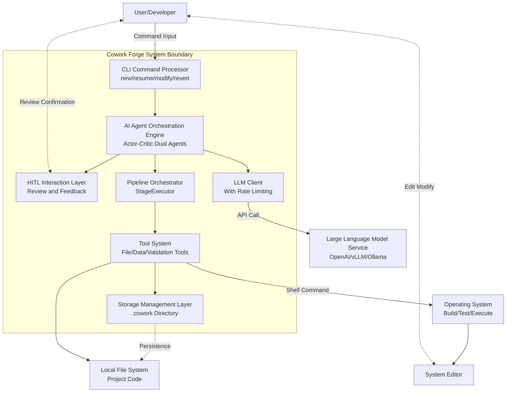
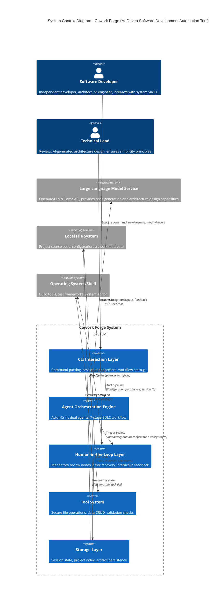
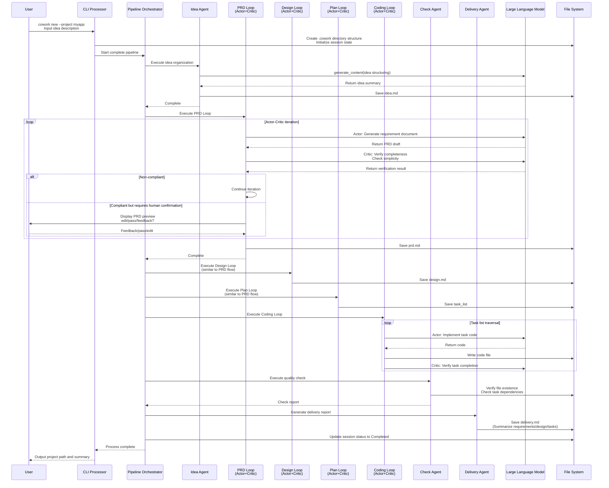
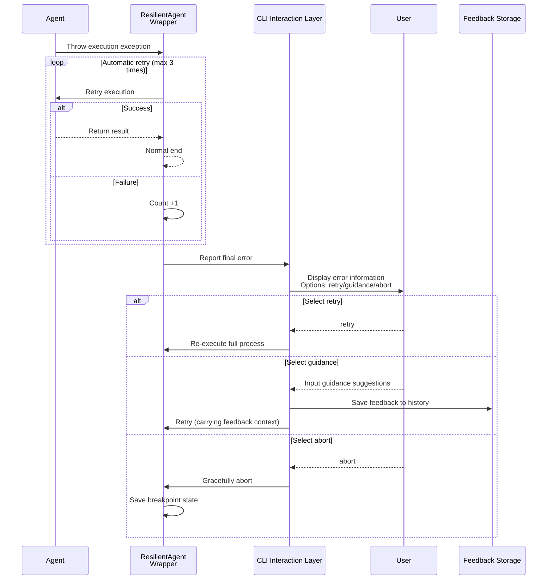

# Cowork Forge System Context Architecture Documentation

**Document Version**: v1.0
**Generated**: 2025-01-21
**Document Level**: C4 System Context (Level 1)

---

## 1. Project Overview

### 1.1 System Introduction

**Cowork Forge** is an AI agent-based software development automation CLI tool that employs a multi-agent Actor-Critic collaboration architecture. It aims to automate the complete software development lifecycle (SDLC) through collaboration among AI agents (AI Agents). The system covers seven core stages from requirements conceptualization to final delivery: Requirements Analysis (Idea), Product Design (PRD), Architecture Design (Design), Task Planning (Plan), Code Implementation (Coding), Quality Check (Check), and Project Delivery (Delivery).

### 1.2 Core Business Value

Cowork Forge creates business value through the following approaches:

- **Development Efficiency Improvement**: By automating key stages such as requirements analysis, architecture design, and code generation through AI, it significantly reduces software development complexity, enabling independent developers and small teams to quickly transform ideas into deliverable software
- **Quality Assurance Mechanism**: Adopts a **Human-in-the-Loop (HITL)** model, forcing human review at key quality nodes such as PRD, Design, and Plan to ensure AI-generated content meets business expectations
- **Simplicity-First Constraint**: Implements the "Simplicity-First" principle, constraining architecture design (limiting to 2-4 core components) and task planning (5-12 core tasks) through instruction templates to prevent AI from falling into over-engineering and infinite iteration loops
- **Flexible Working Modes**: Supports four working modes: **Complete New (New)**, **Incremental Modify (Modify)**, **Checkpoint Resume (Resume)**, and **Version Revert (Revert)**, enabling multi-project parallel development and state traceability through session isolation mechanisms

### 1.3 Key Technical Features

| Feature Dimension | Technical Implementation | Business Value |
|-------------------|-------------------------|----------------|
| **Multi-Agent Architecture** | Actor-Critic dual-agent collaboration mode (Execution Agent + Review Agent) | Ensures output quality at each stage, implements self-correction mechanism |
| **Pipeline Orchestration Engine** | Sequential stage executor based on ADK (Agent Development Kit) | Supports flexible workflow composition (complete workflow, partial workflow, resume workflow) |
| **Resilient Error Recovery** | ResilientAgent wrapper (automatic retry + human decision) | Automatically retries 3 times on execution failure, provides interactive recovery options if still unsuccessful |
| **File Security Control** | Path traversal protection + command execution sandbox (30-second timeout) | Prevents AI operations from exceeding authority, ensures user local environment security |
| **State Persistence** | Local file system storage based on JSON (.cowork directory) | Implements session-level isolation, checkpoint resumption, and version rollback |

---

## 2. Target Users and Use Cases

### 2.1 User Role Definition

The system serves three core user roles, each focusing on different functional dimensions:

#### 2.1.1 Independent Developers / Technical Entrepreneurs
- **Characteristics**: Independent developers who need to quickly transform ideas into MVPs (Minimum Viable Products), or startup teams building prototypes to validate market demand
- **Core Requirements**:
  - Avoid the burden of architecture design from scratch, directly obtain maintainable initial codebase
  - Support rapid prototype verification and rapid iteration of new requirements
  - Ability to resume development from any breakpoint without repeating completed work
- **Typical Scenario**: Use the `cowork new` command to input product ideas, and the system automatically generates complete web application code, database models, and API interfaces

#### 2.1.2 Technical Architects
- **Characteristics**: Technical leads responsible for technology selection, architecture review, and technical debt management
- **Core Requirements**:
  - Ensure AI-generated architecture follows simplicity principles, avoid over-splitting microservices or over-designing abstraction layers
  - Conduct human review at the design stage (Design Loop) to control technology selection and module division rationality
  - Prevent AI from falling into infinite iterations during implementation (through escalate flag and maximum iteration limit)
- **Typical Scenario**: Review AI-generated `design.md` document, confirm component count is within 2-4, modify architecture decisions directly using system editor if necessary

#### 2.1.3 Software Development Engineers
- **Characteristics**: Implementation engineers seeking to improve coding efficiency and code quality with AI assistance
- **Core Requirements**:
  - Guide AI to generate code based on clear task lists (Task List) to ensure functional coverage
  - Verify AI-generated code dependency correctness and file integrity through code quality check tools
  - Support incremental modification of existing projects, enabling "AI-assisted refactoring" capabilities
- **Typical Scenario**: Use the `cowork modify` command to input change requirements, AI analyzes impact scope and automatically modifies related code files, generating a change report

### 2.2 Use Case Matrix

| Working Mode | Trigger Command | Applicable Scenarios | Key Features |
|-------------|----------------|---------------------|--------------|
| **Complete New** | `cowork new --project <name>` | Building new projects from scratch | Full-stage execution, generates complete artifact chain (idea→prd→design→plan→code→check→delivery) |
| **Checkpoint Resume** | `cowork resume --session <id>` | Continuing after interruption or manual stop | Automatically detects completed stages, resumes from breakpoint |
| **Incremental Modify** | `cowork modify --change <desc>` | Requirement changes or feature enhancements for existing projects | Change impact analysis (PRD/Design/Plan/Code), executes code patches |
| **Version Revert** | `cowork revert --to <stage>` | Dissatisfied with certain stage results, regenerate | Inherits pre-stage state, clears target stage and subsequent artifacts, re-executes |

---

## 3. System Boundaries and Scope

### 3.1 System Boundary Definition

As a locally running CLI tool, Cowork Forge clearly distinguishes between **internal core capabilities** and **external dependency responsibilities**, adopting a "light kernel + heavy intelligence" boundary strategy: the system itself provides orchestration, coordination, and quality control capabilities, while outsourcing intelligent computing to external LLM services.

**Boundary Definition Principles**:
- **Included Boundaries**: Agent lifecycle management, workflow orchestration, local state persistence, human-computer interaction coordination, secure file access control
- **Excluded Boundaries**: LLM model inference, code runtime environment, distributed collaboration services, cloud infrastructure management

### 3.2 System Internal Components (Included Components)

The system contains the following core subsystems, together forming complete AI-driven development capabilities:

| Component Category | Specific Components | Functional Responsibilities |
|-------------------|---------------------|----------------------------|
| **Interaction Entry Layer** | CLI Command Line Interface | Supports 6 core commands (new/resume/revert/modify/status/init), implements parameter parsing based on clap, integrates tracing structured logging |
| **Agent Orchestration Layer** | Multi-Agent Orchestration System | Implements Actor-Critic dual agents for 7 stages (Idea, PRD, Design, Plan, Coding, Check, Delivery), agent factory pattern creation |
| **Quality Assurance Layer** | HITL Interaction Layer | Mandatory human review nodes, supports edit/pass/feedback three interaction modes, integrates system default editor |
| **Process Control Layer** | Pipeline Orchestration Engine | StageExecutor executes stages sequentially, supports four pipeline builders (complete/resume/partial/modify) |
| **Tool Abstraction Layer** | Internal Tool System | 11 categories of standardized tools: data operation tools, file operation tools (including path security verification), validation check tools, HITL interaction tools, change management tools, etc. |
| **Data Management Layer** | Session and State Storage | Local persistence based on JSON files, manages .cowork directory structure, implements ProjectIndex and Session state machine |
| **Infrastructure Layer** | LLM Client and Rate Limiter | Encapsulates OpenAI-compatible API, supports vLLM/Ollama, etc., implements RateLimitedLlm (default 2-second delay, <30 times/minute) |

### 3.3 System External Dependencies (Excluded Components)

The following components/systems are explicitly outside the Cowork Forge system boundary, and the system interacts with them through standardized interfaces but is not responsible for their internal implementation:

| External System Category | Excluded Items | Boundary Description |
|--------------------------|----------------|---------------------|
| **AI Computing Resources** | LLM service internal implementation details | Only calls external LLM via REST API, does not host model inference services |
| **Runtime Environment** | Actual business application runtime | Generates code but is not responsible for compiling, deploying, or running user business applications |
| **Development Environment** | IDE or editor plugins | Calls system default editor (such as vim/vscode) but does not implement editor functionality |
| **DevOps Facilities** | CI/CD pipeline integration, container orchestration platforms (K8s), cloud infrastructure management | Generates CI/CD-suitable configurations but does not directly integrate these platforms |
| **Version Control** | Distributed version control system server-side (Git server-side) | Operates local file system but does not directly operate Git servers |
| **Testing Frameworks** | Detailed configuration of test automation frameworks (pytest/jest, etc.) | Calls test commands via RunCommandTool but does not manage framework configuration |

---

## 4. External System Interaction and Dependencies

As a local CLI tool, Cowork Forge has close interaction relationships with four types of external systems, which constitute the necessary ecological environment for system operation.

### 4.1 Large Language Model Services (LLM Services)

**Interaction Method**: REST API calls (OpenAI-compatible interface)

**Functional Positioning**: The system's "intelligent brain", providing natural language understanding, code generation, architecture design, and other cognitive capabilities.

**Detailed Interaction Description**:
- **Interface Standard**: Supports OpenAI API format, compatible with local or cloud deployment solutions such as vLLM, Ollama
- **Call Scenarios**:
  - Idea stage: Understands and structures user original ideas
  - PRD stage: Generates product requirement documents
  - Design stage: Creates system architecture design (constrained by simplicity principles)
  - Coding stage: Generates code implementation based on task lists
- **Quality Control**: Implements rate limiting (default 2-second delay, ensuring call frequency <30 times/minute) through RateLimitedLlm decorator to prevent API rate limiting and cost runaway

### 4.2 Local File System

**Interaction Method**: File IO operations (read/write, directory traversal)

**Functional Positioning**: The system's "persistence layer", storing project code, session data, and intermediate artifacts.

**Detailed Interaction Description**:
- **Project Code Space**: User-specified working directory where AI generates and modifies source code files
- **System Metadata Directory** (.cowork/): Located in user home directory or project root directory, storing:
  - `project_index.json`: Session index and status tracking
  - `sessions/<id>/`: Artifact directories for each session (idea.md, prd.md, design.md, etc.)
  - `state.json`: Runtime state data (requirements, tasks, feature lists, etc.)
- **Security Measures**: All file operations go through `validate_path_security` for path traversal protection, restricting AI to only access project directory and system metadata directory

### 4.3 Operating System/Shell

**Interaction Method**: Command execution (Shell command calls), process management

**Functional Positioning**: The system's "execution layer", providing build, verification, and editing capabilities.

**Detailed Interaction Description**:
- **Command Execution**: Execute shell commands via `RunCommandTool` to:
  - Project building (such as `cargo build`, `npm install`)
  - Test verification (such as `pytest`, `cargo test`)
  - Code checking (such as `clippy`, `eslint`)
  - **Security Constraints**: 30-second timeout mechanism, intercept blocking service commands (such as `systemctl start`)
- **Editor Integration**: Opens user default editor via system call (`$EDITOR`), supporting manual editing of AI-generated documents during HITL review stage (such as modifying design.md)

### 4.4 Terminal User Interface (Terminal UI)

**Interaction Method**: Standard input/output (STDIN/STDOUT), based on dialoguer library

**Functional Positioning**: The system's "human-computer interface", implementing HITL (Human-in-the-Loop) collaboration.

**Detailed Interaction Description**:
- **Interaction Mode**: Conversational CLI, supporting:
  - **Menu Selection**: Displays edit/pass/feedback options at Idea, PRD, Design, Plan stages
  - **Content Preview**: Displays first 12-15 lines summary of AI-generated documents for quick review
  - **Feedback Capture**: Supports user text input feedback to guide AI iteration
  - **Error Decision**: Provides retry/guidance/abort options when execution fails
- **Real-time Feedback**: Supports LLM streaming output (--stdout flag), real-time display of AI thinking process

### 4.5 External Interaction Relationship Diagram (Logical View)

**Figure Note**: Solid lines represent data/control flow, dashed lines represent human-computer interaction or persistence relationships.

---

## 5. System Context Architecture Diagram (C4 System Context)

The following diagram shows Cowork Forge's position in the overall architecture and its relationship with external participants and systems:

### 5.1 Key Architecture Decision Descriptions

#### Decision 1: Local-First Architecture
**Decision Content**: The system runs as a local CLI tool, does not depend on cloud services (except for LLM API), and all states and data are stored locally.
**Decision Rationale**:
- Protect user code privacy, sensitive code does not leave local environment
- Support offline work (except when LLM content generation is needed)
- Reduce operational complexity, no need to maintain multi-tenant cloud services

#### Decision 2: Actor-Critic Dual-Agent Mode
**Decision Content**: Each key stage (PRD/Design/Plan/Coding) is configured with two agents: Actor responsible for content generation, Critic responsible for quality verification.
**Decision Rationale**:
- Implement self-correction mechanism, Critic can force Actor to iterate and improve
- Prevent single agent from falling into confirmation bias
- Force execution of "simplicity-first" constraints through Critic (such as component count check)

#### Decision 3: Mandatory Human-in-the-Loop
**Decision Content**: Mandatory human review is set at key transition nodes of Idea→PRD→Design→Plan, and cannot proceed to the next stage without passing review.
**Decision Rationale**:
- AI may produce hallucinations, especially at the requirements understanding stage
- Early errors not detected are extremely costly to fix at the Coding stage
- Ensure correct alignment of business intent with technical implementation

#### Decision 4: File System as State Store
**Decision Content**: Use JSON files and Markdown documents as the only state storage, without introducing databases.
**Decision Rationale**:
- Use Git for state version control (.cowork directory can be added to .gitignore or version control)
- Human-readable artifacts (prd.md, design.md) facilitate direct review and modification
- Simplify architecture, reduce system complexity

---

## 6. Core Business Flows and Interaction Sequences

### 6.1 Complete New Workflow (Happy Path)

### 6.2 Resilient Error Recovery Flow

When agent execution encounters exceptions (such as LLM service timeout, Max Iterations reached), the system initiates a resilient recovery mechanism:

---

## 7. Non-Functional Requirements and Constraints

### 7.1 Security Constraints

- **Path Security**: All file operations are verified through `validate_path_security`, prohibiting access to files outside project directory and .cowork directory, preventing path traversal attacks
- **Command Security**: `RunCommandTool` implements 30-second timeout and service command interception (prohibiting execution of system management commands such as `systemctl`, `service`)
- **Data Isolation**: Session-level isolation mechanism ensures data is not confused during multi-project parallel development, achieved through UUID session IDs and independent session directories

### 7.2 Performance Characteristics

- **LLM Call Frequency**: Limited to <30 times/minute through RateLimitedLlm to avoid API rate limiting and excessive API costs
- **Concurrency Model**: Current version adopts sequential execution model, stages and tasks execute sequentially to ensure state consistency
- **Resource Usage**: As a CLI tool, memory usage mainly comes from LLM context cache and project file index, typical scenario <500MB memory

### 7.3 Observability

- **Structured Logging**: Integrates `tracing` framework, supports RUST_LOG environment variable to control log level, outputs JSON format structured logs for analysis
- **Session Tracking**: Each session has a unique UUID and complete state history (State Transitions), supports checking current session progress via `cowork status`

---

## 8. Summary and Architecture Evolution Directions

### 8.1 Core Architecture Insights

Cowork Forge's architecture design embodies the core philosophy of **"Intelligent Orchestration, Human Control"**:

1. **Layered Isolation**: Clear layering of CLI layer, orchestration layer, agent layer, and tool layer achieves decoupling of business logic and technical implementation
2. **Feedback-Driven**: HITL mechanism is not just a feature but a core pillar of the architecture, ensuring balance between AI autonomy and human control
3. **Simplicity Constraints**: Through instruction templates (Instruction Templates) and Critic agents, the "simplicity-first" principle is transformed from a suggestion into mandatory architecture constraints

### 8.2 Future Evolution Directions (Not in Current Scope)

Based on the current System Context, potential future expansion directions for the system include:

- **IDE Plugin Integration**: Encapsulate CLI capabilities as VSCode/JetBrains plugins to provide smoother editing experience (currently excluded from boundary)
- **Multimodal Support**: Introduce image understanding capabilities to support generating frontend code based on UI sketches (currently only supports text interaction)
- **Team Collaboration**: Implement session sharing and conflict resolution based on Git, supporting multi-person collaboration mode (currently single-user session isolation)

---

**End of Document**

*This document is written based on C4 model System Context level specifications, describing the overall outline, user roles, external dependencies, and core business flows of the Cowork Forge system. For detailed architecture at Container or Component levels, please refer to relevant supplementary documentation.*