# System Architecture Documentation: Cowork Forge

**Document Version**: 1.0  
**Generation Time**: 2026-02-14 05:10:16 (UTC)  
**Classification**: Architecture Overview  
**Target Audience**: Software Architects, Senior Developers, DevOps Engineers

---

## 1. Architecture Overview

### 1.1 Design Philosophy

Cowork Forge embodies a **Hybrid AI-Human Collaborative Architecture** designed to orchestrate autonomous software development while maintaining human oversight through structured intervention points. The architecture is built upon three foundational principles:

1. **Cognitive Augmentation**: The system acts as an extension of human developer cognition, preserving institutional knowledge across iterations while automating mechanical development tasks through AI agents.

2. **Structured Autonomy**: Rather than unconstrained AI generation, the system enforces a rigorous 7-stage pipeline (Idea→PRD→Design→Plan→Coding→Check→Delivery) with validation gates, ensuring quality assurance through the Actor-Critic pattern.

3. **Interface Agnosticism**: The core domain logic remains pure and independent of interface concerns, enabling simultaneous support for automation-focused CLI workflows and interactive GUI experiences through the Ports and Adapters pattern.

### 1.2 Core Architecture Patterns

#### Hexagonal Architecture (Ports and Adapters)
The system implements a strict **Hexagonal Architecture** with the `cowork-core` crate at the center containing pure domain logic. All external concerns (LLM APIs, file systems, user interfaces) connect through well-defined ports:

- **Inbound Ports**: `InteractiveBackend` trait enabling CLI and GUI implementations
- **Outbound Ports**: Repository abstractions for persistence, LLM client interfaces for AI integration
- **Adapters**: Concrete implementations in `cowork-cli`, `cowork-gui`, and infrastructure modules

#### Domain-Driven Design (DDD)
The architecture follows DDD tactical patterns:
- **Aggregates**: `Project` (root), `Iteration`, `ProjectMemory` enforcing consistency boundaries
- **Value Objects**: `Artifacts`, `StageResult`, `InheritanceMode` (Full/Partial/None)
- **Domain Services**: Pipeline orchestration, inheritance analysis, change scope detection
- **Repositories**: `ProjectStore`, `IterationStore`, `MemoryStore` abstracting persistence

#### Event-Driven Architecture (GUI Layer)
The Tauri-based desktop application implements an event-driven architecture:
- **Asymmetric Communication**: Commands (invoke) for requests, Events (emit) for streaming responses
- **Real-time Streaming**: LLM token streams, process logs, and agent activities flow through Tauri's event system
- **State Synchronization**: React frontend maintains local state while backend emits state change events

#### Actor-Critic Pattern
Each pipeline stage implements the Actor-Critic pattern:
- **Actor**: Generates artifacts (code, documents, plans) based on instructions
- **Critic**: Validates quality, checks constraints, suggests improvements
- **Feedback Loop**: Human input regenerates Actor outputs with critique context

### 1.3 Technology Stack Overview

| Layer | Technology | Purpose | Architectural Role |
|-------|-----------|---------|-------------------|
| **Core Domain** | Rust + Tokio | Async runtime for pipeline execution | Domain logic isolation |
| **AI Orchestration** | adk-rust | Agent framework and tool ecosystem | AI agent lifecycle management |
| **LLM Integration** | OpenAI-compatible APIs | Code generation and reasoning | Infrastructure adapter |
| **Rate Limiting** | Custom Semaphore + Delay | 30 req/min compliance | Cross-cutting concern |
| **CLI Interface** | clap + dialoguer | Command parsing and terminal UI | Primary adapter |
| **GUI Backend** | Tauri | Desktop runtime and system integration | Secondary adapter |
| **GUI Frontend** | React 18 + Ant Design | Component-based interactive UI | Presentation layer |
| **Persistence** | JSON + serde | Schema evolution and storage | Repository implementation |
| **Security** | Path validation + Sandboxing | Workspace containment | Security boundary |

---

## 2. System Context (C4 Level 1)

### 2.1 System Positioning and Value

Cowork Forge operates as a **Local-First AI Development Environment** positioned between traditional IDEs and cloud-based AI coding assistants. Unlike cloud solutions, it maintains complete data locality while providing structured AI orchestration that simple code completion tools cannot achieve.

**Core Value Propositions**:
- **Continuity**: Memory system preserves architectural decisions across development sessions
- **Consistency**: Enforced 7-stage pipeline ensures systematic development methodology
- **Control**: Human-in-the-Loop gates at critical stages prevent AI hallucinations from propagating
- **Flexibility**: Dual interface support accommodates both automation scripts and exploratory development

### 2.2 User Roles and Scenarios

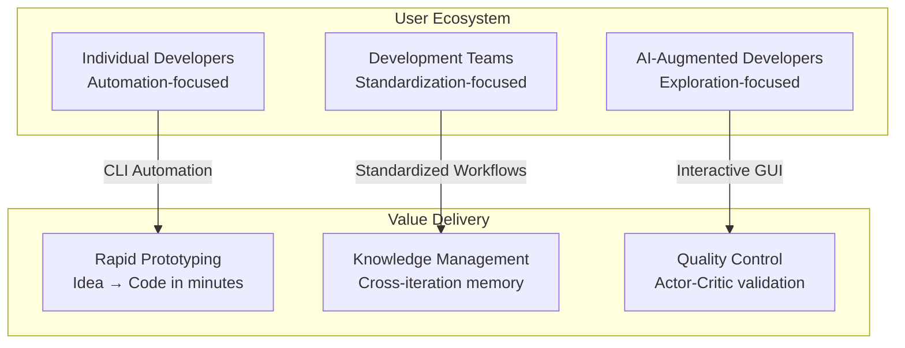

**Primary User Archetypes**:

1. **Individual Developers**: Utilize CLI for rapid prototyping, leveraging automation to generate boilerplate and scaffolding from natural language descriptions.

2. **Development Teams**: Employ the memory system to maintain architectural standards across multiple projects, using inheritance modes to evolve existing codebases systematically.

3. **AI-Augmented Developers**: Prefer GUI interface for visibility into AI decision-making, utilizing real-time streaming and HITL validation to guide the development process interactively.

### 2.3 External System Interactions

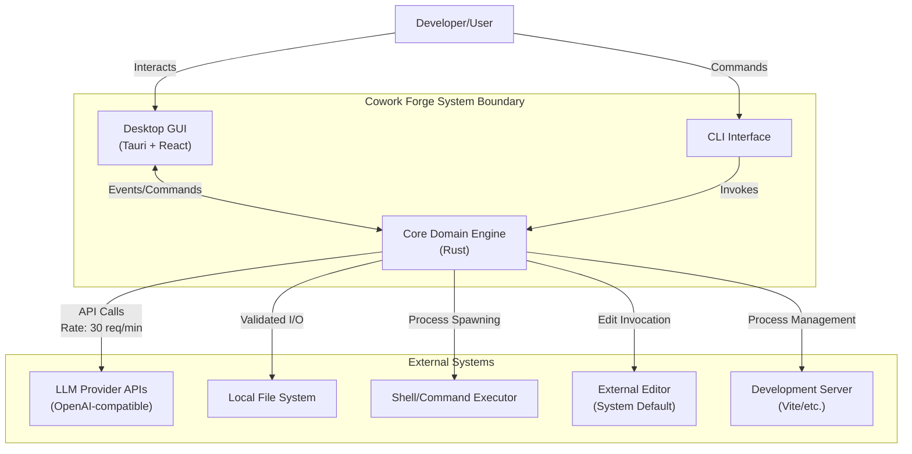

**External Dependencies**:

- **LLM Provider APIs**: OpenAI-compatible endpoints for agent reasoning. Interactions are rate-limited (30 requests/minute) with concurrency control (single semaphore) to manage API quotas and costs.

- **Local File System**: Primary persistence mechanism for projects, iterations, and memory. Access is constrained through workspace validation to prevent path traversal attacks.

- **Shell/Command Executor**: Used for project validation (dependency installation, builds, tests) and development server management. Commands are sanitized and executed within project workspace boundaries.

- **External Editor**: System default editor invoked during HITL flows for content review and modification (e.g., vim, VS Code, nano).

- **Development Server**: User-provided server processes (Vite, Webpack dev server) managed through ProcessRunner for live preview capabilities.

### 2.4 System Boundary Definition

**In-Scope Components**:
- Core domain logic (iterations, projects, memory aggregates)
- 7-stage AI agent pipeline with stage executors
- Agent instruction library (~2000 lines of prompt engineering)
- Tool ecosystem (30+ ADK tools: file, data, validation, HITL, memory)
- Persistence layer with JSON-based project/iteration stores
- CLI command interface with argument parsing
- Tauri-based GUI with React frontend
- Real-time process runner for development servers
- Rate-limited LLM client factory
- Cross-platform desktop application shell

**Out-of-Scope Components**:
- Third-party LLM training infrastructure
- Version control system integration (Git operations)
- External package registry management (npm, crates.io)
- Cloud deployment platforms and CI/CD pipelines
- Remote collaboration features (real-time multi-user editing)

---

## 3. Container View (C4 Level 2)

### 3.1 Domain Module Division

Cowork Forge is structured as a **Multi-Crate Rust Workspace** with clear domain boundaries following DDD strategic design:

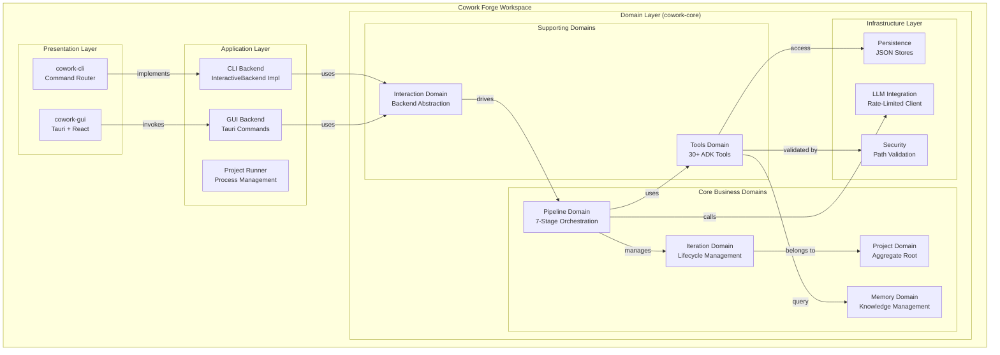

### 3.2 Container Architecture

#### Core Domain Container (`cowork-core`)
The heart of the system containing pure business logic with no external dependencies:

- **Domain Layer**: Entities (`Project`, `Iteration`, `Memory`), Value Objects (`InheritanceMode`), and Domain Services (Pipeline orchestration)
- **Pipeline Layer**: Stage trait implementations, Stage Executor, and instruction library
- **Tool Layer**: 30+ ADK tools organized by function (File, Data, HITL, Memory, Validation)
- **Infrastructure Layer**: LLM configuration with rate limiting, JSON persistence, and interaction backends

#### CLI Container (`cowork-cli`)
Thin adapter implementing terminal-based interaction:
- **Clap Parser**: Command-line argument parsing and routing
- **InteractiveBackend Impl**: Terminal-based HITL with dialoguer prompts and colored output
- **Command Handlers**: Thin wrappers delegating to core domain

#### GUI Container (`cowork-gui`)
Tauri-based desktop application with React frontend:
- **Tauri Backend**: Rust commands exposing core functionality via IPC
- **React Frontend**: 8-panel interface (Projects, Iterations, Editor, Runner, Memory, Knowledge)
- **Event System**: Real-time bidirectional communication for streaming and HITL

### 3.3 Storage Design

The system implements **JSON-First Persistence** for portability and version control compatibility:

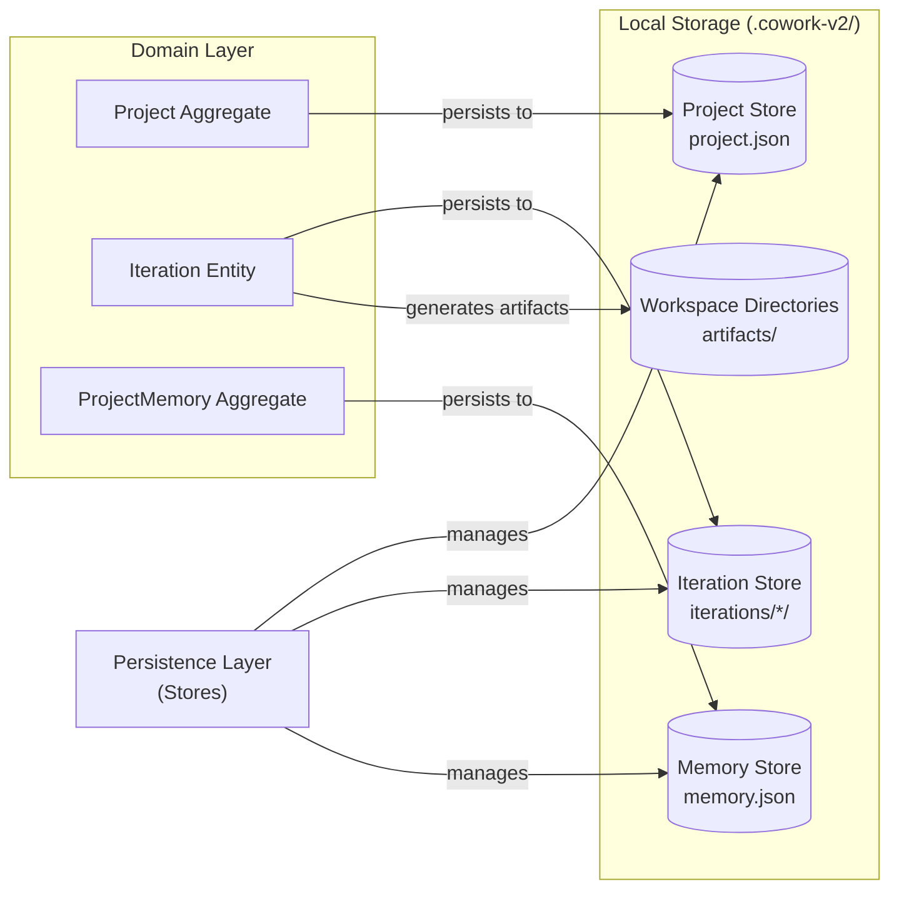

**Storage Characteristics**:
- **Project Store**: Metadata, tech stack detection, iteration summaries
- **Iteration Store**: Stage artifacts (idea.md, prd.md, design.md, plan.md, code files), execution state
- **Memory Store**: Architectural decisions, patterns, issues, learnings across iterations
- **Workspace**: File system artifacts generated by AI agents during pipeline execution

### 3.4 Inter-Domain Communication

**Synchronous Communication**:
- **Command Pattern**: CLI/GUI invoke domain operations through command handlers
- **Repository Pattern**: Domain aggregates persist through store abstractions
- **Trait Abstraction**: `InteractiveBackend` trait enables polymorphic user interaction

**Asynchronous Communication** (GUI only):
- **Event Streaming**: Tauri backend emits events (`agent_event`, `tool_call`, `input_request`) for real-time UI updates
- **Process Streaming**: Development server logs stream via `project_log` events
- **Backpressure Handling**: Tokio channels manage streaming LLM responses without blocking

---

## 4. Component View (C4 Level 3)

### 4.1 Core Functional Components

#### Pipeline Orchestration Component

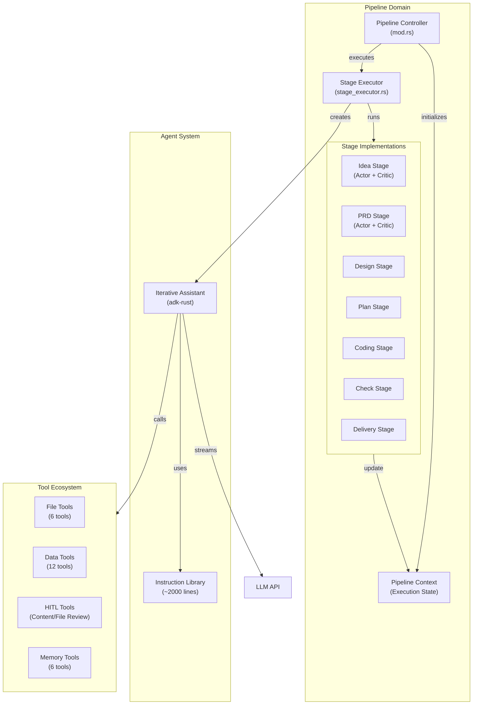

**Component Responsibilities**:
- **Pipeline Controller**: Manages iteration lifecycle, stage sequencing, and error handling
- **Stage Executor**: Bridges domain logic with adk-rust framework, manages agent lifecycle
- **Stage Implementations**: Seven concrete strategies following the Strategy pattern, each with specific instructions and artifact generation logic
- **Iterative Assistant**: AI agent wrapper handling streaming, tool calls, and human interaction

#### Memory Management Component

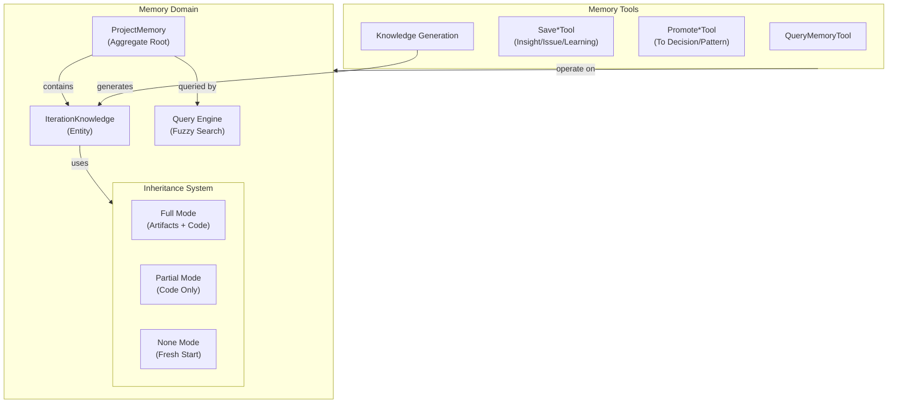

**Memory Inheritance Modes**:
- **Full**: Complete artifact and code transfer for major refactoring (continues from any stage)
- **Partial**: Code-only inheritance for incremental feature development (typically starts at Coding stage)
- **None**: Fresh iteration without historical baggage (starts at Idea stage)

### 4.2 Technical Support Components

#### LLM Integration with Rate Limiting

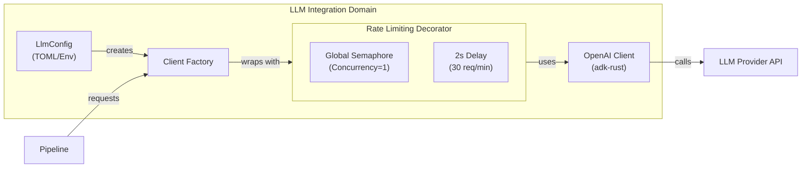

**Rate Limiting Strategy**:
- **Token Bucket Alternative**: Uses semaphore (concurrency=1) combined with fixed delay (2 seconds) to enforce 30 requests/minute
- **Global Scope**: Rate limiter is shared across all pipeline stages to prevent API quota exhaustion
- **Backpressure**: Requests block until capacity available, ensuring compliance without dropping requests

#### Security and Validation Layer

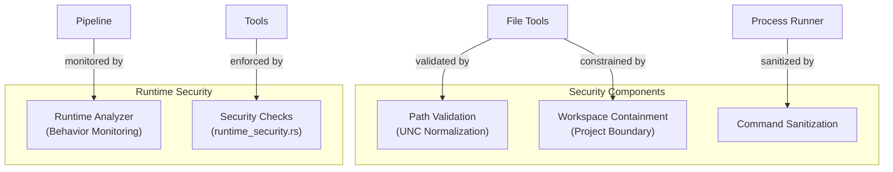

### 4.3 Component Interaction Relationships

**Critical Path Dependencies**:
1. **Pipeline → Tools**: Pipeline executor injects tool set into AI agents; tools access file system and memory
2. **Tools → Persistence**: All data modifications flow through repository pattern to JSON stores
3. **Pipeline → Interaction**: HITL gates suspend execution until InteractiveBackend returns user input
4. **GUI ↔ Backend**: Tauri commands trigger domain operations; events stream progress back to React

**Decoupling Mechanisms**:
- **Trait-Based Backend**: `InteractiveBackend` trait decouples pipeline from specific UI implementations
- **Dependency Injection**: Stage executor receives tool dependencies rather than constructing them
- **Event-Driven Updates**: GUI components react to events rather than polling, reducing coupling

---

## 5. Key Processes

### 5.1 Genesis Iteration Creation Flow

The primary workflow transforming natural language ideas into complete software projects:

```mermaid
flowchart TD
    Start([User Provides Idea]) --> Entry{Entry Point}
    Entry -->|CLI: cowork iter| CLI[CLI Parser]
    Entry -->|GUI: Create Button| GUI[React Frontend]
    
    CLI --> Init[Initialize Pipeline Context]
    GUI --> Init
    
    Init --> Stage1[Idea Stage<br/>Capture Requirements<br/>Output: idea.md]
    Stage1 -->|HITL Gate| Confirm1{User Confirmation}
    Confirm1 -->|Edit/Feedback| Stage1
    Confirm1 -->|Approve| Stage2
    
    Stage2[PRD Stage<br/>Actor/Critic Pattern<br/>Output: prd.md] -->|HITL Gate| Confirm2{User Confirmation}
    Confirm2 -->|Edit/Feedback| Stage2
    Confirm2 -->|Approve| Stage3
    
    Stage3[Design Stage<br/>System Architecture<br/>Output: design.md] -->|HITL Gate| Confirm3{User Confirmation}
    Confirm3 -->|Edit/Feedback| Stage3
    Confirm3 -->|Approve| Stage4
    
    Stage4[Plan Stage<br/>Task Generation<br/>Output: plan.md] -->|HITL Gate| Confirm4{User Confirmation}
    Confirm4 -->|Edit/Feedback| Stage4
    Confirm4 -->|Approve| Stage5
    
    Stage5[Coding Stage<br/>Code Implementation<br/>Output: Source Files] -->|HITL Gate| Confirm5{User Confirmation}
    Confirm5 -->|Edit/Feedback| Stage5
    Confirm5 -->|Approve| Stage6
    
    Stage6[Check Stage<br/>Quality Validation<br/>Output: check_report.md] -->|HITL Gate| Confirm6{User Confirmation}
    Confirm6 -->|Edit/Feedback| Stage6
    Confirm6 -->|Approve| Stage7
    
    Stage7[Delivery Stage<br/>Final Report<br/>Output: delivery_report.md] --> Deploy[Deploy to Project Root]
    
    Deploy --> Knowledge[Generate Knowledge Snapshot<br/>Decisions, Patterns, Tech Stack]
    Knowledge --> Persist[Persist to Memory Store]
    Persist --> Complete([Iteration Complete])
    
    style Start fill:#e1f5fe
    style Complete fill:#c8e6c9
    style Stage1 fill:#fff3e0
    style Stage2 fill:#fff3e0
    style Stage3 fill:#fff3e0
    style Stage4 fill:#fff3e0
    style Stage5 fill:#fff3e0
    style Stage6 fill:#fff3e0
    style Stage7 fill:#fff3e0
```

**Process Characteristics**:
- **Stage Gates**: Each stage includes optional HITL confirmation; user can pass, edit, or request regeneration with feedback
- **Artifact Accumulation**: Each stage generates persistent artifacts (markdown documents, code files) visible in workspace
- **Actor-Critic Validation**: PRD and Design stages employ dual-agent validation where Critic agents review Actor outputs
- **Knowledge Capture**: Upon completion, system extracts architectural decisions, patterns, and tech stack for future iterations

### 5.2 Evolution Iteration Flow

Enables incremental development by building upon previous iterations with intelligent change scope analysis:

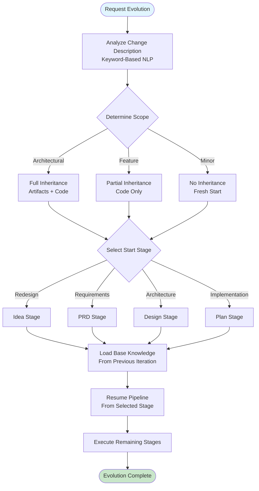

**Inheritance Strategy**:
- **Change Scope Analysis**: NLP keyword matching determines optimal starting stage ("redesign" → Idea, "add feature" → Coding, "fix bug" → Check)
- **Knowledge Transfer**: Base knowledge (decisions, patterns, issues) from parent iteration loads into agent context
- **Workspace Management**: Inheritance mode determines which files copy to new iteration workspace

### 5.3 GUI Real-Time Execution Flow

Event-driven architecture for interactive development monitoring:

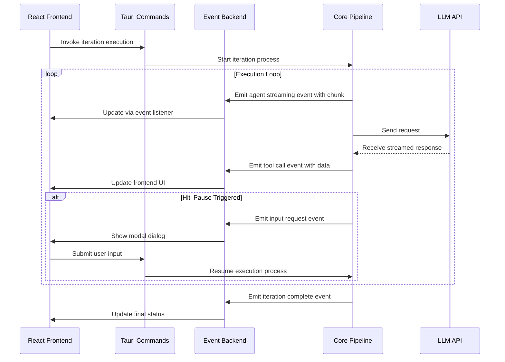

**Event Types**:
- `agent_event`: High-level agent messages (stage transitions, completion)
- `agent_streaming`: Token-by-token LLM output for real-time display
- `tool_call`/`tool_result`: Tool execution visualization
- `input_request`: HITL modal trigger with oneshot channel response
- `project_log`: Development server stdout/stderr streaming

### 5.4 Human-in-the-Loop Validation Flow

Structured human oversight at critical decision points:

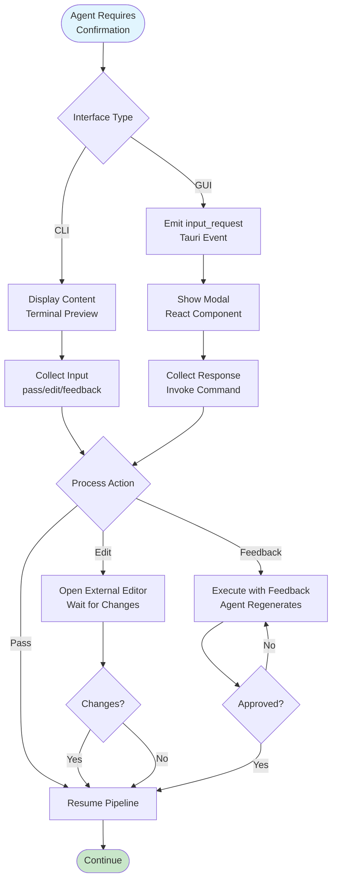

---

## 6. Technical Implementation

### 6.1 Core Module Implementation

#### Pipeline Controller (`crates/cowork-core/src/pipeline/mod.rs`)

The pipeline implements the **Template Method Pattern** with stage-specific implementations:

```rust
// Conceptual structure based on architecture analysis
pub struct PipelineController {
    context: PipelineContext,
    backend: Arc<dyn InteractiveBackend>,
}

impl PipelineController {
    pub async fn execute_genesis_iteration(&mut self, idea: &str) -> Result<Iteration> {
        // Stage sequence: Idea -> PRD -> Design -> Plan -> Coding -> Check -> Delivery
        let stages = vec![
            Box::new(IdeaStage) as Box<dyn Stage>,
            Box::new(PRDStage),
            // ... remaining stages
        ];
        
        for stage in stages {
            let result = self.execute_stage_with_hitl(stage).await?;
            self.context.update(result);
        }
        
        self.generate_knowledge_snapshot().await
    }
    
    async fn execute_stage_with_hitl(&self, stage: Box<dyn Stage>) -> Result<StageResult> {
        let result = stage.execute(&self.context).await?;
        
        if stage.requires_confirmation() {
            match self.backend.request_confirmation(&result).await? {
                UserAction::Pass => Ok(result),
                UserAction::Edit => self.open_editor_and_reload().await,
                UserAction::Feedback(feedback) => {
                    stage.execute_with_feedback(&self.context, feedback).await
                }
            }
        } else {
            Ok(result)
        }
    }
}
```

#### InteractiveBackend Trait (`crates/cowork-core/src/interaction/mod.rs`)

Defines the port for user interaction, enabling hexagonal architecture:

```rust
#[async_trait]
pub trait InteractiveBackend: Send + Sync {
    // Display methods
    async fn display_message(&self, msg: &str);
    async fn display_stream(&self, content: &str);
    async fn display_tool_call(&self, tool_name: &str, params: &Value);
    
    // HITL methods
    async fn request_confirmation(&self, content: &Artifact) -> Result<UserAction>;
    async fn request_input(&self, prompt: &str) -> Result<String>;
    
    // Progress tracking
    async fn update_progress(&self, stage: &str, progress: f32);
}
```

Implementations:
- **CLI Backend**: Uses `dialoguer` for prompts, `console` for colors, terminal tables for iteration listings
- **Tauri Backend**: Uses `AppHandle` for event emission, `tokio::sync::oneshot` for HITL response channels

### 6.2 Key Algorithm Design

#### Change Scope Analysis Algorithm

Determines optimal starting stage for evolution iterations:

```rust
fn analyze_change_scope(description: &str) -> Stage {
    let lower = description.to_lowercase();
    
    if lower.contains("redesign") || lower.contains("architectural") {
        Stage::Idea
    } else if lower.contains("requirement") || lower.contains("feature spec") {
        Stage::PRD
    } else if lower.contains("design") || lower.contains("component") {
        Stage::Design
    } else if lower.contains("implement") || lower.contains("code") {
        Stage::Coding
    } else {
        Stage::Idea // Default to full reconsideration
    }
}
```

#### Memory Query with Fuzzy Matching

Supports three query scopes with keyword filtering:

```rust
pub fn query_memories(
    &self,
    scope: QueryScope,
    category: Option<MemoryCategory>,
    keywords: &[String],
    limit: usize,
) -> Vec<MemoryEntry> {
    let candidates = match scope {
        QueryScope::Project => self.load_project_memories(),
        QueryScope::Iteration(id) => self.load_iteration_memories(id),
        QueryScope::Latest => self.merge_latest_memories(),
    };
    
    candidates
        .filter(|m| category.map_or(true, |c| m.category == c))
        .filter(|m| keywords.iter().any(|k| m.content.contains(k)))
        .take(limit)
        .collect()
}
```

### 6.3 Data Structure Design

#### Project Aggregate

```rust
pub struct Project {
    pub id: ProjectId,
    pub name: String,
    pub project_type: ProjectType,
    pub tech_stack: TechStack,
    pub created_at: DateTime<Utc>,
    pub iterations: Vec<IterationSummary>,
    pub current_iteration: Option<IterationId>,
}

pub struct Iteration {
    pub id: IterationId,
    pub project_id: ProjectId,
    pub mode: IterationMode, // Genesis or Evolution
    pub inheritance: InheritanceMode,
    pub status: IterationStatus, // Draft, Running, Completed, Failed
    pub stages: HashMap<Stage, StageResult>,
    pub workspace_path: PathBuf,
}
```

#### Memory Aggregate

```rust
pub struct ProjectMemory {
    pub project_id: ProjectId,
    pub decisions: Vec<Decision>,
    pub patterns: Vec<Pattern>,
    pub insights: Vec<Insight>,
    pub issues: Vec<Issue>,
    pub tech_stack: TechStackKnowledge,
}

pub struct IterationKnowledge {
    pub iteration_id: IterationId,
    pub summary: String,
    pub promoted_memories: Vec<MemoryId>, // Elevated to project level
    pub stage_insights: HashMap<Stage, Vec<Insight>>,
}
```

### 6.4 Performance Optimization Strategies

#### Async Pipeline Execution
- **Tokio Runtime**: Multi-threaded async execution for I/O bound operations (LLM calls, file I/O)
- **Streaming Architecture**: LLM responses stream directly to UI without buffering, reducing latency perception
- **Concurrent Tool Calls**: Independent tool executions run concurrently where dependencies permit

#### Memory Management
- **Lazy Loading**: Project memories load on-demand rather than at startup
- **Incremental Persistence**: Only modified entities serialize to disk, not entire aggregates
- **Workspace Isolation**: Each iteration has isolated workspace preventing file contention

#### Rate Limiting Optimization
- **Token Bucket Alternative**: Fixed delay + semaphore simpler than token bucket for single-user scenarios
- **Request Batching**: Where possible, multiple small requests coalesce (though limited by chat-based LLM APIs)

---

## 7. Deployment Architecture

### 7.1 Runtime Environment Requirements

**System Requirements**:
- **Operating System**: Cross-platform (Windows 10+, macOS 12+, Linux Ubuntu 20.04+)
- **Runtime**: Rust runtime (Tokio) for core, Node.js (for Tauri build only)
- **Memory**: Minimum 4GB RAM (8GB recommended for large projects)
- **Storage**: 500MB application + project workspace (typically 50-200MB per project)
- **Network**: Internet connection required for LLM API access (OpenAI-compatible endpoints)

**Dependencies**:
- **External**: LLM API key (OpenAI, Anthropic, or compatible)
- **System**: Default text editor (vim, nano, VS Code, etc.), Node.js (for generated projects)
- **Optional**: Development servers (Vite, Webpack) for preview functionality

### 7.2 Deployment Topology

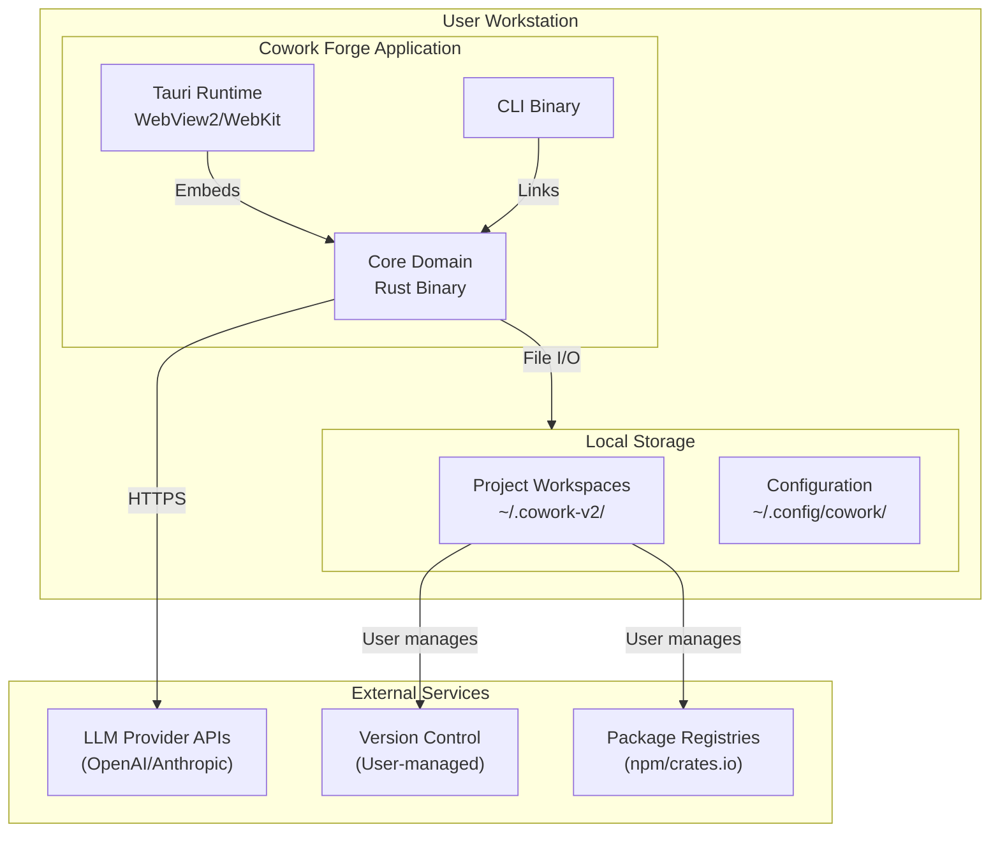

**Distribution Model**:
- **Desktop Application**: Tauri-based installer (.dmg for macOS, .msi for Windows, .AppImage/.deb for Linux)
- **CLI Tool**: Cargo installable crate or standalone binary
- **Core Library**: Published as Rust crate for potential embedding in other tools

### 7.3 Scalability Design

**Current Architecture Limitations**:
- **Single-User**: No multi-user collaboration features; designed for individual workstations
- **Local-First**: All computation and storage local; no horizontal scaling required
- **Synchronous LLM**: Rate limiting (30 req/min) prevents parallel LLM request scaling

**Extension Points**:
- **Plugin Architecture**: Tool system supports custom ADK tool injection for domain-specific operations
- **Custom Stages**: Pipeline trait system allows custom stage implementations (e.g., Security Review stage)
- **Multi-Model Support**: LLM configuration supports multiple providers; could extend to local models (Llama, Mistral)
- **Memory Backends**: Repository pattern allows replacement of JSON storage with database backends (SQLite, PostgreSQL) for team scenarios

### 7.4 Monitoring and Operations

**Observability**:
- **Logging**: Structured logging via `tracing` crate with configurable levels (DEBUG for development, INFO for production)
- **Metrics**: Pipeline execution duration, stage success rates, LLM token consumption
- **Event Tracing**: Tauri events provide real-time execution visibility in GUI mode

**Operational Considerations**:
- **Backup**: Projects stored as plain text (JSON + Markdown) in user directories; standard backup solutions apply
- **Migration**: JSON schema versioning supports forward compatibility; `.cowork-v2` directory naming allows side-by-side version installation
- **Security**: Workspace path validation prevents unauthorized file access; no network listeners exposed (outbound-only LLM calls)

**Health Checks**:
- **LLM Connectivity**: Validation command (`cowork status`) tests API key and connectivity
- **Workspace Integrity**: Automatic validation of project structure on load
- **Tool Availability**: Runtime checks for required external tools (editors, shell commands)

---

## Architectural Decision Records (ADRs)

### ADR-001: Multi-Crate Workspace Structure
**Decision**: Separate CLI, GUI, and Core into distinct crates within a Cargo workspace.  
**Rationale**: Enables independent deployment (CLI for automation, GUI for interaction) while sharing domain logic. Prevents GUI dependencies (Tauri, WebView) from bloating CLI binary.

### ADR-002: Trait-Based Backend Abstraction
**Decision**: `InteractiveBackend` trait to unify CLI and GUI interactions.  
**Rationale**: Single pipeline code path supports both automation and interactive modes without conditional logic throughout domain layer.

### ADR-003: JSON-First Persistence
**Decision**: File-based JSON storage instead of database.  
**Rationale**: Portability, version control compatibility, and local-first architecture. Enables users to inspect and modify project state with standard tools.

### ADR-004: Rate Limiting at Infrastructure Layer
**Decision**: Decorator pattern for LLM rate limiting (30 req/min) with semaphore concurrency control.  
**Rationale**: API quota protection and cost control. Global rate limiter ensures compliance regardless of pipeline stage parallelism.

### ADR-005: Event-Driven GUI with Asymmetric Communication
**Decision**: Tauri commands for requests, events for streaming responses.  
**Rationale**: Commands provide request-response semantics for operations; events enable server-push for streaming LLM tokens and process logs without polling overhead.

---

## Conclusion

Cowork Forge demonstrates a mature application of **Hexagonal Architecture** and **Domain-Driven Design** principles to the AI-assisted development domain. The architecture successfully balances AI autonomy with human oversight through the 7-stage pipeline and HITL validation gates. 

Key architectural strengths include:
- **Clean Separation**: Core domain remains pure and testable, isolated from UI and infrastructure concerns
- **Dual Interface Strategy**: Elegant trait-based abstraction enabling both CLI automation and GUI interactivity
- **Knowledge Persistence**: Memory system bridges the gap between stateless AI agents and stateful software development
- **Security-First**: Workspace containment and path validation protect against prompt injection attacks attempting file system traversal

The system is well-positioned for evolutionary extension, with clear domain boundaries supporting future enhancements such as team collaboration features, additional AI model integrations, or custom pipeline stages.
