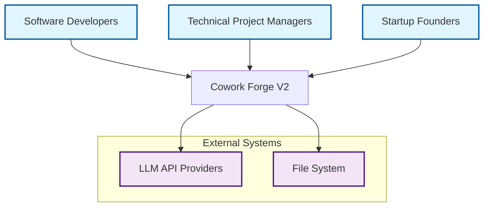
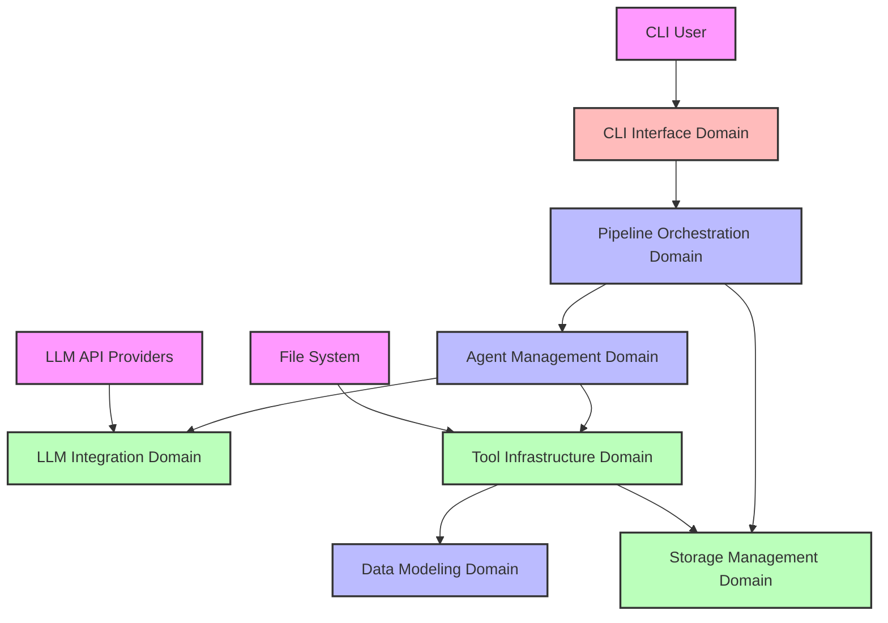
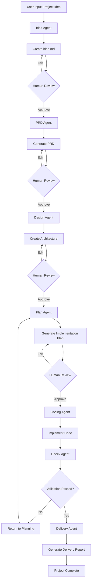
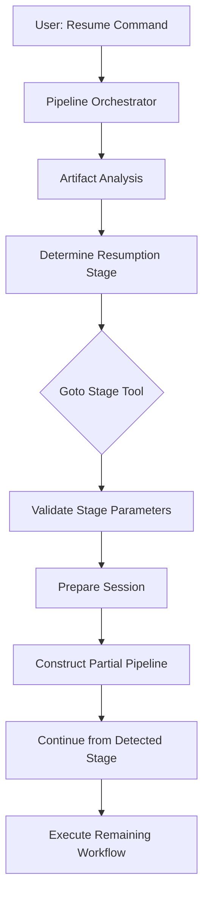
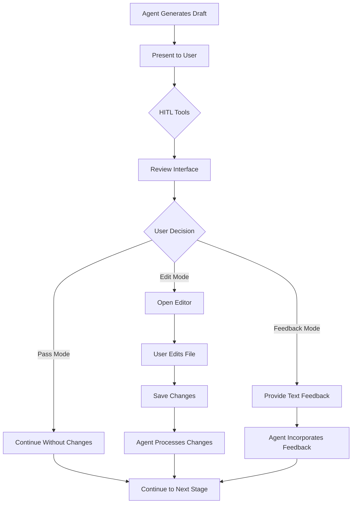
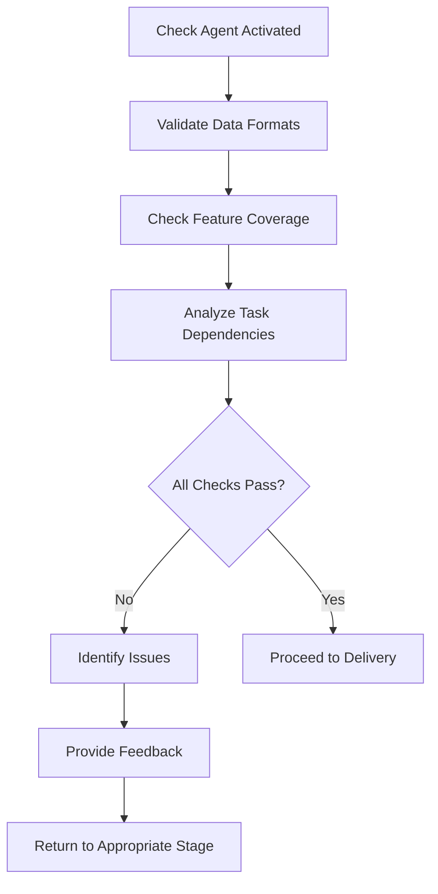
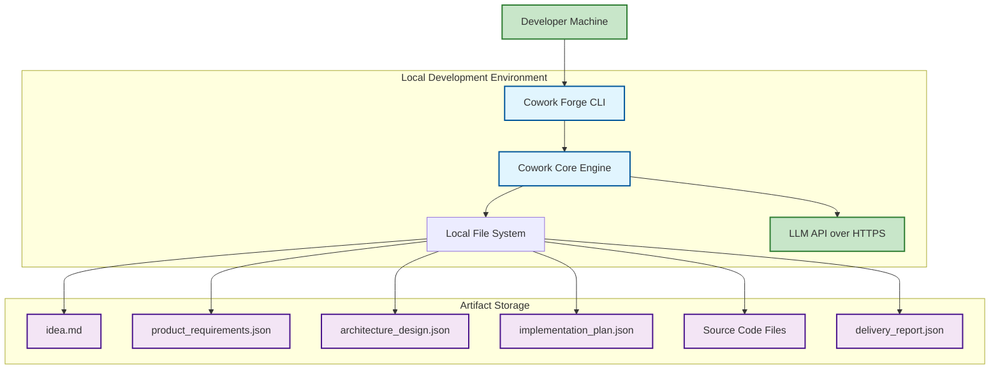

# Cowork Forge V2 Architecture Documentation

## 1. Architecture Overview

### Architecture Design Philosophy
Cowork Forge V2 employs a **domain-driven layered architecture** that balances AI automation with human oversight. The system is designed around the core principle of **structured automation** - providing AI-powered development assistance while maintaining human control at critical decision points. The architecture emphasizes modularity, extensibility, and clear separation of concerns through well-defined domain boundaries.

### Core Architecture Patterns
- **Sequential Pipeline Pattern**: Strict stage-by-stage workflow execution (Idea → PRD → Design → Plan → Coding → Check → Delivery)
- **Actor-Critic Loop Pattern**: Iterative refinement cycles for critical development stages
- **Human-in-the-Loop Pattern**: Strategic human intervention points for quality assurance
- **Tool-Based Extensibility**: Modular tool ecosystem enabling flexible functionality expansion
- **Domain-Driven Design**: Clear separation between business domains and infrastructure concerns

### Technology Stack Overview
- **Language**: Rust (for performance, safety, and concurrency)
- **AI Integration**: OpenAI-compatible LLM APIs
- **CLI Framework**: Clap for command-line interface
- **Data Format**: JSON with schema validation
- **Storage**: File system-based artifact persistence
- **Architecture**: Layered modular design with clear dependencies

## 2. System Context

### System Positioning and Value
Cowork Forge V2 positions itself as an **AI-powered development orchestrator** that accelerates software development by automating repetitive tasks while maintaining human oversight. The system provides structured workflows that guide developers from initial concept to delivered product, reducing cognitive load and ensuring consistent quality.

### User Roles and Scenarios



**Primary User Roles:**
- **Software Developers**: Need automated code generation, structured workflows, and quality validation
- **Technical Project Managers**: Require project status tracking, documentation automation, and progress monitoring
- **Startup Founders**: Seek rapid prototyping, idea validation, and MVP creation capabilities

### External System Interactions
- **LLM API Providers**: External AI services for code generation and analysis (API integration)
- **File System**: Local storage for project artifacts and configuration files (read/write operations)
- **Command Line Interface**: User interaction channel for workflow control

### System Boundary Definition
**Included Components:**
- CLI Interface and command parsing
- AI Agent orchestration and management
- Development pipeline execution engine
- File management and validation tools
- Human-in-the-loop workflow coordination
- Configuration and session management

**Excluded Components:**
- Code execution environments
- Version control system integrations
- Deployment infrastructure
- External database systems
- Web or mobile interfaces

## 3. Container View

### Domain Module Division



### Domain Module Architecture

**Core Business Domains:**
1. **Pipeline Orchestration Domain** (`crates/cowork-core/src/pipeline/`)
   - **Responsibility**: Orchestrates complete development workflow, manages stage sequencing
   - **Key Components**: Pipeline Builder, Stage Detector, SequentialAgent Pipeline
   - **Complexity**: High (8.0/10)

2. **Agent Management Domain** (`crates/cowork-core/src/agents/`)
   - **Responsibility**: Creates and manages specialized AI agents for development stages
   - **Key Components**: Agent Factory, Instruction Management, Specialized Agents
   - **Complexity**: High (9.0/10)

3. **Data Modeling Domain** (`crates/cowork-core/src/data/`)
   - **Responsibility**: Defines domain models and data structures for development artifacts
   - **Key Components**: Domain Models, Schema Management
   - **Complexity**: Medium (7.0/10)

**Infrastructure Domains:**
4. **Tool Infrastructure Domain** (`crates/cowork-core/src/tools/`)
   - **Responsibility**: Provides tool ecosystem for file operations, data management, and user interaction
   - **Key Components**: File Operations, Data Management, Validation Tools, Human Interaction
   - **Complexity**: Medium (7.0/10)

5. **Storage Management Domain** (`crates/cowork-core/src/storage/`)
   - **Responsibility**: Manages persistent storage of project artifacts and session data
   - **Key Components**: Artifact Storage, Session Management
   - **Complexity**: Medium (6.0/10)

6. **LLM Integration Domain** (`crates/cowork-core/src/llm/`)
   - **Responsibility**: Handles external AI service integration and configuration
   - **Key Components**: Configuration Management, Rate Limiting
   - **Complexity**: Medium (6.0/10)

**Presentation Domain:**
7. **CLI Interface Domain** (`crates/cowork-cli/src/`)
   - **Responsibility**: Provides command-line interface for user interaction
   - **Key Components**: Command Parser, Application Orchestrator
   - **Complexity**: Low (5.0/10)

### Storage Design
The system employs a **file system-based storage strategy** with structured directory organization:
- **Artifact Storage**: JSON files for requirements, designs, plans, and delivery artifacts
- **Session Management**: Persistent state tracking for workflow continuity
- **Configuration Storage**: LLM settings and system configuration files

### Inter-Domain Module Communication

| From Domain | To Domain | Relation Type | Strength | Description |
|-------------|-----------|---------------|----------|-------------|
| CLI Interface | Pipeline Orchestration | Service Call | 9.0 | CLI delegates command execution to pipeline orchestrator |
| Pipeline Orchestration | Agent Management | Service Call | 9.0 | Pipeline creates and sequences specialized agents |
| Agent Management | Tool Infrastructure | Tool Dependency | 8.0 | Agents depend on tools for operations and interaction |
| Tool Infrastructure | Data Modeling | Data Dependency | 8.0 | Tools rely on data models for structured operations |
| Tool Infrastructure | Storage Management | Data Dependency | 7.0 | Tools interact with storage for persistence |
| Agent Management | LLM Integration | Service Dependency | 7.0 | Agents utilize LLM services through integration layer |
| Pipeline Orchestration | Storage Management | Data Dependency | 6.0 | Pipeline uses storage for session management |

## 4. Component View

### Core Functional Components

```mermaid
graph TB
    %% Pipeline Orchestration Components
    PIPE_BUILDER[Pipeline Builder] --> PIPELINE_SEQ[SequentialAgent Pipeline]
    STAGE_DETECTOR[Stage Detector] --> PIPELINE_SEQ
    PIPELINE_SEQ --> IDEA_AGENT[Idea Agent]
    PIPELINE_SEQ --> PRD_LOOP[PRD Loop Agent]
    PIPELINE_SEQ --> DESIGN_LOOP[Design Loop Agent]
    PIPELINE_SEQ --> PLAN_LOOP[Plan Loop Agent]
    PIPELINE_SEQ --> CODING_LOOP[Coding Loop Agent]
    PIPELINE_SEQ --> CHECK_AGENT[Check Agent]
    PIPELINE_SEQ --> DELIVERY_AGENT[Delivery Agent]
    
    %% Agent Factory Dependencies
    AGENT_FACTORY[Agent Factory] --> IDEA_AGENT
    AGENT_FACTORY --> PRD_LOOP
    AGENT_FACTORY --> DESIGN_LOOP
    AGENT_FACTORY --> PLAN_LOOP
    AGENT_FACTORY --> CODING_LOOP
    AGENT_FACTORY --> CHECK_AGENT
    AGENT_FACTORY --> DELIVERY_AGENT
    
    %% Tool Infrastructure Components
    FILE_OPS[File Operations] --> AGENT_FACTORY
    DATA_TOOLS[Data Management] --> AGENT_FACTORY
    VALIDATION[Validation Tools] --> AGENT_FACTORY
    HITL_TOOLS[Human Interaction] --> AGENT_FACTORY
    
    classDef pipeline fill:#e3f2fd,stroke:#1976d2,stroke-width:2px
    classDef agent fill:#f3e5f5,stroke:#7b1fa2,stroke-width:2px
    classDef tool fill:#e8f5e8,stroke:#388e3c,stroke-width:2px
    
    class PIPE_BUILDER,STAGE_DETECTOR,PIPELINE_SEQ pipeline
    class AGENT_FACTORY,IDEA_AGENT,PRD_LOOP,DESIGN_LOOP,PLAN_LOOP,CODING_LOOP,CHECK_AGENT,DELIVERY_AGENT agent
    class FILE_OPS,DATA_TOOLS,VALIDATION,HITL_TOOLS tool
```



### Technical Support Components

**Tool Infrastructure Components:**
- **File Operations** (`src/tools/file_tools.rs`): Secure file system interactions
- **Data Management** (`src/tools/data_tools.rs`): Structured data CRUD operations
- **Validation Tools** (`src/tools/validation_tools.rs`): Quality assurance and validation
- **Human Interaction** (`src/tools/hitl_tools.rs`): User feedback collection interfaces

**Data Modeling Components:**
- **Domain Models** (`src/data/models.rs`): Rust structs defining development artifacts
- **Schema Management** (`src/data/schemas/`): JSON schema validation definitions

**LLM Integration Components:**
- **Configuration Management** (`src/llm/config.rs`): LLM settings and API credential handling
- **Rate Limiting** (`src/llm/rate_limiter.rs`): API call throttling and performance optimization

### Component Responsibility Division

| Component | Domain | Responsibility | Key Functions |
|-----------|--------|----------------|---------------|
| Pipeline Builder | Pipeline Orchestration | Constructs development pipelines | Pipeline construction, stage sequencing |
| Stage Detector | Pipeline Orchestration | Analyzes artifacts for resumption | Artifact analysis, stage detection |
| Agent Factory | Agent Management | Creates specialized agents | Agent creation, tool configuration |
| Instruction Management | Agent Management | Manages agent prompts | Instruction storage, template management |
| File Operations | Tool Infrastructure | Handles file system interactions | File reading/writing, directory listing |
| Domain Models | Data Modeling | Defines data structures | Type safety, serialization support |

### Component Interaction Relationships
Components interact through **well-defined interfaces** with clear dependency directions. The pipeline orchestrator acts as the central coordinator, while agents leverage tools for concrete operations. This separation enables independent development and testing of components.

## 5. Key Processes

### Core Functional Processes

**Full Project Development Flow:**


**Pipeline Resumption Flow:**


### Technical Processing Workflows

**Human-in-the-Loop Review Process:**


**Quality Validation Workflow:**


### Data Flow Paths
1. **Idea → Requirements Flow**: User input → Idea Agent → PRD artifacts
2. **Requirements → Design Flow**: PRD artifacts → Design Agent → Architecture documents
3. **Design → Implementation Flow**: Architecture → Plan Agent → Coding Agent → Source code
4. **Validation Flow**: Generated artifacts → Check Agent → Quality assessment
5. **Delivery Flow**: Validated project → Delivery Agent → Final reports

### Exception Handling Mechanisms
- **Stage Failure Recovery**: Pipeline can resume from last successful stage
- **LLM API Errors**: Rate limiting and retry mechanisms with exponential backoff
- **File System Errors**: Graceful degradation with user notification
- **Validation Failures**: Detailed error reporting with remediation guidance

## 6. Technical Implementation

### Core Module Implementation

**Pipeline Orchestration Implementation:**
```rust
// crates/cowork-core/src/pipeline/mod.rs
pub struct SequentialAgentPipeline {
    agents: Vec<Box<dyn Agent>>,
    context: PipelineContext,
}

impl SequentialAgentPipeline {
    pub async fn execute(&mut self) -> Result<PipelineResult> {
        for agent in &mut self.agents {
            let result = agent.execute(&self.context).await?;
            self.context.update(result);
        }
        Ok(PipelineResult::success())
    }
}
```

**Agent Factory Implementation:**
```rust
// crates/cowork-core/src/agents/mod.rs
pub struct AgentFactory {
    tool_registry: Arc<ToolRegistry>,
    instruction_manager: InstructionManager,
}

impl AgentFactory {
    pub fn create_agent(&self, agent_type: AgentType) -> Result<Box<dyn Agent>> {
        match agent_type {
            AgentType::Idea => self.create_idea_agent(),
            AgentType::PRD => self.create_prd_agent(),
            // ... other agent types
        }
    }
}
```

### Key Algorithm Design

**Actor-Critic Loop Algorithm (for PRD, Design, Plan, Coding stages):**
```pseudocode
function actorCriticLoop(initialArtifact):
    artifact = initialArtifact
    iteration = 0
    max_iterations = 5
    
    while iteration < max_iterations:
        # Actor phase: generate or refine artifact
        new_artifact = actor_agent.generate(artifact)
        
        # Critic phase: evaluate quality
        critique = critic_agent.evaluate(new_artifact)
        
        if critique.passes_quality_threshold():
            return new_artifact
        else:
            artifact = incorporate_feedback(new_artifact, critique)
            iteration += 1
    
    return artifact  # Return best effort after max iterations
```

**Stage Detection Algorithm:**
```pseudocode
function detectResumptionStage(projectDirectory):
    artifacts = scanDirectory(projectDirectory)
    
    if hasFile(artifacts, "delivery_report.json"):
        return Stage.COMPLETED
    elif hasFile(artifacts, "implementation_plan.json"):
        return Stage.CODING
    elif hasFile(artifacts, "architecture_design.json"):
        return Stage.PLANNING
    elif hasFile(artifacts, "product_requirements.json"):
        return Stage.DESIGN
    elif hasFile(artifacts, "project_idea.md"):
        return Stage.PRD
    else:
        return Stage.IDEA
```

### Data Structure Design

**Core Domain Models:**
```rust
// crates/cowork-core/src/data/models.rs
#[derive(Serialize, Deserialize, Debug)]
pub struct ProductRequirements {
    pub project_name: String,
    pub objectives: Vec<String>,
    pub features: Vec<Feature>,
    pub constraints: Vec<Constraint>,
    pub success_metrics: Vec<SuccessMetric>,
}

#[derive(Serialize, Deserialize, Debug)]
pub struct ArchitectureDesign {
    pub components: Vec<Component>,
    pub technologies: Vec<Technology>,
    pub interfaces: Vec<Interface>,
    pub deployment: DeploymentStrategy,
}

#[derive(Serialize, Deserialize, Debug)]
pub struct ImplementationPlan {
    pub tasks: Vec<Task>,
    pub milestones: Vec<Milestone>,
    pub dependencies: Vec<Dependency>,
    pub timeline: Timeline,
}
```

### Performance Optimization Strategies

1. **LLM Call Optimization**:
   - Request batching for multiple related operations
   - Response caching for repetitive queries
   - Rate limiting to avoid API throttling

2. **File System Optimization**:
   - Incremental file writes to avoid large I/O operations
   - Directory structure optimization for fast artifact lookup
   - Concurrent file operations where safe

3. **Memory Management**:
   - Efficient data structure design for large artifacts
   - Lazy loading of large files and datasets
   - Proper resource cleanup after pipeline execution

## 7. Deployment Architecture

### Runtime Environment Requirements
- **Operating System**: Linux, macOS, or Windows with Rust support
- **Rust Version**: 1.70.0 or higher
- **Memory**: Minimum 4GB RAM (8GB recommended for complex projects)
- **Storage**: 1GB free disk space for artifacts and dependencies
- **Network**: Internet connection for LLM API access

### Deployment Topology Structure


### Scalability Design

**Horizontal Scaling Points:**
1. **Agent Parallelization**: Independent agents can potentially run in parallel for different project stages
2. **Tool Extensibility**: New tools can be added without modifying core agents
3. **Pipeline Customization**: Configurable pipeline sequences for different project types

**Vertical Scaling Considerations:**
1. **LLM API Tier Selection**: Support for different LLM model sizes based on project complexity
2. **Memory Management**: Efficient handling of large codebases and complex artifacts
3. **Concurrent Project Support**: Session isolation for multiple simultaneous projects

### Monitoring and Operations

**Key Monitoring Metrics:**
- Pipeline execution time per stage
- LLM API response times and error rates
- File system operation performance
- User interaction latency

**Operational Considerations:**
- **Logging**: Structured logging for debugging and performance analysis
- **Configuration Management**: Environment-based configuration for different deployment scenarios
- **Error Reporting**: Comprehensive error reporting with contextual information
- **Backup Strategies**: Regular backup of critical configuration and project templates

**Security Considerations:**
- **API Key Management**: Secure storage and rotation of LLM API credentials
- **File System Security**: Sandboxed file operations to prevent unauthorized access
- **Input Validation**: Comprehensive validation of all user inputs and external data
- **Session Isolation**: Secure separation between different user sessions and projects

This architecture provides a robust foundation for AI-powered software development, balancing automation with human oversight while maintaining extensibility and maintainability through clear domain separation and modular design. The system is designed to evolve with emerging AI capabilities while maintaining stability and reliability for production use.