# Cowork Forge System Architecture Document

**Version**: 1.0
**Generated**: 2025-01-20
**Document Status**: Official Release

---

## 1. Architecture Overview

### 1.1 Architecture Design Philosophy

Cowork Forge adopts a **Human-in-the-Loop First** design philosophy, building an AI agent automation system for the software development lifecycle (SDLC). Its core architecture philosophy includes:

| Design Principle | Technical Implementation | Business Value |
|-----------------|--------------------------|----------------|
| **Simplicity First** | Instruction template hard constraints (2-4 components, 5-12 tasks limit) | Avoid AI over-engineering, ensure generated code maintainability |
| **Human-in-the-Loop (HITL)** | ResilientAgent resilient layer + mandatory review nodes | Human control at key quality nodes, preventing automation runaway |
| **Resilient Fault Tolerance** | Three-level retry mechanism + human decision intervention | Ensures long-process stability, supports checkpoint recovery |
| **Traceability** | Session isolation + file system persistence | Complete decision history recording, supports version rollback |

### 1.2 Core Architecture Patterns

The system adopts a **Layered Multi-Domain Architecture**, implementing multi-agent collaboration based on the Actor-Critic reinforcement learning paradigm:

1. **Actor-Critic Collaboration Mode**: Each key stage is equipped with dual agents (Actor generates content, Critic verifies quality), ensuring output quality through feedback loops
2. **Pipeline Orchestration Mode**: StageExecutor implements stage isolation, supporting sequential execution and conditional branches
3. **Tool Abstraction Mode**: Standardized tool interfaces (adk_core::Tool), enabling extensible AI capabilities
4. **Session Isolation Mode**: UUID-based session space, supporting multi-project parallel development

### 1.3 Technology Stack Overview


---

## 2. System Context

### 2.1 System Positioning and Business Value

Cowork Forge is an **AI-native software development automation tool**, positioned in the niche segment between AI-assisted programming and low-code platforms. Its core value lies in:

- **End-to-End Automation**: Covers the complete SDLC from requirements conceptualization (Idea) to project delivery (Delivery)
- **Architecture Constraint Generation**: Enforces simplicity architecture through prompt engineering to avoid "AI hallucination" causing over-design
- **Controllable Automation**: Introduces mandatory human review at key nodes such as PRD, Design, Plan to balance efficiency and quality

### 2.2 User Roles and Scenarios


### 2.3 External System Interactions

| External System | Interaction Method | Data Exchange | Reliability Requirements |
|----------------|-------------------|---------------|-------------------------|
| **Large Language Model Services** | HTTP API (OpenAI compatible protocol) | JSON request/response, streaming output | High (rate limit 30/min) |
| **File System** | Standard IO operations | Text/binary file read/write | High (local disk) |
| **Operating System/Shell** | Command execution (30-second timeout) | Command input/output capture | Medium (timeout protection) |
| **Terminal User Interface** | Synchronous interaction (dialoguer) | Menu selection, text input | High (blocking) |

### 2.4 System Boundary Definition

**Included in System**:
- CLI command line interface (new/resume/revert/modify/status/init)
- Multi-agent orchestration system (7-stage lifecycle management)
- Agent Actor-Critic execution engine
- Human-in-the-Loop (HITL) interaction layer
- LLM client and rate limiter
- Secure file access control module
- Session and state management storage layer
- Internal tool system (file operations, data management, validation)

**Excluded from System**:
- Actual business application runtime environment
- LLM service internal implementation details (model training/inference)
- IDE or editor plugins (only calls system default editor)
- CI/CD pipeline integration (indirectly supported via Shell commands)
- Distributed version control system server-side (Git server-side)
- Container orchestration platforms (K8s/Docker Swarm)


---

## 3. Container View

### 3.1 Domain Module Division

The system adopts a **Layered Domain Architecture**, implementing modularity through Rust Crate physical isolation:


### 3.2 Core Container Details

#### 3.2.1 CLI Interaction and Project Entry Domain (cowork-cli)

**Responsibilities**: System entry, responsible for command parsing, configuration loading, session lifecycle management
**Technical Implementation**: Parameter parsing based on `clap`, interactive menu implementation based on `dialoguer`

| Sub-component | Responsibilities | Key Interfaces |
|--------------|------------------|----------------|
| Command Processor | Parse new/resume/revert/modify/status/init commands | `execute_*_command` |
| Configuration Manager | TOML file + environment variable fallback strategy | `load_config_with_fallback` |
| Session Manager | UUID generation, state machine management (InProgress/Completed/Failed) | `generate_session_id`, `fingerprint_project_files` |

#### 3.2.2 AI Agent Orchestration Domain (cowork-core/agents)

**Architecture Pattern**: Actor-Critic Dual-Agent Collaboration
**Core Components**:


#### 3.2.3 Pipeline Orchestration Domain (cowork-core/pipeline)

**Core Abstraction**: `StageExecutor` implements stage isolation
**Key Capabilities**:
- **Stage Isolation**: By ignoring the escalate flag, allows LoopAgent to exit independently without affecting the overall workflow
- **Four Pipeline Builders**:
  - `create_cowork_pipeline`: Seven-stage complete workflow
  - `create_resume_pipeline`: Checkpoint resumption based on artifact detection
  - `create_partial_pipeline`: Restart from specified stage (version rollback)
  - `create_modify_pipeline`: Incremental modification dedicated pipeline

#### 3.2.4 Tool System Domain (cowork-core/tools)

**Tool Classification Architecture**:

| Tool Category | Implementation File | Core Capabilities | Security Mechanisms |
|---------------|---------------------|-------------------|---------------------|
| Data Operation Tools | `data_tools.rs` | CRUD requirements/features/tasks | Automatic ID generation (REQ-*/FEAT-*/TASK-*) |
| File Operation Tools | `file_tools.rs` | Read/Write/Execute | Path traversal protection, 30-second timeout |
| Validation Check Tools | `validation_tools.rs` | Dependency cycle detection (DFS algorithm), feature coverage analysis | Set operation verification |
| Flow Control Tools | `control_tools.rs` | Feedback recording, replanning request | Persist to feedback_history.json |
| HITL Interaction Tools | `hitl_*.rs` | Content review, file editing | System editor integration |
| Change Management Tools | `modify_tools.rs` | ChangeRequest persistence | Atomic write |

### 3.3 Storage Design

Adopts **File System Persistence** solution, implementing session isolation based on `.cowork` directory:

```
Project Root Directory/
├── .cowork/
│   ├── project_index.json          # Session index [ProjectIndex]
│   └── sessions/
│       └── {uuid}/
│           ├── metadata.json       # Session metadata [SessionRecord]
│           ├── input.json          # Session input
│           ├── state.json          # Execution state
│           ├── feedback_history.json # Feedback history
│           └── artifacts/
│               ├── idea.md
│               ├── prd.md
│               ├── design.md
│               └── plan.json
└── src/                            # Generated project code
```

**Data Model Core Entities**:
- `ProjectIndex`: Project-level session index, supporting multi-session management
- `SessionRecord`: Session state machine (InProgress → Completed/Failed)
- `Requirements`/`Feature`: Requirement management, supporting priority and status tracking
- `DesignSpec`: Design specification, mandatory component count constraint (2-4)
- `ImplementationPlan`/`Task`: Implementation plan, task dependency graph
- `ChangeRequest`: Change management, supporting incremental modification

### 3.4 Cross-Domain Communication Mechanisms


---

## 4. Component View

### 4.1 Core Functional Components

#### 4.1.1 StageExecutor (Stage Executor)

**Responsibilities**: Sequentially execute multi-stage agents, isolating stage states
**Key Design**:

```rust
pub struct StageExecutor {
    name: String,
    stages: Vec<(String, Arc<dyn Agent>)>, // Stage name and agent mapping
}

impl Agent for StageExecutor {
    async fn run(&self, ctx: Arc<dyn InvocationContext>) -> AdkResult<EventStream> {
        for (stage_name, agent) in &self.stages {
            // Key: Ignore escalate flag to prevent LoopAgent's ExitLoopTool from affecting overall workflow
            let event_stream = agent.run(ctx.clone()).await?;
            // Stream processing logic...
        }
    }
}
```

**Architecture Value**: Implements an execution model of "iteration within stages, sequential execution between stages", supporting the Actor-Critic feedback loop mechanism.

#### 4.1.2 ResilientAgent (Resilient Agent Wrapper)

**Three-Level Fault Tolerance Mechanism**:


#### 4.1.3 LoopAgent (Actor-Critic Loop)

**Collaboration Mode Implementation**:

| Stage | Actor Responsibilities | Critic Responsibilities | Exit Condition |
|-------|----------------------|------------------------|----------------|
| PRD | Analyze requirements and generate documents | Verify completeness, simplicity | ExitLoopTool or max=3 |
| Design | Create architecture design | Verify component count (2-4), simplicity | ExitLoopTool or max=3 |
| Plan | Create task list | Verify no dependency loops, coverage | ExitLoopTool or max=3 |
| Coding | Implement code | Verify task completion, code quality | ExitLoopTool or max=5 |

### 4.2 Technical Support Components

#### 4.2.1 File Secure Access Control (FileTools)

**Security Mechanisms**:
- **Path Traversal Protection**: `validate_path_security` check, prohibiting access to sensitive paths outside `.cowork`
- **Command Execution Sandbox**: `RunCommandTool` 30-second timeout, blocking background service commands (`nohup`, `&`, `systemctl`)
- **Concurrency Safety**: Based on Rust ownership system, file operation atomicity guarantee

#### 4.2.2 Rate Limiter (RateLimiter)

**Simplified Token Bucket Algorithm Implementation**:
- Default delay: 2 seconds/request (satisfying 30 times/minute limit)
- Decorator pattern: Wraps `Llm` trait, transparently intercepts requests
- Configurable: Dynamically adjust through `RateLimitedLlm::with_delay`

```rust
pub struct RateLimitedLlm {
    inner: Arc<dyn Llm>,
    delay: Duration, // Default 2s
}
```

#### 4.2.3 Data Validation Engine (ValidationTools)

**Algorithm Implementation**:
- **Dependency Cycle Detection**: DFS algorithm to detect task dependency graph
- **Feature Coverage Analysis**: Set operation to verify code implementation covers requirements
- **Data Format Validation**: Based on serde deserialization verification

### 4.3 Component Interaction Relationships


---

## 5. Key Processes

### 5.1 Complete Project Creation Workflow


**Key Execution Details**:

1. **PRD Stage Constraints**:
   - Actor must generate PRD draft containing 3-6 core requirements and 2-4 core features
   - Mandatory rejection of non-core requirements (performance optimization, test infrastructure, CI/CD, monitoring)
   - Human review implemented through `review_with_feedback_content` tool, supporting edit/pass/feedback three operations

2. **Design Stage Constraints**:
   - Component count strictly limited to 2-4
   - Mandatory use of simplest technology stack (recommend SQLite/JSON rather than complex databases)
   - Recommend monolithic architecture, prohibit microservices, caching layers, message queues (unless absolutely necessary)

3. **Coding Stage Characteristics**:
   - Unlike the multi-iteration of the first three stages, Coding Actor completes all pending tasks in a single round
   - Code generation follows existing project patterns, context-aware through `list_files` and `read_file` tools
   - Prohibit automatic generation of test code (unless explicitly required by PRD)

### 5.2 Incremental Modification Workflow

**Business Value**: Supports safe changes to delivered projects, achieving requirement evolution through change impact analysis and incremental patches while maintaining change traceability.

**Execution Flow**:


**Key Technical Mechanisms**:

1. **File Fingerprint Calculation**: Calculate project file hashes before modification, used for subsequent change tracking and conflict detection
2. **State Inheritance**: Implement session state inheritance through `init_session_from_base`, copying historical artifacts as context
3. **Change Scope Identification**: Triage Agent analyzes whether changes affect requirements layer (PRD), architecture layer (Design), planning layer (Plan), or only code layer (Code), guiding subsequent execution paths

### 5.3 Checkpoint Recovery Workflow

**Business Value**: Ensures long-running AI development processes have fault tolerance, supporting resumption from any interruption point, avoiding repeated computation.

**Execution Flow**:


**State Recovery Strategy**:

The system constructs a **stage completion matrix** by detecting file existence in the `.cowork/sessions/<id>/artifacts/` and `.cowork/sessions/<id>/state/` directories. The `create_resume_pipeline` function dynamically builds the execution pipeline based on this matrix, ensuring:

- Completed stages (artifacts exist and are valid) are skipped
- Incomplete or partially completed stages are re-executed
- Dependency relationships remain coherent (e.g., when restarting Coding stage, ensure Plan data is loaded)

### 5.4 Version Rollback Workflow

**Business Value**: When fundamental flaws appear in architecture design or directional requirement changes occur, allows restarting from a specific stage, preserving valuable early analysis results.

**Execution Flow**:


---

## 6. Process Coordination and Control

### 6.1 Pipeline Orchestration Mechanism

The system adopts **StageExecutor** to achieve precise workflow control, ensuring consistency and reliability of multi-stage sequential execution:

```mermaid
sequenceDiagram
    participant CLI as CLI Entry
    participant PF as Pipeline Factory
    participant SE as StageExecutor
    participant Agent as AI Agent
    participant Store as Storage Layer

    CLI->>PF: Create workflow pipeline<br/>create_cowork_pipeline()
    PF->>PF: Instantiate stage agents<br/>Idea→PRD→Design→Plan→Coding→Check→Delivery
    
    PF->>SE: Register sub-agent list
    loop Stage Execution
        SE->>SE: Isolate escalate flag<br/>Prevent loop exit signal propagation
        SE->>Agent: Execute current stage<br/>execute()
        Agent->>Store: Read/write session state
        Agent-->>SE: Return execution result<br/>Content/FunctionCall
        SE->>SE: Check exit signal<br/>ExitLoopTool handling
    end
    
    SE-->>CLI: Report execution completion status
```



**StageExecutor Core Responsibilities**:

1. **Stage Isolation**: Each stage has independent escalate flag context, ensuring LoopAgent's internal loop exit won't terminate the entire workflow
2. **Streaming Output**: Implements `Agent` trait, supports asynchronous streaming of LLM-generated content, real-time feedback to user
3. **State Verification**: At stage transitions, verifies existence of prerequisite stage artifacts, ensuring data continuity

### 6.2 State Management and Data Flow

The system adopts **session isolation + file system persistence** architecture to manage state:


**Data Flow Control Principles**:

1. **Forward Dependency**: Each stage can only read data from current and previous stages, prohibiting reverse dependency
2. **Immutable Artifacts**: Once a stage is marked as complete, its generated markdown artifacts (idea.md, prd.md, etc.) are read-only in principle, modifications require incremental modification workflow
3. **Automatic State Update**: `auto_update_feature_status` mechanism automatically cascades feature status updates when task status changes

### 6.3 Human-in-the-Loop (HITL) Coordination Mechanism

The system forces human review at key quality nodes, implementing seamless collaboration through tool chains:


**HITL Decision Matrix**:

| Stage | Review Tool | Edit Capability | Feedback Handling | Loop Limit |
|-------|-------------|-----------------|-------------------|------------|
| Idea | ReviewAndEditContentTool | Yes | Resave | No limit |
| PRD | ReviewWithFeedbackContentTool | Yes | Record to feedback_history | 3-5 times |
| Design | ReviewWithFeedbackContentTool | Yes | Record to feedback_history | 3-5 times |
| Plan | ReviewWithFeedbackContentTool | Yes | Record to feedback_history | 3-5 times |
| Coding | None (automatic flow) | No | Critic direct feedback | 3 times |

---

## 7. Exception Handling and Recovery

### 7.1 Resilient Error Recovery Architecture

The system achieves robust error handling through the **ResilientAgent** wrapper, ensuring when AI execution exceptions occur, it doesn't fail immediately but provides graded recovery strategies:


**Exception Classification and Handling Strategies**:

| Exception Type | Detection Method | Automatic Retry | Human Intervention | Recovery Mechanism |
|---------------|-----------------|----------------|-------------------|-------------------|
| **Max Iterations** | ADK framework throws | 3 times | Mandatory | User guidance then retry |
| **LLM API Error** | HTTP status code | 3 times | Optional | Delayed retry |
| **Tool Execution Failure** | ToolResult error code | 0 times | Mandatory | Fix then retry |
| **Loop Detection** | Critic feedback history analysis | N/A | Mandatory | RequestHumanReviewTool |

### 7.2 Anti-Loop Protection Mechanism

To prevent Actor-Critic loops from falling into infinite iterations, the system implements protection at multiple levels:


**Critic Decision Rules**:

1. **First Iteration**: Actor generates draft → Critic comprehensive check → Provides specific feedback
2. **Second Iteration**: Actor modifies → Critic compares with feedback history → If unresolved issue found, elevates warning level
3. **Third Iteration**: If issue persists, Critic calls `request_human_review` tool, outputs boxed warning (⚠️ 🚨) on console, and returns Agent Error to suspend execution

### 7.3 Failover and Degradation Strategies

Degradation behavior when key services are unavailable:

| Failure Scenario | Impact Scope | Degradation Strategy | User Experience |
|------------------|--------------|---------------------|-----------------|
| LLM API Timeout | Current stage | Exponential backoff retry (1s, 2s, 4s) | Display waiting prompt |
| LLM API Completely Unavailable | Entire workflow | Save current state, prompt user to check configuration | Graceful exit, state retained |
| File System Permission Error | Specific tool call | Skip operation, record warning | Continue execution, remind afterwards |
| User Interruption (Ctrl+C) | Current execution | Save session status to InProgress | Resume possible |
| Disk Space Insufficient | Persistence operation | Pause new file writes, clean logs | Prompt to clear space |

---

## 8. Technical Implementation Details

### 8.1 Core Module Implementation

#### 8.1.1 Agent Factory Implementation Pattern

Adopts **Builder Pattern** combined with **Dependency Injection**:

```rust
pub fn create_prd_loop(
    llm: Arc<dyn Llm>,
    tools: Vec<Arc<dyn Tool>>,
    storage: Arc<dyn Storage>,
) -> Arc<dyn Agent> {
    // Actor: Generate requirements
    let actor = LlmAgentBuilder::new()
        .with_model(llm.clone())
        .with_instruction(PRD_ACTOR_INSTRUCTION)
        .with_tools(tools.clone())
        .build();
    
    // Critic: Verify requirements
    let critic = LlmAgentBuilder::new()
        .with_model(llm)
        .with_instruction(PRD_CRITIC_INSTRUCTION)
        .with_tools(tools)
        .build();
    
    // LoopAgent: Orchestrate Actor-Critic loop
    let loop_agent = LoopAgentBuilder::new()
        .with_main_agent(actor)
        .with_critic_agent(critic)
        .with_max_iterations(3)
        .build();
    
    // ResilientAgent: Wrap with fault tolerance mechanism
    Arc::new(ResilientAgent::new(
        loop_agent,
        storage,
        "prd_loop".to_string()
    ))
}
```

#### 8.1.2 Stage Isolation Mechanism

**Key Code** (`StageExecutor::run`):

```rust
// Ignore escalate event to prevent LoopAgent's ExitLoopTool from affecting overall workflow
while let Some(event) = stream.next().await {
    match event {
        Event::Action { action, .. } => {
            // Key: Don't propagate escalate flag to outer layer
            if action.name() != "ExitLoopTool" {
                yield event;
            }
        }
        _ => yield event,
    }
}
```

**Architecture Significance**: Implements "structured concurrency" where child task failures don't affect parent tasks, supporting intra-stage retries.

### 8.2 Key Algorithm Design

#### 8.2.1 Checkpoint Recovery Algorithm

Based on **artifact existence detection** state inference:

```rust
fn detect_resume_stage(session_id: &str) -> ResumeStage {
    if has_code_files(session_id) {
        ResumeStage::Check  // Code generated, start from check
    } else if has_implementation_plan(session_id) 
           && has_design_spec(session_id) {
        ResumeStage::Coding // Design complete, start from coding
    } else if has_design_spec(session_id) {
        ResumeStage::Plan   // Requirements complete, start from planning
    } else if has_requirements(session_id) {
        ResumeStage::Design // Requirements complete, start from design
    } else {
        ResumeStage::Prd    // Start from beginning
    }
}
```

#### 8.2.2 Task Dependency Cycle Detection

**DFS Algorithm Implementation** (`CheckTaskDependenciesTool`):

```rust
fn detect_cycles(tasks: &[Task]) -> Option<Vec<String>> {
    let graph = build_dependency_graph(tasks);
    let mut visited = HashSet::new();
    let mut recursion_stack = HashSet::new();
    
    for task in tasks {
        if !visited.contains(&task.id) {
            if let Some(cycle) = dfs_detect(&graph, task.id, &mut visited, &mut recursion_stack) {
                return Some(cycle);
            }
        }
    }
    None
}
```

### 8.3 Data Structure Design

#### 8.3.1 Session State Machine


#### 8.3.2 Feature Lifecycle Model

```rust
enum FeatureStatus {
    Planned,      // Planned
    InProgress,   // In progress
    Implemented,  // Implemented (code exists)
    Verified,     // Verified (tests passed)
    Delivered,    // Delivered
}

struct Feature {
    id: String,           // FEAT-001
    name: String,
    status: FeatureStatus,
    requirements: Vec<String>, // Associated requirement IDs
    tasks: Vec<String>,        // Associated task IDs
    created_at: DateTime<Utc>,
    updated_at: DateTime<Utc>,
}
```

### 8.4 Performance Optimization Strategies

#### 8.4.1 LLM Call Optimization

- **Rate Limiting**: Default 2-second delay, preventing API rate limiting
- **Streaming Output**: Supports `--stream` flag, real-time display of generation process
- **Context Compression**: Critic stage only passes key differences, reducing token consumption

#### 8.4.2 Storage Optimization

- **Lazy Loading**: `Storage` implements on-demand JSON file loading
- **Incremental Persistence**: Immediately save state after tool execution, avoiding batch write blocking
- **File Fingerprint Caching**: Cache file hashes during incremental modification, avoiding repeated computation

#### 8.4.3 Concurrency Design

- **Intra-Stage Sequential**: Guarantees causality of Actor-Critic alternating execution
- **Inter-Stage Isolation**: StageExecutor sequential execution, avoiding concurrent conflicts
- **Asynchronous IO**: File operations and LLM calls are both asynchronous, supporting concurrent session management

---

## 9. Deployment Architecture

### 9.1 Runtime Environment Requirements

| Component | Minimum Requirements | Recommended Configuration |
|-----------|---------------------|---------------------------|
| **Operating System** | Linux/macOS/Windows | Linux (Ubuntu 22.04+) |
| **Rust** | 1.70+ | 1.75+ |
| **Memory** | 2GB | 4GB+ (LLM context cache) |
| **Disk** | 1GB | 10GB+ (Project artifact storage) |
| **Network** | Accessible LLM API | Local vLLM/Ollama deployment |

### 9.2 Deployment Topology


### 9.3 Configuration Management Strategy

**Layered Configuration System**:

1. **System-level Configuration** (`/etc/cowork/config.toml`): Global defaults
2. **User-level Configuration** (`~/.config/cowork/config.toml`): Personal preferences
3. **Project-level Configuration** (`.cowork/config.toml`): Project-specific
4. **Environment Variables** (`COWORK_LLM_API_KEY`): Sensitive information
5. **Command Line Arguments** (`--verbose`, --model`): Temporary override

**Configuration Example**:
```toml
[llm]
provider = "openai"  # Or "vllm", "ollama"
api_key = "${OPENAI_API_KEY}"  # Supports env variable interpolation
model = "gpt-4"
rate_limit = "30/m"

[project]
template = "rust"  # Default project template
editor = "code"    # System editor command
```

### 9.4 Scalability Design

#### 9.4.1 Horizontal Scalability

Although Cowork Forge is primarily designed for single-machine CLI, its architecture supports the following extensions:

- **Multi-Session Parallel**: Session ID isolation supports simultaneous management of multiple projects
- **Multi-Model Switching**: Define multiple LLM configurations in config, switch at runtime
- **Custom Tools**: Implement `Tool` trait to extend agent capabilities

#### 9.4.2 Vertical Scalability Path

| Extension Point | Implementation Method | Scenarios |
|----------------|----------------------|-----------|
| **New Development Stage** | Implement `Agent` trait, register in `StageExecutor` | Add security audit stage |
| **Custom Validation Rules** | Add new `ValidationTool`, reference in Critic instruction | Compliance checking |
| **New Language Support** | Extend `coding` stage instruction templates, add file extension mapping | Python/Go project generation |
| **CI/CD Integration** | Use `--no-interactive` mode, coordinate with Shell scripts | Automated pipelines |

### 9.5 Monitoring and Operations

#### 9.5.1 Observability

**Structured Logging** (tracing):
- **INFO**: Stage start/complete, human-computer interaction points
- **DEBUG**: Tool call details, LLM request parameters
- **ERROR**: Execution exceptions, retry counter overflow

**Session Audit Log**:
```json
// .cowork/sessions/{id}/audit.log
{
  "timestamp": "2025-01-20T10:00:00Z",
  "event": "stage_transition",
  "from": "design",
  "to": "plan",
  "actor": "DesignCritic",
  "decision": "approve"
}
```

#### 9.5.2 Troubleshooting Guide

| Failure Phenomenon | Possible Cause | Solution |
|-------------------|----------------|----------|
| Max iterations error | Task too complex or description unclear | Use `cowork modify` to refine requirements, or manually provide guidance |
| API rate limiting | LLM calls too frequent | Check `rate_limit` configuration, or switch to local vLLM |
| File permission error | Security path verification failed | Ensure operation is within `project_root`, avoid system directories |
| Session state inconsistency | Forced exit causing metadata corruption | Use `cowork revert` to rollback to stable stage |

#### 9.5.3 Backup and Recovery

**Automatic Backup Mechanism**:
- Automatically create `.cowork/sessions/{id}/backups/` after each stage completion
- Keep state snapshots of the last 5 stages
- Support quick rollback via `cowork revert --to <stage>`

**Disaster Recovery**:
```bash
# Manual session backup
cp -r .cowork/sessions/{id} backup/

# Restore session
cp -r backup/{id} .cowork/sessions/
cowork resume --session {id}
```

---

## 10. Architecture Decision Records (ADR)

### ADR-001: File System Persistence vs Database Storage

**Decision**: Use JSON file system instead of SQLite/PostgreSQL
**Rationale**:
- Native integration with code repositories for version control
- Zero-configuration deployment, no database service required
- Human-readable artifacts (Markdown/JSON) facilitate auditing
**Trade-offs**: Sacrifice complex query performance for simplicity and portability

### ADR-002: Actor-Critic Pattern vs Single Agent

**Decision**: Adopt dual-agent (Actor-Critic) collaboration for key stages
**Rationale**:
- Separate generation and verification responsibilities, reduce single prompt complexity
- Achieve self-correction through loop mechanism, reduce manual intervention frequency
**Trade-offs**: Increase token consumption and latency, exchange for higher quality output

### ADR-003: Rust Language Selection

**Decision**: Use Rust instead of Python/TypeScript
**Rationale**:
- Type safety guarantees runtime stability (critical for long-process automation)
- Performance advantages: fast file operations, low memory footprint
- Native support from ADK framework
**Trade-offs**: Slower development iteration, steeper learning curve

---

## 11. Summary

Cowork Forge's architecture design embodies the philosophy of **"Controlled Automation"**: ensuring AI output quality through Actor-Critic collaboration mechanism, ensuring human control at key moments through HITL resilient layer, and achieving reliable long-process execution through stage isolation and session management.

This architecture applies to software development scenarios requiring **structured AI assistance**, particularly:
- Startup product rapid prototype verification (MVP development)
- Batch generation of standardized microservices
- Incremental refactoring of legacy systems

**Future Evolution Directions**:
- Support distributed multi-agents (multi-model debate mechanism)
- Integrate IDE plugins for real-time code synchronization
- Introduce vectorized storage for project knowledge base retrieval