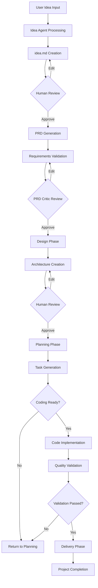
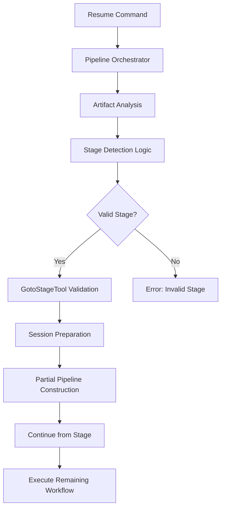

# Core Workflows

## 1. Workflow Overview

Cowork Forge implements an AI-powered software development lifecycle through sequential specialized agents with human-in-the-loop validation. The system orchestrates seven core workflows that automate the complete software development process from idea generation to final delivery.

### System Main Workflows
- **Full Project Development Flow**: Complete end-to-end process from idea generation to final delivery orchestrated by sequential AI agents
- **Pipeline Resumption Flow**: Intelligent artifact detection and stage-based recovery enabling incremental development and error recovery
- **Human-in-the-Loop Review Process**: Standardized feedback integration ensuring quality control at critical development decision points

### Core Execution Paths
```mermaid
graph TD
   [User Input CLI] --> B[CLI Interface Domain]
    B --> C[Pipeline Orchestration Domain]
    C --> D[Agent Management Domain]
    D --> E{Idea Agent}
    E --> F[Requirements Management Domain]
    F --> G{PRD Agent}
    G --> H[Architecture Design Domain]
    H --> I[Planning Domain]
    I --> J[Coding Domain]
    J --> K[Quality Assurance Domain]
    K --> L[Delivery Management Domain]
    L --> M[Project Completion]
```

### Key Process Nodes
- **Entry Point**: CLI command parsing and workflow initialization
- **Validation Gates**: Human review checkpoints at idea, PRD, design, and planning stages
- **Quality Assurance**: Automated structural validation and completeness checking
- **Recovery Nodes**: Stage-based resumption capabilities with intelligent artifact detection

### Process Coordination Mechanisms
- **Sequential Agent Orchestration**: Linear progression through specialized AI agents
- **Human-in-the-Loop Integration**: Structured feedback collection at critical stages
- **Artifact-Driven Continuity**: Persistent storage of development artifacts enabling workflow continuity
- **Stage Detection Logic**: Intelligent analysis of existing artifacts to determine appropriate resumption points

## 2. Main Workflows

### 2.1 Full Project Development Flow
The primary business process orchestrates the complete software development lifecycle through seven specialized AI agents with integrated human validation.



**Process Execution Order:**
1. **Idea Capture Phase**: Idea Agent processes user input → Creates structured idea.md → Human review cycle begins
2. **Requirements Generation Phase**: PRD Agent analyzes idea.md → Generates product requirements → Human validation checkpoint
3. **Architecture Design Phase**: Design Agent creates technical specifications → Component definitions → Technology stack decisions
4. **Implementation Planning Phase**: Plan Agent generates task breakdown → Dependency analysis → Milestone planning
5. **Code Generation Phase**: Coding Agent implements planned tasks → File creation → Code validation
6. **Quality Assurance Phase**: Check Agent performs structural validation → Feature coverage → Dependency analysis
7. **Final Delivery Phase**: Delivery Agent generates comprehensive reports → Project validation → Final documentation

**Input/Output Data Flows:**
- **User Input**: Project idea, requirements, configuration settings
- **Idea Agent Output**: Structured idea.md document with problem statement, target audience, goals
- **PRD Agent Output**: Product Requirements Document with features, user stories, acceptance criteria
- **Design Agent Output**: System architecture specification with components, interfaces, technology stack
- **Plan Agent Output**: Implementation plan with tasks, dependencies, milestones, timelines
- **Coding Agent Output**: Source code files implementing planned functionality
- **Check Agent Output**: Validation results, issues detected, quality assessment
- **Delivery Agent Output**: Final delivery documentation, project reports, completion status

### 2.2 Pipeline Resumption Flow
The secondary recovery workflow enables development continuation from specific stages based on existing artifacts, providing fault tolerance and incremental development capabilities.



**Execution Dependencies:**
- **Artifact Detection**: Storage Management Domain scans .cowork/ directory → Analyzes existing artifact files → Determines most recent valid stage
- **Validation Logic**: Pipeline Orchestration Domain validates detected stage → Ensures stage-specific prerequisites are met
- **Pipeline Construction**: Pipeline Orchestration Domain builds partial workflow → Configures agents for remaining stages → Initializes session context

## 3. Flow Coordination and Control

### 3.1 Multi-Module Coordination Mechanisms
The system implements sophisticated coordination between specialized AI agents through the Pipeline Orchestration Domain, managing sequential execution, stage transitions, and inter-agent communication.

**State Management and Synchronization:**
- **Session-Based Execution**: Each workflow stage maintains isolated session context with persistent state storage
- **Artifact-Driven Continuity**: Development artifacts serve as state carriers between stages, enabling workflow recovery
- **Agent Sequencing Control**: Pipeline orchestrator manages agent execution order, dependencies, and error handling

**Data Passing and Sharing Mechanisms:**
- **Structured Data Transfer**: JSON-based data schemas ensure consistent data format between agents
- **Artifact Persistence**: All development artifacts are stored in .cowork/ directory for workflow continuity
- **Validation Gate Integration**: Quality checkpoints use shared validation results to inform subsequent stages

### 3.2 Execution Control and Scheduling
The system employs intelligent workflow scheduling with adaptive error handling and performance optimization strategies.

**Concurrent Processing Strategy:**
- **Rate-Limited LLM Calls**: Rate limiting middleware enforces configurable delays between LLM API calls
- **Sequential Agent Execution**: Agents execute sequentially to maintain workflow consistency and data integrity
- **Error Recovery Mechanisms**: Stage-based resumption capabilities provide fault tolerance for individual agent failures

**Performance Optimization Strategies:**
- **Lazy Artifact Loading**: Only loads necessary artifacts for each stage to minimize memory footprint
- **Incremental Pipeline Construction**: Builds partial workflows based on detected resumption points
- **Validation Caching**: Stores validation results to avoid redundant quality checks
- **Early Termination Logic**: Implements efficient exit conditions when workflows complete successfully

## 4. Exception Handling and Recovery

### 4.1 Error Detection and Handling
The system implements comprehensive error handling strategies across multiple architectural layers.

**Error Detection Mechanisms:**
- **Agent-Level Error Handling**: Individual AI agents implement structured error handling with specific error types and recovery strategies
- **Tool-Level Error Recovery**: Tool infrastructure provides secure error boundaries with automatic retry mechanisms
- **Pipeline-Level Fault Tolerance**: Pipeline orchestrator implements stage-based error recovery with intelligent rollback points

**Exception Recovery Mechanisms:**
- **Stage-Based Recovery**: System can resume from any completed development stage using existing artifacts
- **Artifact Validation**: Automatic validation of existing artifacts before resumption to ensure consistency
- **Session State Recovery**: Pipeline maintains session state enabling workflow continuity after interruptions

### 4.2 Fault Tolerance Strategy Design
The fault tolerance strategy employs multiple layers of protection to ensure system reliability.

**Failure Retry and Degradation Strategies:**
- **Exponential Backoff**: Rate limiting middleware implements progressively increasing delays for LLM API failures
- **Alternative Validation Paths**: When validation tools fail, system provides fallback mechanisms using simpler checks
- **Graceful Degradation**: System maintains basic functionality even when advanced AI features become unavailable

**Error Classification and Handling:**
```
enum WorkflowError {
    AgentExecutionFailure(String),    // AI agent execution errors
    ToolExecutionError(String),       // Tool infrastructure errors
    ValidationError(String),         // Quality validation failures
    ConfigurationError(String),     // System configuration issues
    ExternalServiceError(String),  // LLM API service failures
}
```

## 5. Key Process Implementation

### 5.1 Core Algorithm Processes
The system implements sophisticated workflow algorithms through the Pipeline Orchestration Domain:

**Pipeline Construction Algorithm:**
```rust
fn construct_pipeline(workflow_type: WorkflowType) -> Pipeline {
    match workflow_type {
        WorkflowType::FullProject => {
            agents: [
                IdeaAgent::new(),
                PRDAgent::new(),
                DesignAgent::new(),
                PlanAgent::new(),
                CodingAgent::new(),
                CheckAgent::new(),
                DeliveryAgent::new()
            ],
            sequence: SequentialAgent::new(agents),
            configuration: {
                max_iterations: 1,  // Workaround for agent exit bug
                exit_conditions: stage_completion
            }
        },
        WorkflowType::ResumeFromStage(stage) => {
            existing_artifacts = detect_artifacts(stage);
            partial_agents = get_remaining_agents(stage, existing_artifacts);
            Pipeline::new(partial_agents)
        }
    }
}
```

**Stage Detection Logic:**
```rust
fn detect_resumption_point() -> Result<WorkflowStage, DetectionError> {
    let artifacts = scan_artifact_directory();
    let latest_stage = analyze_artifact_timeline(artifacts);
    
    match latest_stage {
        Some(Stage::Idea) if has_prd_artifacts() => Stage::Prd,
        Some(Stage::Prd) if has_design_artifacts() => Stage::Design,
        Some(Stage::Design) if has_plan_artifacts() => Stage::Plan,
        Some(Stage::Plan) if has_code_files() => Stage::Coding,
        Some(Stage::Coding) if has_delivery_ready() => Stage::Delivery,
        None => Stage::Idea,  // Start from beginning
        Some(current) => current  // Resume from current
    }
}
```

### 5.2 Data Processing Pipelines
The system implements structured data processing through specialized tools and validation mechanisms:

**Data Processing Flow:**
```
User Input → Idea Agent Processing → idea.md Creation
idea.md → PRD Agent Processing → Product Requirements Document
Requirements → Design Agent Processing → Architecture Specification
Design → Plan Agent Processing → Implementation Task Plan
Plan → Coding Agent Processing → Source Code Generation
Code → Check Agent Validation → Quality Assessment Report
Validation → Delivery Agent Processing → Final Delivery Documentation
```

**Business Rule Execution:**
- **Human Review Gates**: Mandatory validation checkpoints at idea, requirements, design, and planning stages
- **Quality Validation Rules**: Automated quality checks ensure feature coverage and architectural consistency
- **Completion Criteria**: Strict validation requiring both task completion and actual code file existence

### 5.3 Technical Implementation Details
The system employs sophisticated technical implementations through specialized domain modules:

**Technical Implementation Architecture:**
```rust
// Core workflow orchestration logic
impl PipelineOrchestrator {
    async fn execute_full_workflow(&self, user_input: UserInput) -> Result<WorkflowOutput, WorkflowError> {
        // 1. Initialize session context and validate prerequisites
        let session = self.initialize_session_context(user_input).await?;
        
        // 2. Construct sequential agent pipeline with error handling
        let pipeline = SequentialAgent::new(vec![
            self.create_idea_agent(),
            self.create_prd_agent(),
            self.create_design_agent(),
            self.create_plan_agent(), 
            self.create_coding_agent(),
            self.create_check_agent(),
            self.create_delivery_agent()
        ]);
        
        // 3. Execute workflow with stage-based error recovery
        let result = pipeline.execute_with_fallback_strategy().await;
        
        // 4. Handle completion and generate final delivery reports
        self.handle_workflow_completion(result).await
    }
    
    // Stage detection and resumption logic
    async fn detect_resumption_stage(&self, artifacts: &[Artifact]) -> Stage {
        if artifacts.contains("delivery_report.md") { Stage::Complete }
        else if artifacts.contains("requirements.json") { Stage::Delivery }
        else if artifacts.contains("code_files") { Stage::Coding }
        else if artifacts.contains("implementation_plan.json") { Stage::Plan }
        else if artifacts.contains("design_specification.json") { Stage::Design }
        else if artifacts.contains("prd.md") { Stage::PRD }
        else { Stage::Idea }
    }
}
```

**Performance Optimization Strategies:**
- **Rate-Limited LLM Calls**: Configurable delays between API calls prevent rate limit violations
- **Artifact Caching**: Intelligent caching of development artifacts to minimize redundant processing
- **Incremental Pipeline Construction**: Dynamic pipeline construction based on detected resumption points
- **Early Termination Logic**: Efficient completion detection preventing unnecessary processing cycles

This comprehensive workflow documentation provides system architects, developers, and operations teams with a detailed understanding of the core business processes, technical implementations, and operational characteristics of the Cowork Forge AI-powered development system.