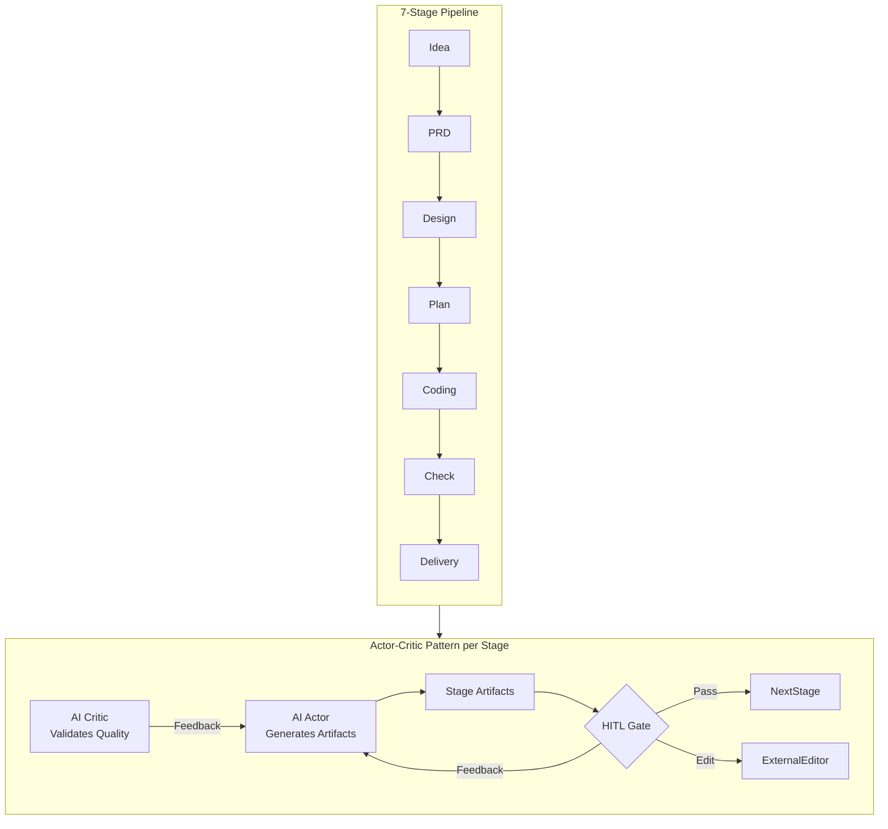
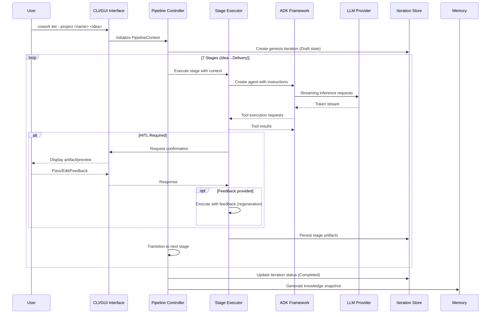
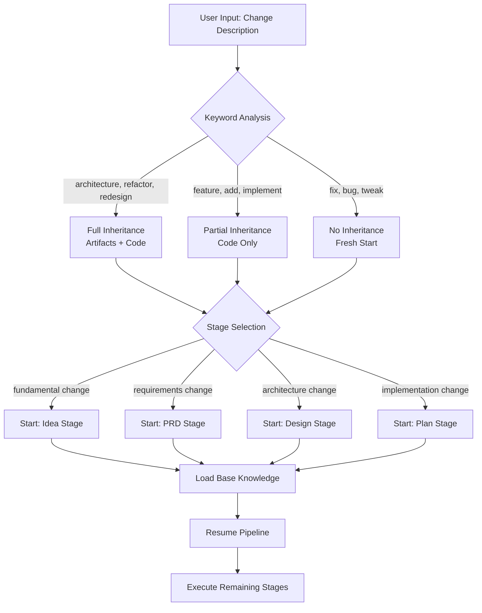
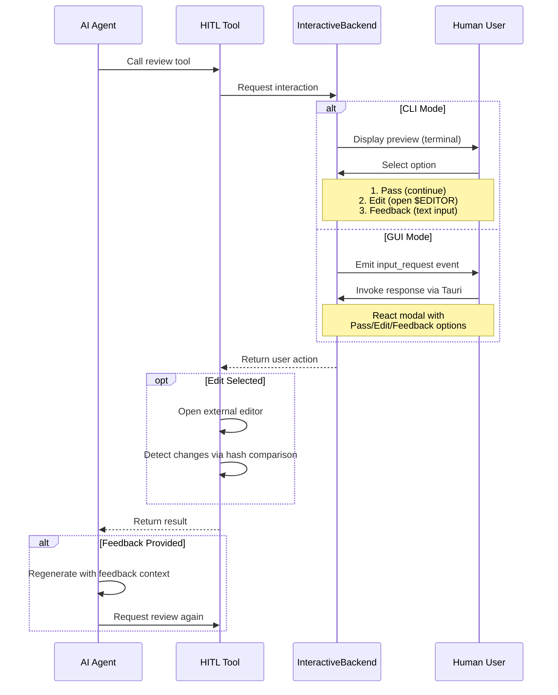
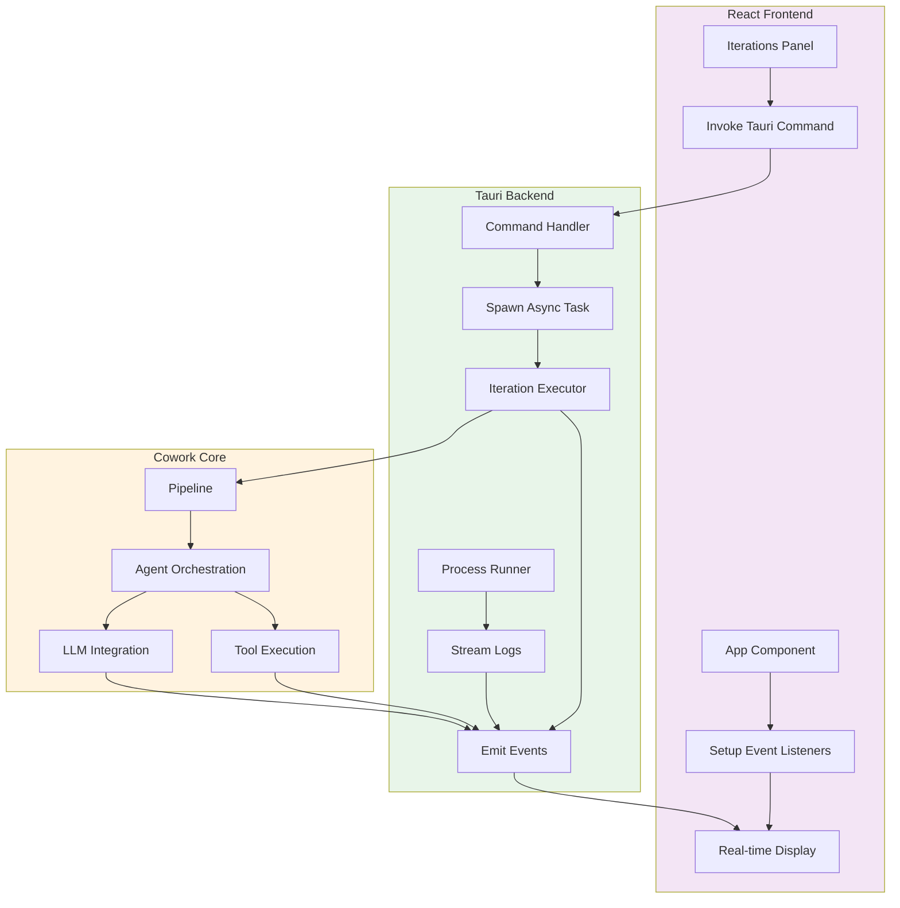
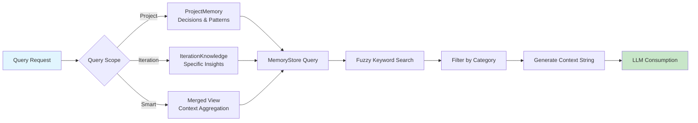
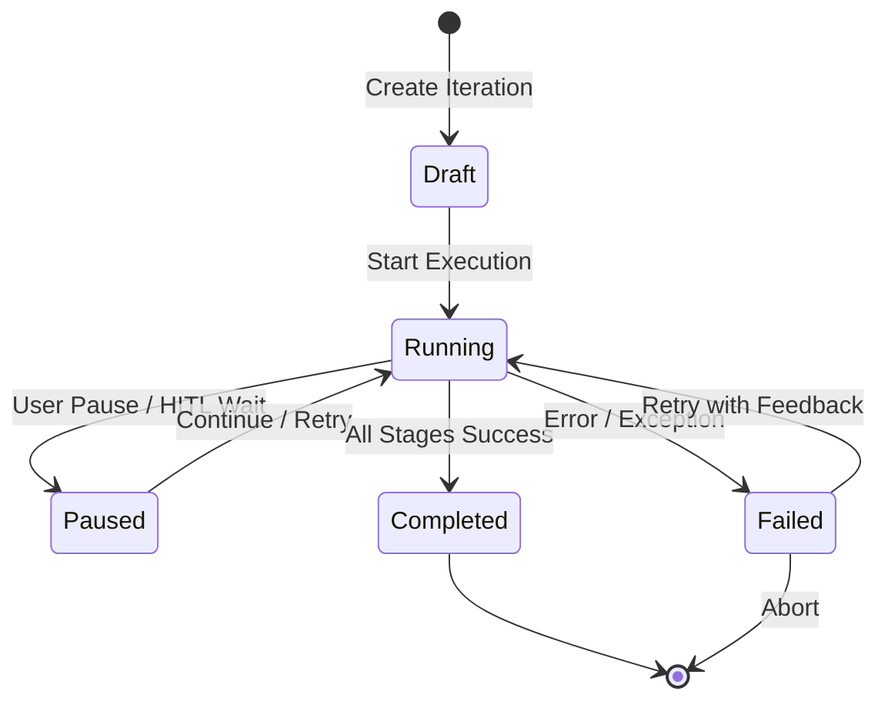
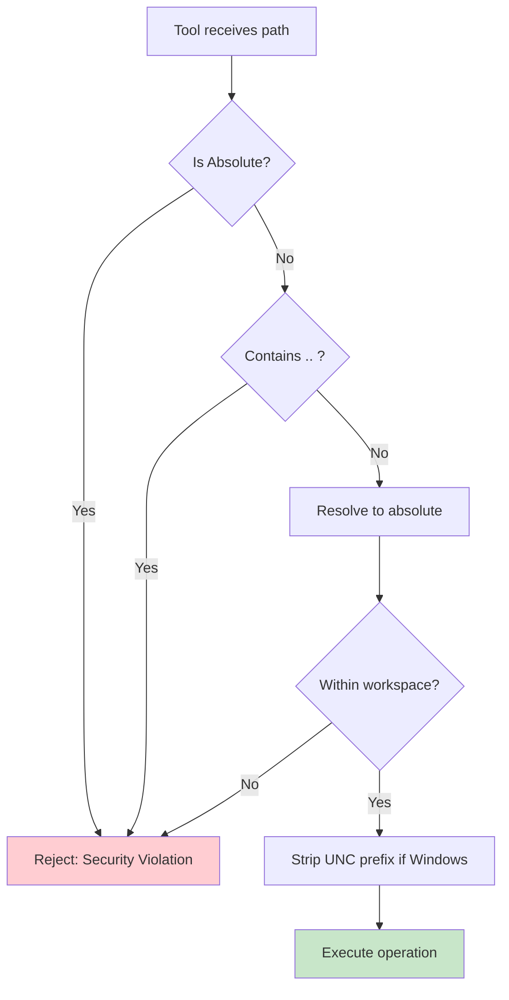

Based on the comprehensive research materials provided, I have analyzed the Cowork Forge system architecture, domain modules, and implementation details. Here is the complete Core Workflows documentation:

---

# Core Workflows

**Document Version**: 1.0  
**System**: Cowork Forge - AI-Powered Iterative Software Development Platform  
**Generation Time**: 2026-02-14 05:11:46 (UTC)

## 1. Workflow Overview

### 1.1 System Architecture Context

Cowork Forge implements a **domain-driven, event-driven architecture** centered around a 7-stage AI agent pipeline. The system operates as a multi-crate Rust workspace with three primary distribution channels: a CLI tool for automation-focused users, a Tauri-based desktop GUI for interactive development, and a core domain library containing the business logic.

### 1.2 Core Execution Paradigm

The system follows an **Actor-Critic Pattern with Human-in-the-Loop (HITL) Gates**:



### 1.3 Key Process Nodes

| Node | Responsibility | Criticality |
|------|---------------|-------------|
| **Pipeline Controller** | Orchestrates stage execution, manages context state, handles transitions | Critical |
| **Stage Executor** | Bridges pipeline with ADK framework, manages agent lifecycle and streaming | Critical |
| **Interactive Backend** | Abstraction for HITL interactions (CLI vs GUI implementations) | High |
| **Memory Store** | Persistence layer for project knowledge and iteration history | High |
| **Tool Registry** | 30+ ADK tools for file operations, validation, and data management | Medium |
| **Rate-Limited LLM** | Decorator ensuring API compliance (30 req/min, concurrency=1) | Medium |

### 1.4 Process Coordination Mechanisms

- **Async/Await Concurrency**: Tokio runtime manages concurrent pipeline execution and I/O
- **Event-Driven GUI**: Tauri AppHandle emits real-time events (agent_event, tool_call, progress)
- **State Isolation**: Each iteration maintains isolated workspace under `.cowork-v2/iterations/{id}/`
- **Memory Aggregation**: Three-scope query system (Project-level, Iteration-level, Smart Merged)

## 2. Main Workflows

### 2.1 Genesis Iteration Creation Flow

**Business Value**: Transforms natural language ideas into complete software projects through structured AI-driven development, establishing baseline project memory for future evolution.

**Execution Path**:



**Key Technical Details**:

1. **Stage Initialization**: Each stage implements the `Stage` trait with `execute()` and `execute_with_feedback()` methods
2. **Artifact Persistence**: Stage outputs saved as markdown files (idea.md, prd.md, design.md, plan.md) in iteration workspace
3. **Actor-Critic Implementation**: 
   - Actor instructions (~200 lines each) define workflow steps and tool schemas
   - Critic instructions enforce quality gates (anti-loop protection, simplicity validation)
4. **Confirmation Gates**: Critical stages (Idea, PRD, Design, Plan, Coding) return `needs_confirmation() = true`

### 2.2 Evolution Iteration Flow

**Business Value**: Enables incremental development and refactoring by leveraging historical context while supporting three inheritance strategies.

**Change Scope Analysis Algorithm**:



**Inheritance Mode Matrix**:

| Mode | Artifact Transfer | Code Transfer | Use Case |
|------|------------------|---------------|----------|
| **None** | ❌ | ❌ | Fresh start, experimental changes |
| **Partial** | ❌ | ✅ | Incremental features, bug fixes |
| **Full** | ✅ | ✅ | Major refactoring, architecture changes |

**Process Details**:
1. **NLP Analysis**: `analyze_change_scope()` in `iteration.rs` uses keyword matching to determine optimal starting stage
2. **Knowledge Loading**: `LoadBaseKnowledgeTool` retrieves historical decisions, patterns, and known issues from previous iterations
3. **Workspace Preparation**: Inheritance modes determine which files are copied from base iteration workspace to new iteration workspace

### 2.3 Human-in-the-Loop (HITL) Validation Flow

**Business Value**: Ensures human oversight at critical decision points while supporting iterative refinement through feedback loops.



**Implementation Mechanics**:
- **CLI Backend**: Uses `dialoguer` crate for interactive prompts, supports opening system default editor via `edit` crate
- **GUI Backend**: Implements async request/response pattern using `tokio::sync::oneshot` channels with 3000s timeout
- **Content Review**: `ReviewAndEditContentTool` handles markdown content (15-line preview limit)
- **File Review**: `ReviewAndEditFileTool` handles file modifications (10-line preview, external editor integration)

### 2.4 GUI Real-Time Execution & Monitoring Flow

**Business Value**: Provides transparent visibility into AI agent execution with real-time log streaming and development server management.



**Event Types**:
- `agent_event`: Agent messages and thinking process
- `agent_streaming`: Token-by-token LLM output
- `tool_call`: Tool invocation with parameters
- `tool_result`: Tool execution results
- `progress`: Stage completion percentages
- `input_request`: HITL confirmation requests
- `project_log`: External process stdout/stderr

**Process Runner Architecture**:
- **Cross-platform**: Windows (`cmd /C`) vs Unix (`sh -c`) command execution
- **Process Registry**: `Arc<Mutex<HashMap>>` tracks active processes by iteration_id
- **Stream Processing**: Separate Tokio tasks read stdout/stderr asynchronously
- **Safety**: `is_blocking_service_command()` prevents execution of hanging commands (npm dev, http.server)

### 2.5 Memory Query and Knowledge Retrieval Flow

**Business Value**: Maintains project continuity across iterations by preserving architectural decisions, design patterns, and technical insights.



**Query Dimensions**:
1. **Scope**: `project` (historical), `iteration` (current), `latest` (merged)
2. **Category**: `decisions`, `patterns`, `insights`, `issues`
3. **Stage**: Filter by pipeline stage (idea, prd, design, etc.)
4. **Keywords**: Fuzzy search on titles and content

**Knowledge Promotion Workflow**:
- **Insight Capture**: `SaveInsightTool` captures observations during execution
- **Decision Promotion**: `PromoteToDecisionTool` elevates insights to project-level architectural decisions
- **Pattern Extraction**: `PromoteToPatternTool` creates reusable pattern library entries
- **Snapshot Generation**: Post-delivery, `SaveKnowledgeSnapshotTool` compresses iteration data into `IterationKnowledge`

## 3. Flow Coordination and Control

### 3.1 State Management Architecture

**Pipeline State Machine**:



**Context Propagation**:
- `PipelineContext` carries execution state across stages containing:
  - Current iteration ID and metadata
  - Stage sequence and completion tracking
  - Inheritance mode and base knowledge references
  - User feedback accumulation
- **Immutable Updates**: Each stage receives cloned context, outputs new context with updated artifacts

### 3.2 Multi-Module Coordination

**Dependency Injection Pattern**:
```rust
// Pipeline orchestrates through trait abstractions
pub struct Pipeline {
    stages: Vec<Box<dyn Stage>>,
    backend: Arc<dyn InteractiveBackend>,
    store: Arc<IterationStore>,
}
```

**Concurrency Control**:
- **Single Iteration Execution**: Global semaphore in `RateLimitedLlm` ensures one active LLM request at a time
- **GUI State Sharing**: `AppState` wrapped in `Arc<Mutex<>>` for thread-safe access across Tauri commands
- **Process Isolation**: Each iteration's dev server runs in isolated subprocess with dedicated I/O streams

### 3.3 Data Flow Architecture

**Artifact Flow**:
1. **Generation**: AI Actor creates content via LLM inference
2. **Validation**: AI Critic checks quality standards
3. **Review**: HITL gate presents to user via InteractiveBackend
4. **Persistence**: Saved to `workspace/artifacts/{stage}.md`
5. **Propagation**: Loaded by subsequent stages via `LoadDocumentSummaryTool`

**Memory Flow**:
1. **Capture**: Agent tools (`SaveInsightTool`, `SaveIssueTool`) collect knowledge
2. **Aggregation**: `MemoryStore` indexes by tags and categories
3. **Query**: `QueryMemoryTool` retrieves relevant context
4. **Injection**: Context strings prepended to agent prompts for continuity

## 4. Exception Handling and Recovery

### 4.1 Error Classification Hierarchy

| Level | Type | Handling Strategy |
|-------|------|-------------------|
| **Infrastructure** | LLM API failures, network timeouts | Exponential backoff, rate limit respect, user notification |
| **Domain** | Invalid state transitions, constraint violations | Validation at entry points, early failure with context |
| **Tool** | File I/O errors, command execution failures | Path validation, sandbox enforcement, detailed error messages |
| **Pipeline** | Stage execution failures, agent errors | Pause iteration, allow retry with feedback, preserve partial artifacts |

### 4.2 Recovery Mechanisms

**Iteration State Recovery**:
- **Orphaned State Detection**: On project load, automatically reset `Running` iterations to `Paused` (handles crashes)
- **Partial Artifact Recovery**: Stage completion tracked separately; can resume from any completed stage
- **Workspace Integrity**: Atomic file operations with validation before overwriting

**HITL Timeout Handling**:
- **GUI Mode**: 3000-second timeout on oneshot channels; auto-fail iteration if user unresponsive
- **CLI Mode**: Blocking wait with `ctrl+c` handling for graceful interruption

**Tool Execution Safety**:
- **Path Validation**: `validate_path_security_within_workspace()` prevents directory traversal (`..` rejection, absolute path rejection)
- **Command Blocking**: Detection of long-running service commands (npm dev, vite) to prevent agent hangs
- **File Extension Filtering**: Deployment tool uses whitelist approach (`.html`, `.js`, `.css`, etc.) preventing sensitive file exposure

### 4.3 Fault Tolerance Strategies

**Graceful Degradation**:
- **LLM Unavailable**: Pipeline pauses with clear error message; user can retry
- **Editor Unavailable**: HITL falls back to text input mode if external editor launch fails
- **Process Crash**: `project_runner` emits `project_stopped` event; GUI updates UI state

**Retry Logic**:
- **Transient Failures**: LLM rate limiting (429 errors) trigger automatic retry with delay
- **Validation Failures**: Actor-Critic loop allows up to 3 automatic regeneration attempts before human intervention required

## 5. Key Process Implementation

### 5.1 Stage Execution Algorithm

```rust
// Pseudocode representation of stage execution logic
async fn execute_stage(
    &self,
    context: PipelineContext,
    backend: Arc<dyn InteractiveBackend>
) -> StageResult {
    // 1. Load stage-specific instructions (Actor + Critic)
    let actor_prompt = self.get_actor_instruction();
    let critic_prompt = self.get_critic_instruction();
    
    // 2. Create ADK agent with tool registry
    let agent = AgentBuilder::new()
        .with_llm(create_llm_client())
        .with_tools(get_stage_tools())
        .with_instruction(actor_prompt)
        .build();
    
    // 3. Execute with streaming output
    let mut stream = agent.execute(context.to_prompt()).await;
    while let Some(chunk) = stream.next().await {
        backend.show_message(chunk.content).await;
        
        // Handle tool calls
        if let Some(tool_call) = chunk.tool_call {
            backend.show_tool_call(&tool_call).await;
            let result = execute_tool(tool_call).await;
            backend.show_tool_result(&result).await;
            agent.submit_tool_result(result).await;
        }
    }
    
    // 4. Critic validation
    if let Some(critic_result) = validate_with_critic(&agent.output).await {
        if !critic_result.approved {
            return StageResult::Revision(critic_result.feedback);
        }
    }
    
    // 5. HITL confirmation (if required)
    if self.needs_confirmation() {
        match backend.request_confirmation(&agent.output).await {
            UserAction::Pass => StageResult::Success(agent.output),
            UserAction::Edit => {
                let edited = open_editor(&agent.output).await;
                StageResult::Success(edited)
            }
            UserAction::Feedback(fb) => StageResult::Revision(fb),
        }
    } else {
        StageResult::Success(agent.output)
    }
}
```

### 5.2 Knowledge Extraction Pipeline

**Post-Delivery Processing**:
1. **Document Analysis**: Parse idea.md, prd.md, design.md, plan.md for key themes
2. **Tech Stack Detection**: Analyze configuration files (package.json, Cargo.toml, requirements.txt)
3. **Code Structure Mapping**: Directory traversal with depth limiting (max 10 levels)
4. **Decision Extraction**: Identify architectural choices with rationale and consequences
5. **Pattern Recognition**: Extract reusable solutions with usage examples
6. **Issue Documentation**: Capture known problems and technical debt

**Storage Format**:
```json
{
  "iteration_id": "uuid",
  "timestamp": "ISO 8601",
  "summary": "300-500 word narrative",
  "tech_stack": ["React", "Rust", "TypeScript"],
  "decisions": [{"title": "", "rationale": "", "consequences": []}],
  "patterns": [{"name": "", "tags": [], "usage": ""}],
  "known_issues": [{"description": "", "severity": "high|medium|low"}]
}
```

### 5.3 File System Security Model

**Validation Pipeline**:


**Protected Paths** (Deployment Phase):
- Version control: `.git`, `.gitignore`, `.gitattributes`
- IDE config: `.vscode`, `.idea`
- Build artifacts: `target`, `node_modules`, `dist`, `build`
- System files: `.cowork-v2`, `Cargo.lock` (optional)
- Documentation: `README.md`, `LICENSE`, `CHANGELOG.md`

### 5.4 Performance Optimization Strategies

**LLM Rate Limiting**:
- **Global Semaphore**: `tokio::sync::Semaphore(1)` ensures single concurrent request
- **Request Spacing**: 2-second delay between requests enforces 30 req/min policy
- **Token Streaming**: Real-time token emission prevents UI blocking during long generations

**File I/O Optimization**:
- **Truncated Reading**: `ReadFileTruncatedTool` limits large files (>10KB) to prevent context overflow
- **Virtualized Rendering**: GUI file tree uses `react-window` for handling directories with 1000+ files
- **Chunked Loading**: Large files loaded in 10KB chunks with offset/limit pagination

**Memory Management**:
- **Lazy Loading**: Memory index loaded on first query, cached for subsequent requests
- **Context Pruning**: LLM prompts include only top-N relevant memories (configurable limit)
- **Workspace Cleanup**: Automatic removal of orphaned files during deployment phase

---

**End of Core Workflows Documentation**