# Core Workflows

## 1. Workflow Overview

### 1.1 System Positioning and Core Value

Cowork Forge is an AI-driven software development automation platform built on the **ADK (Agent Development Kit)** framework. The system employs an **Actor-Critic Multi-Agent Collaboration Architecture**, covering the complete software development lifecycle (SDLC) from project idea conceptualization to final delivery. Through human-in-the-loop (HITL) mode, it introduces manual review at key quality nodes, ensuring AI-generated content complies with the **Simplicity-First** principle and avoids over-engineering.

### 1.2 Core Execution Paths

The system defines four core execution paths to meet different software project development scenarios:

| Workflow Type | Trigger Command | Core Features | Applicable Scenarios |
|---------------|----------------|---------------|---------------------|
| **Complete New Workflow** | `cowork new` | Seven-stage sequential execution, mandatory manual review nodes | New project development from scratch |
| **Incremental Modify Workflow** | `cowork modify` | Change impact analysis, incremental code patches, PR-like reports | Requirement changes and feature enhancements |
| **Checkpoint Recovery Workflow** | `cowork resume` | Artifact status detection, intelligent resumption, checkpoint recovery | Continuing after interruption |
| **Version Rollback Workflow** | `cowork revert` | State snapshot rollback, stage-level re-execution | Re-planning after design flaws or requirement changes |

### 1.3 Key Process Node Architecture

All workflows share a unified layered execution architecture:


### 1.4 Workflow Coordination Mechanisms

The system adopts the following coordination mechanisms to ensure consistency and reliability of multi-agent collaboration:

1. **Session Isolation Mechanism**: Each workflow instance corresponds to an independent Session, identified by UUID, ensuring data isolation during multi-project parallel development
2. **Stage Isolation Execution**: `StageExecutor` isolates escalate flags of each stage, preventing LoopAgent's exit signals from affecting the overall workflow
3. **State Persistence**: File system-based JSON persistence, supporting checkpoint recovery and state rollback
4. **Anti-Loop Protection**: Critic agents track feedback history, detect repeated issues, and escalate to manual review
5. **Rate Limiting**: LLM calls implement 2-second delay (<30 times/minute) through decorator pattern to ensure API compliance

## 2. Main Workflows Detailed

### 2.1 Complete Project Creation Workflow

**Business Value**: Achieves end-to-end automated conversion from natural language project ideas to deliverable software code, ensuring architectural simplicity and implementation completeness through seven-stage progressive development.

**Execution Flow**:


**Key Execution Details**:

1. **PRD Stage Constraints**:
   - Actor must generate PRD draft containing 3-6 core requirements and 2-4 core features
   - Mandatory rejection of non-core requirements (performance optimization, test infrastructure, CI/CD, monitoring)
   - Human review implemented through `review_with_feedback_content` tool, supporting edit/pass/feedback three operations

2. **Design Stage Constraints**:
   - Component count strictly limited to 2-4
   - Mandatory use of simplest technology stack (recommend SQLite/JSON rather than complex databases)
   - Recommend monolithic architecture, prohibit microservices, caching layers, message queues (unless absolutely necessary)

3. **Coding Stage Characteristics**:
   - Unlike the multi-iteration of the first three stages, Coding Actor completes all pending tasks in a single round
   - Code generation follows existing project patterns, context-aware through `list_files` and `read_file` tools
   - Prohibit automatic generation of test code (unless explicitly required by PRD)

### 2.2 Incremental Modification Workflow

**Business Value**: Supports safe changes to delivered projects, achieving requirement evolution through change impact analysis and incremental patches while maintaining change traceability.

**Execution Flow**:


**Key Technical Mechanisms**:

1. **File Fingerprint Calculation**: Calculate project file hashes before modification, used for subsequent change tracking and conflict detection
2. **State Inheritance**: Implement session state inheritance through `init_session_from_base`, copying historical artifacts as context
3. **Change Scope Identification**: Triage Agent analyzes whether changes affect requirements layer (PRD), architecture layer (Design), planning layer (Plan), or only code layer (Code), guiding subsequent execution paths

### 2.3 Checkpoint Recovery Workflow

**Business Value**: Ensures long-running AI development processes have fault tolerance, supporting resumption from any interruption point, avoiding repeated computation.

**Execution Flow**:


**State Recovery Strategy**:

The system constructs a **stage completion matrix** by detecting file existence in the `.cowork/sessions/<id>/artifacts/` and `.cowork/sessions/<id>/state/` directories. The `create_resume_pipeline` function dynamically builds the execution pipeline based on this matrix, ensuring:

- Completed stages (artifacts exist and are valid) are skipped
- Incomplete or partially completed stages are re-executed
- Dependency relationships remain coherent (e.g., when restarting Coding stage, ensure Plan data is loaded)

### 2.4 Version Rollback Workflow

**Business Value**: When fundamental flaws appear in architecture design or directional requirement changes occur, allows restarting from a specific stage, preserving valuable early analysis results.

**Execution Flow**:


## 3. Workflow Coordination and Control

### 3.1 Pipeline Orchestration Mechanism

The system adopts **StageExecutor** to achieve precise workflow control, ensuring consistency and reliability of multi-stage sequential execution:

```mermaid
sequenceDiagram
    participant CLI as CLI Entry
    participant PF as Pipeline Factory
    participant SE as StageExecutor
    participant Agent as AI Agent
    participant Store as Storage Layer

    CLI->>PF: Create workflow pipeline<br/>create_cowork_pipeline()
    PF->>PF: Instantiate stage agents<br/>Idea→PRD→Design→Plan→Coding→Check→Delivery
    
    PF->>SE: Register sub-agent list
    loop Stage Execution
        SE->>SE: Isolate escalate flag<br/>Prevent loop exit signal propagation
        SE->>Agent: Execute current stage<br/>execute()
        Agent->>Store: Read/write session state
        Agent-->>SE: Return execution result<br/>Content/FunctionCall
        SE->>SE: Check exit signal<br/>ExitLoopTool handling
    end
    
    SE-->>CLI: Report execution completion status
```



**StageExecutor Core Responsibilities**:

1. **Stage Isolation**: Each stage has independent escalate flag context, ensuring LoopAgent's internal loop exit won't terminate the entire workflow
2. **Streaming Output**: Implements `Agent` trait, supports asynchronous streaming of LLM-generated content, real-time feedback to user
3. **State Verification**: At stage transitions, verifies existence of prerequisite stage artifacts, ensuring data continuity

### 3.2 State Management and Data Flow

The system adopts **session isolation + file system persistence** architecture to manage state:


**Data Flow Control Principles**:

1. **Forward Dependency**: Each stage can only read data from current and previous stages, prohibiting reverse dependency
2. **Immutable Artifacts**: Once a stage is marked as complete, its generated markdown artifacts (idea.md, prd.md, etc.) are read-only in principle, modifications require incremental modification workflow
3. **Automatic State Update**: `auto_update_feature_status` mechanism automatically cascades feature status updates when task status changes

### 3.3 Human-in-the-Loop (HITL) Coordination Mechanism

The system forces human review at key quality nodes, implementing seamless collaboration through tool chains:


**HITL Decision Matrix**:

| Stage | Review Tool | Edit Capability | Feedback Handling | Loop Limit |
|-------|-------------|-----------------|-------------------|------------|
| Idea | ReviewAndEditContentTool | Yes | Resave | No limit |
| PRD | ReviewWithFeedbackContentTool | Yes | Record to feedback_history | 3-5 times |
| Design | ReviewWithFeedbackContentTool | Yes | Record to feedback_history | 3-5 times |
| Plan | ReviewWithFeedbackContentTool | Yes | Record to feedback_history | 3-5 times |
| Coding | None (automatic flow) | No | Critic direct feedback | 3 times |

## 4. Exception Handling and Recovery

### 4.1 Resilient Error Recovery Architecture

The system achieves robust error handling through the **ResilientAgent** wrapper, ensuring when AI execution exceptions occur, it doesn't fail immediately but provides graded recovery strategies:


**Exception Classification and Handling Strategies**:

| Exception Type | Detection Method | Automatic Retry | Human Intervention | Recovery Mechanism |
|---------------|-----------------|----------------|-------------------|-------------------|
| **Max Iterations** | ADK framework throws | 3 times | Mandatory | User guidance then retry |
| **LLM API Error** | HTTP status code | 3 times | Optional | Delayed retry |
| **Tool Execution Failure** | ToolResult error code | 0 times | Mandatory | Fix then retry |
| **Loop Detection** | Critic feedback history analysis | N/A | Mandatory | RequestHumanReviewTool |

### 4.2 Anti-Loop Protection Mechanism

To prevent Actor-Critic loops from falling into infinite iterations, the system implements protection at multiple levels:


**Critic Decision Rules**:

1. **First Iteration**: Actor generates draft → Critic comprehensive check → Provides specific feedback
2. **Second Iteration**: Actor modifies → Critic compares with feedback history → If unresolved issue found, elevates warning level
3. **Third Iteration**: If issue persists, Critic calls `request_human_review` tool, outputs boxed warning (⚠️ 🚨) on console, and returns Agent Error to suspend execution

### 4.3 Failover and Degradation Strategies

Degradation behavior when key services are unavailable:

| Failure Scenario | Impact Scope | Degradation Strategy | User Experience |
|------------------|--------------|---------------------|-----------------|
| LLM API Timeout | Current stage | Exponential backoff retry (1s, 2s, 4s) | Display waiting prompt |
| LLM API Completely Unavailable | Entire workflow | Save current state, prompt user to check configuration | Graceful exit, state retained |
| File System Permission Error | Specific tool call | Skip operation, record warning | Continue execution, remind afterwards |
| User Interruption (Ctrl+C) | Current execution | Save session status to InProgress | Resume possible |
| Disk Space Insufficient | Persistence operation | Pause new file writes, clean logs | Prompt to clear space |

## 5. Key Process Implementation

### 5.1 Actor-Critic Dual-Agent Mode

The system adopts **Actor-Critic** architecture in PRD, Design, Plan, and Coding stages, achieving generation and verification decoupling:

**Architecture Pattern**:


**Actor and Critic Responsibility Division**:

| Dimension | Actor Responsibilities | Critic Responsibilities |
|-----------|----------------------|--------------------------|
| **Core Task** | Create PRD/design documents/task lists/code | Verify simplicity, completeness, consistency |
| **Tool Usage** | create_*, save_*, write_file | get_*, check_*, provide_feedback |
| **Exit Condition** | No direct exit | Verify pass then call exit_loop() |
| **Human Interaction** | Respond to feedback, execute modification | Trigger human upgrade (loop protection) |
| **Constraint Enforcement** | Follow simplicity principles when coding | Force rejection of over-engineering design |

### 5.2 Tool System Integration Architecture

Tool system follows **ADK Tool Standard Interface**, achieving modular extension of agent capabilities:


**Key Tool Implementation Details**:

1. **File Operation Security**:
   - All paths verified through `validate_path_security`, prohibiting `../`, absolute paths, access outside project root directory
   - `RunCommandTool` implements 30-second timeout, intercepting blocking service commands (`npm start`, `python server.py`)

2. **Data Operation Atomicity**:
   - `CreateTaskTool` automatically handles dependencies, preventing cyclic dependencies (via DFS detection)
   - `UpdateTaskStatusTool` automatically cascades updates to associated Feature status

3. **HITL Tool Integration**:
   - `ReviewWithFeedbackContentTool` uses `dialoguer` crate to implement cross-platform CLI interaction
   - Supports `$EDITOR` environment variable to call user's preferred editor

### 5.3 LLM Service Abstraction and Rate Control

The system achieves decoupling from specific LLM providers through layered abstraction:


**Rate Limiting Strategy**:

```rust
// Pseudo code example
pub struct RateLimitedLlm {
    inner: Arc<dyn Llm>,
    delay_ms: u64,  // Default 2000ms
}

impl Llm for RateLimitedLlm {
    async fn generate_content(&self, request: Request) -> Result<Response> {
        // Mandatory delay before each call
        tokio::time::sleep(Duration::from_millis(self.delay_ms)).await;
        self.inner.generate_content(request).await
    }
}
```

**Performance Characteristics**:
- **Delay**: Fixed 2-second delay ensures <30 times/minute API limit compliance
- **Concurrency**: Multiple LLM client sharing across agents through `Arc<dyn Llm>`
- **Fault Tolerance**: Network errors propagated via anyhow context, handled by ResilientAgent retry

### 5.4 Concurrency Processing and Resource Management

Although the system primarily uses sequential execution, it implements concurrency optimization in the following scenarios:

1. **File Fingerprint Calculation** (Modify workflow):
   - Uses asynchronous file I/O to calculate project file hashes in parallel
   - Ignore pattern matching (`.gitignore` rules) reduces invalid calculations

2. **Agent Initialization**:
   - Parallel initialization of stage agents during pipeline construction
   - Tool sets shared between agents (through `Arc`), avoiding duplicate instantiation

3. **Streaming Output Processing**:
   - LLM-generated content returned asynchronously via `futures::Stream`
   - Terminal real-time rendering and subsequent processing logic execute in parallel

**Resource Limitation Strategies**:

| Resource Type | Limitation Strategy | Implementation Mechanism |
|---------------|---------------------|-------------------------|
| **LLM API Calls** | Rate limiting | 2-second delay decorator |
| **Shell Commands** | Timeout control | 30-second hard timeout |
| **File Handles** | Scope limitation | Rust RAII + explicit close |
| **Session Storage** | Space management | Automatic cleanup of Failed status temporary files |
| **Memory Usage** | Streaming processing | Chunked reading of large files, avoiding one-time load |

---

**Document Generation Time**: 2026-01-31 05:56:42 (UTC)
**Version**: Based on Cowork Forge Architecture Design v1.0