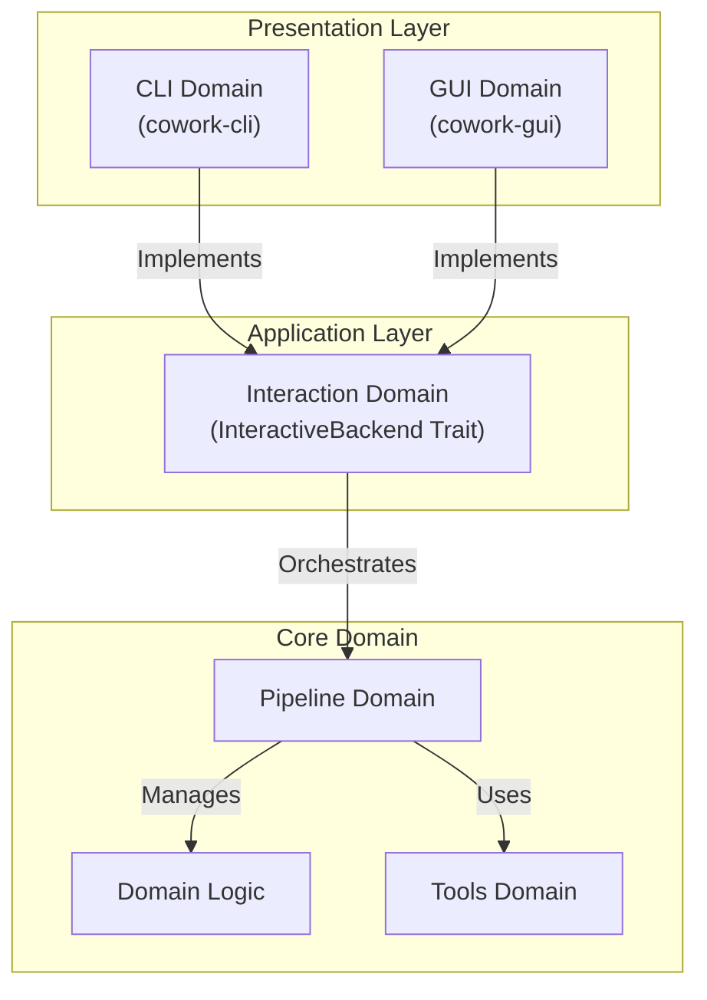
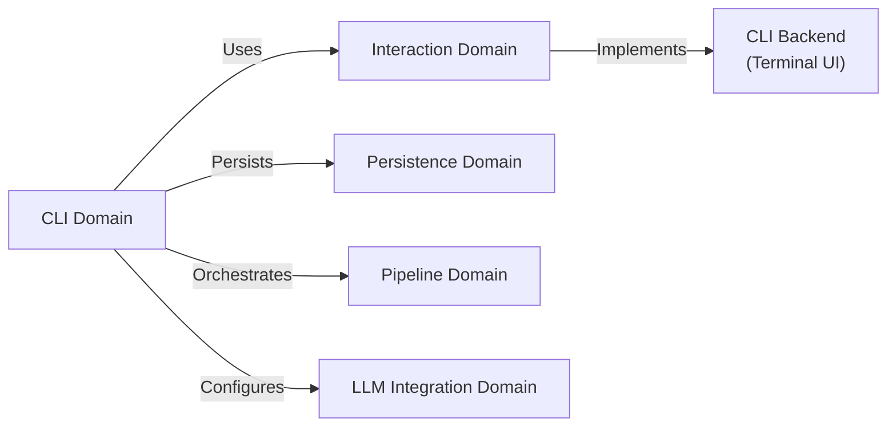
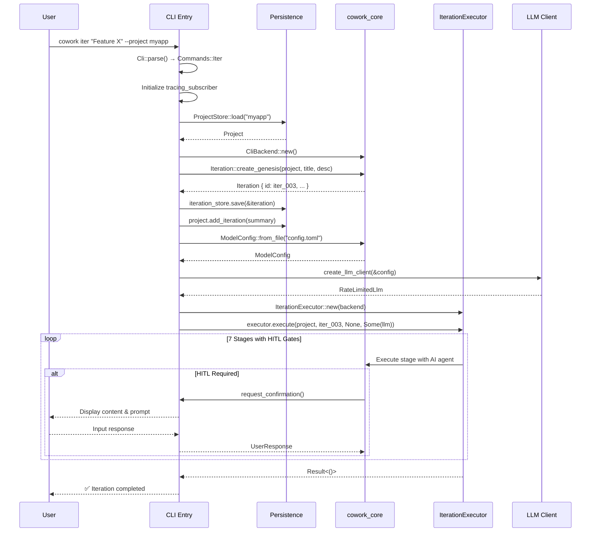
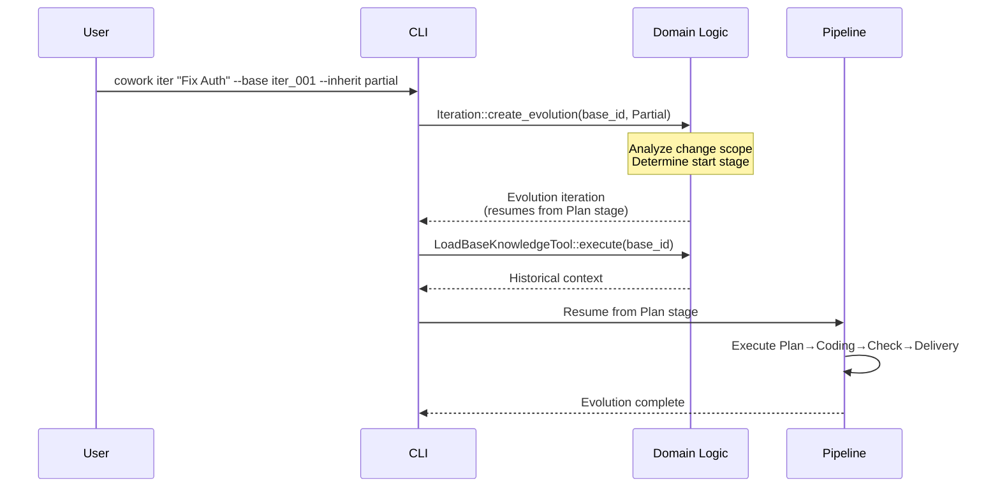

**CLI Domain Technical Documentation**
**Cowork Forge** | **Version 1.0** | **Generated: 2024**

---

## 1. Overview

The **CLI Domain** serves as the command-line interface entry point for Cowork Forge, providing an automation-focused interaction model for the AI-powered iterative software development platform. Implemented as a Rust-based terminal application, this domain enables developers to orchestrate the complete 7-stage development pipeline (Idea → PRD → Design → Plan → Coding → Check → Delivery) through declarative shell commands.

### 1.1 Purpose & Business Value

The CLI Domain addresses the needs of automation-focused developers and technical leads who prefer terminal-based workflows, CI/CD integration, or scriptable development operations. It provides:

- **Batch Operations**: Non-interactive iteration execution for automated pipelines
- **Rapid Prototyping**: Quick project initialization and iteration creation via single commands
- **Remote Development**: SSH-compatible interface for headless server environments
- **Workflow Scripting**: Composable commands for complex development automation scenarios

### 1.2 Architectural Position

Within the Hexagonal Architecture of Cowork Forge, the CLI Domain resides in the **Presentation Layer**, implementing the `InteractiveBackend` trait defined in the Interaction Domain. This design ensures the core domain logic remains interface-agnostic while the CLI provides terminal-specific adapters for user interaction.



---

## 2. Technical Architecture

### 2.1 Technology Stack

| Component | Technology | Purpose |
|-----------|-----------|---------|
| **Language** | Rust (Edition 2021) | Type-safe systems programming with async support |
| **CLI Framework** | clap v4.x | Derive-based argument parsing with subcommand routing |
| **Async Runtime** | tokio | Asynchronous iteration execution and I/O |
| **Error Handling** | anyhow | Structured error propagation with context |
| **Logging** | tracing + tracing_subscriber | Structured logging with configurable verbosity |
| **Terminal UI** | dialoguer | Interactive prompts and confirmation dialogs |
| **Formatting** | ansi_term / owo-colors | Color-coded terminal output |

### 2.2 Module Structure

```
crates/cowork-cli/
├── src/
│   └── main.rs          # CLI entry point, command routing, and orchestration
├── Cargo.toml           # Dependencies: clap, tokio, anyhow, tracing, cowork-core
└── README.md
```

**Key Dependencies:**
- `cowork-core`: Domain logic, pipeline execution, and persistence
- `clap`: Command-line argument parsing with derive macros
- `tokio`: Async runtime for non-blocking LLM API calls and file operations

---

## 3. Command Interface Specification

The CLI exposes eight primary commands through the `cowork` binary, supporting both global flags and subcommand-specific options.

### 3.1 Global Arguments

| Flag | Short | Description | Default |
|------|-------|-------------|---------|
| `--config` | `-c` | Path to custom configuration file (TOML) | `./config.toml` |
| `--verbose` | `-v` | Enable debug-level logging | `false` |
| `--project` | `-p` | Target project name (optional context) | Current directory |

### 3.2 Command Reference

#### 3.2.1 `iter` — Create and Execute Iteration

Creates a new iteration (genesis or evolution) and immediately executes the pipeline.

**Syntax:**
```bash
cowork iter [OPTIONS] <TITLE> [DESCRIPTION]
```

**Options:**
| Option | Description |
|--------|-------------|
| `--base <ID>` | Base iteration ID for evolution (creates evolution iteration if specified) |
| `--inherit <MODE>` | Inheritance mode: `none`, `partial`, or `full` (default: `none`) |
| `--stage <STAGE>` | Starting stage for evolution iterations (idea, prd, design, plan) |

**Examples:**
```bash
# Genesis iteration
cowork iter "User Authentication" "Implement JWT-based auth system"

# Evolution iteration with partial inheritance (code only)
cowork iter "Add OAuth Support" "Extend auth with Google OAuth" \
    --base iter_001 --inherit partial

# Evolution with full inheritance (artifacts + code)
cowork iter "Refactor Database Layer" "Migrate to SQLx" \
    --base iter_002 --inherit full --stage design
```

#### 3.2.2 `list` — List Iterations

Displays all iterations in the current project with status indicators.

**Syntax:**
```bash
cowork list [OPTIONS]
```

**Options:**
| Option | Description |
|--------|-------------|
| `--all` | Include completed iterations in output |
| `--status <STATUS>` | Filter by status: `running`, `paused`, `completed`, `failed` |

**Output Format:**
```
ID          Title                Status      Stage       Created
iter_001    Initial Setup        Completed   Delivery    2024-01-15
iter_002    Add Auth             Running     Coding      2024-01-16
iter_003    Fix CSS              Paused      Check       2024-01-16
```

#### 3.2.3 `show` — Display Iteration Details

Renders detailed information about a specific iteration including stage artifacts and metadata.

**Syntax:**
```bash
cowork show <ITERATION_ID>
```

#### 3.2.4 `continue` — Resume Paused Iteration

Resumes execution of a previously paused iteration from its current stage.

**Syntax:**
```bash
cowork continue [ITERATION_ID]
```

*If `ITERATION_ID` is omitted, resumes the most recently paused iteration.*

#### 3.2.5 `init` — Initialize Project

Creates a new Cowork Forge project structure in the specified directory.

**Syntax:**
```bash
cowork init [PATH]
```

**Behavior:**
- Creates `.cowork-v2/` metadata directory
- Initializes project configuration
- Auto-detects technology stack (React, Vue, Rust, Python, etc.)

#### 3.2.6 `status` — Project Status

Displays aggregated project statistics including iteration counts, success rates, and current activity.

**Syntax:**
```bash
cowork status
```

#### 3.2.7 `delete` — Remove Iteration

Removes an iteration and its associated workspace data with interactive confirmation.

**Syntax:**
```bash
cowork delete <ITERATION_ID> [--force]
```

**Safety Features:**
- Requires explicit confirmation unless `--force` is specified
- Validates iteration is not currently running
- Archives artifacts before deletion (if configured)

#### 3.2.8 `regenerate-knowledge` — Update Knowledge Base

Regenerates the knowledge snapshot for a completed iteration, useful when manually editing iteration artifacts.

**Syntax:**
```bash
cowork regenerate-knowledge <ITERATION_ID>
```

---

## 4. Implementation Details

### 4.1 Entry Point and Command Routing

The CLI entry point (`main.rs`) implements a structured initialization sequence:

```rust
#[tokio::main]
async fn main() -> anyhow::Result<()> {
    // 1. Parse CLI arguments using clap derive macros
    let cli = Cli::parse();
    
    // 2. Initialize logging with configurable verbosity
    tracing_subscriber::fmt()
        .with_max_level(if cli.verbose { Level::DEBUG } else { Level::INFO })
        .init();
    
    // 3. Route to command handler
    match cli.command {
        Commands::Iter(args) => cmd_iter(args).await,
        Commands::List(args) => cmd_list(args).await,
        // ... additional commands
    }
}
```

**Command Enumeration Structure:**
```rust
#[derive(Subcommand)]
enum Commands {
    /// Create and execute a new iteration
    Iter(IterArgs),
    /// List all iterations
    List(ListArgs),
    /// Show iteration details
    Show(ShowArgs),
    /// Continue a paused iteration
    Continue(ContinueArgs),
    /// Initialize a new project
    Init(InitArgs),
    /// Show project status
    Status,
    /// Delete an iteration
    Delete(DeleteArgs),
    /// Regenerate knowledge for completed iteration
    RegenerateKnowledge(RegenerateArgs),
}
```

### 4.2 Backend Initialization and Dependency Injection

The CLI implements the `InteractiveBackend` trait to provide terminal-specific interaction capabilities:

```rust
async fn cmd_iter(args: IterArgs) -> anyhow::Result<()> {
    // 1. Initialize persistence stores
    let project_store = ProjectStore::new();
    let iteration_store = IterationStore::new();
    
    // 2. Load or create project
    let project = project_store.load(&args.project)
        .ok_or_else(|| anyhow!("Project not found. Run 'cowork init' first"))?;
    
    // 3. Create CLI backend (implements InteractiveBackend)
    let backend = Arc::new(CliBackend::new());
    
    // 4. Initialize LLM client with rate limiting
    let config = ModelConfig::from_file("config.toml")
        .or_else(|_| ModelConfig::from_env())?;
    let llm_client = create_llm_client(&config)?;
    
    // 5. Create iteration executor
    let executor = IterationExecutor::new(backend.clone());
    
    // 6. Create iteration (genesis or evolution)
    let iteration = if let Some(base_id) = args.base {
        Iteration::create_evolution(
            &project, 
            args.title, 
            args.description, 
            base_id, 
            args.inherit_mode
        )?
    } else {
        Iteration::create_genesis(&project, args.title, args.description)?
    };
    
    // 7. Execute pipeline
    executor.execute(project, iteration.id(), None, Some(llm_client)).await?;
    
    Ok(())
}
```

### 4.3 Terminal Output Formatting

The CLI employs ANSI color codes for semantic output classification:

| Color | Semantic Meaning | Usage Example |
|-------|-----------------|---------------|
| **Green** | Success/Completed | `✅ Iteration completed successfully` |
| **Yellow** | Warning/Running | `⚠️  Iteration running: Step 3/7` |
| **Cyan** | Information/Paused | `⏸️  Iteration paused at PRD stage` |
| **Red** | Error/Failed | `❌ Error: LLM API rate limit exceeded` |
| **Blue** | Headers/Metadata | Section titles in `show` command |

### 4.4 Configuration Management

The CLI supports dual configuration sources with precedence:

1. **File-based**: `config.toml` in project root or specified via `--config`
2. **Environment-based**: Environment variables for LLM credentials

**Configuration Resolution:**
```rust
impl ModelConfig {
    pub fn from_file(path: &str) -> Result<Self, ConfigError> {
        // Load from TOML
    }
    
    pub fn from_env() -> Result<Self, ConfigError> {
        // Load from OPENAI_API_KEY, OPENAI_BASE_URL, etc.
    }
}
```

---

## 5. Integration Architecture

### 5.1 Domain Dependencies

The CLI Domain maintains strict dependencies on core infrastructure:



**Dependency Details:**

| Dependency | Interface | Purpose |
|------------|-----------|---------|
| **Interaction Domain** | `InteractiveBackend` trait | HITL prompts, progress display, streaming output |
| **Persistence Domain** | `ProjectStore`, `IterationStore` | Project metadata and iteration workspace management |
| **Pipeline Domain** | `IterationExecutor` | 7-stage pipeline orchestration |
| **LLM Integration** | `ModelConfig`, `create_llm_client` | AI agent configuration and rate-limited API access |

### 5.2 Human-in-the-Loop (HITL) Implementation

For stages requiring human validation, the CLI implements the `InteractiveBackend` trait methods:

```rust
impl InteractiveBackend for CliBackend {
    async fn request_confirmation(&self, content: &str) -> anyhow::Result<UserResponse> {
        // Display content with syntax highlighting
        println!("{}", content);
        
        // Interactive prompt using dialoguer
        let options = vec!["Pass", "Edit", "Feedback"];
        let selection = Select::with_theme(&ColorfulTheme::default())
            .with_prompt("Action")
            .items(&options)
            .interact()?;
            
        match selection {
            0 => Ok(UserResponse::Pass),
            1 => Ok(UserResponse::Edit(self.open_editor(content).await?)),
            2 => Ok(UserResponse::Feedback(self.collect_feedback().await?)),
            _ => unreachable!(),
        }
    }
    
    async fn display_stream(&self, chunk: &str) -> anyhow::Result<()> {
        // Real-time streaming output for AI responses
        print!("{}", chunk);
        std::io::stdout().flush()?;
        Ok(())
    }
}
```

---

## 6. Execution Workflows

### 6.1 Genesis Iteration Flow



### 6.2 Evolution Iteration Flow



---

## 7. Error Handling and Resilience

### 7.1 Error Propagation Strategy

The CLI uses `anyhow` for ergonomic error handling with context propagation:

```rust
async fn cmd_delete(args: DeleteArgs) -> anyhow::Result<()> {
    let store = ProjectStore::new()
        .context("Failed to initialize project store")?;
        
    let iteration = store.load(&args.id)
        .with_context(|| format!("Iteration {} not found", args.id))?;
        
    if iteration.status() == IterationStatus::Running {
        return Err(anyhow!("Cannot delete running iteration. Pause first."));
    }
    
    if !args.force {
        let confirmed = Confirm::with_theme(&ColorfulTheme::default())
            .with_prompt("Delete iteration permanently?")
            .interact()?;
            
        if !confirmed {
            return Ok(()); // Graceful exit
        }
    }
    
    store.delete(&args.id)
        .context("Failed to delete iteration files")?;
        
    Ok(())
}
```

### 7.2 Common Error Scenarios

| Error Code | Scenario | User Message |
|------------|----------|--------------|
| `E001` | Project not initialized | `❌ Error: Run 'cowork init' first` |
| `E002` | Invalid base iteration | `❌ Error: Base iteration 'iter_999' not found` |
| `E003` | LLM configuration missing | `❌ Error: No LLM config found. Set OPENAI_API_KEY or create config.toml` |
| `E004` | Rate limit exceeded | `⚠️  Warning: Rate limit hit. Retrying in 2s...` |
| `E005` | Workspace permission denied | `❌ Error: Permission denied accessing .cowork-v2/` |

---

## 8. Configuration Schema

### 8.1 config.toml Structure

```toml
[llm]
provider = "openai"
api_key = "sk-..."
base_url = "https://api.openai.com/v1"
model = "gpt-4"
temperature = 0.7
max_tokens = 4096

[cli]
theme = "auto"  # auto, light, dark
confirm_destructive = true
editor = "vim"  # or $EDITOR
```

### 8.2 Environment Variables

| Variable | Purpose | Example |
|----------|---------|---------|
| `COWORK_CONFIG` | Override default config path | `/path/to/config.toml` |
| `OPENAI_API_KEY` | LLM authentication | `sk-abc123...` |
| `OPENAI_BASE_URL` | Custom LLM endpoint | `https://api.openai.com/v1` |
| `COWORK_EDITOR` | Preferred external editor | `code --wait` |

---

## 9. Performance Considerations

### 9.1 Async Execution Model

The CLI leverages Tokio's async runtime to handle concurrent operations:

- **LLM Streaming**: Non-blocking token streaming with real-time terminal output
- **File I/O**: Async file operations during artifact generation
- **Process Management**: Parallel external command execution during Check stage

### 9.2 Memory Management

- **Arc<CliBackend>**: Shared backend state across async tasks
- **Streaming Processing**: Constant memory usage for large AI responses via streaming
- **Workspace Isolation**: Each iteration maintains independent file handles

---

## 10. Security Considerations

### 10.1 Path Validation

All file operations validate workspace containment:

```rust
fn validate_workspace_path(path: &Path) -> anyhow::Result<()> {
    let canonical = path.canonicalize()?;
    let workspace = get_workspace_root()?.canonicalize()?;
    
    if !canonical.starts_with(&workspace) {
        return Err(anyhow!("Path {} escapes workspace", path.display()));
    }
    Ok(())
}
```

### 10.2 Sensitive Data Handling

- API keys loaded from environment or config file with `0600` permissions check
- No logging of LLM prompts containing potential secrets
- Secure temporary file cleanup on SIGINT/SIGTERM

---

## 11. Extension Points

### 11.1 Adding New Commands

To add a new subcommand:

1. Define args struct with `clap::Args` derive
2. Add variant to `Commands` enum
3. Implement handler function in `main.rs`
4. Register in command router match statement

```rust
#[derive(Args)]
struct ExportArgs {
    iteration_id: String,
    format: ExportFormat,
}

async fn cmd_export(args: ExportArgs) -> anyhow::Result<()> {
    // Implementation
}
```

### 11.2 Custom Backends

The `InteractiveBackend` trait allows for specialized CLI implementations (e.g., JSON output mode, silent mode):

```rust
struct JsonBackend;

impl InteractiveBackend for JsonBackend {
    async fn display_message(&self, msg: &str) -> anyhow::Result<()> {
        println!(r#"{{"type": "message", "content": "{}"}}"#, msg);
        Ok(())
    }
    // ... implement other methods
}
```

---

## 12. Troubleshooting Guide

| Issue | Diagnostic | Solution |
|-------|-----------|----------|
| `command not found: cowork` | Binary not in PATH | Run `cargo install --path crates/cowork-cli` |
| `Failed to initialize project store` | Permission denied on `.cowork-v2/` | Check directory permissions: `chmod 755 .cowork-v2` |
| `LLM client creation failed` | Missing API key | Set `OPENAI_API_KEY` environment variable |
| `Iteration execution hangs` | HITL waiting for input | Check if external editor opened in background |
| `Color codes not rendering` | Terminal lacks ANSI support | Use `--no-color` flag or set `NO_COLOR=1` |

---

**Document Control**
- **Author**: Cowork Forge Architecture Team
- **Review Cycle**: Quarterly
- **Related Documents**: 
  - [Pipeline Domain Architecture](./pipeline-domain.md)
  - [Interaction Domain Specification](./interaction-domain.md)
  - [LLM Integration Guide](./llm-integration.md)