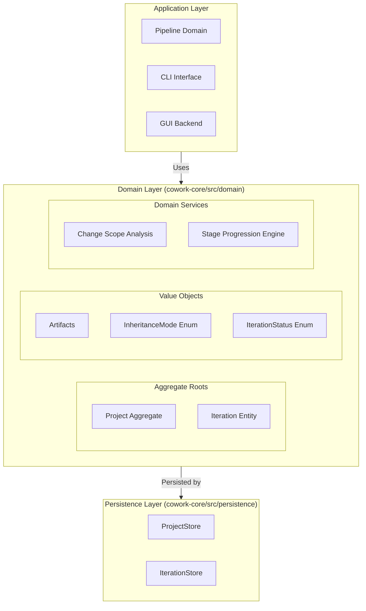
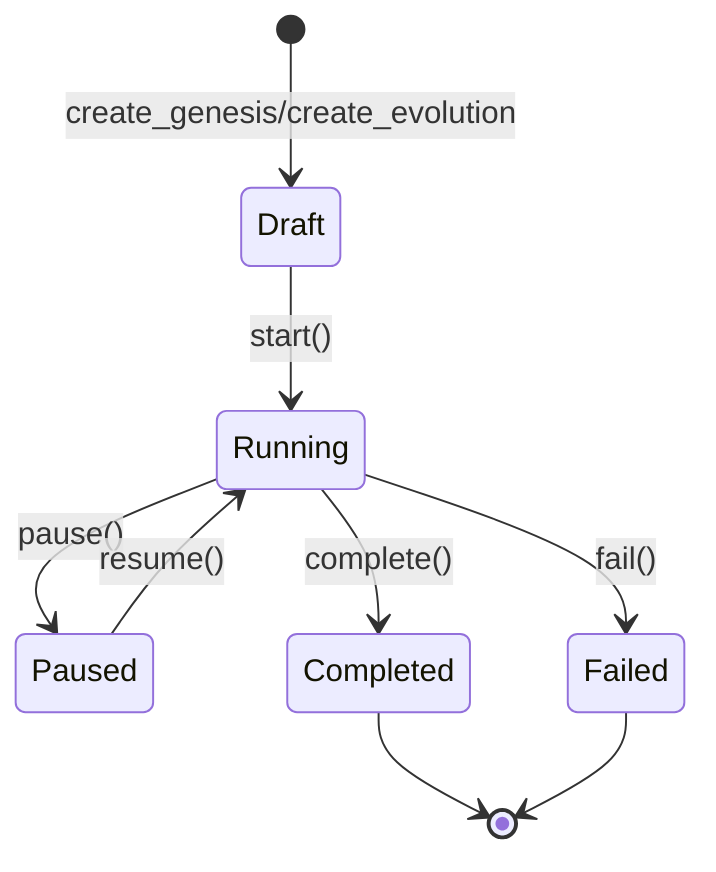
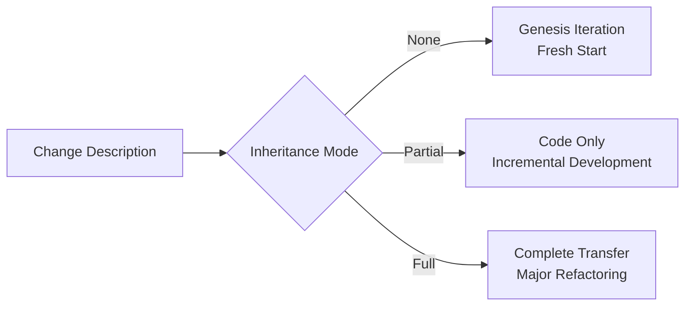
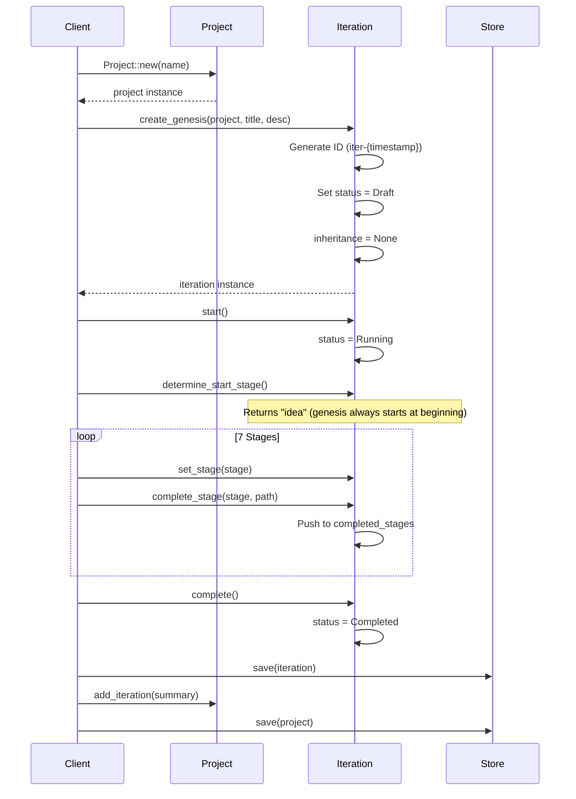
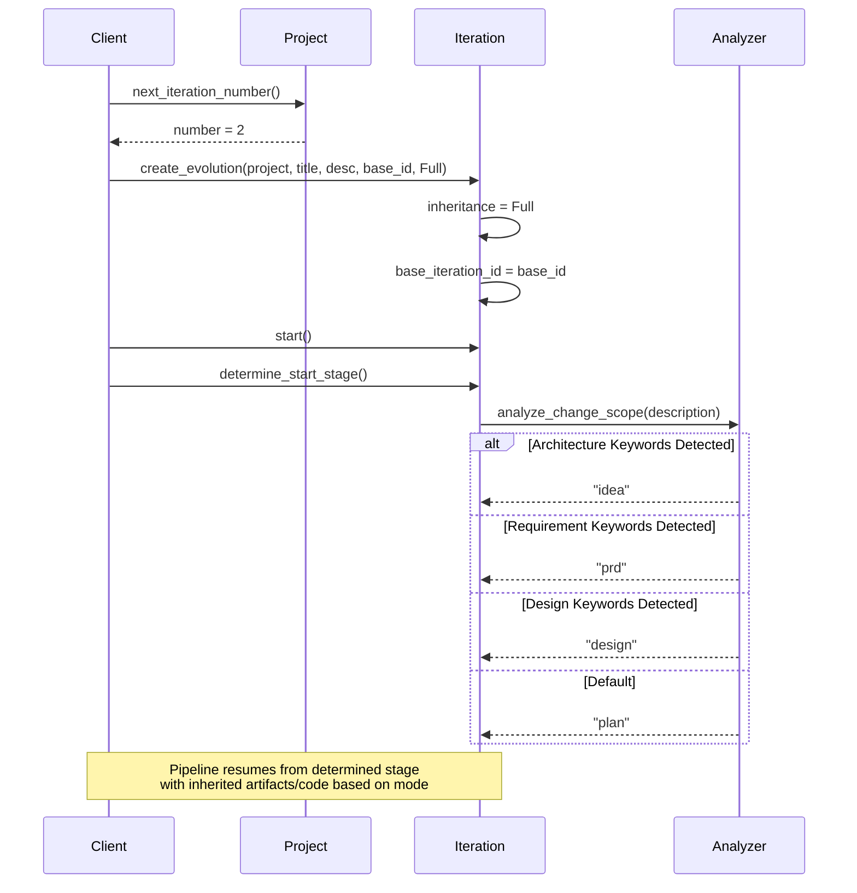

**Domain Logic Technical Documentation**

**Cowork Forge - Core Business Domain**

---

## 1. Overview

The **Domain Logic** layer constitutes the heart of Cowork Forge's architecture, encapsulating the core business entities, invariants, and behavioral rules that govern AI-assisted software development workflows. Implemented following **Domain-Driven Design (DDD)** principles, this domain defines the fundamental constructs of `Project` and `Iteration`, managing their lifecycles, relationships, and state transitions through a sophisticated 7-stage development pipeline.

As the **Aggregate Root** layer within the hexagonal architecture, Domain Logic maintains strict separation from infrastructure concerns, ensuring business rules remain pure, testable, and independent of persistence mechanisms, UI implementations, or external AI service integrations.

---

## 2. Architectural Design

### 2.1 Domain-Driven Design Structure

The Domain Logic implements a layered architecture with clear boundaries:



### 2.2 Core Design Principles

1. **Aggregate Root Pattern**: `Project` serves as the aggregate root managing `Iteration` lifecycle and metadata consistency
2. **Entity-Persistence Separation**: Domain entities are pure Rust structs with business logic, while persistence handles JSON serialization and filesystem operations
3. **State Machine Enforcement**: Iteration status transitions are strictly controlled (Draft → Running → Completed/Failed)
4. **Temporal Consistency**: Automatic timestamp management (`created_at`, `updated_at`, `started_at`, `completed_at`) ensures auditability
5. **Strategy Pattern**: Inheritance modes implement different artifact transfer strategies for evolution iterations

---

## 3. Core Domain Entities

### 3.1 Project Aggregate Root

The `Project` entity represents the top-level aggregate containing all project metadata and iteration history.

**Key Characteristics:**
- **ID Generation**: Auto-generated unique identifiers using format `proj-{timestamp}` (e.g., `proj-1703123456789`)
- **Metadata Management**: `ProjectMetadata` struct tracks `tech_stack`, `project_type`, and `language` with auto-detection capabilities
- **Iteration Collection**: Maintains `Vec<IterationSummary>` for lightweight iteration tracking without loading full iteration data
- **Current Iteration Pointer**: Optional reference to active iteration (`current_iteration_id`) supporting pause/resume workflows

**Core Operations:**
```rust
// Construction
Project::new(name: String) -> Self

// Iteration Management
add_iteration(summary: IterationSummary)  // Appends and updates timestamp
set_current_iteration(id: String)         // Sets active iteration pointer
next_iteration_number() -> u32            // Generates sequential numbers (1, 2, 3...)

// Queries
get_latest_completed_iteration() -> Option<&IterationSummary>
```

### 3.2 Iteration Entity

The `Iteration` entity implements a finite state machine representing a single development cycle through the 7-stage pipeline (Idea → PRD → Design → Plan → Coding → Check → Delivery).

#### 3.2.1 Creation Patterns

The domain supports two distinct creation patterns via factory methods:

**Genesis Iteration** (`create_genesis`):
- Initializes fresh projects with `InheritanceMode::None`
- No artifact or code inheritance from previous iterations
- Starts from Stage 1 (Idea)

**Evolution Iteration** (`create_evolution`):
- Derives from existing iterations via `base_iteration_id`
- Configurable inheritance strategy (Full/Partial/None)
- Intelligent stage selection via `analyze_change_scope()`

#### 3.2.2 State Machine

Iterations transition through strictly defined states:



**State Behaviors:**
- **Draft**: Initial state, allows configuration and modification
- **Running**: Pipeline execution in progress, locks iteration for modifications
- **Paused**: Temporary suspension, preserves execution context
- **Completed**: Successful 7-stage completion, artifacts finalized
- **Failed**: Error termination with failure context preservation

#### 3.2.3 Stage Progression Engine

The `Iteration` tracks pipeline execution through:

- `current_stage: Option<String>`: Currently executing stage identifier
- `completed_stages: Vec<String>`: Historical record of completed stages
- `Artifacts`: Type-safe storage mapping stage names to artifact file paths

**Stage Management API:**
```rust
set_stage(stage: impl Into<String>)           // Sets current execution stage
complete_stage(stage, artifact_path)          // Records completion and persists path
determine_start_stage() -> String             // Returns optimal starting stage
```

### 3.3 Artifacts Value Object

The `Artifacts` struct provides type-safe storage for iteration deliverables:

```rust
pub struct Artifacts {
    pub idea: Option<String>,
    pub prd: Option<String>,
    pub design: Option<String>,
    pub plan: Option<String>,
    pub coding: Option<String>,
    pub check: Option<String>,
    pub delivery: Option<String>,
}
```

**Access Patterns:**
- `get(stage: &str) -> Option<&String>`: Retrieve path by stage name
- `set(stage: &str, path: String)`: Store artifact path with validation

---

## 4. Inheritance Strategy Pattern

The domain implements three inheritance strategies enabling iterative development workflows:

### 4.1 InheritanceMode Enumeration



**None**:
- **Use Case**: Fresh project initialization or complete rewrites
- **Behavior**: No artifact or code transfer; starts from Idea stage
- **Stage Selection**: Always returns "idea"

**Partial**:
- **Use Case**: Adding features to existing codebase
- **Behavior**: Transfers code files only; regenerates all documentation artifacts (PRD, Design, etc.)
- **Stage Selection**: Always returns "idea" (full regeneration of artifacts)

**Full**:
- **Use Case**: Architectural refactoring or major redesigns
- **Behavior**: Copies all code and artifacts from base iteration
- **Stage Selection**: Uses `analyze_change_scope()` for intelligent stage determination

### 4.2 Change Scope Analysis Algorithm

The `analyze_change_scope()` function implements keyword-based natural language processing to determine optimal pipeline entry points for evolution iterations with Full inheritance:

**Classification Logic:**
```rust
fn analyze_change_scope(description: &str) -> String {
    let desc_lower = description.to_lowercase();
    
    // Architecture keywords trigger complete redesign
    if matches_keywords(&desc_lower, &["架构", "architecture", "重构", "rewrite", "重新设计", "redesign"]) {
        return "idea".to_string();
    }
    
    // Requirement keywords trigger PRD regeneration
    if matches_keywords(&desc_lower, &["需求", "requirement", "功能", "feature", "添加", "add"]) {
        return "prd".to_string();
    }
    
    // Design keywords trigger Design stage entry
    if matches_keywords(&desc_lower, &["设计", "design", "数据库", "database", "接口", "api"]) {
        return "design".to_string();
    }
    
    // Default: Code-level changes
    "plan".to_string()
}
```

**Strategic Benefits:**
- Avoids redundant regeneration of stable artifacts
- Enables architectural pivots while preserving implementation details when needed
- Supports both Chinese and English keyword matching for multilingual interaction

---

## 5. Persistence Layer Integration

The Domain Logic maintains strict separation from persistence concerns through repository pattern implementations:

### 5.1 ProjectStore

Manages project-level persistence in JSON format:

- **Storage Location**: `{workspace}/.cowork-v2/project.json`
- **Responsibilities**: 
  - CRUD operations for Project aggregates
  - Project structure initialization
  - Metadata serialization/deserialization using `serde_json`
  - Timestamp synchronization

**API Surface:**
```rust
load() -> Result<Project>
save(project: &Project) -> Result<()>
exists() -> bool
create(project: Project) -> Result<()>
update(project: Project) -> Result<()>
```

### 5.2 IterationStore

Manages iteration-specific persistence with workspace isolation:

- **Storage Location**: `{workspace}/.cowork-v2/iterations/{iteration_id}.json`
- **Workspace Management**: Ensures V2 iteration-specific workspace architecture
- **Bulk Operations**: Supports `load_all()` and `load_summaries()` for efficient listing

**Workspace Path Resolution:**
```rust
workspace_path(iteration_id: &str) -> PathBuf  // Returns iteration workspace
iteration_path(iteration_id: &str) -> PathBuf  // Returns JSON storage path
ensure_workspace(iteration_id: &str) -> Result<PathBuf>  // Creates if missing
```

### 5.3 Data Integrity

- **Atomic Writes**: JSON serialization uses temporary files with atomic rename operations
- **Validation**: Schema validation ensures backward compatibility
- **Error Handling**: Comprehensive error propagation using `anyhow` for context-rich failures

---

## 6. Public API Reference

### 6.1 Project Aggregate API

| Method | Signature | Description |
|--------|-----------|-------------|
| **Constructor** | `new(name: String) -> Self` | Creates project with auto-generated ID and timestamps |
| **Iteration Tracking** | `add_iteration(summary: IterationSummary)` | Appends iteration summary and updates `updated_at` |
| **Current Iteration** | `set_current_iteration(id: String)` | Sets active iteration pointer |
| **Sequencing** | `next_iteration_number() -> u32` | Returns next sequential number (1-indexed) |
| **Query** | `get_latest_completed_iteration() -> Option<&IterationSummary>` | Retrieves most recent completed iteration |

### 6.2 Iteration Entity API

| Method | Signature | Description |
|--------|-----------|-------------|
| **Genesis Factory** | `create_genesis(project, title, description) -> Self` | Creates fresh iteration with `InheritanceMode::None` |
| **Evolution Factory** | `create_evolution(project, title, description, base_id, inheritance) -> Self` | Creates derived iteration with configurable inheritance |
| **State Transition** | `start()` | Transitions Draft → Running, sets `started_at` |
| **State Transition** | `pause()` | Transitions Running → Paused |
| **State Transition** | `resume()` | Transitions Paused → Running |
| **State Transition** | `complete()` | Transitions Running → Completed, sets `completed_at` |
| **State Transition** | `fail()` | Transitions Running → Failed |
| **Stage Control** | `set_stage(stage)` | Updates current execution stage |
| **Stage Control** | `complete_stage(stage, path)` | Records stage completion and artifact path |
| **Analysis** | `determine_start_stage() -> String` | Returns starting stage based on inheritance mode |
| **Projection** | `to_summary() -> IterationSummary` | Converts to lightweight summary for Project tracking |

---

## 7. Business Workflows

### 7.1 Genesis Iteration Flow



### 7.2 Evolution Iteration Flow



---

## 8. Implementation Details

### 8.1 Entity Relationships

```rust
// Project Aggregate
pub struct Project {
    pub id: String,                              // proj-{timestamp}
    pub name: String,
    pub metadata: ProjectMetadata,               // tech_stack, type, language
    pub iterations: Vec<IterationSummary>,       // Lightweight references
    pub current_iteration_id: Option<String>,
    pub created_at: DateTime<Utc>,
    pub updated_at: DateTime<Utc>,
}

// Iteration Entity
pub struct Iteration {
    pub id: String,                              // iter-{timestamp}
    pub project_id: String,
    pub number: u32,                             // Sequential (1, 2, 3...)
    pub title: String,
    pub description: String,
    pub status: IterationStatus,
    pub inheritance: InheritanceMode,
    pub base_iteration_id: Option<String>,
    pub current_stage: Option<String>,
    pub completed_stages: Vec<String>,
    pub artifacts: Artifacts,
    pub created_at: DateTime<Utc>,
    pub updated_at: DateTime<Utc>,
    pub started_at: Option<DateTime<Utc>>,
    pub completed_at: Option<DateTime<Utc>>,
}
```

### 8.2 InheritanceMode Enum

```rust
pub enum InheritanceMode {
    None,      // Fresh start, no inheritance
    Partial,   // Code only, regenerate artifacts
    Full,      // Complete artifact and code transfer
}
```

### 8.3 Associated Files

The Domain Logic implementation spans the following source files:

- `crates/cowork-core/src/domain/project.rs` - Project aggregate definition
- `crates/cowork-core/src/domain/iteration.rs` - Iteration entity and state machine
- `crates/cowork-core/src/persistence/project_store.rs` - Project persistence logic
- `crates/cowork-core/src/persistence/iteration_store.rs` - Iteration persistence and workspace management

---

## 9. Integration with External Domains

### 9.1 Upstream Dependencies (Domain Logic Depends On)
- **None** (Domain Logic is the core, depends only on standard library and serde for serialization)

### 9.2 Downstream Consumers (Depend on Domain Logic)

**Pipeline Domain**:
- Uses `Iteration` as the primary execution context
- Calls `determine_start_stage()` to establish entry points
- Manages state transitions through the entity API

**Persistence Domain**:
- Implements storage mechanisms for domain entities
- `ProjectStore` and `IterationStore` depend on entity definitions
- Maintains separation between domain logic and I/O concerns

**Memory Domain**:
- Consumes `Iteration` summaries for knowledge generation
- Tracks `base_iteration_id` relationships for knowledge lineage

**Tools Domain**:
- File Tools access iteration workspaces via `IterationStore`
- Data Tools manipulate iteration-specific data stores

---

## 10. Best Practices & Constraints

### 10.1 Domain Invariants Enforced
1. **Immutability of IDs**: Once assigned, project and iteration IDs never change
2. **Status Transition Validity**: Invalid transitions (e.g., Draft → Completed) are prevented at compile time via method visibility
3. **Temporal Consistency**: `updated_at` is automatically modified on all mutating operations
4. **Workspace Isolation**: Each iteration maintains isolated workspace directories preventing cross-contamination

### 10.2 Usage Guidelines
- Always use factory methods (`create_genesis`, `create_evolution`) rather than direct struct instantiation
- Persist iterations immediately after state transitions to prevent data loss
- Use `IterationSummary` for listings to avoid loading full iteration data into memory
- Respect the aggregate boundary: modify iterations through Project aggregate when affecting project-level invariants

---

**Document Version**: 1.0  
**Last Updated**: 2024  
**Related Documentation**: Pipeline Domain, Persistence Layer, Memory Management