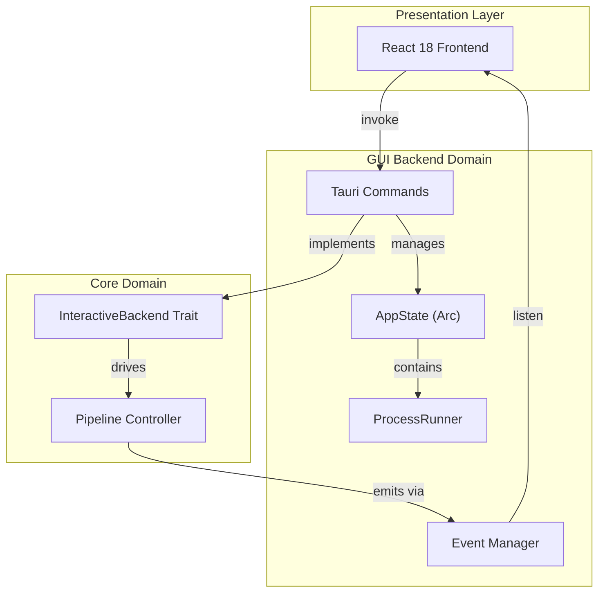

**GUI Backend Domain Technical Documentation**

**Generation Time:** 2024-12-19T10:30:00Z  
**Version:** 1.0  
**Domain:** Infrastructure Layer (Tauri Backend)

---

## 1. Executive Overview

The **GUI Backend Domain** serves as the infrastructure bridge between the React-based frontend and the Cowork Core domain engine within the Tauri desktop application. Implemented in Rust as part of the `cowork-gui` crate, this domain provides the command handlers, state management, and process orchestration necessary to expose core business capabilities through Tauri's IPC (Inter-Process Communication) system.

**Architectural Position:**  
The domain implements the **Adapter** pattern within the Hexagonal Architecture, adapting the core domain's `InteractiveBackend` trait to Tauri's event-driven desktop runtime. It maintains strict separation between presentation concerns (React frontend) and business logic (cowork-core), ensuring the core domain remains agnostic of GUI-specific implementation details.

**Key Responsibilities:**
- **Command Handling**: Expose 24+ JSON-RPC endpoints for frontend invocation
- **Event Streaming**: Real-time bidirectional communication via Tauri's event emission system
- **Process Management**: Cross-platform development server lifecycle management
- **State Bridging**: Thread-safe shared state management between async tasks and UI thread
- **DTO Transformation**: Domain model serialization for frontend consumption

---

## 2. Architectural Design

### 2.1 Hexagonal Integration Pattern

The GUI Backend Domain acts as a **Primary Adapter** in the Ports and Adapters architecture, implementing the `InteractiveBackend` port defined in the Interaction Domain. This design enables the core pipeline to operate identically whether invoked via CLI or GUI, with the backend handling interface-specific concerns (events vs. terminal output).



### 2.2 Concurrency Model

The domain employs **Tokio's async runtime** with strategic threading to maintain UI responsiveness:

- **Main Thread**: Handles Tauri command invocations and event emission
- **Background Tasks**: CPU-intensive iteration execution spawns in `tokio::spawn` tasks to prevent blocking
- **Process I/O**: Separate async tasks for stdout/stderr streaming with `tokio::io::AsyncBufReadExt`
- **State Protection**: Shared mutable state protected via `Arc<Mutex<T>>` for thread-safe access across tasks

---

## 3. Core Components

### 3.1 Command Handlers (`iteration_commands.rs`, `gui_commands.rs`)

The command handlers serve as the API surface for the React frontend, implementing Tauri's command pattern with async function signatures. Each command represents a use case bridge between frontend actions and core domain operations.

**Key Capabilities:**

| Command | Domain Operation | Async Pattern |
|---------|-----------------|---------------|
| `gui_execute_iteration` | Pipeline execution with LLM integration | Background spawn with event streaming |
| `gui_continue_iteration` | Resume paused execution | State machine transition |
| `gui_retry_iteration` | Retry failed stages | Error recovery wrapper |
| `query_memory_index` | Memory domain search | Direct async/await |
| `create_project` | Project aggregate initialization | Transactional creation |
| `start_iteration_preview` | ProcessRunner activation | Child process management |
| `pm_send_message` | Project Manager Agent message processing | Context-aware with history |
| `pm_restart_iteration` | Re-execute from specified stage | Pipeline jump |
| `get_system_locale` | Get system language setting | Synchronous return |

**Implementation Pattern:**
```rust
#[tauri::command]
pub async fn gui_execute_iteration(
    project_id: String,
    iteration_id: String,
    state: State<'_, AppState>,
    app_handle: AppHandle,
) -> Result<(), String> {
    // 1. State extraction from Arc<Mutex>
    // 2. TauriBackend initialization with AppHandle for events
    // 3. LLM client creation with rate limiting
    // 4. Background task spawning
    // 5. Immediate return to prevent UI blocking
}
```

**Error Handling Strategy:**
Domain errors are mapped to JSON-serializable strings to maintain Tauri's JSON-RPC compatibility, preserving error context while ensuring frontend parseability.

### 3.2 Project Registry Manager (`project_manager.rs`)

Manages the project registry with JSON-based persistence, providing CRUD operations for project metadata and cross-platform configuration directory resolution.

**Key Functions:**
- **Auto-Detection**: Technology stack identification (React, Vue, Python, Rust) via filesystem introspection
- **Registry Persistence**: JSON storage in platform-specific config directories (`dirs::config_dir()`)
- **Multi-Project Management**: Project switching and registry maintenance without workspace reloading

**Data Flow:**
1. Frontend requests project creation with path
2. Manager validates directory and detects tech stack
3. Project registered in JSON registry with metadata
4. Core domain stores initialized via `ProjectStore`

### 3.3 Process Runner (`project_runner.rs`)

The **ProcessRunner** service manages external development server lifecycles with real-time log streaming. This component is critical for the "Runner & Preview" panel functionality, enabling users to execute `npm run dev` or similar commands with UI feedback.

**Architecture:**
- **Process Map**: Thread-safe `HashMap<String, Child>` tracking active processes by iteration ID
- **Stream Processing**: Async readers for stdout/stderr with ANSI sequence preservation
- **Cross-Platform Spawning**:
  - **Windows**: `cmd /C` with `CREATE_NO_WINDOW` flag to prevent console flash
  - **Unix**: `sh -c` with signal handling for graceful termination
- **Event Emission**: Log lines emitted as `project_log` events with iteration context for frontend filtering

**Lifecycle Management:**
```rust
pub async fn start(
    &self,
    iteration_id: String,
    command: String,
    code_dir: PathBuf,
) -> Result<u32, String> {
    // 1. Validate workspace containment
    // 2. Platform-specific process spawning
    // 3. Spawn stdout/stderr streaming tasks
    // 4. Register PID in process map
    // 5. Emit initial project_log event
}
```

### 3.4 GUI Types (`gui_types.rs`)

Defines the Data Transfer Objects (DTOs) for frontend-backend communication, ensuring type safety across the JavaScript/Rust boundary via Serde serialization.

**Type Categories:**
- **Project DTOs**: `ProjectInfo`, `ProjectSummary` with RFC3339 timestamp formatting
- **Iteration DTOs**: `IterationInfo` with stage status enumeration
- **Memory DTOs**: `MemoryEntry`, `MemoryQuery` with category/impact classification
- **Execution DTOs**: `ExecutionStatus`, `PreviewInfo` for runtime state
- **Event Payloads**: Structured types for `agent_event`, `tool_call`, `input_request` events

---

## 4. Communication Patterns

### 4.1 Command Invocation (Frontend → Backend)

The frontend uses Tauri's `invoke` API to trigger commands, passing structured payloads and receiving Promise-based responses.

**Pattern:**
- **Synchronous feel**: Commands return immediately with task handles or status
- **Long-running operations**: Background tasks emit progress via events rather than blocking the invocation

### 4.2 Event Streaming (Backend → Frontend)

Real-time updates utilize Tauri's event system with the `AppHandle` for emission and frontend `listen` APIs for consumption.

**Event Taxonomy:**

| Event | Payload | Frequency | Purpose |
|-------|---------|-----------|---------|
| `agent_event` | Message content | Per agent message | Chat interface updates |
| `agent_streaming` | Token chunks | Real-time | Typing indicators, live content |
| `tool_call` | Tool name/args | Per tool execution | Tool usage visualization |
| `tool_result` | Result/Error | Post-execution | Tool outcome display |
| `progress` | Stage/Percentage | Stage transitions | Pipeline progress bars |
| `input_request` | Prompt/Options | HITL gates | Modal dialog triggers |
| `iteration_started` | Iteration ID | Once per execution | UI state transition |
| `iteration_completed` | Summary | Once per execution | Success handling |
| `iteration_failed` | Error details | On failure | Error display |
| `project_log` | Log line + ANSI | Per stdout/stderr line | Terminal panel streaming |
| `project_stopped` | Exit code | Process termination | Cleanup handling |

### 4.3 Human-in-the-Loop (HITL) Coordination

The TauriBackend implementation bridges the synchronous nature of Tauri's event system with the async requirements of the core pipeline:

1. **Request Emission**: Pipeline emits `input_request` event with oneshot channel sender
2. **Frontend Modal**: React displays input modal, blocking further interaction
3. **Response Collection**: User selection captured via `submit_input` command
4. **Channel Resolution**: Backend receives response via oneshot channel, resuming pipeline
5. **Timeout Handling**: 3000-second timeout prevents indefinite blocking

---

## 5. Implementation Details

### 5.1 State Management

The `AppState` struct serves as the dependency injection container:

```rust
pub struct AppState {
    pub project_manager: Arc<Mutex<ProjectRegistryManager>>,
    pub project_runner: Arc<Mutex<ProcessRunner>>,
    pub config: Arc<AppConfig>,
}
```

**Access Patterns:**
- **Commands**: Receive `State<'_, AppState>` parameter for DI
- **Background Tasks**: Clone `Arc` handles before spawning to maintain ownership
- **Thread Safety**: Mutex guards held only during critical sections to prevent deadlocks

### 5.2 Cross-Platform Considerations

**Path Handling:**
- UNC path normalization for Windows compatibility
- Workspace containment validation (all paths resolved relative to project root)
- Platform-specific config directory resolution via `dirs` crate

**Process Management:**
- **Windows**: `std::os::windows::process::CommandExt` for `CREATE_NO_WINDOW`
- **Unix**: Signal handling for SIGTERM vs SIGKILL during graceful shutdown
- **Path Separation**: Environment variable handling differences (PATH vs Path)

### 5.3 DTO Transformation

Domain models (rich entities with business logic) are transformed to DTOs (serialization-focused structures) via helper functions:

```rust
fn iteration_to_info(iteration: &Iteration, project: &Project) -> IterationInfo {
    IterationInfo {
        id: iteration.id.clone(),
        stage: iteration.current_stage.to_string(),
        status: iteration.status.to_string(),
        created_at: iteration.created_at.to_rfc3339(),
        // ... additional fields
    }
}
```

**Timestamp Handling:** All dates converted to RFC3339 format for JavaScript `Date` compatibility.

### 5.4 Error Boundary Strategy

The backend implements a **Fail-Fast** approach with graceful degradation:

- **Validation Errors**: Returned immediately to frontend with descriptive messages
- **Execution Errors**: Emitted as `iteration_failed` events with full stack traces
- **Process Errors**: `project_log` events tagged with stderr streams for visibility
- **Panic Safety**: `std::panic::catch_unwind` in background tasks prevents GUI crashes

---

## 6. Integration Workflows

### 6.1 Real-Time Iteration Execution

**Flow:**
1. User clicks "Execute" in IterationsPanel (React)
2. Frontend invokes `gui_execute_iteration` with project/iteration IDs
3. Command handler extracts state and creates `TauriBackend` instance
4. Background task spawned; command returns immediately
5. Pipeline executes, emitting events via `TauriBackend`
6. Frontend receives events, updates chat interface and progress bars
7. HITL gates trigger `input_request` events, pausing pipeline
8. User responds via modal, pipeline resumes
9. Completion emits `iteration_completed` or `iteration_failed`

### 6.2 Development Server Lifecycle

**Flow:**
1. User opens RunnerPanel and clicks "Start"
2. Frontend invokes `start_iteration_preview` with command (e.g., `npm run dev`)
3. `ProcessRunner` spawns child process in iteration workspace
4. Async tasks spawned for stdout/stderr reading
5. Each line emitted as `project_log` event with ANSI codes
6. Frontend displays in terminal panel with color formatting
7. User clicks "Stop" → graceful termination via SIGTERM (or taskkill on Windows)
8. `project_stopped` emitted with exit code for status indication

### 6.3 Memory Query Operations

**Flow:**
1. User selects filters in MemoryPanel (scope, category, keywords)
2. Frontend invokes `query_memory_index` with query parameters
3. Command delegates to `MemoryStore` in core domain
4. Fuzzy keyword matching and filtering applied
5. Results aggregated and transformed to `MemoryEntry` DTOs
6. Frontend renders cards with category color-coding (decisions=green, patterns=blue, etc.)
7. User clicks entry → `load_memory_detail` invoked for full markdown content

---

## 7. Security & Validation

### 7.1 Workspace Containment

All file operations validate paths against the iteration workspace root:
- **Path Traversal Prevention**: Canonicalization and prefix checking
- **Symbolic Link Handling**: Resolution before validation to prevent escapes
- **Protected Paths**: `.git`, `node_modules`, and `.cowork-v2` directory protection

### 7.2 Process Isolation

- **Command Whitelisting**: No arbitrary shell execution; commands validated against project configuration
- **Working Directory Enforcement**: All processes spawned within iteration workspace
- **Resource Limits**: Implicit limits via OS process management; no cgroup integration currently

### 7.3 IPC Security

- **Command Exposure**: Only explicitly annotated `#[tauri::command]` functions exposed
- **Payload Validation**: Serde deserialization errors caught and sanitized
- **State Access**: Arc<Mutex> ensures no direct mutable statics accessible

---

## 8. Configuration & Extension

### 8.1 Runtime Configuration

The domain reads configuration from:
- **TOML Files**: `config.toml` in project root for LLM settings
- **Environment Variables**: Fallback for API keys and model selection
- **Registry JSON**: `projects.json` in system config directory

### 8.2 Extending Command Handlers

To add new frontend capabilities:
1. Define DTO in `gui_types.rs` with `Serialize`/`Deserialize` derives
2. Implement handler function with `#[tauri::command]` attribute
3. Add to Tauri builder in `lib.rs` command registry
4. Invoke from frontend via `await invoke('command_name', payload)`

### 8.3 Custom Event Types

New event types require:
1. Payload struct definition (Clone + Serialize)
2. Emission via `app_handle.emit("event_name", payload)`
3. Frontend listener registration with type guards

---

## 9. Performance Considerations

- **Memory Usage**: ProcessRunner maintains open file descriptors for active dev servers; automatic cleanup on app exit
- **Event Frequency**: Streaming events throttled at LLM layer (30 req/min), but tool calls emit immediately
- **State Contention**: Mutex locks held minimally; heavy operations (LLM calls) release locks before awaiting
- **Serialization Cost**: Large file contents (code files) streamed directly rather than emitted as events to prevent JSON serialization overhead

---

## 10. Dependencies & Relationships

**Upstream Dependencies:**
- **Interaction Domain**: Implements `InteractiveBackend` trait
- **Pipeline Domain**: Drives execution via `IterationExecutor`
- **Persistence Domain**: Uses `ProjectStore`, `IterationStore`, `MemoryStore`
- **LLM Integration**: Creates rate-limited clients via `LlmConfig`

**Downstream Consumers:**
- **GUI Frontend Domain**: React components consume commands and events
- **Tauri Runtime**: Desktop shell and IPC infrastructure

**External Systems:**
- **OS Process Manager**: Child process lifecycle management
- **File System**: Workspace I/O operations
- **LLM APIs**: Via core domain delegation

---

**Document Maintenance:**  
This documentation should be updated when:
- New Tauri commands are added to the public API
- Event payload structures change
- Cross-platform process handling logic is modified
- State management patterns evolve

**Contact:**  
For technical questions regarding the GUI Backend Domain, refer to the `cowork-gui/src-tauri/src/` directory structure and associated Rust module documentation.