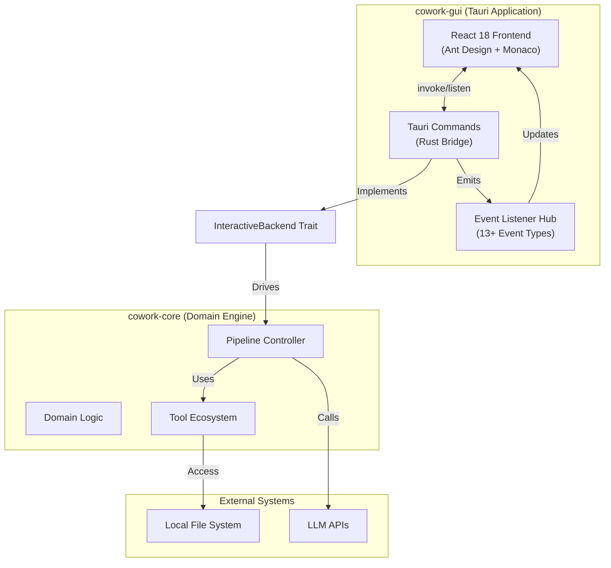
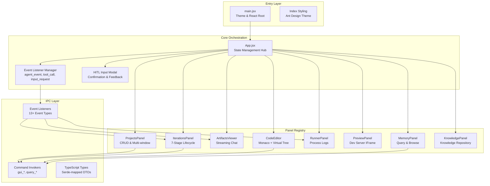
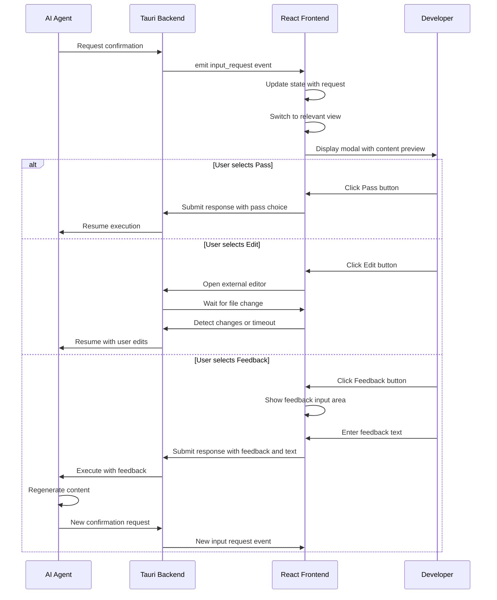

**GUI Frontend Domain Technical Documentation**

**Generation Time:** 2026-02-14 05:21:52 (UTC)  
**Version:** 1.0  
**Domain:** Presentation Layer (Cowork-GUI)  

---

## 1. Executive Summary

The **GUI Frontend Domain** implements the desktop presentation layer of the Cowork Forge system, delivering a comprehensive AI-assisted development environment through a Tauri-based desktop application shell with a React 18 frontend. This domain provides the primary human-computer interface for the 7-stage AI agent pipeline, enabling real-time iteration monitoring, artifact inspection, code editing, and Human-in-the-Loop (HITL) validation workflows.

**Key Architectural Characteristics:**
- **Multi-Panel Workspace**: Eight functional panels (Projects, Iterations, Chat/Artifacts, Code Editor, Runner, Preview, Memory, Knowledge) orchestrated through a central state manager
- **Event-Driven Real-Time Communication**: Bidirectional IPC via Tauri's invoke/listen APIs supporting streaming AI agent outputs and asynchronous HITL interactions
- **Dual-Mode Interaction**: Supports both automated execution monitoring and interactive feedback loops with modal-based confirmation workflows
- **Performance-Optimized Rendering**: Virtualized lists for large file trees, Monaco Editor integration for code editing, and optimistic UI updates for responsive feedback

---

## 2. System Architecture

### 2.1 Container Context (C4 Level 2)

The GUI Frontend operates as a distinct container within the Cowork Forge architecture, communicating exclusively with the Tauri Backend Domain through well-defined IPC boundaries:



### 2.2 Component Architecture (C4 Level 3)

The frontend implements a layered component hierarchy with clear separation of concerns:



---

## 3. Technical Implementation

### 3.1 Technology Stack

| Layer | Technology | Purpose |
|-------|-----------|---------|
| **UI Framework** | React 18 | Component-based declarative UI with concurrent features |
| **Component Library** | Ant Design 5.x | Enterprise-grade UI components (Tables, Modals, Tabs) |
| **Desktop Shell** | Tauri 1.x+ | Rust-based desktop runtime with native OS integration |
| **Code Editor** | Monaco Editor | VS Code-powered editing with syntax highlighting and IntelliSense |
| **Virtualization** | react-window | Performance optimization for large file trees and lists |
| **Content Rendering** | ReactMarkdown + remark-gfm | Markdown parsing for AI-generated artifacts |
| **Styling** | CSS Modules + Ant Design Tokens | Scoped component styles with theme consistency |
| **State Management** | React Hooks (useState/useEffect) | Centralized state in App.jsx with prop drilling |
| **Icons** | @ant-design/icons | Consistent iconography across interface |

### 3.2 State Management Architecture

The domain employs a centralized state management pattern with React's native hook system:

**Central State Hub (App.jsx):**
- `currentSession`: Active project/iteration context
- `activeView`: Current visible panel (projects, iterations, chat, code, run, memory, knowledge)
- `messages[]`: Real-time AI agent message buffer with type differentiation (user, agent, thinking, tool_call, tool_result)
- `isProcessing`: Global execution state for pipeline operations
- `inputRequest`: HITL modal state management
- `refreshTriggers`: Counter-based cache invalidation for memory/knowledge panels

**State Distribution Pattern:**
```javascript
// Centralized state with selective prop drilling
<App>
  <ProjectsPanel currentSession={session} onProjectSelect={handler} />
  <IterationsPanel 
    currentSession={session} 
    isProcessing={isProcessing}
    onExecuteStatusChange={handler}
    refreshTrigger={refreshTrigger}
  />
  <CodeEditor currentIterationId={iterationId} />
  {/* ... additional panels */}
</App>
```

**Event-Driven State Updates:**
Rather than polling, the system maintains WebSocket-like connectivity through Tauri's event system:
- **Emission**: Backend emits events via `AppHandle` in Rust
- **Subscription**: Frontend registers listeners in `useEffect` hooks with cleanup
- **Aggregation**: Streaming content aggregated in local state buffers

---

## 4. Communication Layer (IPC)

### 4.1 Command Interface (Frontend → Backend)

The domain exposes type-safe command invocations using Tauri's `invoke` API:

**Project Management Commands:**
| Command | Parameters | Return | Description |
|---------|-----------|--------|-------------|
| `gui_init_project` | `{ name, description?, path? }` | `ProjectDTO` | Initialize new project workspace |
| `get_all_projects` | - | `ProjectDTO[]` | Retrieve registered projects |
| `open_project` | `{ projectId, newWindow? }` | `void` | Load project in current/new window |
| `delete_project` | `{ projectId }` | `boolean` | Remove project from registry |
| `update_project` | `{ projectId, updates }` | `ProjectDTO` | Modify project metadata |

**Iteration Control Commands:**
| Command | Parameters | Return | Description |
|---------|-----------|--------|-------------|
| `gui_create_iteration` | `{ projectId, title, description, fromIteration? }` | `IterationDTO` | Create genesis/evolution iteration |
| `gui_execute_iteration` | `{ iterationId }` | `void` | Start pipeline execution (async) |
| `gui_continue_iteration` | `{ iterationId }` | `void` | Resume paused iteration |
| `gui_retry_iteration` | `{ iterationId, stage? }` | `void` | Retry failed stage |
| `gui_delete_iteration` | `{ iterationId }` | `boolean` | Remove iteration workspace |

**File Operations:**
| Command | Parameters | Return | Description |
|---------|-----------|--------|-------------|
| `get_iteration_file_tree` | `{ iterationId }` | `FileNode[]` | Retrieve virtualized file tree |
| `read_iteration_file` | `{ iterationId, filePath }` | `string` | Read file content |
| `save_iteration_file` | `{ iterationId, filePath, content }` | `boolean` | Persist file changes |
| `format_code` | `{ code, language }` | `string` | Format code using external formatter |

**Knowledge & Memory:**
| Command | Parameters | Return | Description |
|---------|-----------|--------|-------------|
| `query_memory_index` | `{ scope, category?, stage?, limit?, keyword? }` | `MemoryEntry[]` | Search project memory |
| `load_memory_detail` | `{ memoryId }` | `MemoryDetail` | Retrieve full memory content |
| `gui_get_project_knowledge` | `{ projectId }` | `KnowledgeDTO` | Get aggregated knowledge |
| `gui_regenerate_knowledge` | `{ iterationId }` | `void` | Trigger knowledge re-extraction |

### 4.2 Event Interface (Backend → Frontend)

The system implements 13+ event types for real-time streaming:

**Lifecycle Events:**
- `project_loaded`: Emitted when project context initialized
- `iteration_started`: Pipeline execution commenced
- `iteration_completed`: Successful completion with results
- `iteration_failed`: Error state with diagnostic messages
- `iteration_continued`: Resumed from paused state

**Agent Streaming Events:**
- `agent_event`: Structured content messages (thinking, progress, stage transitions)
- `agent_streaming`: Real-time token streaming from LLM APIs

**Execution Events:**
- `tool_call`: Tool invocation with name and arguments
- `tool_result`: Tool execution result (success/failure with output)
- `progress`: Stage completion percentage and status

**HITL Events:**
- `input_request`: Suspension for human input with metadata (type, options, context)
- `input_response`: (Command) Response submission from frontend

**Process Events:**
- `project_log`: Stdout/stderr from development server processes
- `project_error`: Process execution errors

**Implementation Pattern:**
```javascript
// Event subscription in App.jsx
useEffect(() => {
  const unlisten = listen('agent_event', (event) => {
    const { payload } = event;
    setMessages(prev => [...prev, {
      type: payload.type, // 'thinking' | 'message' | 'stage'
      content: payload.content,
      timestamp: Date.now()
    }]);
  });
  
  return () => { unlisten.then(f => f()); };
}, []);
```

---

## 5. Functional Components

### 5.1 Projects Panel (`ProjectsPanel.jsx`)

**Responsibilities:**
- Project lifecycle management (CRUD operations)
- Multi-window project loading support
- Workspace directory access integration
- Technology stack visualization

**Key Features:**
- **Card-based Layout**: Grid display of projects with metadata (tech stack, last modified, iteration count)
- **Multi-window Support**: "Open in New Window" functionality using Tauri's window management API
- **Quick Actions**: Direct access to workspace directories via OS file explorer
- **Deletion Safety**: Confirmation modals with warning states for destructive operations

**State Interactions:**
- Emits `project_loaded` event on selection
- Triggers `activeView` transition to 'iterations'
- Manages `currentSession` context for child components

### 5.2 Iterations Panel (`IterationsPanel.jsx`)

**Responsibilities:**
- 7-stage pipeline visualization (Idea → PRD → Design → Plan → Coding → Check → Delivery)
- Iteration execution control (Start, Pause, Continue, Retry)
- Real-time status tracking and progress indication
- Evolution iteration creation with inheritance mode selection

**Key Features:**
- **Stage Visualization**: Visual pipeline showing current stage, completed stages, and pending stages with color-coded status indicators
- **Execution Controls**: Context-aware buttons (Start for Draft, Continue for Paused, Retry for Failed)
- **Evolution Workflow**: "Evolve" button triggering inheritance mode selection (Full/Partial/None)
- **Live Status**: Real-time updates via `iteration_started`, `iteration_completed` events

**HITL Integration:**
- Listens for `input_request` events with `ARTIFACT_TYPE` context
- Auto-switches view to appropriate panel (Artifacts/Code) based on confirmation type
- Manages execution blocking during human validation phases

### 5.3 Code Editor (`CodeEditor.jsx`)

**Responsibilities:**
- File tree navigation with virtualized rendering
- Multi-tab code editing with Monaco Editor
- File content persistence
- Language-specific syntax highlighting and formatting

**Technical Implementation:**
- **Virtualized Tree**: Uses `react-window` for performant rendering of large directory structures (>1000 files)
- **Monaco Integration**: Full-featured editor with IntelliSense, error highlighting, and minimap
- **Language Detection**: Automatic mode setting based on file extensions (rs, js, ts, py, html, css, json, md, toml, yaml)
- **Auto-save**: Debounced save operations to backend via `save_iteration_file`

**File Operations:**
- Lazy loading: File content fetched on-demand via `read_iteration_file`
- Change tracking: Dirty state management for unsaved changes
- Cross-panel integration: File selection from Chat/Artifacts panel opens in editor

### 5.4 Runner & Preview Panels (`RunnerPanel.jsx`, `PreviewPanel.jsx`)

**Responsibilities:**
- Development server process management
- Real-time log streaming with ANSI sequence processing
- Live preview via iframe embedding
- Process lifecycle control (start, stop, restart)

**Technical Features:**
- **Log Streaming**: Consumes `project_log` events with ANSI color code rendering for terminal-like output
- **Log Filtering**: Search and filter capabilities for process output
- **Dual-Tab Interface**: "Run Program" (logs) and "Page Preview" (iframe) modes
- **Safety Controls**: Graceful process termination and port conflict detection

### 5.5 Memory & Knowledge Panels (`MemoryPanel.jsx`, `KnowledgePanel.jsx`)

**Responsibilities:**
- Project memory querying and browsing
- Knowledge artifact visualization
- Historical decision and pattern retrieval
- Fuzzy search across memory entries

**Key Features:**
- **Query Interface**: Filter by scope (project/iteration), category (decision/pattern/insight), and keywords
- **Markdown Rendering**: Rich content display with syntax highlighting for code blocks
- **Detail Modals**: Drill-down views for memory entries with full context
- **Refresh Coordination**: Responds to `knowledge_regeneration_completed` events

---

## 6. Human-in-the-Loop (HITL) Implementation

The GUI Frontend implements sophisticated HITL workflows for AI-human collaboration:

### 6.1 Confirmation Flow Architecture



### 6.2 Modal State Management

The `InputModal` component handles three interaction modes:
1. **Text Input**: Freeform feedback for regeneration requests
2. **Option Selection**: Predefined choices (Yes/No/View/Feedback) for artifact confirmation
3. **Artifact Review**: Rich content display with tab switching to relevant panels

**Timeout Handling:**
- Backend maintains 3000-second timeout (50 minutes) for HITL responses
- Frontend displays countdown warnings for long-running operations
- Automatic cleanup on component unmount to prevent memory leaks

---

## 7. Performance Optimizations

### 7.1 Virtualization Strategy

**File Tree Rendering:**
- Implements `react-window` FixedSizeTree for directories with >100 items
- Lazy loading of file metadata (size, modification time)
- Collapsed node optimization (children not rendered until expanded)

**Memory Lists:**
- Virtualized scrolling for memory entries with dynamic height support
- Pagination via "Load More" pattern for large result sets
- Debounced search input (300ms) to prevent excessive query commands

### 7.2 Streaming Optimization

**Message Aggregation:**
- Buffers rapid `agent_streaming` events (throttled to 60fps updates)
- Uses `requestAnimationFrame` for smooth scrolling during high-velocity token streaming
- Implements message deduplication for tool_call/tool_result pairs

**Memoization:**
- `React.memo` on panel components to prevent unnecessary re-renders during background streaming
- `useMemo` for expensive markdown parsing and syntax highlighting
- `useCallback` for event handlers passed to child components

---

## 8. Integration Patterns

### 8.1 Error Handling Strategy

**Command Errors:**
- Rust `Result` types mapped to JavaScript exceptions
- Ant Design `message` API for transient error notifications
- Modal dialogs for critical failures (workspace access denied, iteration corruption)

**Event Stream Errors:**
- `iteration_failed` events trigger error boundary catches
- Automatic state reset to prevent UI desynchronization
- Retry mechanisms with exponential backoff for transient network issues

### 8.2 Cross-Panel Communication

**Refresh Coordination:**
```javascript
// Counter-based invalidation pattern
const [memoryRefreshTrigger, setMemoryRefreshTrigger] = useState(0);

// Trigger from App.jsx when iteration completes
useEffect(() => {
  if (iterationCompleted) {
    setMemoryRefreshTrigger(prev => prev + 1);
  }
}, [iterationCompleted]);

// Consumption in MemoryPanel
useEffect(() => {
  loadMemoryData();
}, [memoryRefreshTrigger]);
```

**View Switching:**
- Programmatic navigation via `setActiveView` prop drilling
- Context-aware switching (e.g., artifact confirmation switches to Code view for code files, Artifacts view for markdown)

---

## 9. Security Considerations

**Path Validation:**
- All file paths validated by backend `runtime_security` module before operations
- Frontend displays workspace-relative paths only (absolute paths obscured)
- Traversal attack prevention via backend path canonicalization

**Content Security:**
- IFrame sandboxing for Preview panel (`sandbox="allow-scripts allow-same-origin"`)
- Monaco Editor runs in isolated context
- Markdown rendering sanitizes HTML to prevent XSS via AI-generated content

**Process Isolation:**
- Development servers spawned in separate processes with restricted environment
- Frontend cannot execute arbitrary shell commands (all commands validated by backend Tool domain)

---

## 10. Known Limitations & Technical Debt

**Current Issues:**
1. **Component Nesting Bug**: `main.jsx` contains `<App><App /></App>` causing double mounting (requires immediate fix)
2. **Tight Coupling**: `App.jsx` exceeds 200 LOC with complex prop drilling; candidate for Context API or Zustand migration
3. **Memory Leaks**: Event listeners in early returns may not cleanup properly if component unmounts during async operations

**Future Improvements:**
- Migration to TypeScript for type-safe IPC communication
- Implementation of virtualized chat history for long-running iterations (>10k messages)
- WebSocket fallback for Tauri IPC in potential web deployment scenarios

---

## 11. Development Guidelines

**Adding New Panels:**
1. Create component in `src/components/`
2. Add panel key to `activeView` state enum in `App.jsx`
3. Implement in `PANELS` mapping object with icon and title
4. Add necessary IPC commands to Tauri backend
5. Register event listeners in panel's `useEffect`

**Event Listener Best Practices:**
```javascript
useEffect(() => {
  let unlisten;
  
  const setupListener = async () => {
    unlisten = await listen('event_name', handler);
  };
  
  setupListener();
  
  return () => {
    if (unlisten) unlisten.then(f => f());
  };
}, []);
```

**Styling Conventions:**
- Use Ant Design tokens for consistency (`token.colorPrimary`, `token.borderRadius`)
- CSS Modules for component-scoped styles
- Responsive breakpoints: `xs` (<576px), `sm` (≥576px), `md` (≥768px), `lg` (≥992px), `xl` (≥1200px)

---

**Conclusion:** The GUI Frontend Domain successfully abstracts the complexity of the AI agent pipeline into an intuitive desktop interface. Its event-driven architecture enables real-time collaboration between human developers and AI agents, while the modular panel structure supports diverse workflows from project initialization to code deployment. The domain maintains strict separation from core business logic through the Tauri IPC boundary, ensuring architectural integrity while delivering responsive user experiences.
