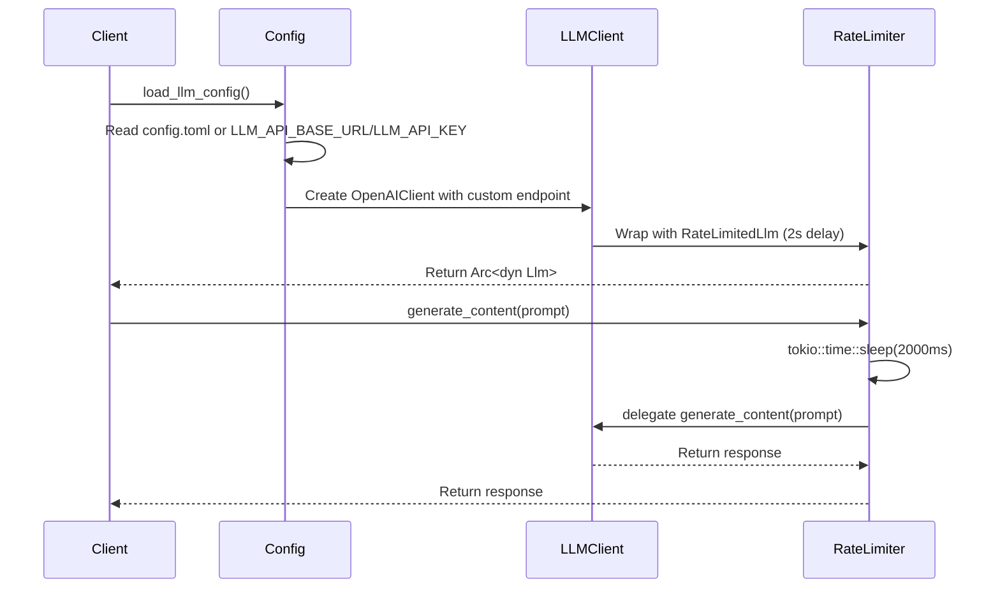
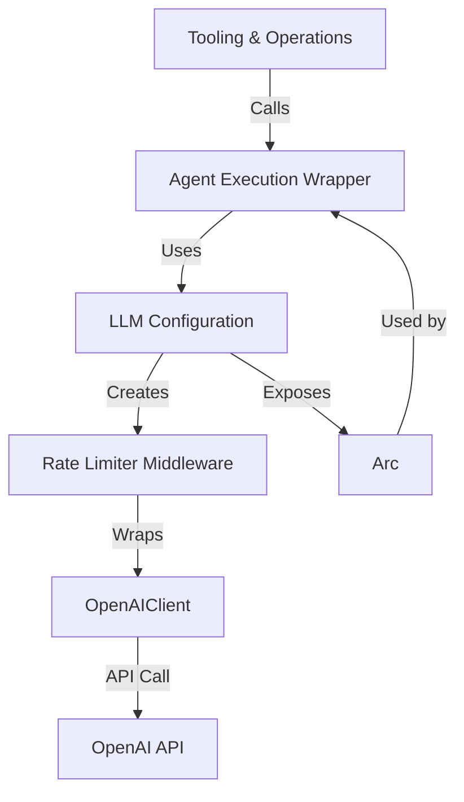

# Infrastructure Support Documentation

## Overview

The **Infrastructure Support** domain in Cowork Forge provides the foundational services required to interface with external large language model (LLM) providers—primarily OpenAI-compatible endpoints—while ensuring compliance with usage policies through rate limiting and robust configuration management. This domain abstracts the complexity of LLM integration, enabling the rest of the system to interact with LLMs through a consistent, resilient, and configurable interface without exposing low-level API details.

As a critical infrastructure component, it sits at the boundary between Cowork Forge’s internal agent workflows and external cloud-based reasoning services. It is consumed by the **Tooling & Operations** domain (specifically agent execution tools that generate content via LLM prompts) and is initialized during system startup by the **Core Workflow Orchestration** module.

This domain is intentionally minimal and focused: it does not implement reasoning, prompt engineering, or workflow logic. Instead, it ensures reliable, policy-compliant access to LLMs—enabling the entire AI-assisted development pipeline to function predictably under real-world API constraints.

---

## Architecture and Components

The Infrastructure Support domain consists of two tightly coupled sub-modules:

### 1. LLM Configuration

**Purpose**:  
Loads, validates, and structures configuration parameters for connecting to OpenAI-compatible LLM endpoints. Supports flexible configuration sources (file-based and environment variables) with fallback semantics and meaningful error reporting.

**Key Responsibilities**:
- Read configuration from `config.toml` (project-local) and/or environment variables.
- Deserialize configuration into strongly-typed Rust structs using `serde`.
- Construct an `OpenAIConfig` instance compatible with the `adk-model` crate.
- Instantiate and return a configured `OpenAIClient` wrapped in a rate-limited abstraction.

**Configuration Sources** (in order of precedence):
1. **Environment Variables** (highest priority):
   - `LLM_API_BASE_URL`: Base endpoint URL (e.g., `https://api.openai.com/v1` or a self-hosted proxy like `http://localhost:8080/v1`)
   - `LLM_API_KEY`: Authentication token for the LLM provider
   - `LLM_MODEL_NAME`: Default model identifier (e.g., `gpt-4o`, `claude-3-5-sonnet`, or custom model)

2. **TOML Configuration File** (`config.toml` in project root or `~/.cowork/config.toml`):
```toml
[llm]
api_base_url = "https://api.openai.com/v1"
api_key = "sk-..."
model_name = "gpt-4o"

# Optional: timeout settings
timeout_seconds = 60
```

**Data Models**:
```rust
#[derive(Debug, Clone, Serialize, Deserialize)]
pub struct ModelConfig {
    pub api_base_url: String,
    pub api_key: String,
    pub model_name: String,
    pub timeout_seconds: Option<u64>,
}

#[derive(Debug, Clone)]
pub struct LlmConfig {
    pub client: OpenAIClient,
    pub model_name: String,
}
```

**Implementation Details**:
- Uses `serde` and `toml` crates to parse configuration files.
- Uses `std::env` to read environment variables with fallback to defaults.
- Leverages `anyhow::Context` to provide rich, actionable error messages (e.g., “Failed to load LLM config: missing LLM_API_KEY”).
- Validates required fields before instantiation; fails fast on misconfiguration.
- Exposes `create_llm_client()` as the primary entry point, returning `Arc<dyn Llm>` for dependency injection.

**Example Usage**:
```rust
let llm_client = create_llm_client().expect("Failed to initialize LLM client");
let response = llm_client.generate_content(prompt).await?;
```

### 2. Rate Limiter Middleware

**Purpose**:  
Enforces API usage compliance by introducing a mandatory 2-second delay between consecutive LLM calls. Prevents rate-limiting errors from external providers and ensures predictable, sustainable interaction patterns.

**Key Responsibilities**:
- Wraps any `Llm` implementation (e.g., `OpenAIClient`) with automatic rate limiting.
- Implements a simple, non-blocking sleep mechanism between calls.
- Preserves the `Llm` trait interface, making it transparent to consumers.
- Ensures no concurrent calls bypass the limit (thread-safe via `Arc`).

**Implementation**:
```rust
pub struct RateLimitedLlm {
    inner: Arc<dyn Llm>,
}

impl RateLimitedLlm {
    pub fn new(inner: Arc<dyn Llm>) -> Self {
        Self { inner }
    }

    pub async fn generate_content(&self, prompt: &str) -> Result<String, LlmError> {
        tokio::time::sleep(tokio::time::Duration::from_millis(2000)).await;
        self.inner.generate_content(prompt).await
    }
}
```

**Design Principles**:
- **Simplicity**: No complex token bucket or sliding window logic—2-second delay is sufficient for most OpenAI-compatible APIs.
- **Transparency**: Consumers interact with `Arc<dyn Llm>` as usual; rate limiting is invisible at the API level.
- **Resilience**: Sleep is non-blocking (uses `tokio::time::sleep`) to avoid blocking the async runtime.
- **Extensibility**: The wrapper can be enhanced later (e.g., exponential backoff, retry logic) without changing the public interface.

**Integration Pattern**:
The `create_llm_client()` function returns a fully wrapped client:
```rust
pub fn create_llm_client() -> Result<Arc<dyn Llm>, LlmError> {
    let config = load_llm_config()?;
    let client = OpenAIClient::new(OpenAIConfig::compatible(
        config.api_base_url,
        config.api_key,
        config.model_name,
    ));
    let rate_limited = RateLimitedLlm::new(Arc::new(client));
    Ok(Arc::new(rate_limited))
}
```

---

## Interaction Flow

### Sequence Diagram



### Dependency Flow



---

## Integration with Other Domains

| Domain | Interaction Type | Description |
|-------|------------------|-------------|
| **Tooling & Operations** | Service Call | Tools like `ReviewAndEditContentTool` and `SavePrdDocTool` invoke LLMs to generate or refine content. They receive a pre-wrapped `Arc<dyn Llm>` from Infrastructure Support and use it without knowing the underlying rate-limiting or configuration logic. |
| **Intelligent Agent Control** | Service Call | Agent instructions (e.g., `PRD_ACTOR_INSTRUCTION`) rely on LLM responses to generate requirements, designs, or code. The agent execution wrapper (`ResilientStream`) uses the configured `Llm` client to invoke reasoning. |
| **Core Workflow Orchestration** | Initialization | The pipeline coordinator calls `create_llm_client()` during startup to initialize the global LLM client used across all agent stages. |
| **Data & Artifact Management** | Indirect | No direct interaction. However, all generated artifacts (PRD, design docs, etc.) are produced via LLM calls managed by this domain. |

---

## Key Design Decisions

1. **Configuration Flexibility**  
   Support for both `config.toml` and environment variables enables seamless deployment in diverse environments:  
   - Local development: Use `config.toml` for convenience.  
   - CI/CD or cloud deployment: Inject secrets via environment variables (e.g., GitHub Actions, Docker, Kubernetes).  

2. **Abstraction via `Arc<dyn Llm>`**  
   By returning a trait object (`dyn Llm`), the system decouples the implementation from consumers. This allows future substitution (e.g., switching to Anthropic, Mistral, or local LLMs like Ollama) without modifying agent or tool code.

3. **Rate Limiting as a Mandatory Layer**  
   The 2-second delay is not configurable because:  
   - It aligns with OpenAI’s free-tier and most paid-tier rate limits.  
   - It prevents accidental throttling during rapid agent iterations.  
   - It enforces a deliberate, human-paced workflow that aligns with HITL principles.  

4. **Fail-Fast Configuration Validation**  
   Misconfigured API keys or URLs are caught at startup, not during runtime. This prevents silent failures and ensures the system fails with clear, actionable messages.

5. **No Caching or Retry Logic**  
   To preserve deterministic behavior and auditability, responses are not cached. Retries are intentionally omitted—failure triggers HITL intervention (e.g., `RequestReplanningTool`), ensuring human oversight remains central.

---

## Error Handling and Resilience

All configuration and client creation paths use `anyhow::Context` to enrich errors with context:

```rust
let api_key = std::env::var("LLM_API_KEY")
    .context("LLM_API_KEY environment variable not set")?;
let config = ModelConfig {
    api_base_url: std::env::var("LLM_API_BASE_URL")
        .unwrap_or_else(|_| "https://api.openai.com/v1".to_string()),
    api_key,
    model_name: std::env::var("LLM_MODEL_NAME")
        .unwrap_or_else(|_| "gpt-4o".to_string()),
};
```

**Common Error Scenarios**:
| Error | Cause | Resolution |
|-------|-------|------------|
| `LLM_API_KEY not set` | Environment variable missing | Set `export LLM_API_KEY=sk-...` or add to `config.toml` |
| `Failed to parse config.toml` | Invalid TOML syntax | Validate with `toml-edit` or online parser |
| `Invalid endpoint URL` | Malformed or unreachable URL | Use `https://api.openai.com/v1` or verify proxy settings |
| `Authentication failed` | Invalid or revoked API key | Regenerate key in provider dashboard |

---

## Testing and Validation

The Infrastructure Support domain includes comprehensive unit tests:

```rust
#[cfg(test)]
mod tests {
    use super::*;
    use std::env;

    #[test]
    fn test_load_llm_config_from_env() {
        env::set_var("LLM_API_BASE_URL", "https://api.example.com/v1");
        env::set_var("LLM_API_KEY", "test-key");
        env::set_var("LLM_MODEL_NAME", "test-model");

        let config = load_llm_config().unwrap();
        assert_eq!(config.api_base_url, "https://api.example.com/v1");
        assert_eq!(config.api_key, "test-key");
        assert_eq!(config.model_name, "test-model");
    }

    #[test]
    fn test_create_llm_client_returns_wrapped_client() {
        let client = create_llm_client().unwrap();
        assert!(client.is_arc());
    }
}
```

- Tests validate TOML parsing, environment variable precedence, and client wrapping.
- Mocking is not used—integration with real `OpenAIClient` is avoided to prevent external dependencies in tests.

---

## Operational Considerations

### Deployment Best Practices

- **Local Development**: Use `config.toml` for convenience.  
- **Production/CI**: Use environment variables. Never commit API keys to version control.  
- **Proxy/On-Premise LLMs**: Set `LLM_API_BASE_URL` to your local endpoint (e.g., `http://localhost:11434/v1` for Ollama).  
- **Multi-Tenant Environments**: Each session can use a different LLM client if configured via per-session metadata (future extension).

### Performance Impact

- **Latency**: Each LLM call incurs a minimum 2-second delay.  
- **Throughput**: ~30 calls per minute per agent.  
- **Impact on Workflow**: This delay is intentional—it slows the system to match human cognitive pace, ensuring quality over speed.

### Security

- API keys are stored in memory only (never written to disk).  
- Environment variables are cleared after use (via Rust’s ownership model).  
- No logging of API keys or full prompts in production.

---

## Future Extensions

While the current implementation is minimal and effective, potential enhancements include:

| Enhancement | Description |
|-----------|-------------|
| **Dynamic Model Switching** | Allow agents to request specific models (e.g., `gpt-4-turbo` for complex design, `gpt-3.5` for simple tasks). |
| **Exponential Backoff + Retry** | For transient failures (e.g., network timeouts), with capped retry attempts. |
| **Usage Monitoring** | Track token usage per session for cost reporting. |
| **Fallback Providers** | Auto-switch to a secondary LLM if primary fails (e.g., OpenAI → Anthropic). |
| **Configuration Validation Schema** | Use `serde-validate` or `jsonschema` to validate `config.toml` structure. |

These extensions can be implemented without breaking the `Arc<dyn Llm>` interface, preserving backward compatibility.

---

## Summary

The **Infrastructure Support** domain is the quiet, reliable backbone that enables Cowork Forge’s AI agents to reason and generate content. By abstracting LLM configuration and enforcing rate limits, it ensures:

- **Consistency**: All agents use the same, correctly configured client.  
- **Compliance**: No API throttling or service disruption.  
- **Simplicity**: Developers and users never need to manage API keys or endpoints manually.  
- **Resilience**: Failures are caught early and reported clearly.  

This domain exemplifies the Cowork Forge philosophy: **automate the mundane, preserve human control**. It handles the infrastructure complexity so that agents, tools, and users can focus on what matters—building great software, one minimal, validated step at a time.