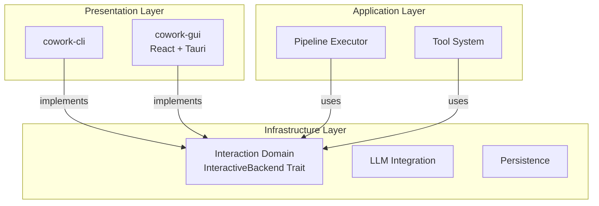
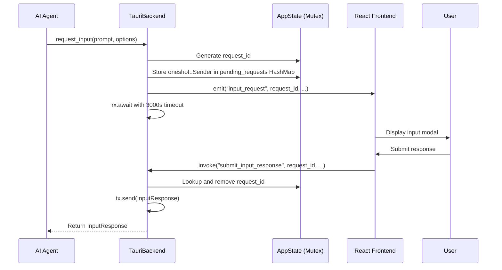

**Interaction Domain Technical Documentation**
**Cowork Forge System**
*Generation Time: 2024-12-19*

---

## 1. Executive Summary

The **Interaction Domain** serves as the infrastructure bridge between Cowork Forge's core business logic and its user interfaces. Following the Hexagonal Architecture pattern (Ports and Adapters), this domain implements the `InteractiveBackend` trait—a standardized port that enables the system's dual-interface strategy. 

By abstracting user interaction behind a unified asynchronous interface, the domain allows the AI pipeline (7-stage development workflow) to execute identically across both automation-focused CLI environments and interactive desktop GUI experiences without modification to core domain logic.

**Key Capabilities:**
- **Dual-Interface Abstraction**: Single trait implementation supporting both terminal (CLI) and desktop (Tauri) interfaces
- **Real-time Streaming**: Low-latency transmission of AI agent outputs and tool execution results
- **Human-in-the-Loop (HITL)**: Synchronous request-response coordination for human validation gates
- **Context-Aware Messaging**: Rich metadata propagation enabling sophisticated UI rendering

---

## 2. Architectural Positioning

### 2.1 Layer Classification
In the Domain-Driven Design (DDD) architecture, the Interaction Domain resides in the **Infrastructure Layer**, implementing outbound adapters for the presentation layer:



### 2.2 Design Pattern: Port and Adapter
The domain implements the **Port and Adapter** pattern through:
- **Port**: `InteractiveBackend` trait defining the contract for all UI interactions
- **Adapters**: Concrete implementations (`CliBackend`, `TauriBackend`) adapting the port to specific technologies

This decoupling ensures that changes to the React frontend or terminal libraries never propagate to the Pipeline or Tool domains.

---

## 3. Core Abstraction: InteractiveBackend Trait

The `InteractiveBackend` trait defines the contract for bidirectional communication between the AI pipeline and users. It is implemented using Rust's `async_trait` macro to support asynchronous operations across the tokio runtime.

### 3.1 Interface Definition

| Method | Purpose | Direction |
|--------|---------|-----------|
| `show_message` | Display system notifications (Info/Warning/Error/Success) | Backend → User |
| `show_message_with_context` | Rich messaging with agent/stage metadata | Backend → User |
| `send_streaming` | Real-time LLM token streaming | Backend → User |
| `send_tool_call` | Tool invocation visualization | Backend → User |
| `send_tool_result` | Tool execution completion display | Backend → User |
| `show_progress` | Task progress reporting (0-100%) | Backend → User |
| `request_input` | HITL input collection with timeout | Backend ↔ User |
| `submit_response` | Async response handling for pending requests | User → Backend |

### 3.2 Context-Aware Messaging
The `MessageContext` struct enables sophisticated UI rendering by carrying metadata:

```rust
struct MessageContext {
    agent_name: String,      // e.g., "Actor", "Critic"
    stage_name: String,      // e.g., "Design", "Coding"
    message_type: MessageType // Normal, Thinking, ToolCall, ToolResult, Streaming
}
```

This context allows the GUI to apply color coding, agent avatars, and stage-specific grouping without parsing message content.

---

## 4. Implementation: CLI Backend

Located in `crates/cowork-core/src/interaction/cli.rs`, the CLI implementation provides terminal-based interaction using the `dialoguer` and `console` crates.

### 4.1 Technical Characteristics
- **Stateless Design**: No persistent state between method calls
- **UTF-8 Compliance**: Full Unicode support for international project names and content
- **External Editor Integration**: Uses `dialoguer::Editor` to launch system default editors (VS Code, Vim, etc.) for content review
- **Colored Output**: Emoji-prefixed, ANSI-colored messages using the `console` crate

### 4.2 HITL Implementation
For Human-in-the-Loop interactions, the CLI backend:
1. Displays content preview with syntax highlighting hints
2. Presents options: `[Pass]`, `[Edit]`, `[Cancel]`, or `[Feedback]`
3. For "Edit" selection: spawns external editor process and monitors file changes
4. Returns structured `InputResponse` to the awaiting pipeline stage

### 4.3 Streaming Behavior
Real-time LLM streaming is implemented via `stdout` flushing:
```rust
print!("{}", chunk);
std::io::stdout().flush().unwrap();
```
This ensures tokens appear immediately rather than buffering until newline characters.

---

## 5. Implementation: Tauri Backend

Located in `crates/cowork-core/src/interaction/tauri.rs`, the Tauri implementation enables desktop GUI interaction through event emission and command invocation.

### 5.1 Event-Driven Architecture
The backend uses Tauri's `AppHandle` to emit events to the WebView frontend:

| Event Name | Payload | Purpose |
|------------|---------|---------|
| `agent_event` | Structured message with context | General agent communication |
| `agent_streaming` | Token chunk + metadata | Real-time LLM output |
| `tool_call` | Tool name + arguments | Tool execution start |
| `tool_result` | Result data + success flag | Tool execution completion |
| `progress` | Task ID + percentage | Long-running task updates |
| `input_request` | Request ID + prompt + options | HITL modal trigger |
| `project_loaded` | Project metadata | State change notification |

### 5.2 Synchronous HITL in Async Context
The most complex aspect of the Tauri backend is managing synchronous user input within the async pipeline. The implementation uses **tokio oneshot channels**:



**Key Implementation Details:**
- **Pending Requests Storage**: `HashMap<String, oneshot::Sender<InputResponse>>` protected by `Arc<Mutex<>>`
- **Timeout Handling**: 3000-second (50-minute) timeout using `tokio::select!` to prevent indefinite pipeline stalls
- **Request Correlation**: UUID-based request IDs ensure responses match to the correct awaiting agent

### 5.3 State Management (V2 Architecture)
The V2 architecture removed the event bus in favor of direct state sharing:
```rust
pub struct AppState {
    pending_requests: HashMap<String, oneshot::Sender<InputResponse>>,
    project_registry_manager: ProjectRegistryManager,
    workspace_path: Option<PathBuf>,
}
```
Access is synchronized via `Arc<Mutex<AppState>>` shared across Tauri commands and the Interaction backend.

---

## 6. Human-in-the-Loop (HITL) Mechanism

The HITL system enables the Actor-Critic pattern by pausing AI execution for human validation at critical stage boundaries.

### 6.1 Interaction Flow

**Step 1: Trigger**
- Stage Executor detects `needs_confirmation()` or agent calls `ReviewAndEditContentTool`
- Tool retrieves `InteractiveBackend` from pipeline context

**Step 2: Presentation**
- **CLI**: Renders content preview in terminal with dialoguer prompts
- **GUI**: Emits `input_request` event; React frontend displays modal dialog

**Step 3: User Action**
- **Pass**: Approve and continue pipeline
- **Edit**: Modify content in external editor (CLI) or inline editor (GUI)
- **Feedback**: Provide comments triggering agent regeneration via `execute_with_feedback()`

**Step 4: Resolution**
- CLI receives input directly via stdin
- GUI receives input via `submit_input_response` Tauri command, which resolves the oneshot channel

### 6.2 Error Handling
- **Timeout**: Returns `InputResponse::Timeout` after 3000s, allowing pipeline to abort or continue based on configuration
- **Cancellation**: User can cancel iteration, triggering pipeline abortion and cleanup
- **Connection Loss**: GUI disconnections are handled by timeout mechanisms; CLI handles Ctrl+C via signal handlers

---

## 7. Integration Patterns

### 7.1 Pipeline Domain Integration
The Pipeline domain uses the Interaction backend for:
1. **Stage Progress Reporting**: Emitting progress updates during long-running AI operations
2. **Streaming Display**: Forwarding LLM token streams to the user interface
3. **Confirmation Gates**: Pausing at stage boundaries for human approval

**Code Pattern:**
```rust
// In stage_executor.rs
backend.send_streaming(content, &agent_name, is_thinking).await?;
if stage_config.requires_confirmation {
    let response = backend.request_input(prompt, options, None).await?;
    match response {
        InputResponse::Feedback(comment) => {
            return self.execute_with_feedback(comment).await;
        }
        // ... handle other variants
    }
}
```

### 7.2 Tools Domain Integration
Tools in the `hitl_content_tools.rs` and `hitl_file_tools.rs` modules use the backend to:
- Display files for review (`ReviewAndEditFileTool`)
- Collect structured feedback (`ReviewWithFeedbackTool`)
- Show tool execution confirmations

### 7.3 Frontend Integration (GUI)
The React frontend (`crates/cowork-gui/src/App.jsx`) establishes event listeners before triggering execution:

```javascript
// Event listeners setup
listen('agent_streaming', (event) => addStreamingMessage(event.payload));
listen('input_request', (event) => showInputModal(event.payload));
listen('tool_call', (event) => logToolInvocation(event.payload));

// Command invocation
invoke('gui_execute_iteration', { projectId, iterationId });
```

---

## 8. Data Structures

### 8.1 InputResponse Enum
Defines possible user responses to HITL requests:
- `Pass`: Continue without changes
- `Edit { content }`: Modified content from editor
- `Feedback { comment }`: Regeneration request with comments
- `Cancel`: Abort iteration
- `Timeout`: No response within 3000s window

### 8.2 MessageType Enum
Categorizes messages for UI styling:
- `Normal`: Standard agent messages
- `Thinking`: Agent's internal reasoning (often rendered differently)
- `ToolCall`: Tool invocation notifications
- `ToolResult`: Success/failure indicators
- `Streaming`: Real-time LLM output fragments

### 8.3 ProgressInfo Struct
```rust
struct ProgressInfo {
    task_id: String,
    current: u32,
    total: u32,
    message: Option<String>,
}
```

---

## 9. Configuration & Extension

### 9.1 Implementing a New Backend
To add a new interface (e.g., WebSocket API):
1. Implement `InteractiveBackend` for your struct
2. Handle the `request_input` method with appropriate async synchronization
3. Ensure UTF-8 compliance for all string inputs/outputs
4. Implement timeout handling for HITL operations

### 9.2 Backend Selection
The application selects the backend at runtime:
- **CLI**: `CliBackend` instantiated in `cowork-cli/src/main.rs`
- **GUI**: `TauriBackend` instantiated in `cowork-gui/src-tauri/src/lib.rs` with access to Tauri's `AppHandle`

### 9.3 Security Considerations
- **Path Validation**: All file operations shown via `send_tool_call` have been pre-validated by Runtime Security
- **Input Sanitization**: The backend does not sanitize content (handled by Tools domain), but ensures proper encoding (UTF-8)
- **Timeout Protection**: Prevents resource exhaustion from abandoned HITL requests

---

## 10. Best Practices

1. **Always Await Timeouts**: When implementing custom backends, ensure `request_input` implements timeout logic to prevent zombie pipelines
2. **Preserve Context**: Pass `MessageContext` accurately to enable rich UI features in GUI mode while maintaining CLI compatibility
3. **Non-Blocking Events**: Event emission should never block the AI pipeline; use `tokio::spawn` for fire-and-forget notifications if necessary
4. **UTF-8 Compliance**: All implementations must handle Unicode correctly, particularly for international development teams
5. **State Cleanup**: When implementing HITL, always remove completed request IDs from pending maps to prevent memory leaks

---

## 11. Associated Files

| File Path | Responsibility |
|-----------|---------------|
| `crates/cowork-core/src/interaction/mod.rs` | Trait definition and shared types |
| `crates/cowork-core/src/interaction/cli.rs` | Terminal-based implementation |
| `crates/cowork-core/src/interaction/tauri.rs` | Desktop GUI implementation |
| `crates/cowork-cli/src/main.rs` | CLI backend instantiation and routing |
| `crates/cowork-gui/src-tauri/src/lib.rs` | Tauri backend registration and state management |
| `crates/cowork-gui/src-tauri/src/gui_types.rs` | DTOs for frontend-backend communication |

---

## 12. Conclusion

The Interaction Domain exemplifies the system's adherence to Hexagonal Architecture by strictly separating interface concerns from business logic. Through the `InteractiveBackend` trait, Cowork Forge achieves true interface portability—enabling the same sophisticated AI pipeline to operate in both automated CI/CD environments (CLI) and rich interactive development environments (Desktop GUI) without code duplication or domain pollution.

The domain's sophisticated handling of asynchronous HITL workflows, combined with context-aware messaging and robust concurrency management, provides the foundation for reliable human-AI collaboration in software development workflows.