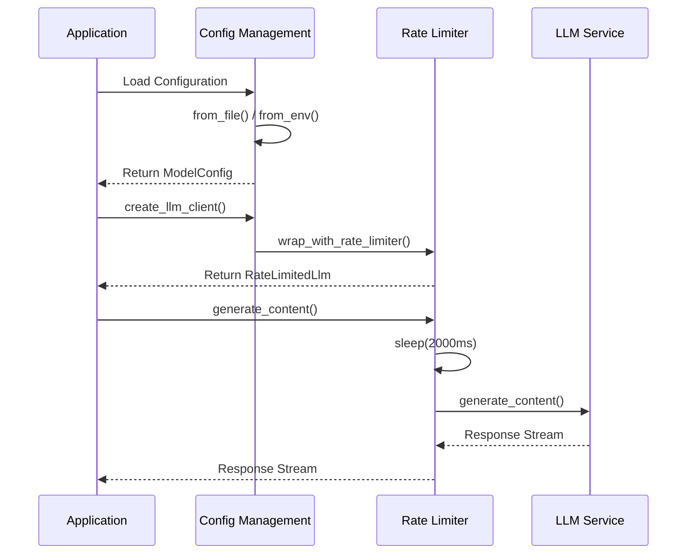

# LLM Integration Domain Technical Documentation

## Overview

The LLM Integration Domain serves as the external AI service integration layer within Cowork Forge V2, providing configuration management and rate limiting capabilities for language model interactions. This domain enables the system's AI agents to communicate with external LLM services while maintaining performance and compliance with API rate limits.

## Module Structure

### Core Components

The domain consists of three primary modules:

- **`mod.rs`**: Module declaration and public API exports
- **`config.rs`**: Configuration management and client creation
- **`rate_limiter.rs`**: Rate limiting middleware implementation

### Module Dependencies

```rust
// Primary dependencies
use adk_model::openai::{OpenAIClient, OpenAIConfig};
use adk_core::Llm;
use serde::{Deserialize, Serialize};
use std::sync::Arc;
```

## Configuration Management

### Configuration Structures

The domain defines two main configuration structures:

```rust
[derive(Debug, Clone, Serialize, Deserialize)]
pub struct LlmConfig {
    pub api_base_url: String,    // OpenAI-compatible endpoint
    pub api_key: String,         // API authentication key
    pub model_name: String,      // Target model identifier
}

#[derive(Debug, Clone, Serialize, Deserialize)]
pub struct ModelConfig {
    pub llm: LlmConfig,          // Nested LLM configuration
}
```

### Configuration Loading

The system supports dual configuration loading strategies:

#### File-based Configuration
```rust
pub fn from_file(path: &str) -> Result<Self> {
    let content = std::fs::read_to_string(path)?;
    let config: Self = toml::from_str(&content)?;
    Ok(config)
}
```

#### Environment-based Configuration
```rust
pub fn from_env() -> Result<Self> {
    Ok(Self {
        llm: LlmConfig {
            api_base_url: std::env::var("LLM_API_BASE_URL")?,
            api_key: std::env::var("LLM_API_KEY")?,
            model_name: std::env::var("LLM_MODEL_NAME")?,
        },
    })
}
```

### LLM Client Creation

The `create_llm_client` function orchestrates client creation:

```rust
pub fn create_llm_client(config: &LlmConfig) -> Result<Arc<dyn Llm>> {
    // 1. Configure OpenAI-compatible client
    let openai_config = OpenAIConfig::compatible(
        &config.api_key,
        &config.api_base_url,
        &config.model_name,
    );
    
    // 2. Create base client
    let client = OpenAIClient::new(openai_config)?;
    
    // 3. Apply rate limiting
    let rate_limited_client = RateLimitedLlm::with_default_delay(Arc::new(client));
    
    Ok(Arc::new(rate_limited_client))
}
```

## Rate Limiting Implementation

### RateLimitedLlm Structure

The rate limiting wrapper implements the `Llm` trait while adding configurable delays:

```rust
pub struct RateLimitedLlm {
    inner: Arc<dyn Llm>,    // Wrapped LLM implementation
    delay_ms: u64,          // Delay duration in milliseconds
}
```

### Default Configuration

The system enforces a default 2-second delay (2000ms) between API calls, ensuring compliance with typical rate limits of <30 calls per minute:

```rust
pub fn with_default_delay(inner: Arc<dyn Llm>) -> Self {
    Self::new(inner, 2000)  // 2-second delay
}
```

### Async Implementation

The rate limiting middleware uses async/await for non-blocking delays:

```rust
#[async_trait]
impl Llm for RateLimitedLlm {
    async fn generate_content(
        &self,
        req: LlmRequest,
        stream: bool,
    ) -> adk_core::Result<LlmResponseStream> {
        // Apply delay before API call
        sleep(Duration::from_millis(self.delay_ms)).await;
        
        // Delegate to underlying LLM
        self.inner.generate_content(req, stream).await
    }
}
```

## Integration Patterns

### Domain Interaction Flow

```
Application → Config Management → Rate Limiter → LLM Service
     ↓              ↓                ↓            ↓
   Request     Load Config      Add Delay     API Call
     ↓              ↓                ↓            ↓
  Response  ←  Return Client  ←  Wrap Client ← Stream
```

### Sequence Diagram



## Technical Specifications

### API Compatibility

The domain supports OpenAI-compatible endpoints through the `OpenAIConfig::compatible` method, enabling flexibility in LLM service selection while maintaining a consistent interface.

### Error Handling

Comprehensive error handling using `anyhow::Result` with contextual error messages:
- Configuration file read/parse failures
- Environment variable validation
- Client creation errors
- Rate limiting enforcement

### Thread Safety

All components are designed for concurrent access:
- Configuration structures implement `Clone` and `Send`
- LLM clients are wrapped in `Arc<dyn Llm>` for shared ownership
- Rate limiting uses async-safe timing mechanisms

## Usage Examples

### Basic Configuration

```toml
# config.toml
[llm]
api_base_url = "http://localhost:8000/v1"
api_key = "your-api-key"
model_name = "gpt-4"
```

### Client Creation

```rust
let config = ModelConfig::from_file("config.toml")?;
let llm_client = create_llm_client(&config.llm)?;
```

### Environment Variables

```bash
export LLM_API_BASE_URL="http://localhost:8000/v1"
export LLM_API_KEY="your-api-key"
export LLM_MODEL_NAME="gpt-4"
```

## Testing

The module includes comprehensive unit tests for configuration parsing:

```rust
#[cfg(test)]
mod tests {
    #[test]
    fn test_config_parse() {
        let toml_content = r#"
            [llm]
            api_base_url = "http://localhost:8000/v1"
            api_key = "test-key"
            model_name = "gpt-4"
        "#;
        
        let config: ModelConfig = toml::from_str(toml_content).unwrap();
        assert_eq!(config.llm.api_base_url, "http://localhost:8000/v1");
    }
}
```

## Performance Considerations

### Rate Limiting Impact

The 2-second delay between API calls ensures:
- Compliance with most LLM provider rate limits
- Stable system performance under load
- Prevention of API throttling and quota exhaustion

### Memory Efficiency

The use of `Arc` for client sharing enables:
- Efficient memory usage across multiple agents
- Thread-safe client sharing
- Reduced initialization overhead

## Security Features

### Credential Management

- API keys loaded securely from environment variables or configuration files
- No hardcoded credentials in source code
- Configurable authentication endpoints

### Input Validation

- Environment variable validation with meaningful error messages
- Configuration file format validation
- API endpoint URL validation

## Integration with Other Domains

The LLM Integration Domain primarily serves the **Agent Management Domain**, providing configured and rate-limited LLM clients to specialized AI agents throughout the development workflow. This separation of concerns allows agents to focus on their specific development tasks while the LLM domain handles external service integration complexities.

## Future Extensions

The modular design allows for easy extension with:
- Additional LLM provider implementations
- Dynamic rate limiting based on provider quotas
- Advanced caching mechanisms
- Circuit breaker patterns for fault tolerance

This domain provides a robust foundation for AI-powered software development while maintaining flexibility for future enhancements and provider integrations.