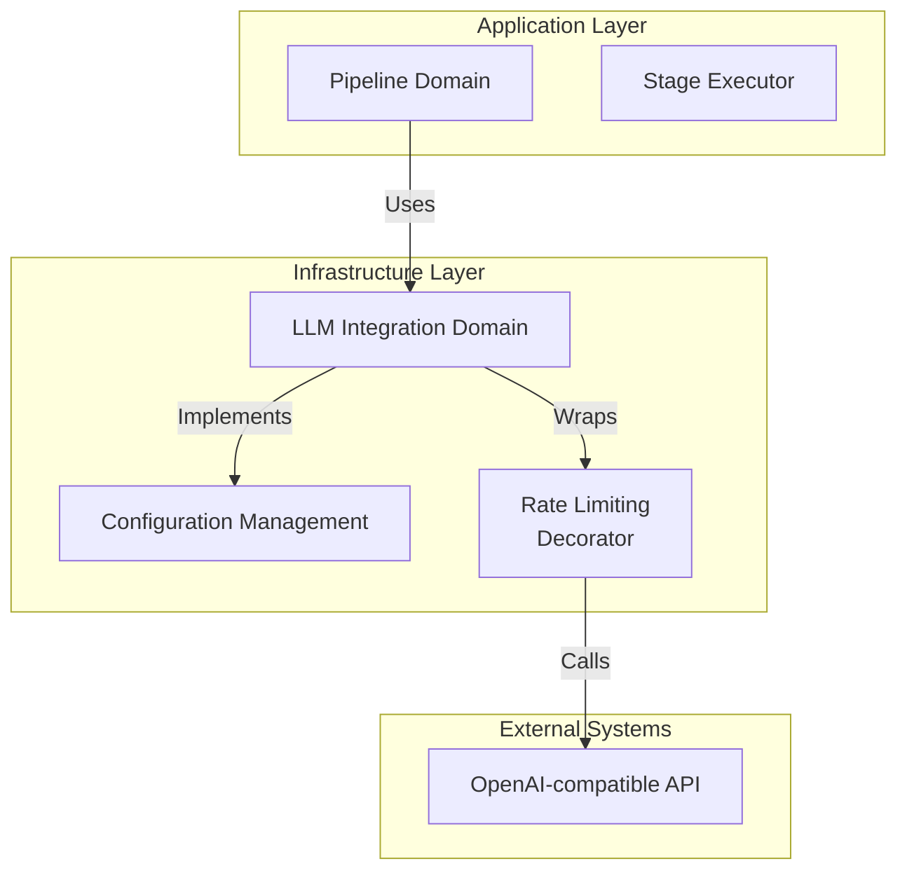
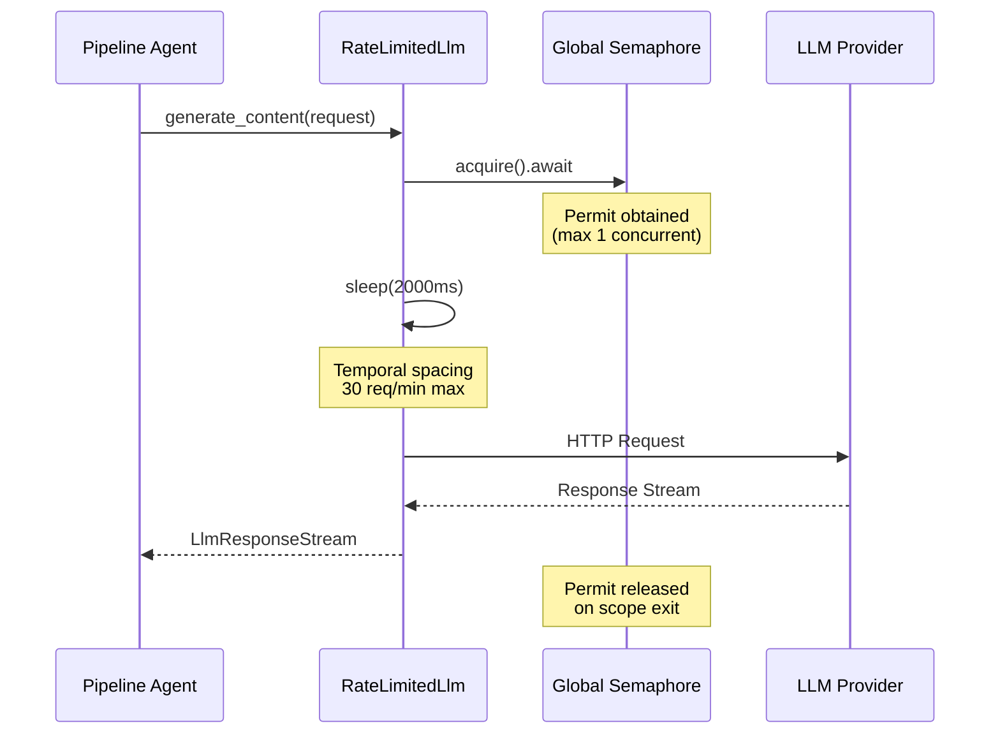

**LLM Integration Domain Technical Documentation**

---

## 1. Overview

The **LLM Integration Domain** provides the infrastructure layer for connecting Cowork Forge to OpenAI-compatible Large Language Model APIs. As an infrastructure domain within the Hexagonal Architecture, it abstracts the complexity of external API communication, authentication, and critical production concerns such as rate limiting and quota management.

This domain serves as the exclusive bridge between the core AI agent pipeline and external LLM providers, ensuring that the system maintains API compliance (30 requests/minute) while providing a clean, trait-based interface for the Pipeline Domain's Stage Executor and agent orchestration components.

**Key Responsibilities:**
- Configuration management supporting both file-based (TOML) and environment-based deployments
- Factory-based client instantiation with automatic rate limiting decoration
- Dual-mechanism rate limiting (concurrency control + temporal throttling) to prevent API quota exhaustion
- Seamless integration with the `adk-rust` ecosystem (`adk_core` traits and `adk_model` OpenAI client)

---

## 2. Architectural Design

### 2.1 Pattern Implementation

The domain implements two primary design patterns to achieve clean separation of concerns and production-grade reliability:

**Factory Pattern**: The `create_llm_client` function acts as a centralized factory that orchestrates client initialization, configuration validation, and automatic wrapping with rate limiting decorators. This ensures that all LLM clients used throughout the system comply with API constraints by default.

**Decorator Pattern**: The `RateLimitedLlm` struct implements the `adk_core::Llm` trait while wrapping an inner LLM implementation. This allows rate limiting concerns to be added transparently without modifying the underlying OpenAI client logic, adhering to the Single Responsibility Principle.

### 2.2 System Positioning

Within the Clean Architecture hierarchy, this domain resides in the **Infrastructure Layer**, depending only on external frameworks (`adk-rust`, `tokio`) and providing implementations for domain-defined interfaces:



---

## 3. Core Components

### 3.1 Configuration Management (`llm/config.rs`)

The configuration system supports dual-source initialization to accommodate both development workflows and containerized production environments:

**Configuration Structures:**
- `LlmConfig`: Top-level configuration container
- `ModelConfig`: Specific model parameters including API base URL, authentication key, and model selection

**Loading Strategies:**
- **File-based**: `ModelConfig::from_file(path)` deserializes TOML configuration files for persistent, version-controlled settings
- **Environment-based**: `ModelConfig::from_env()` reads from environment variables (`LLM_API_BASE_URL`, `LLM_API_KEY`, `LLM_MODEL_NAME`) for containerized deployments and secrets management

### 3.2 Rate Limiting Infrastructure (`llm/rate_limiter.rs`)

The `RateLimitedLlm` decorator implements a sophisticated dual-mechanism rate limiting strategy essential for API quota compliance:

**Mechanism 1: Concurrency Control**
- Utilizes a global `tokio::sync::Semaphore` (initialized via `tokio::sync::OnceCell`) with a permit count of **1**
- Ensures only a single API request is in flight at any given time across the entire application
- Initialized lazily via `init_global_rate_limiter(max_concurrent: usize)`

**Mechanism 2: Temporal Throttling**
- Enforces a mandatory **2-second delay** (2000ms) before each API call using `tokio::time::sleep`
- Guarantees the system does not exceed **30 requests per minute** even under sustained load
- Implemented in `RateLimitedLlm::with_default_delay()` constructor

**Thread Safety:**
The global semaphore is stored in a `static OnceCell`, ensuring thread-safe, one-time initialization across async task boundaries without race conditions.

### 3.3 Client Factory

The `create_llm_client` function serves as the primary entry point for obtaining LLM instances:

```rust
pub fn create_llm_client(config: &LlmConfig) -> Result<Arc<dyn Llm>>
```

**Orchestration Flow:**
1. Initializes the global rate limiter semaphore (idempotent operation)
2. Constructs `OpenAIConfig` with custom base URL support via `OpenAIConfig::compatible()`
3. Instantiates `OpenAIClient` from the `adk_model` crate
4. Wraps the client with `RateLimitedLlm` using the default 2000ms delay
5. Returns an `Arc<dyn Llm>` suitable for dependency injection into agent components

---

## 4. Rate Limiting Strategy Deep Dive

The 30 requests/minute limit is enforced through a defense-in-depth approach combining concurrency and temporal controls:



**Why Dual Mechanisms?**
- **Concurrency control** prevents burst traffic that could trigger provider rate limits or connection pool exhaustion
- **Temporal throttling** ensures steady-state compliance with per-minute quotas, even during sequential operations
- The combination provides graceful degradation under load while maintaining predictable API usage costs

---

## 5. Integration with Agent System

### 5.1 Trait Implementation

The domain implements the `adk_core::Llm` trait, providing the standard interface for the agent framework:

```rust
#[async_trait]
impl Llm for RateLimitedLlm {
    fn name(&self) -> &str;
    async fn generate_content(
        &self, 
        request: LlmRequest, 
        stream: bool
    ) -> Result<LlmResponseStream>;
}
```

### 5.2 Pipeline Domain Consumption

The Pipeline Domain's `StageExecutor` consumes LLM clients through dependency injection:

- **Initialization**: The executor receives an `Arc<dyn Llm>` via the factory function during pipeline context setup
- **Execution**: During stage execution (Idea, PRD, Design, etc.), the executor calls `generate_content()` with stage-specific instructions
- **Streaming**: Supports both streaming responses (for real-time GUI updates) and synchronous completion modes
- **Feedback Loops**: The Actor-Critic pattern relies on the rate-limited client for both initial generation and regeneration cycles

### 5.3 Error Handling

All errors are propagated using the `anyhow` crate for ergonomic error handling:
- Configuration parsing errors (invalid TOML, missing env vars)
- HTTP connection failures
- Rate limiting semaphore poisoning (extremely unlikely with tokio's implementation)
- API authentication errors

---

## 6. Configuration Reference

### 6.1 TOML Configuration File

```toml
[llm]
api_base_url = "https://api.openai.com/v1"
api_key = "sk-..."
model_name = "gpt-4"
max_retries = 3
timeout_seconds = 120
```

### 6.2 Environment Variables

| Variable | Description | Required |
|----------|-------------|----------|
| `LLM_API_BASE_URL` | Base URL for OpenAI-compatible API | Yes |
| `LLM_API_KEY` | Authentication key | Yes |
| `LLM_MODEL_NAME` | Model identifier (e.g., gpt-4, gpt-3.5-turbo) | Yes |

**Precedence**: When both TOML and environment variables are present, the specific loading method called by the application determines which takes precedence. The factory pattern typically prioritizes explicit configuration objects over environment fallbacks.

---

## 7. Usage Patterns

### 7.1 Initialization (Application Startup)

```rust
use cowork_core::llm::{create_llm_client, LlmConfig};

// Load configuration
let config = LlmConfig::from_file("config.toml")?;

// Create rate-limited client
let llm_client = create_llm_client(&config)?;
// Client is now ready for injection into Pipeline Domain
```

### 7.2 Runtime Usage (Agent Execution)

```rust
// Inside StageExecutor or Agent implementation
let response = llm_client
    .generate_content(request, true)  // true = streaming
    .await?;

// Process streaming chunks
while let Some(chunk) = response.stream.next().await {
    // Emit to GUI via Interaction Domain or process locally
}
```

### 7.3 Custom Rate Limiting (Advanced)

For scenarios requiring different rate limits (e.g., different providers with varying quotas):

```rust
use cowork_core::llm::RateLimitedLlm;

// Custom delay: 1 second (60 req/min)
let custom_limited = RateLimitedLlm::new(inner_client, 1000);
```

---

## 8. Operational Considerations

### 8.1 API Quota Management

The default 30 req/min limit is conservative for standard OpenAI tiers. For enterprise tiers with higher limits:
- Modify the delay constant in `with_default_delay()` (currently 2000ms)
- Adjust the global semaphore count if the provider supports concurrent connections
- Monitor logs for rate limit responses (HTTP 429) as fallback protection

### 8.2 Latency Implications

The 2-second mandatory delay introduces baseline latency:
- **Sequential operations**: A 7-stage pipeline with single-pass execution incurs minimum 14 seconds of rate-limiting overhead
- **Feedback loops**: Actor-Critic iterations multiply this overhead
- **Mitigation**: The delay is non-blocking for other application components due to Tokio's async runtime

### 8.3 Monitoring and Observability

Key metrics to monitor:
- **Semaphore wait time**: Indicates queue depth if multiple agents request LLM access simultaneously
- **Request duration**: Total time including the 2-second delay and API latency
- **Error rates**: Authentication failures or rate limit breaches (HTTP 429)

---

## 9. File Structure

```
crates/cowork-core/src/llm/
├── mod.rs              # Module exports and public API
├── config.rs           # LlmConfig, ModelConfig, factory function
└── rate_limiter.rs     # RateLimitedLlm decorator, global semaphore
```

**Related Files:**
- `crates/cowork-core/src/tech_stack.rs`: Technology detection (auxiliary to LLM operations)
- `crates/cowork-core/src/pipeline/stage_executor.rs`: Primary consumer of LLM clients

---

## 10. Summary

The LLM Integration Domain provides a robust, production-ready bridge to external AI services while enforcing critical operational constraints. By encapsulating rate limiting logic within a decorator pattern and supporting flexible configuration sources, it enables the Pipeline Domain to focus on orchestration logic without concern for API compliance details. The dual-mechanism rate limiting (concurrency + temporal) ensures reliable operation within provider quotas, making it suitable for long-running autonomous agent pipelines as well as interactive GUI-driven development workflows.