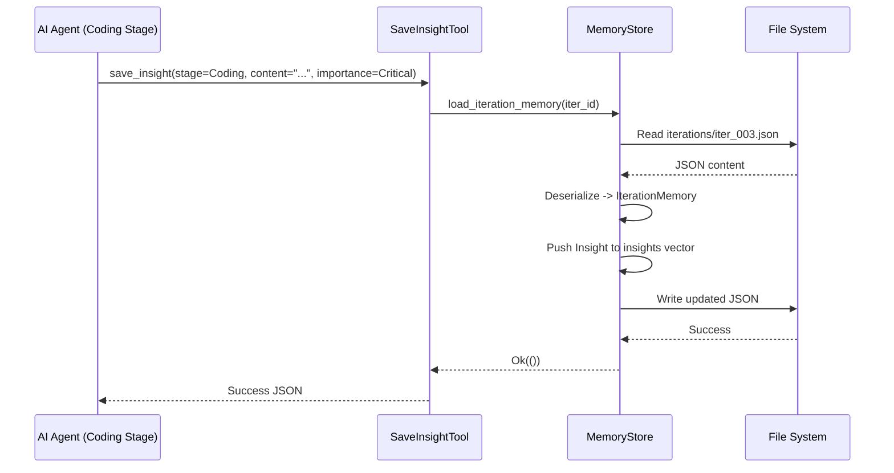
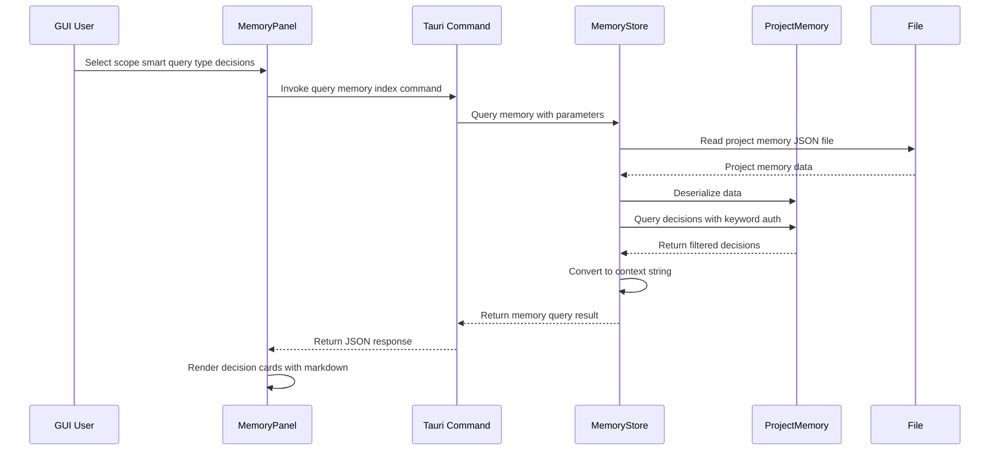

**Memory Domain Technical Documentation**

**Version:** 1.0  
**Last Updated:** 2025-01-09  
**Module:** `cowork-core/src/domain/memory`  
**Classification:** Core Business Domain

---

## 1. Overview

The **Memory Domain** provides the institutional knowledge management system for Cowork Forge, enabling project continuity across multiple development iterations through a sophisticated two-tier memory architecture. This domain implements the Repository pattern with Aggregate Root design to persist, query, and promote knowledge artifacts generated during the AI-driven development pipeline.

### 1.1 Purpose and Value

- **Knowledge Persistence**: Maintains architectural decisions, design patterns, and iteration-specific insights across the software development lifecycle
- **Context Continuity**: Enables evolutionary development by providing AI agents with historical context from previous iterations
- **Knowledge Elevation**: Implements promotion mechanisms that transform transient iteration insights into permanent project-level decisions and reusable patterns
- **Retrieval Intelligence**: Supports fuzzy keyword search, tag-based filtering, and LLM-optimized context generation

### 1.2 Architectural Position

The Memory Domain sits at the intersection of the Pipeline Domain (generating knowledge) and the Tools Domain (consuming knowledge). It serves as the system's "collective memory," accessible by both AI agents during execution and human users through the GUI/CLI interfaces.

---

## 2. Architecture & Design Principles

### 2.1 Domain-Driven Design Structure

The Memory Domain follows **Domain-Driven Design (DDD)** principles with clear aggregate boundaries:

```
┌─────────────────────────────────────────────────────────────┐
│                    ProjectMemory                             │
│                  (Aggregate Root)                            │
├─────────────────────────────────────────────────────────────┤
│  ┌──────────────┐  ┌──────────────┐  ┌──────────────────┐  │
│  │  Decisions   │  │   Patterns   │  │ ProjectContext   │  │
│  │   [Vec]      │  │    [Vec]     │  │                  │  │
│  └──────────────┘  └──────────────┘  └──────────────────┘  │
│  ┌────────────────────────────────────────────────────────┐ │
│  │        IterationKnowledge [HashMap<iteration_id>]      │ │
│  │  ┌──────────────┬──────────────┬──────────────────┐    │ │
│  │  │   Insights   │    Issues    │    Learnings     │    │ │
│  │  └──────────────┴──────────────┴──────────────────┘    │ │
│  └────────────────────────────────────────────────────────┘ │
└─────────────────────────────────────────────────────────────┘
```

### 2.2 Two-Tier Memory Architecture

The system implements a bifurcated storage model:

**Tier 1: Project-Level Memory** (`ProjectMemory`)
- **Scope**: Global across all iterations
- **Lifespan**: Persistent for project duration
- **Contents**: Architectural Decisions, Design Patterns, Project Context
- **Storage**: `memory/project/memory.json`

**Tier 2: Iteration-Level Memory** (`IterationKnowledge` / `IterationMemory`)
- **Scope**: Specific to a single iteration
- **Lifespan**: Rotational (subject to retention policies)
- **Contents**: Insights, Issues, Learnings, Compressed stage summaries
- **Storage**: `memory/iterations/{iteration_id}.json`

### 2.3 Repository Pattern Implementation

The `MemoryStore` acts as the repository interface, abstracting JSON file persistence details from domain logic. It provides:
- Aggregate persistence for `ProjectMemory`
- CRUD operations for iteration-specific memories
- Query engine with filtering and merging capabilities
- Knowledge promotion orchestration

---

## 3. Core Domain Models

### 3.1 ProjectMemory (Aggregate Root)

The central aggregate encapsulating all project-level knowledge:

```rust
pub struct ProjectMemory {
    pub project_id: String,
    pub created_at: DateTime<Utc>,
    pub updated_at: DateTime<Utc>,
    pub decisions: Vec<Decision>,
    pub patterns: Vec<Pattern>,
    pub context: ProjectContext,
    pub iteration_knowledge: HashMap<String, IterationKnowledge>,
}
```

**Key Behaviors:**
- `query_decisions(keyword)`: Fuzzy search across decision titles and contexts
- `query_patterns(tag)`: Filter patterns by category tags
- `save_iteration_knowledge()`: Cache compressed iteration summaries
- `cleanup_old_knowledge(keep_count)`: Enforce retention policies

### 3.2 IterationKnowledge

Compressed snapshot of an iteration's essential information for quick context loading:

```rust
pub struct IterationKnowledge {
    pub iteration_id: String,
    pub summaries: DocumentSummaries,  // Compressed idea, PRD, design, plan
    pub tech_stack: TechStackMetadata,
    pub key_decisions: Vec<String>,    // References to project decisions
    pub key_patterns: Vec<String>,     // References to project patterns
    pub code_structure: CodeStructureSummary,
    pub known_issues: Vec<String>,
    pub created_at: DateTime<Utc>,
}
```

### 3.3 IterationMemory

Detailed capture of iteration execution telemetry:

```rust
pub struct IterationMemory {
    pub iteration_id: String,
    pub insights: Vec<Insight>,    // AI-generated observations
    pub issues: Vec<Issue>,        // Problems encountered
    pub learnings: Vec<Learning>,  // Technical discoveries
    pub stage_results: Vec<StageResult>,
}
```

### 3.4 Value Objects

**Decision**: Captured architectural choices with consequences
```rust
pub struct Decision {
    pub id: String,
    pub title: String,
    pub context: String,
    pub decision: String,
    pub consequences: Vec<String>,
    pub created_at: DateTime<Utc>,
    pub iteration_id: Option<String>,  // Source iteration if promoted
}
```

**Pattern**: Reusable design solutions
```rust
pub struct Pattern {
    pub id: String,
    pub name: String,
    pub description: String,
    pub usage_examples: Vec<String>,
    pub tags: Vec<String>,
    pub code_example: Option<String>,
    pub created_at: DateTime<Utc>,
}
```

**Insight**: Transient observations with importance levels
```rust
pub struct Insight {
    pub id: String,
    pub content: String,
    pub stage: PipelineStage,
    pub importance: ImportanceLevel,  // Critical, Important, Normal
    pub created_at: DateTime<Utc>,
    pub promoted_to_decision: bool,
}
```

---

## 4. Persistence Layer

### 4.1 Storage Structure

```
.cowork-v2/
└── memory/
    ├── project/
    │   └── memory.json          # ProjectMemory aggregate
    └── iterations/
        ├── iter_001.json        # IterationMemory for iteration 1
        ├── iter_002.json        # IterationMemory for iteration 2
        └── ...
```

### 4.2 MemoryStore Interface

The `MemoryStore` provides the primary API for persistence operations:

**Project Memory Operations:**
- `load_project_memory(project_id) -> Result<ProjectMemory>`
- `save_project_memory(&ProjectMemory) -> Result<()>`
- `add_decision(project_id, Decision) -> Result<()>`
- `add_pattern(project_id, Pattern) -> Result<()>`

**Iteration Memory Operations:**
- `load_iteration_memory(iteration_id) -> Result<IterationMemory>`
- `save_iteration_memory(&IterationMemory) -> Result<()>`

**Query Operations:**
- `query(&MemoryQuery, iteration_id: Option<&str>) -> Result<MemoryQueryResult>`

### 4.3 Serialization Strategy

- **Format**: Human-readable pretty-printed JSON (`serde_json::to_string_pretty`)
- **Temporal Tracking**: ISO 8601 UTC timestamps via `chrono::DateTime<Utc>`
- **Schema Evolution**: Forward-compatible struct definitions with `#[serde(default)]`

---

## 5. Query Engine

### 5.1 Query Scopes

The query engine supports three semantic scopes:

| Scope | Description | Use Case |
|-------|-------------|----------|
| `Project` | Query only project-level decisions and patterns | Historical context retrieval |
| `Iteration` | Query only specific iteration insights/issues | Debugging specific iteration |
| `Smart` | Merged view: Project memory + latest iteration knowledge | Active development context |

### 5.2 Query Types

```rust
pub enum MemoryQueryType {
    Decisions,    // Architectural decisions only
    Patterns,     // Design patterns only
    Insights,     // AI observations only
    Issues,       // Known problems only
    Learnings,    // Technical discoveries only
    All,          // Unified search across all types
}
```

### 5.3 Search Capabilities

**Fuzzy Keyword Search:**
- Case-insensitive substring matching on titles and content
- Tokenization of search terms for partial matches
- Relevance scoring for result ranking

**Tag-Based Filtering:**
- Pattern retrieval by category tags (e.g., "architecture", "performance", "security")
- Multi-tag intersection support

**Temporal Filtering:**
- Date range constraints for knowledge retrieval
- "Latest N" iteration limiting

### 5.4 LLM Context Generation

The `MemoryQueryResult` provides `to_context_string()` method that formats search results into optimized prompts for LLM consumption:

```rust
impl MemoryQueryResult {
    pub fn to_context_string(&self) -> String {
        // Formats decisions, patterns, and insights
        // into structured markdown suitable for 
        // inclusion in AI agent prompts
    }
}
```

---

## 6. Knowledge Promotion

### 6.1 Promotion Workflow

Knowledge promotion elevates transient iteration insights to permanent project assets:

```
┌──────────────┐     Critical Importance      ┌──────────────┐
│   Insight    │ ───────────────────────────> │   Decision   │
│  (Iteration) │    [PromoteToDecisionTool]   │   (Project)  │
└──────────────┘                              └──────────────┘

┌──────────────┐     Reusable Solution         ┌──────────────┐
│   Learning   │ ───────────────────────────> │    Pattern   │
│  (Iteration) │    [PromoteToPatternTool]    │   (Project)  │
└──────────────┘                              └──────────────┘
```

### 6.2 Automatic Promotion

The system implements automatic promotion for **Critical** importance insights:
- During iteration finalization, `promote_insights_to_decisions()` scans for insights marked `ImportanceLevel::Critical`
- Automatically creates Decision entries with back-references to source iteration
- Prevents knowledge loss from high-impact observations

### 6.3 Manual Promotion Tools

**PromoteToDecisionTool**: Elevates insights to architectural decisions
- Parameters: title, context, decision text, consequences array
- Validation: Ensures uniqueness of decision titles
- Side Effects: Updates ProjectMemory and persists to disk

**PromoteToPatternTool**: Creates reusable design patterns
- Parameters: name, description, usage examples, tags, optional code example
- Validation: Checks for naming conflicts
- Indexing: Adds to searchable pattern registry

---

## 7. Tool Integration (ADK)

The Memory Domain exposes 10 specialized tools through the Agent Development Kit (ADK) for AI agent interaction:

### 7.1 Memory Tools (`memory_tools.rs`)

| Tool | Purpose | Target Tier |
|------|---------|-------------|
| `QueryMemoryTool` | Flexible memory retrieval with scope/type filtering | Both |
| `SaveInsightTool` | Capture AI observations during execution | Iteration |
| `SaveIssueTool` | Record problems encountered | Iteration |
| `SaveLearningTool` | Document technical discoveries | Iteration |
| `PromoteToDecisionTool` | Elevate insight to project decision | Project |
| `PromoteToPatternTool` | Create reusable pattern | Project |

**QueryMemoryTool Parameters:**
```rust
pub struct QueryMemoryParams {
    pub scope: MemoryScope,        // Project, Iteration, Smart
    pub query_type: MemoryQueryType, // Decisions, Patterns, Insights, All
    pub keywords: Vec<String>,     // Fuzzy search terms
    pub limit: Option<usize>,      // Result limiting
    pub iteration_id: Option<String>, // Required for Iteration scope
}
```

### 7.2 Knowledge Tools (`knowledge_tools.rs`)

| Tool | Purpose |
|------|---------|
| `LoadDocumentSummaryTool` | Retrieve compressed stage summaries (idea, PRD, design, plan) |
| `LoadBaseKnowledgeTool` | Load historical knowledge from base iterations |
| `SaveKnowledgeSnapshotTool` | Persist complete knowledge state with metadata |
| `ListFilesWorkspaceTool` | Workspace introspection with metadata extraction |

---

## 8. Integration Patterns

### 8.1 Pipeline Integration

During the 7-stage pipeline execution:
1. **Capture**: Agents use `SaveInsightTool` during stages to record observations
2. **Aggregation**: At iteration completion, `SaveKnowledgeSnapshotTool` compresses stage artifacts into `IterationKnowledge`
3. **Inheritance**: Evolution iterations use `LoadBaseKnowledgeTool` to retrieve context from previous iterations
4. **Context Injection**: `QueryMemoryTool` provides historical decisions/patterns to agent prompts

### 8.2 GUI Integration

The Memory Domain supports the React-based MemoryPanel:
- **Real-time Queries**: `query_memory_index` Tauri command delegates to `MemoryStore`
- **Visualization**: Category-based color coding (Decisions=blue, Patterns=green, Insights=yellow)
- **Detail Views**: Markdown rendering of full content with temporal metadata
- **Promotion UI**: Workflow for converting insights to decisions via modal interfaces

### 8.3 Retention Management

The `cleanup_old_knowledge(keep_count)` method implements rotational storage:
- Maintains only the most recent N iterations in detail (`IterationMemory`)
- Preserves compressed summaries (`IterationKnowledge`) indefinitely
- Project-level decisions and patterns persist forever

---

## 9. Data Flow Examples

### 9.1 Knowledge Capture Flow



### 9.2 Cross-Iteration Query Flow



---

## 10. Configuration & Constraints

### 10.1 Storage Constraints

- **Format**: JSON files with pretty printing (human-readable)
- **Size Limits**: No hard limits, but queries implement `limit` parameters for performance
- **Concurrency**: File-based locking prevents corruption during concurrent access
- **Path Validation**: All paths constrained to project workspace (`.cowork-v2/memory/`)

### 10.2 Retention Policies

- **Default Iteration Keep Count**: 10 (configurable via `cleanup_old_knowledge`)
- **Compression**: `IterationKnowledge` maintains 1000-character summaries of stage documents
- **Archival**: No automatic deletion of project-level memories (decisions/patterns)

### 10.3 Performance Characteristics

- **Query Latency**: < 100ms for typical projects (< 50 iterations)
- **Memory Footprint**: ProjectMemory loaded once per session, iteration memories loaded on demand
- **Indexing**: In-memory HashMap for iteration knowledge lookups; linear scan for text search

---

## 11. Best Practices

### 11.1 For Agent Developers

1. **Insight Granularity**: Save insights at task completion boundaries, not per operation
2. **Importance Levels**: Reserve `Critical` for architectural implications triggering promotion
3. **Pattern Completeness**: When promoting learnings to patterns, include concrete usage examples

### 11.2 For System Integrators

1. **Query Scope Selection**: Use `Smart` scope for active development; `Project` for architectural planning
2. **Context Window Management**: Respect `limit` parameters to prevent LLM context overflow
3. **Promotion Timing**: Promote insights to decisions during iteration review, not during active coding

---

## 12. Related Documentation

- **Pipeline Domain**: Stage execution and agent orchestration
- **Tools Domain**: ADK tool implementation patterns
- **Persistence Domain**: JSON store implementation details
- **GUI Frontend**: MemoryPanel component architecture

---

*This documentation reflects the Memory Domain implementation as of the current system version. For implementation details, refer to the source files listed in the associated files section.*
