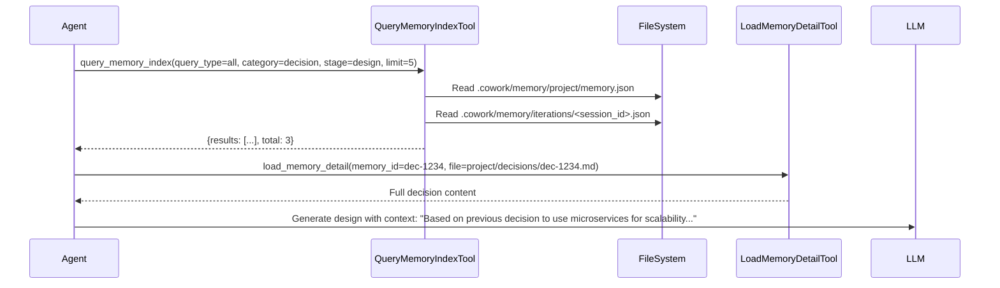
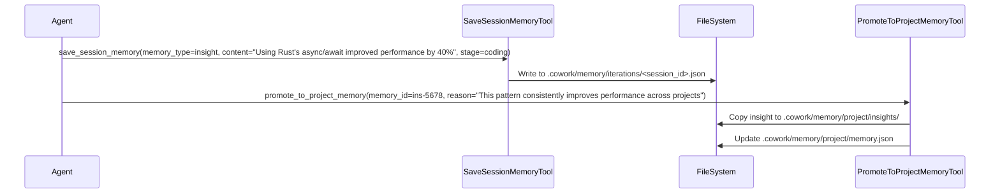

# Memory Domain Documentation

## Overview

The Memory Domain in Cowork Forge is a foundational component that enables context-aware AI-assisted software development by maintaining a dual-layer memory system: persistent project-level memory and transient session-level memory. This architecture allows the system to learn from past decisions and experiences across multiple development iterations while capturing real-time insights during active development sessions.

The Memory Domain serves as the knowledge repository for the entire system, providing AI agents with historical context to make informed decisions during requirement generation, architecture design, code generation, and quality assurance. By preserving architectural decisions, reusable patterns, and technical learnings, the Memory Domain significantly enhances the consistency, quality, and efficiency of automated software development workflows.

## Architecture and Design Principles

The Memory Domain implements a clean, hierarchical storage architecture based on file-based persistence with JSON serialization, following the principle of separation of concerns between long-term knowledge and ephemeral working memory.

### Dual-Layer Memory Structure

The system maintains two distinct memory layers with different lifecycles and purposes:

#### Project Memory (Persistent)
- **Purpose**: Long-term storage of architectural decisions, reusable patterns, and technical context that persists across all iterations of a project
- **Scope**: Project-wide knowledge that informs future development cycles
- **Persistence**: Stored in `.cowork/memory/project/` directory and survives session completion
- **Content Types**:
  - **Decisions**: Key architectural choices with context, rationale, and consequences
  - **Patterns**: Reusable design patterns and best practices
  - **Context**: Technical metadata including tech stack, architecture style, and key dependencies

#### Session Memory (Ephemeral)
- **Purpose**: Temporary storage of insights, issues, and learnings specific to a single development session
- **Scope**: Limited to the current iteration or development cycle
- **Persistence**: Stored in `.cowork/memory/iterations/<session_id>.json` and cleared upon session completion
- **Content Types**:
  - **Insights**: Valuable observations made during development stages
  - **Issues**: Problems encountered during execution
  - **Learnings**: General takeaways from the development process

This separation ensures that critical architectural knowledge is preserved while allowing the system to experiment and learn without cluttering the permanent knowledge base.

## Core Data Models

The Memory Domain defines structured data models that ensure consistency and semantic clarity in knowledge representation.

### Project Memory Models

```rust
#[derive(Debug, Clone, Serialize, Deserialize, Default)]
pub struct ProjectMemory {
    pub decisions: Vec<Decision>,
    pub patterns: Vec<Pattern>,
    pub context: ProjectContext,
}

#[derive(Debug, Clone, Serialize, Deserialize)]
pub struct Decision {
    pub id: String, // Format: dec-{iteration_id}-{timestamp}
    pub title: String,
    pub context: String, // Background and problem statement
    pub decision: String, // The actual decision made
    pub consequences: Vec<String>, // Pros and cons of the decision
    pub iteration_id: String, // Source iteration for traceability
    pub created_at: DateTime<Utc>,
}

#[derive(Debug, Clone, Serialize, Deserialize)]
pub struct Pattern {
    pub id: String, // Format: pat-{iteration_id}-{timestamp}
    pub name: String,
    pub description: String,
    pub usage: Vec<String>, // When and how to apply this pattern
    pub tags: Vec<String>, // Categorization for filtering
    pub code_example: Option<String>, // Optional code snippet
    pub iteration_id: String, // Source iteration for traceability
    pub created_at: DateTime<Utc>,
}

#[derive(Debug, Clone, Serialize, Deserialize, Default)]
pub struct ProjectContext {
    pub tech_stack: Vec<String>, // Frameworks, languages, libraries
    pub architecture_style: Option<String>, // e.g., "Clean Architecture", "Hexagonal"
    pub key_dependencies: Vec<Dependency>,
}

#[derive(Debug, Clone, Serialize, Deserialize)]
pub struct Dependency {
    pub name: String,
    pub version: String,
    pub purpose: String, // Why this dependency was chosen
}
```

### Session Memory Models

```rust
#[derive(Debug, Clone, Serialize, Deserialize, Default)]
pub struct IterationMemory {
    pub iteration_id: String,
    pub insights: Vec<Insight>,
    pub issues: Vec<Issue>,
    pub learnings: Vec<Learning>,
}

#[derive(Debug, Clone, Serialize, Deserialize)]
pub struct Insight {
    pub stage: String, // Stage where insight was gained (idea, prd, design, etc.)
    pub content: String,
    pub importance: Importance, // Critical, Important, Normal
    pub created_at: DateTime<Utc>,
}

#[derive(Debug, Clone, Serialize, Deserialize)]
pub struct Issue {
    pub stage: String, // Stage where issue was encountered
    pub content: String,
    pub resolved: bool,
    pub created_at: DateTime<Utc>,
    pub resolved_at: Option<DateTime<Utc>>,
}

#[derive(Debug, Clone, Serialize, Deserialize)]
pub struct Learning {
    pub content: String, // General takeaway from the session
    pub created_at: DateTime<Utc>,
}

#[derive(Debug, Clone, Copy, Serialize, Deserialize)]
#[serde(rename_all = "snake_case")]
pub enum Importance {
    Critical,
    Important,
    Normal,
}
```

These models are designed with serialization in mind, using `serde` for seamless JSON persistence and retrieval. Each entity includes metadata (timestamps, source iteration IDs) to maintain provenance and traceability.

## Persistence Layer Implementation

The persistence layer, implemented in `memory_store.rs`, provides a robust repository pattern for managing memory data with comprehensive error handling and path management.

### Key Implementation Features

```rust
pub struct MemoryStore;

impl MemoryStore {
    // Project Memory Operations
    pub fn load_project_memory(&self) -> anyhow::Result<ProjectMemory> { /* ... */ }
    pub fn save_project_memory(&self, memory: &ProjectMemory) -> anyhow::Result<()> { /* ... */ }
    pub fn add_decision(&self, decision: Decision) -> anyhow::Result<()> { /* ... */ }
    pub fn add_pattern(&self, pattern: Pattern) -> anyhow::Result<()> { /* ... */ }
    
    // Iteration Memory Operations
    pub fn load_iteration_memory(&self, iteration_id: &str) -> anyhow::Result<IterationMemory> { /* ... */ }
    pub fn save_iteration_memory(&self, memory: &IterationMemory) -> anyhow::Result<()> { /* ... */ }
    pub fn ensure_iteration_memory(&self, iteration_id: &str) -> anyhow::Result<IterationMemory> { /* ... */ }
    
    // Query Operations
    pub fn query(&self, query: &MemoryQuery, current_iteration_id: Option<&str>) -> anyhow::Result<MemoryQueryResult> { /* ... */ }
}
```

### File System Structure

The persistence layer organizes memory data in a well-defined directory structure under the `.cowork` directory:

```
.cowork/
├── memory/
│   ├── project/
│   │   ├── memory.json          # ProjectMemory index
│   │   ├── decisions/
│   │   │   ├── dec-<id>.md      # Detailed decision content (Markdown)
│   │   │   └── ...
│   │   ├── patterns/
│   │   │   ├── pat-<id>.md      # Detailed pattern content (Markdown)
│   │   │   └── ...
│   │   └── context/
│   │       └── context.md       # Project context documentation
│   └── iterations/
│       ├── <session_id_1>.json  # IterationMemory for session 1
│       ├── <session_id_2>.json  # IterationMemory for session 2
│       └── ...
└── session.json                 # Tracks current/latest session
```

This structure ensures:
- **Isolation**: Each session's memory is stored separately
- **Traceability**: Decisions and patterns are linked to their source iteration
- **Efficiency**: Index files (JSON) enable fast querying without loading full content
- **Human readability**: Detailed content is stored in Markdown format for direct human inspection

The `MemoryStore` handles all file I/O operations with comprehensive error handling, automatically creating missing directories and files as needed. It supports both loading existing memory and creating new memory instances with default values.

## Memory Query System

The Memory Domain implements a sophisticated query system that enables AI agents to efficiently retrieve relevant historical knowledge.

### Query Parameters

The `MemoryQuery` structure supports flexible filtering with the following parameters:

| Parameter | Type | Description |
|----------|------|-------------|
| `scope` | `MemoryScope` | Determines which memory layer to query: `Project`, `Iteration`, or `Smart` (both) |
| `query_type` | `MemoryQueryType` | Filters by category: `Decisions`, `Patterns`, `Insights`, or `All` |
| `keywords` | `Vec<String>` | Text-based search terms for content matching |
| `stage` | `Option<String>` | Filters by development stage (e.g., "design", "coding") |
| `limit` | `Option<i64>` | Maximum number of results to return |

### Query Execution Flow

The query system follows a multi-stage execution pattern:

1. **Scope Resolution**: Determines which memory layers to consult based on the `scope` parameter
2. **Layer Processing**: For each applicable layer, loads the corresponding index file
3. **Content Filtering**: Applies filters based on `query_type`, `keywords`, and `stage`
4. **Result Aggregation**: Combines results from multiple layers (when `Smart` scope is used)
5. **Limit Application**: Truncates results to the specified limit
6. **Sorting**: Orders results by creation time (newest first)

The `query` method in `MemoryStore` implements this logic with separate handlers for project and iteration memory, ensuring optimal performance by avoiding unnecessary data loading.

## Memory Tools Interface

The Memory Domain exposes its functionality to AI agents through five specialized tools that implement the ADK Tool trait, providing a safe, controlled interface for memory operations.

### QueryMemoryIndexTool

```rust
pub struct QueryMemoryIndexTool;

#[async_trait]
impl Tool for QueryMemoryIndexTool {
    fn name(&self) -> &str { "query_memory_index" }
    
    fn description(&self) -> &str {
        "Query memory index to get a list of memory items (decisions, experiences, patterns, records). Use this before loading detailed memory content to find relevant items."
    }
    
    fn parameters_schema(&self) -> Option<Value> {
        Some(json!({
            "type": "object",
            "properties": {
                "query_type": {
                    "type": "string",
                    "description": "Which memory to query: 'all' (both project and session), 'project' (project-level only), or 'session' (current session only)",
                    "enum": ["all", "project", "session"],
                    "default": "all"
                },
                "category": {
                    "type": "string",
                    "description": "Filter by memory category: 'decision', 'experience', 'pattern', 'record', or 'all' for all categories",
                    "enum": ["decision", "experience", "pattern", "record", "all"],
                    "default": "all"
                },
                "stage": {
                    "type": "string",
                    "description": "Filter by stage (e.g., 'idea', 'prd', 'design', 'plan', 'coding', 'check'). Optional.",
                    "default": null
                },
                "limit": {
                    "type": "number",
                    "description": "Maximum number of results to return. Default: 20",
                    "default": 20
                }
            },
            "required": []
        }))
    }
}
```

**Purpose**: Enables agents to discover relevant memory items without loading full content, reducing token usage and improving response time.

**Usage Pattern**: Agents first call `query_memory_index` to identify relevant items, then use `load_memory_detail` to retrieve full content.

### LoadMemoryDetailTool

```rust
pub struct LoadMemoryDetailTool;

#[async_trait]
impl Tool for LoadMemoryDetailTool {
    fn name(&self) -> &str { "load_memory_detail" }
    
    fn description(&self) -> &str {
        "Load the detailed content of a memory item from its markdown file. Use this after querying the index to get the full details of a specific memory item."
    }
    
    fn parameters_schema(&self) -> Option<Value> {
        Some(json!({
            "type": "object",
            "properties": {
                "memory_id": {
                    "type": "string",
                    "description": "The ID of the memory item to load"
                },
                "file": {
                    "type": "string",
                    "description": "The file path to the memory detail (as returned by query_memory_index)"
                }
            },
            "required": ["memory_id", "file"]
        }))
    }
}
```

**Purpose**: Retrieves the full Markdown content of a memory item identified by its ID and file path.

**Implementation**: Uses the file path returned by `query_memory_index` to directly read the corresponding Markdown file from the filesystem.

### SaveSessionMemoryTool

```rust
pub struct SaveSessionMemoryTool;

#[async_trait]
impl Tool for SaveSessionMemoryTool {
    fn name(&self) -> &str { "save_session_memory" }
    
    fn description(&self) -> &str {
        "Save a new memory item to the current session's memory. Use this to record insights, issues, or learnings during development."
    }
    
    fn parameters_schema(&self) -> Option<Value> {
        Some(json!({
            "type": "object",
            "properties": {
                "memory_type": {
                    "type": "string",
                    "description": "Type of memory to save: 'insight', 'issue', or 'learning'",
                    "enum": ["insight", "issue", "learning"]
                },
                "title": {
                    "type": "string",
                    "description": "Title or summary of the memory item"
                },
                "content": {
                    "type": "string",
                    "description": "Detailed content of the memory item"
                },
                "stage": {
                    "type": "string",
                    "description": "Development stage where this memory was created (e.g., 'design', 'coding')"
                }
            },
            "required": ["memory_type", "content"]
        }))
    }
}
```

**Purpose**: Allows agents to record temporary knowledge during a development session.

**Implementation**: Creates a new entry in the current session's memory with appropriate metadata and saves it to the session-specific JSON file.

### PromoteToProjectMemoryTool

```rust
pub struct PromoteToProjectMemoryTool;

#[async_trait]
impl Tool for PromoteToProjectMemoryTool {
    fn name(&self) -> &str { "promote_to_project_memory" }
    
    fn description(&self) -> &str {
        "Promote a session memory item to the project memory, making it available across all future iterations. Use this for decisions, patterns, or insights that have proven valuable and should be preserved long-term."
    }
    
    fn parameters_schema(&self) -> Option<Value> {
        Some(json!({
            "type": "object",
            "properties": {
                "memory_id": {
                    "type": "string",
                    "description": "The ID of the memory item to promote"
                },
                "reason": {
                    "type": "string",
                    "description": "Why this item should be promoted to project memory"
                }
            },
            "required": ["memory_id", "reason"]
        }))
    }
}
```

**Purpose**: Enables knowledge transfer from ephemeral session memory to persistent project memory.

**Implementation**: 
1. Locates the memory item in the current session's memory
2. Creates a new entry in the project memory with a new ID
3. Copies the Markdown content to the project memory directory
4. Updates the project memory index with timeline information
5. Preserves provenance by recording the original session ID

This tool is critical for the system's learning capability, allowing valuable insights to become institutional knowledge.

### GetMemoryContextTool

```rust
pub struct GetMemoryContextTool;

#[async_trait]
impl Tool for GetMemoryContextTool {
    fn name(&self) -> &str { "get_memory_context" }
    
    fn description(&self) -> &str {
        "Get a summary of the current memory context, including counts of decisions, patterns, insights, and issues. Useful for system status reporting and agent decision-making."
    }
    
    fn parameters_schema(&self) -> Option<Value> {
        Some(json!({
            "type": "object",
            "properties": {
                "include_details": {
                    "type": "boolean",
                    "description": "Whether to include detailed summaries of recent items",
                    "default": false
                }
            },
            "required": []
        }))
    }
}
```

**Purpose**: Provides a high-level overview of the memory state for system monitoring and agent context awareness.

**Implementation**: Aggregates counts from both project and session memory layers and optionally provides summaries of the most recent items.

## Integration with Other Domains

The Memory Domain is deeply integrated with other system components, forming a critical knowledge pipeline.

### Interaction with Pipeline Domain

The Memory Domain is a key enabler for the Pipeline Domain's AI agents. During each pipeline stage (Idea, PRD, Design, Plan, Coding, Check), agents use memory tools to:

1. **Query for relevant context**: Before generating requirements or design, agents query for past decisions on similar problems
2. **Apply patterns**: Agents identify and apply proven patterns from the project memory
3. **Avoid repetition**: Agents check for previous solutions to similar issues
4. **Improve quality**: Agents use lessons learned from previous iterations to enhance current output

This integration transforms the system from a stateless generator to a context-aware, learning system.

### Interaction with Tool Support Domain

The Memory Domain provides the knowledge foundation for other tool categories:
- **Artifact Tools**: Memory items inform the content of generated PRDs, design documents, and delivery reports
- **Data Tools**: Memory can influence requirement prioritization and feature design
- **Control Tools**: Human feedback captured through HITL tools can be promoted to project memory
- **Modify Tools**: Change request analysis leverages historical decisions to assess impact

### Interaction with Storage Domain

The Memory Domain relies on the Storage Domain for:
- Path resolution to `.cowork/memory/` directories
- Session management via `session.json`
- Directory creation and validation

This dependency ensures consistent file system structure across the entire system.

## Usage Patterns and Best Practices

### AI Agent Usage Patterns

**Pattern 1: Context-Aware Generation**


**Pattern 2: Knowledge Capture and Promotion**


### Human Usage Patterns

**Pattern 1: Reviewing Historical Decisions**
- Developers can manually inspect `.cowork/memory/project/decisions/` directory to understand architectural rationale
- Product managers can review patterns to ensure consistency with business goals

**Pattern 2: Knowledge Transfer**
- Tech leads can promote valuable session insights to project memory during code reviews
- New team members can study project memory to understand established patterns

## Error Handling and Reliability

The Memory Domain implements comprehensive error handling to ensure system reliability:

1. **File System Errors**: All I/O operations use `anyhow::Result` with descriptive error messages
2. **Serialization Errors**: JSON parsing failures provide context about malformed data
3. **Missing Files**: Gracefully handles missing memory files by returning empty structures
4. **Path Validation**: Ensures all file paths are within the `.cowork` directory to prevent security issues
5. **Atomic Operations**: Writes are performed with temporary files and atomic renames where possible
6. **Fallback Behavior**: When memory queries return no results, agents proceed with default patterns

## Performance Considerations

The Memory Domain is designed for efficiency in a high-frequency AI agent environment:

1. **Index-Based Querying**: Agents query lightweight JSON index files before loading full content
2. **Content Separation**: Detailed Markdown content is stored separately from metadata
3. **Caching**: MemoryStore instances can be cached in memory between operations
4. **Limit Enforcement**: Results are capped at reasonable limits to prevent excessive token usage
5. **Selective Loading**: Only requested memory items are loaded, minimizing memory footprint

## Conclusion

The Memory Domain is a sophisticated, production-ready knowledge management system that transforms Cowork Forge from a simple code generator into a truly intelligent, learning software development assistant. By implementing a dual-layer memory architecture with robust persistence, flexible querying, and controlled promotion mechanisms, the domain enables:

- **Consistency**: Reuse of proven patterns and decisions across projects
- **Efficiency**: Reduction of redundant work through knowledge reuse
- **Quality**: Improved outcomes by leveraging historical lessons
- **Traceability**: Clear audit trail of architectural decisions
- **Adaptability**: Continuous learning from each development cycle

The domain's clean separation of concerns, comprehensive tool interface, and integration with the broader system make it a cornerstone of Cowork Forge's AI-assisted development capabilities.