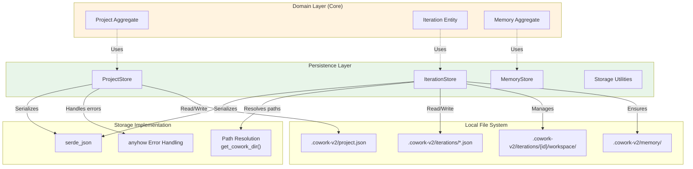
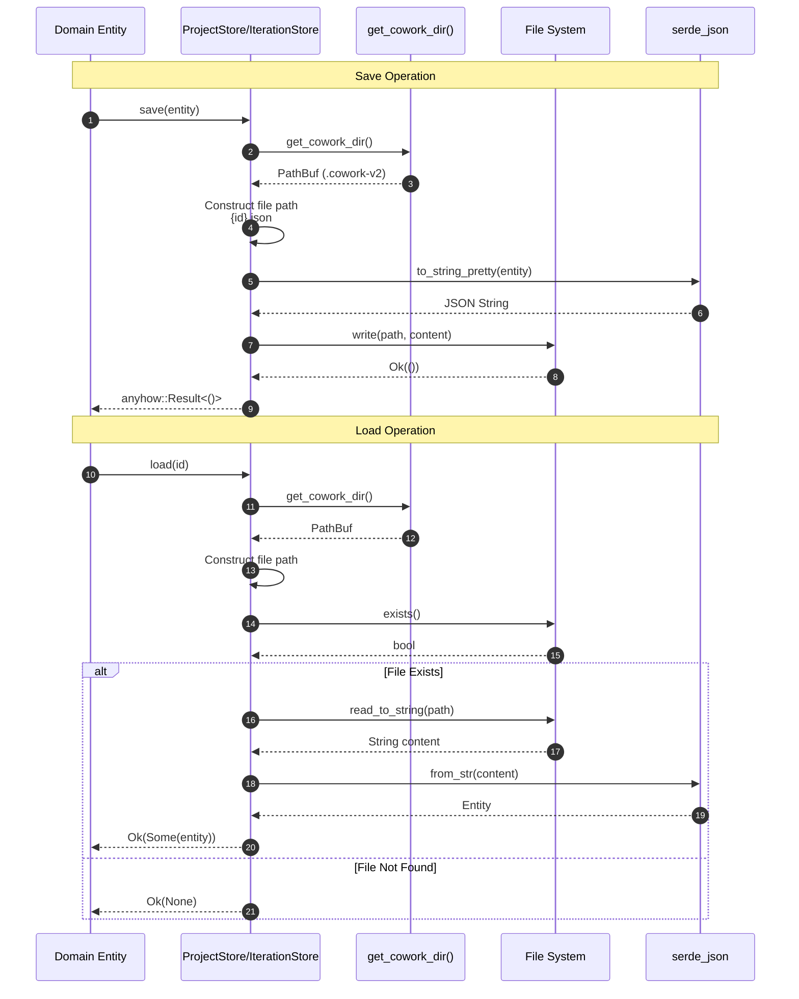
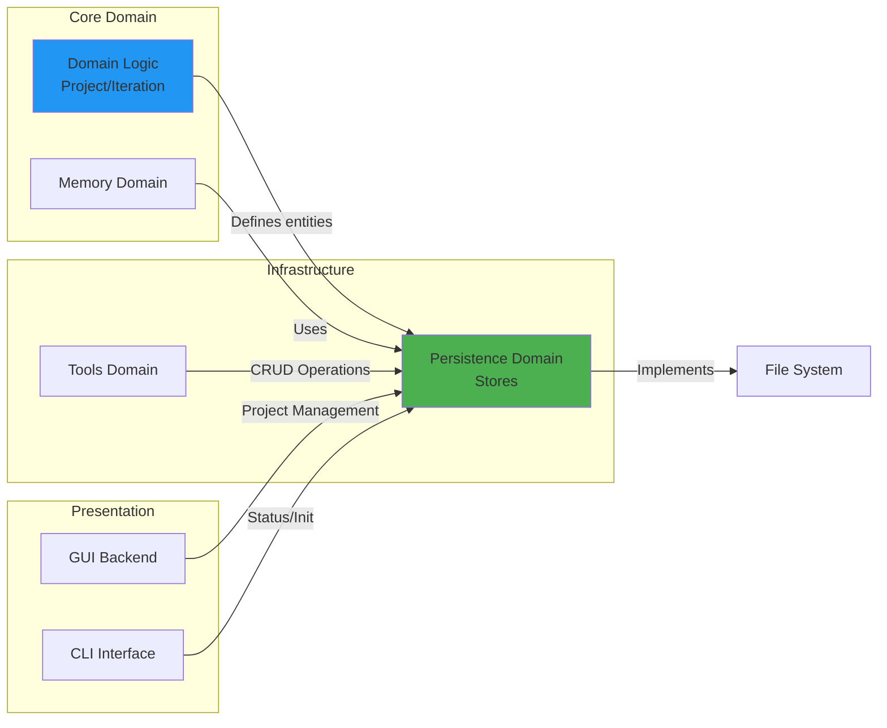

**Persistence Domain Technical Documentation**

**Cowork Forge** | **Infrastructure Layer** | **Generation Time:** 2025-01-09 08:23:45 UTC

---

## 1. Overview

The **Persistence Domain** provides durable storage abstractions for the Cowork Forge platform, implementing a file-based Data Access Layer (DAL) that persists domain entities to the local filesystem. This domain bridges the core business logic (Project, Iteration, and Memory aggregates) with long-term storage, ensuring project continuity across development sessions and system restarts.

**Key Responsibilities:**
- Entity serialization and deserialization (JSON-based)
- Workspace directory structure management (`.cowork-v2` convention)
- Platform-specific path resolution and file I/O operations
- Iteration-scoped workspace isolation for artifact storage
- Atomic write operations and data integrity enforcement

**Architectural Classification:** Infrastructure Domain (supporting Core Business Domains)

---

## 2. Architectural Position

The Persistence Domain sits at the infrastructure layer of the Hexagonal Architecture, implementing the **Repository Pattern** to abstract storage mechanics from domain logic. It provides stateless Data Access Objects (DAOs) that translate between domain entities and persistent storage formats.

### 2.1 Layer Relationships



### 2.2 Design Patterns

- **Repository Pattern:** Abstracts data access through store interfaces (`ProjectStore`, `IterationStore`), allowing the domain layer to remain persistence-agnostic
- **Data Access Layer (DAL):** Stateless service layer handling all CRUD operations and query capabilities
- **Workspace Isolation:** Each iteration maintains an isolated workspace directory, preventing artifact collisions between concurrent or historical iterations

---

## 3. Core Components

### 3.1 ProjectStore

**Location:** `crates/cowork-core/src/persistence/project_store.rs`

Manages the persistence lifecycle of the `Project` aggregate root, handling project metadata, iteration tracking, and configuration storage.

**Key Operations:**

| Method | Signature | Description |
|--------|-----------|-------------|
| `load` | `() -> Result<Option<Project>>` | Loads project metadata from `project.json`; returns `None` if not initialized |
| `save` | `(&Project) -> Result<()>` | Persists project state with pretty-printed JSON formatting |
| `exists` | `() -> Result<bool>` | Checks for project initialization in the current workspace |
| `create` | `(name: &str, path: &Path) -> Result<Project>` | Initializes new project with directory structure scaffolding |
| `update` | `(&Project) -> Result<()>` | Updates existing project metadata |
| `add_iteration` | `(iteration_id: &str) -> Result<()>` | Registers new iteration in project's iteration collection |
| `set_current_iteration` | `(iteration_id: &str) -> Result<()>` | Updates pointer to active iteration |

**Storage Schema:**
```json
{
  "id": "uuid-v4-string",
  "name": "Project Name",
  "description": "Optional description",
  "path": "/absolute/path/to/project",
  "tech_stack": {
    "language": "Rust",
    "framework": "Tauri",
    "project_type": "DesktopApp"
  },
  "iterations": ["iter-001", "iter-002"],
  "current_iteration": "iter-002",
  "created_at": "2025-01-09T08:23:45Z",
  "updated_at": "2025-01-09T10:15:22Z"
}
```

### 3.2 IterationStore

**Location:** `crates/cowork-core/src/persistence/iteration_store.rs`

Manages iteration entities and their associated workspace artifacts. Implements the V2 architecture pattern with iteration-specific workspace isolation.

**Key Operations:**

| Method | Signature | Description |
|--------|-----------|-------------|
| `load` | `(iteration_id: &str) -> Result<Option<Iteration>>` | Retrieves specific iteration by UUID |
| `save` | `(&Iteration) -> Result<()>` | Persists iteration state to `iterations/{id}.json` |
| `delete` | `(iteration_id: &str) -> Result<()>` | Removes iteration metadata and optionally cleans workspace |
| `load_all` | `() -> Result<Vec<Iteration>>` | Retrieves all iterations sorted by iteration number (ascending) |
| `load_summaries` | `() -> Result<Vec<IterationSummary>>` | Lightweight query returning only essential metadata |
| `workspace_path` | `(iteration_id: &str) -> Result<PathBuf>` | Resolves absolute path to iteration's workspace directory |
| `ensure_workspace` | `(iteration_id: &str) -> Result<PathBuf>` | Idempotent directory creation for workspace and memory subdirectories |
| `iteration_path` | `(iteration_id: &str) -> PathBuf` | Constructs path to iteration artifact subdirectory |

**Workspace Structure:**
```
.cowork-v2/
├── project.json
├── iterations/
│   ├── iter-001.json
│   ├── iter-002.json
│   └── iter-{uuid}/
│       ├── workspace/          # Generated artifacts (code, docs)
│       │   ├── src/
│       │   ├── docs/
│       │   └── ...
│       └── memory/             # Knowledge snapshots
│           └── knowledge.json
```

### 3.3 Storage Utilities

**Location:** `crates/cowork-core/src/storage/*.rs`

Provides low-level storage primitives and cross-cutting concerns for persistence operations.

**Key Functions:**

- **`get_cowork_dir()`**: Resolves the `.cowork-v2` directory path relative to project root with platform-specific path normalization (handles UNC paths on Windows)
- **`get_iteration_id()`**: Retrieves current active iteration identifier from global state or filesystem
- **Path Validation**: Ensures all file operations remain within project workspace boundaries (security containment)

---

## 4. Storage Conventions & Schema

### 4.1 Directory Structure

The Persistence Domain enforces a strict directory convention under the `.cowork-v2` hidden directory at project root:

| Path Component | Purpose | Lifecycle |
|----------------|---------|-----------|
| `project.json` | Project metadata, tech stack, iteration registry | Persistent (project lifetime) |
| `iterations/` | Iteration metadata storage | Persistent (append-only) |
| `iterations/{id}/workspace/` | Generated artifacts, code, documentation | Iteration-scoped |
| `iterations/{id}/memory/` | Knowledge snapshots, learning data | Iteration-scoped |
| `memory/` | Global project memory indices | Persistent |

### 4.2 Serialization Strategy

- **Format:** JSON (pretty-printed with 2-space indentation for human readability)
- **Library:** `serde_json` with `to_string_pretty()` for writes and `from_str()` for reads
- **Error Handling:** `anyhow` crate for context-rich error propagation
- **Encoding:** UTF-8 standard encoding

### 4.3 Concurrency Model

The implementation utilizes **synchronous, blocking I/O** operations suitable for the desktop application context:
- File operations are atomic (write-to-temp-then-rename pattern where applicable)
- No database locking mechanisms required (filesystem-level isolation)
- Suitable for single-user local execution model

---

## 5. Data Flow & Operations

### 5.1 Entity Persistence Flow



### 5.2 Workspace Initialization Flow

When creating a new iteration, the `IterationStore` ensures proper workspace scaffolding:

1. **Directory Creation:** `ensure_workspace()` creates `iterations/{id}/workspace/` recursively
2. **Memory Directory:** Ensures `iterations/{id}/memory/` exists for knowledge persistence
3. **Path Resolution:** Returns absolute `PathBuf` for downstream artifact generation
4. **Validation:** Confirms workspace containment within project boundaries

---

## 6. Error Handling & Safety

### 6.1 Error Strategy

- **Library:** `anyhow` for error context and propagation
- **Pattern:** Early return with `?` operator for I/O and serialization errors
- **User Feedback:** Errors bubble up to Interface layer (CLI/GUI) for user presentation
- **Recovery:** Graceful handling of missing files (returns `Option<T>` rather than failing)

### 6.2 Security Considerations

- **Path Traversal Prevention:** All paths resolved through `get_cowork_dir()` with validation that operations remain within `.cowork-v2` hierarchy
- **Workspace Containment:** File tools (in Tools Domain) validate paths against project root before delegation to Persistence Domain
- **Atomic Writes:** Critical metadata updates use write-temporary-rename pattern to prevent corruption on interruption

---

## 7. Integration with Other Domains

### 7.1 Upstream Dependencies (Consumers)

| Domain | Usage Pattern | Integration Point |
|--------|--------------|-------------------|
| **Domain Logic** | Core entities define structures being persisted | `Project`, `Iteration` structs passed to Store methods |
| **Tools Domain** | File tools, Data tools, Memory tools require storage | Direct Store instantiation for CRUD operations |
| **GUI Backend** | Project management, iteration listing | `ProjectManager` wraps Store operations for Tauri commands |
| **CLI Domain** | Project initialization, status checks | Direct Store usage in command handlers |

### 7.2 Downstream Dependencies (Providers)

| Service | Purpose |
|---------|---------|
| **File System** | Local disk I/O operations |
| **serde_json** | Serialization/deserialization engine |
| **anyhow** | Error handling and context |

### 7.3 Domain Relations Diagram



---

## 8. Implementation Considerations

### 8.1 Performance Characteristics

- **Latency:** Low (local filesystem operations, typically <10ms for metadata)
- **Throughput:** Suitable for document-sized JSON files (<10MB); not optimized for binary blob storage
- **Scalability:** Limited by filesystem performance; tested up to 100+ iterations per project
- **Memory:** Streaming deserialization not implemented; entire JSON documents loaded into memory (acceptable for metadata scale)

### 8.2 Migration & Evolution

The V2 architecture (current) maintains backward compatibility considerations:
- Schema evolution handled through serde's `default` attributes for new fields
- Directory structure versioned via `.cowork-v2` naming convention (allows future V3 alongside)
- No automated migration tools currently implemented; manual migration scripts for major version upgrades

### 8.3 Configuration

No external configuration required. Storage location is deterministic:
- **Path Resolution:** `{project_root}/.cowork-v2/`
- **Platform Handling:** Cross-platform path separators via `std::path::PathBuf`
- **Environment:** Respects standard filesystem permissions (UMASK on Unix, ACLs on Windows)

---

## 9. Usage Examples

### 9.1 Project Initialization
```rust
// Creates project structure and persists metadata
let project = ProjectStore::create("MyApp", &project_path)?;
ProjectStore::save(&project)?;
```

### 9.2 Iteration Lifecycle
```rust
// Save new iteration
let iteration = Iteration::new_genesis(&project_id, idea_description);
IterationStore::save(&iteration)?;

// Ensure workspace exists for artifact generation
let workspace = IterationStore::ensure_workspace(&iteration.id)?;
// workspace now points to .cowork-v2/iterations/{id}/workspace/
```

### 9.3 Query Operations
```rust
// Load all iterations sorted by number
let iterations = IterationStore::load_all()?;
for iter in iterations {
    println!("Iteration {}: {}", iter.number, iter.status);
}

// Check project existence
if ProjectStore::exists()? {
    let project = ProjectStore::load()?.expect("Project exists");
}
```

---

## 10. Future Considerations

- **Schema Migration:** Formal migration framework for evolving JSON schemas across versions
- **Compression:** Optional gzip compression for large iteration histories
- **Caching:** In-memory caching layer for frequently accessed project metadata
- **Backup:** Automated backup strategies for `.cowork-v2` directory integrity

---

**Document Version:** 1.0  
**Last Updated:** 2025-01-09  
**Maintainer:** Cowork Forge Architecture Team