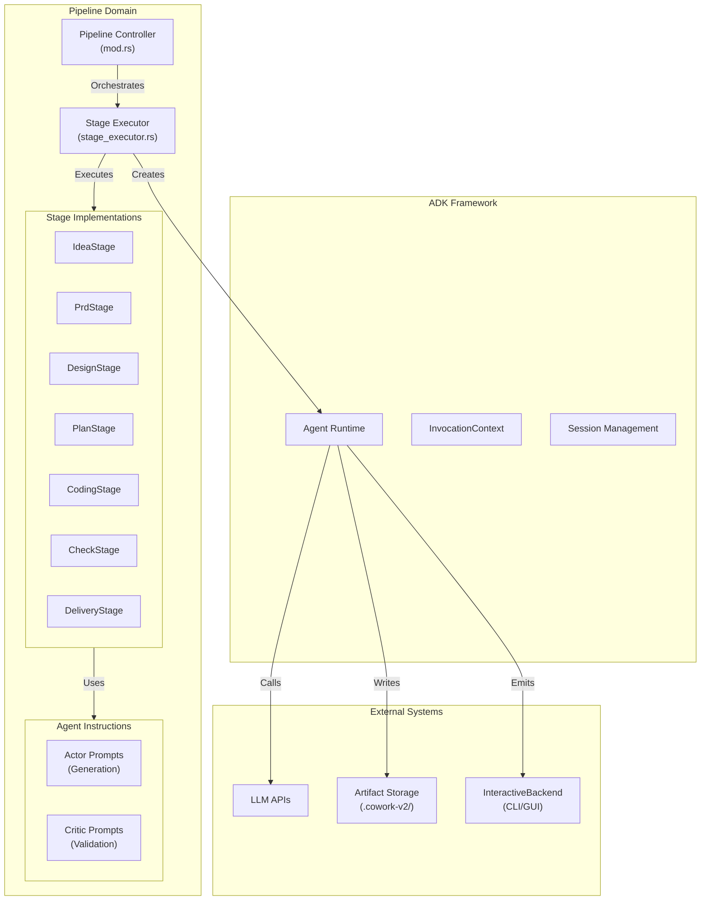
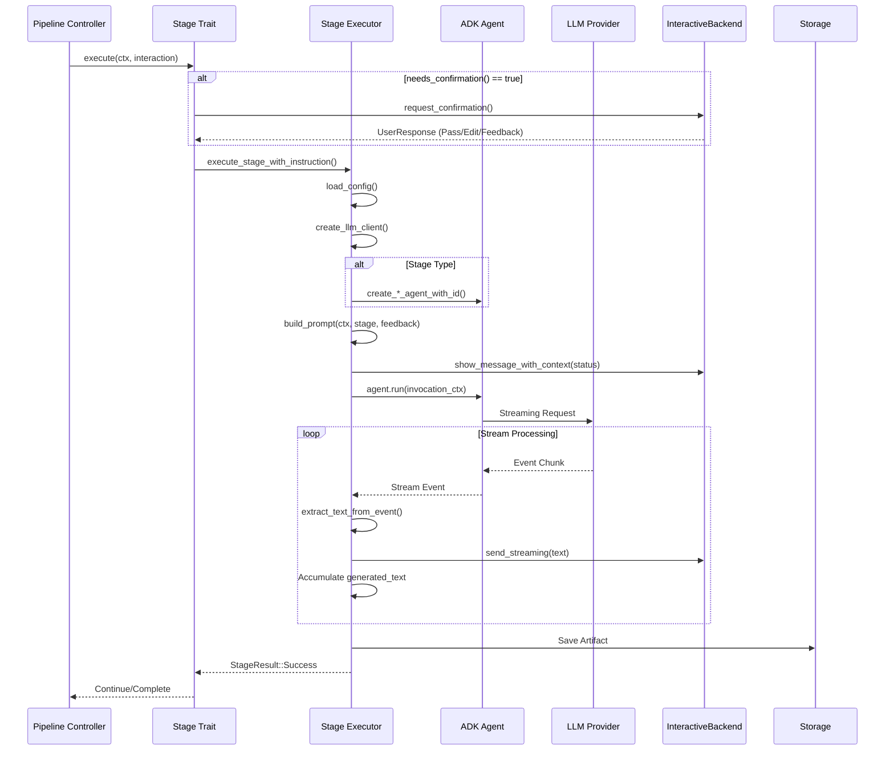
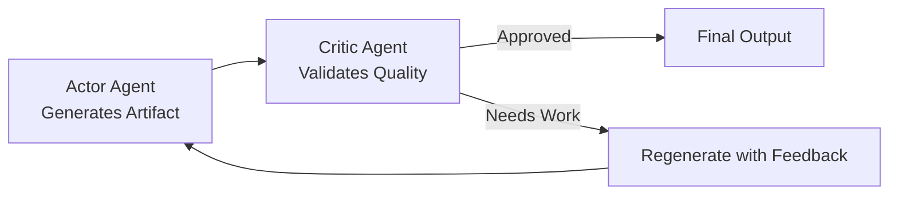

# Pipeline Domain Technical Documentation

**Version:** 1.0  
**Module:** `cowork-core::pipeline`  
**Last Updated:** 2026-02-14 05:14:32 (UTC)

## 1. Overview

The Pipeline Domain is the central orchestration engine of Cowork Forge, implementing a structured 7-stage AI-driven software development workflow. It transforms natural language requirements into production-ready code through an iterative, validation-gated pipeline that combines autonomous AI agents with human oversight.

### 1.1 Core Value Proposition
- **Structured Workflow**: Enforces architectural rigor through sequential stages (Idea → PRD → Design → Plan → Coding → Check → Delivery)
- **Quality Assurance**: Actor-Critic pattern with AI validation and Human-in-the-Loop (HITL) confirmation gates
- **Extensibility**: Strategy pattern enabling custom stage implementations while maintaining consistent execution semantics
- **Dual Interface Support**: Unified execution framework supporting both CLI automation and GUI interactions via the `InteractiveBackend` abstraction

### 1.2 Domain Boundaries
The Pipeline Domain operates as a **Core Business Domain** within the hexagonal architecture, depending on:
- **Domain Logic**: For `Project` and `Iteration` entity management
- **Tools Domain**: For agent capabilities (file operations, data CRUD, validation)
- **LLM Integration**: For AI agent orchestration via `adk-rust`
- **Interaction Domain**: For human feedback collection and progress streaming

## 2. Architectural Design

### 2.1 High-Level Architecture



### 2.2 Design Patterns

| Pattern | Implementation | Purpose |
|---------|---------------|---------|
| **Strategy** | `Stage` trait with 7 concrete implementations | Polymorphic stage execution allowing uniform treatment of diverse stage logic |
| **Actor-Critic** | Dual-agent loops for PRD, Design, Plan, Coding stages | Quality validation through generation (Actor) and critique (Critic) cycles |
| **Template Method** | `execute_stage_with_instruction()` | Common execution framework with stage-specific customization points |
| **Bridge** | `StageExecutor` bridging domain logic with `adk-rust` | Decoupling of pipeline orchestration from agent framework specifics |
| **State Machine** | `StageResult` variants (Success, Failed, Paused, NeedsRevision) | Explicit handling of stage execution outcomes and transitions |

## 3. Core Components

### 3.1 Stage Trait Abstraction

The `Stage` trait defines the contract for all pipeline stages, enabling polymorphic execution while maintaining type safety:

```rust
#[async_trait]
pub trait Stage: Send + Sync {
    /// Unique stage identifier (e.g., "idea", "prd", "coding")
    fn name(&self) -> &str;
    
    /// Human-readable description of stage purpose
    fn description(&self) -> &str;
    
    /// Determines if HITL confirmation is required before proceeding
    fn needs_confirmation(&self) -> bool;
    
    /// Primary execution entry point
    async fn execute(
        &self, 
        ctx: &PipelineContext, 
        interaction: &Arc<dyn InteractiveBackend>
    ) -> Result<StageResult>;
    
    /// Feedback-driven regeneration entry point
    async fn execute_with_feedback(
        &self, 
        ctx: &PipelineContext, 
        interaction: &Arc<dyn InteractiveBackend>,
        feedback: &str
    ) -> Result<StageResult>;
}
```

**Key Design Decisions:**
- **Zero-Sized Types**: All stage implementations (`IdeaStage`, `PrdStage`, etc.) are unit structs with no fields, delegating all behavior to the shared executor with stage-specific constants
- **Async Trait**: Uses `#[async_trait]` for async execution support across stage boundaries
- **Feedback Loop**: Explicit `execute_with_feedback()` method enables iterative refinement without stage-specific logic duplication

### 3.2 Stage Implementations

Seven concrete stage implementations provide the workflow structure:

| Stage | Type | Confirmation | Agent Pattern | Output Artifact |
|-------|------|-------------|---------------|-----------------|
| **Idea** | Individual | Yes | Single Agent | `idea.md` |
| **PRD** | Loop | Yes | Actor-Critic | `prd.md` |
| **Design** | Loop | Yes | Actor-Critic | `design.md` |
| **Plan** | Loop | Yes | Actor-Critic | `plan.md` |
| **Coding** | Loop | Yes | Actor-Critic | Code files |
| **Check** | Individual | No | Single Agent | `check_report.md` |
| **Delivery** | Individual | No | Single Agent | `delivery_report.md` |

**Implementation Pattern:**
Each stage is a zero-sized type implementing the `Stage` trait:
```rust
pub struct DesignStage;

#[async_trait]
impl Stage for DesignStage {
    fn name(&self) -> &str { "design" }
    fn needs_confirmation(&self) -> bool { true }
    
    async fn execute(&self, ctx: &PipelineContext, interaction: &Arc<dyn InteractiveBackend>) -> Result<StageResult> {
        execute_stage_with_instruction(
            ctx, 
            interaction, 
            "design", 
            DESIGN_ACTOR_INSTRUCTION,
            None
        ).await
    }
    // ... execute_with_feedback implementation
}
```

### 3.3 Stage Executor

The `StageExecutor` (`stage_executor.rs`) serves as the **Adapter** between the pipeline domain and the `adk-rust` agent framework:

**Responsibilities:**
1. **Agent Lifecycle Management**: Creates stage-specific agents (`create_idea_agent_with_id`, `create_prd_loop_with_id`, etc.)
2. **Context Preparation**: Builds `InvocationContext` with project state, iteration metadata, and historical context
3. **Prompt Engineering**: Constructs contextual prompts via `build_prompt()` combining instructions, feedback, and memory
4. **Stream Processing**: Manages real-time LLM output streaming with event extraction and UI propagation
5. **Artifact Coordination**: Persists generated content to `.cowork-v2/iterations/{id}/artifacts/{stage}.md`

**ADK Integration:**
Implements custom traits to bridge the domain model with the agent framework:
- `SimpleInvocationContext`: Provides agent configuration, memory access, and run configuration
- `SimpleSession`: Manages conversation history and state persistence
- `SimpleState`: Key-value storage for agent state across streaming chunks

### 3.4 Agent Instructions

Located in `crates/cowork-core/src/instructions/`, this subsystem contains approximately **2,000 lines of prompt engineering** defining AI agent behavior:

**Structure:**
- **Actor Instructions**: Define generation behavior, output formats, and tool usage patterns
- **Critic Instructions**: Define validation criteria, quality standards, and feedback generation
- **Tool Schemas**: Embedded function calling definitions for `save_idea`, `get_requirements`, `update_task_status`, `goto_stage`, etc.

**Example Flow (Design Stage):**
1. **Design Actor** generates architecture documents using `DESIGN_ACTOR_INSTRUCTION`
2. **Design Critic** validates against standards using `DESIGN_CRITIC_INSTRUCTION`
3. If validation fails, Critic provides feedback triggering regeneration loop
4. Upon approval, final artifact persisted to storage

## 4. Execution Flow

### 4.1 Standard Execution Sequence



### 4.2 Actor-Critic Loop (Complex Stages)

For PRD, Design, Plan, and Coding stages, the system implements an **Actor-Critic Pattern**:



**Implementation Details:**
- **Loop Agents**: Specialized agent constructors (`create_prd_loop_with_id`, etc.) instantiate paired Actor-Critic agents
- **Iteration Control**: Maximum iteration limits prevent infinite regeneration loops
- **Feedback Integration**: Critic critiques are passed as feedback to the Actor's next generation attempt

### 4.3 Human-in-the-Loop Integration

Critical stages (Idea, PRD, Design, Plan, Coding) implement confirmation gates:

**Confirmation Points:**
1. **Pre-execution**: User approves proceeding to stage
2. **Post-execution**: User reviews generated artifact before proceeding

**Interaction Modes:**
- **Pass**: Approve and continue to next stage
- **Edit**: Open artifact in external editor, reload modified content
- **Feedback**: Provide textual feedback triggering `execute_with_feedback()`

**Technical Implementation:**
```rust
// In Stage trait implementations
async fn execute(&self, ctx: &PipelineContext, interaction: &Arc<dyn InteractiveBackend>) -> Result<StageResult> {
    // Stage-specific execution
    let result = execute_stage_with_instruction(...).await?;
    
    // HITL integration via InteractiveBackend trait
    if self.needs_confirmation() {
        interaction.show_message_with_context(
            MessageLevel::Info,
            "Stage complete. Review artifact before continuing.",
            MessageContext::new(self.name(), ctx.iteration.id)
        ).await?;
    }
    
    Ok(result)
}
```

## 5. Data Models & Context

### 5.1 PipelineContext

The execution context carrying state across stages:

```rust
pub struct PipelineContext {
    pub project: Project,           // Project aggregate root
    pub iteration: Iteration,       // Current iteration entity
    pub workspace_path: PathBuf,    // Sandbox directory for artifacts
    // Additional configuration and state...
}
```

### 5.2 StageResult

Explicit result type enforcing state machine semantics:

```rust
pub enum StageResult {
    Success(Option<String>),    // Artifact content (optional)
    Failed(String),             // Error message
    Paused,                     // Awaiting external input
    NeedsRevision(String),      // Feedback for regeneration
}
```

### 5.3 Artifact Storage

Artifacts follow a structured storage convention:
```
.cowork-v2/
└── iterations/
    └── {iteration_id}/
        └── artifacts/
            ├── idea.md
            ├── prd.md
            ├── design.md
            ├── plan.md
            ├── check.md
            └── delivery.md
```

## 6. Integration Points

### 6.1 Interface Abstraction

The `InteractiveBackend` trait (`crates/cowork-core/src/interaction/`) abstracts UI concerns:

```rust
#[async_trait]
pub trait InteractiveBackend: Send + Sync {
    async fn show_message(&self, level: MessageLevel, message: &str);
    async fn show_message_with_context(&self, level: MessageLevel, message: &str, context: MessageContext);
    async fn send_streaming(&self, content: &str, display_name: &str, is_complete: bool);
    async fn request_confirmation(&self, content: &str) -> Result<UserResponse>;
}
```

**Implementations:**
- **CLI Backend**: Terminal UI with colored output using `dialoguer`
- **Tauri Backend**: Event emission to React frontend via Tauri's IPC system

### 6.2 LLM Integration

The Stage Executor interacts with the **LLM Integration Domain** through:
- **Rate-Limited Client**: All requests pass through `RateLimitedLlm` (30 req/min, concurrency=1)
- **Configuration Loading**: `load_config()` resolves LLM settings from TOML files or environment variables
- **Model Selection**: Stage-specific model configurations (e.g., stronger models for Design, faster models for Check)

### 6.3 Tool System Integration

Agents invoke tools from the **Tools Domain** during execution:
- **File Tools**: `ReadFileTool`, `WriteFileTool` for artifact manipulation
- **Data Tools**: `GetRequirementsTool`, `UpdateTaskStatusTool` for project state management
- **HITL Tools**: `ReviewAndEditContentTool` for human validation
- **Memory Tools**: `QueryMemoryTool` for historical context retrieval

## 7. Configuration & Extensibility

### 7.1 Adding New Stages

To implement a new pipeline stage:

1. **Create Stage Struct**:
```rust
pub struct CustomStage;
```

2. **Implement Stage Trait**:
```rust
#[async_trait]
impl Stage for CustomStage {
    fn name(&self) -> &str { "custom" }
    fn needs_confirmation(&self) -> bool { true }
    
    async fn execute(&self, ctx: &PipelineContext, interaction: &Arc<dyn InteractiveBackend>) -> Result<StageResult> {
        execute_stage_with_instruction(
            ctx,
            interaction,
            "custom",
            CUSTOM_INSTRUCTION,
            None
        ).await
    }
}
```

3. **Define Instructions**:
Create `crates/cowork-core/src/instructions/custom.rs` with `CUSTOM_INSTRUCTION` constant.

4. **Register in Pipeline**:
Add to `get_all_stages()` in `crates/cowork-core/src/pipeline/mod.rs`.

### 7.2 Customizing Agent Behavior

Modify stage behavior through:
- **Instruction Updates**: Edit prompt constants in `instructions/` modules
- **Tool Injection**: Extend agent capabilities by adding tools to agent constructors in `stage_executor.rs`
- **Context Enrichment**: Modify `build_prompt()` to include additional domain context

## 8. Error Handling & Resilience

### 8.1 Error Categories

| Category | Handling Strategy | Recovery |
|----------|------------------|----------|
| **LLM Errors** | Retry with exponential backoff | StageResult::Failed |
| **Tool Execution** | Validation + rollback | StageResult::Failed |
| **User Cancellation** | Graceful shutdown | StageResult::Paused |
| **Validation Failures** | Actor-Critic loop | StageResult::NeedsRevision |

### 8.2 Streaming Resilience

- **Partial Content Persistence**: Streamed chunks are accumulated in memory and persisted only upon successful completion
- **Timeout Handling**: Long-running generations have configurable timeouts
- **Interruption Recovery**: Support for pausing and resuming at stage boundaries

## 9. Performance Considerations

### 9.1 Concurrency Model
- **Single Pipeline Execution**: Only one pipeline runs per iteration (enforced by Iteration state machine)
- **Sequential Stages**: Stages execute serially to maintain dependency ordering
- **Async I/O**: All file operations and LLM requests are non-blocking (Tokio runtime)

### 9.2 Resource Management
- **Memory**: Streaming processing prevents loading large artifacts entirely into memory
- **Rate Limiting**: Global semaphore ensures compliance with LLM API quotas
- **Storage**: Artifacts written atomically to prevent corruption

## 10. Security Considerations

### 10.1 Path Validation
All file operations validate paths against the iteration workspace:
```rust
// Implicit in File Tools via Security domain
assert!(path.starts_with(&ctx.workspace_path));
```

### 10.2 Sandboxing
- **Workspace Confinement**: Agents can only access files within `.cowork-v2/iterations/{id}/`
- **Command Restrictions**: `RunCommandTool` validates commands against allow-lists
- **No Network Access**: Agents cannot initiate outbound network requests (except via LLM client)

## 11. Testing Strategy

### 11.1 Unit Testing
- **Stage Logic**: Test individual stage behaviors with mock `InteractiveBackend`
- **Prompt Validation**: Verify instruction constants compile and contain required placeholders
- **Result Handling**: Test `StageResult` state transitions

### 11.2 Integration Testing
- **End-to-End Pipeline**: Execute full 7-stage workflows with stubbed LLM responses
- **HITL Simulation**: Mock user inputs for confirmation gates
- **Artifact Verification**: Validate generated files match expected schemas

## 12. Future Enhancements

### 12.1 Planned Improvements
- **Parallel Stage Execution**: Independent stages (Check + Delivery) could execute concurrently
- **Checkpoint Recovery**: Resume from arbitrary stage after system restart
- **Dynamic Stage Injection**: Runtime stage registration for plugin architecture

### 12.2 Architectural Evolution
- **Event Sourcing**: Consider event-sourced pipeline state for complex workflow visualization
- **Distributed Execution**: Remote agent execution for compute-intensive coding stages

---

## Appendix A: File Structure

```
crates/cowork-core/src/pipeline/
├── mod.rs                    # Pipeline controller and stage orchestration
├── stage_executor.rs         # ADK integration and execution framework
├── stages/
│   ├── idea.rs              # Idea stage implementation
│   ├── prd.rs               # PRD stage (Actor-Critic)
│   ├── design.rs            # Design stage (Actor-Critic)
│   ├── plan.rs              # Plan stage (Actor-Critic)
│   ├── coding.rs            # Coding stage (Actor-Critic)
│   ├── check.rs             # Quality check stage
│   └── delivery.rs          # Final delivery stage
└── ...

crates/cowork-core/src/instructions/
├── idea.rs                  # Idea agent prompts
├── prd.rs                   # PRD Actor/Critic prompts
├── design.rs                # Design Actor/Critic prompts
├── plan.rs                  # Plan Actor/Critic prompts
├── coding.rs                # Coding Actor/Critic prompts
├── check.rs                 # Check agent prompts
├── delivery.rs              # Delivery agent prompts
└── ...
```

## Appendix B: Glossary

- **ADK**: Agent Development Kit (Rust framework for LLM agent orchestration)
- **Actor-Critic**: ML pattern where one agent generates content (Actor) and another validates it (Critic)
- **Genesis Iteration**: Initial project creation workflow (all 7 stages)
- **Evolution Iteration**: Subsequent iteration building on previous work
- **HITL**: Human-in-the-Loop (human validation gates)
- **Stage**: Discrete pipeline phase with specific inputs and outputs
- **Artifact**: Persistent output generated by a stage (Markdown files, code, etc.)