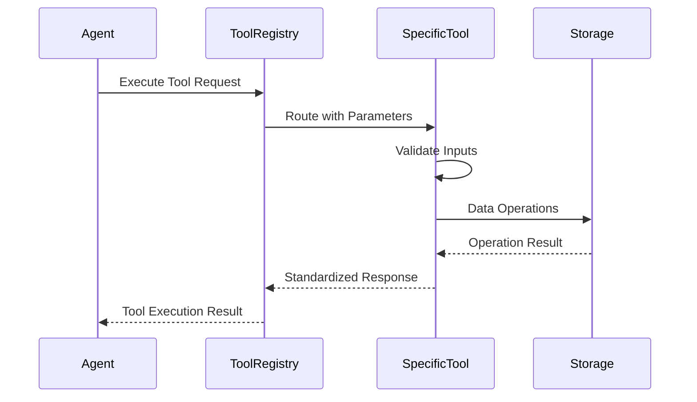

# Tool Infrastructure Domain Technical Documentation

## Overview

The Tool Infrastructure Domain provides a comprehensive ecosystem of reusable tools that enable AI agents to interact with the system, file system, and users throughout the software development lifecycle. This domain serves as the operational bridge between the AI agents and the underlying system infrastructure, supporting all development stages from idea generation to final delivery.

## Architecture

### Domain Structure

The Tool Infrastructure Domain is organized into specialized submodules, each handling a distinct category of operations:

```mermaid
graph TB
    TI[Tool Infrastructure Domain] --> FO[File Operations]
    TI --> DM[Data Management]
    TI --> VT[Validation Tools]
    TI --> HI[Human Interaction]
    TI --> CT[Control Tools]
    TI --> AT[Artifact Tools]
    
    FO --> LFT[ListFilesTool]
    FO --> RFT[ReadFileTool]
    FO --> WFT[WriteFileTool]
    FO --> RCT[RunCommandTool]
    
    DM --> CRT[CreateRequirementTool]
    DM --> AFT[AddFeatureTool]
    DM --> CDCT[CreateDesignComponentTool]
    DM --> CTT[CreateTaskTool]
    DM --> SUT[Status Update Tools]
    
    VT --> CDFT[CheckDataFormatTool]
    VT --> CFCT[CheckFeatureCoverageTool]
    VT --> CTDT[CheckTaskDependenciesTool]
    
    HI --> RAFT[ReviewAndEditFileTool]
    HI --> RWFT[ReviewWithFeedbackTool]
    HI --> PFT[ProvideFeedbackTool]
    HI --> AUT[AskUserTool]
    
    CT --> PFT2[ProvideFeedbackTool]
    CT --> AUT2[AskUserTool]
    
    AT --> SDRT[SaveDeliveryReportTool]
    AT --> SPDT[SavePrdDocTool]
    AT --> SDDT[SaveDesignDocTool]
```



## Core Implementation

### Tool Interface Pattern

All tools implement the `adk_core::Tool` trait using the `async_trait` pattern, ensuring compatibility with the agent framework:

```rust
use adk_core::{Tool, ToolContext};
use async_trait::async_trait;
use serde_json::{json, Value};
use std::sync::Arc;

#[async_trait]
impl Tool for ExampleTool {
    fn name(&self) -> &str { "tool_name" }
    
    fn description(&self) -> &str { "Tool description" }
    
    fn parameters_schema(&self) -> Option<Value> { /* JSON schema */ }
    
    async fn execute(&self, ctx: Arc<dyn ToolContext>, args: Value) -> adk_core::Result<Value> {
        // Tool implementation
    }
}
```

### Security Architecture

The domain implements robust security measures through path validation and input sanitization:

```rust
/// Security Helper - Path Validation
fn validate_path_security(path: &str) -> Result<PathBuf, String> {
    // Rule 1: Reject absolute paths
    if path_obj.is_absolute() {
        return Err("Security: Absolute paths are not allowed".to_string());
    }
    
    // Rule 2: Reject parent directory access (..)
    if path.contains("..") {
        return Err("Security: Parent directory access is not allowed".to_string());
    }
    
    // Rule 3: Verify path is within current directory
    let current_dir = std::env::current_dir()?;
    let canonical_path = current_dir.join(path).canonicalize()?;
    
    if !canonical_path.starts_with(&current_dir) {
        return Err("Security: Path escapes current directory".to_string());
    }
    
    Ok(canonical_path)
}
```

## Submodule Details

### File Operations (`file_tools.rs`)

**Purpose**: Secure file system operations with comprehensive safety measures.

**Key Tools**:
- **ListFilesTool**: Recursive/non-recursive directory listing with security validation
- **ReadFileTool**: Safe file reading with line range support
- **WriteFileTool**: Secure file writing with backup creation
- **RunCommandTool**: Command execution with blocking service detection

**Security Features**:
- Path validation preventing directory traversal
- Hidden file and directory filtering
- Maximum depth limiting for recursive operations
- File size and permission validation

### Data Management (`data_tools.rs`)

**Purpose**: Structured data operations for development artifacts.

**Key Tools**:
- **CreateRequirementTool**: Create SMART requirements with acceptance criteria
- **AddFeatureTool**: Define features linked to requirements
- **CreateDesignComponentTool**: Design component creation with technology specifications
- **CreateTaskTool**: Task definition with dependencies and assignments
- **Status Update Tools**: Progress tracking throughout development stages

**Data Integrity**:
- Type-safe data modeling using Rust structs
- Automatic ID generation with sequential numbering
- Timestamp tracking for all modifications
- Relationship validation between artifacts

### Validation Tools (`validation_tools.rs`)

**Purpose**: Quality assurance and data validation throughout the development lifecycle.

**Key Tools**:
- **CheckDataFormatTool**: JSON schema validation for all data files
- **CheckFeatureCoverageTool**: Ensures all features are covered by design components
- **CheckTaskDependenciesTool**: Circular dependency detection in implementation plans

**Validation Logic**:
```rust
fn validate_requirements_schema() -> Vec<String> {
    let mut errors = vec![];
    match load_requirements() {
        Ok(requirements) => {
            for req in &requirements.requirements {
                if req.title.is_empty() {
                    errors.push(format!("{}: title is empty", req.id));
                }
                if req.acceptance_criteria.is_empty() {
                    errors.push(format!("{}: missing acceptance criteria", req.id));
                }
            }
        }
        Err(e) => errors.push(format!("Failed to load requirements: {}", e)),
    }
    errors
}
```

### Human Interaction (`hitl_tools.rs`)

**Purpose**: Human-in-the-Loop (HITL) interfaces for user collaboration.

**Key Tools**:
- **ReviewAndEditFileTool**: Simple edit/pass interface for file review
- **ReviewWithFeedbackTool**: Enhanced three-mode interface (edit/pass/feedback)
- **ProvideFeedbackTool**: Structured feedback collection for agent improvement

**Interaction Patterns**:
```rust
// Three-mode user interaction
match user_input.to_lowercase().as_str() {
    "edit" => {
        // Mode 1: Open editor for direct modification
        let edited = Editor::new().require_save(true).edit(&content)?;
        // Save and continue
    }
    "pass" => {
        // Mode 2: Continue without changes
        Ok(json!({"action": "pass", "status": "approved"}))
    }
    _ => {
        // Mode 3: Provide feedback for agent processing
        Ok(json!({"action": "feedback", "feedback": user_input}))
    }
}
```

### Control Tools (`control_tools.rs`)

**Purpose**: Workflow control and agent feedback mechanisms.

**Key Tools**:
- **ProvideFeedbackTool**: Structured feedback with severity levels
- **AskUserTool**: Interactive CLI prompts for user input

**Feedback Structure**:
```rust
pub enum FeedbackType {
    BuildError,
    QualityIssue,
    MissingRequirement,
    Suggestion,
}

pub enum Severity {
    Critical,
    Major,
    Minor,
}
```

### Artifact Tools (`artifact_tools.rs`)

**Purpose**: Final artifact generation and delivery management.

**Key Tools**:
- **SaveDeliveryReportTool**: Final project delivery documentation
- **SavePrdDocTool**: Product Requirements Document generation
- **SaveDesignDocTool**: System architecture documentation

## Integration Patterns

### Agent-Tool Interaction

The domain follows a standardized interaction pattern:



### Error Handling

All tools implement consistent error handling:

```rust
async fn execute(&self, _ctx: Arc<dyn ToolContext>, args: Value) -> adk_core::Result<Value> {
    // Operation with proper error mapping
    let result = some_operation()
        .map_err(|e| adk_core::AdkError::Tool(format!("Operation failed: {}", e)))?;
    
    // Standardized success response
    Ok(json!({
        "status": "success",
        "message": "Operation completed",
        "data": result
    }))
}
```

## Technical Specifications

### Dependencies

- **adk-core**: Tool trait and execution framework
- **async-trait**: Async trait implementation support
- **serde_json**: JSON serialization and schema validation
- **dialoguer**: Interactive CLI user interfaces
- **walkdir**: Efficient directory traversal
- **tokio**: Async runtime for tool execution

### Performance Characteristics

- **Async Execution**: All tools support async/await for non-blocking operations
- **Memory Safety**: Rust's ownership model prevents common security vulnerabilities
- **Efficient File Operations**: Streaming file operations with minimal memory footprint
- **Concurrent Safe**: Thread-safe implementations using Arc for shared context

### Security Model

- **Path Validation**: Comprehensive path security preventing directory traversal
- **Input Sanitization**: All user inputs are validated against schemas
- **Resource Limits**: File size and operation depth limitations
- **Error Isolation**: Tool failures don't crash the agent system

## Usage in Development Workflow

The Tool Infrastructure Domain supports the complete Cowork Forge V2 development lifecycle:

1. **Idea Stage**: File operations and human review tools
2. **PRD Stage**: Data management tools for requirements and features
3. **Design Stage**: Component creation and validation tools
4. **Planning Stage**: Task management and dependency tools
5. **Coding Stage**: File operations and validation tools
6. **Check Stage**: Comprehensive validation tools
7. **Delivery Stage**: Artifact generation tools

This modular, security-focused tool ecosystem enables AI agents to effectively collaborate with human developers while maintaining system integrity and data consistency throughout the automated software development process.