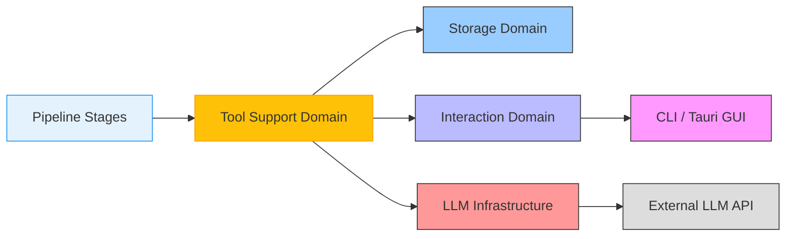

# Tool Support Domain Documentation

## Overview

The **Tool Support Domain** serves as the critical interface between AI agents and the operational capabilities of the Cowork Forge system. It provides a secure, standardized, and extensible set of tools that enable LLM-driven agents to interact with the system's file system, data entities, external services, and human-in-the-loop (HITL) mechanisms—without direct access to internal state or infrastructure.

All tools implement the `ADK Tool` trait defined in the core engine, ensuring consistent invocation patterns, parameter validation, and structured JSON response formats. This design enforces a clean separation of concerns: AI agents operate solely through tool calls, while the system retains full control over security, access, and state integrity.

The Tool Support Domain is organized into eight specialized sub-modules, each addressing a distinct class of system interactions. These tools are invoked by pipeline stages during automated development workflows (Idea → PRD → Design → Plan → Coding → Check → Delivery) and are essential for enabling autonomous, context-aware software development.

---

## Core Design Principles

### 1. **Security-First Architecture**
All tools enforce strict access controls to prevent unauthorized or malicious operations. The foundational `validate_path_security()` function canonicalizes all file paths and ensures they remain strictly within the session workspace (`.cowork/sessions/<id>/`). Absolute paths (`/`, `C:\`), parent directory traversal (`..`), and symbolic links are explicitly blocked.

### 2. **Uniform Interface**
Every tool follows a consistent signature:
```rust
async fn execute(&self, params: serde_json::Value) -> Result<ToolResponse, ToolError>
```
- **Input**: JSON parameters parsed via `serde_json`
- **Output**: Structured `ToolResponse` with fields:
  - `status`: `"success"`, `"error"`, or `"security_error"`
  - `message`: Human-readable description
  - `data`: Optional payload (e.g., file list, content, line count)

### 3. **Agent-Centric Design**
Tools are designed for programmatic consumption by AI agents. Parameters are named for clarity and semantic meaning (e.g., `path`, `recursive`, `content`, `stage`) rather than technical implementation details. Responses include sufficient context to inform downstream decisions without exposing internal architecture.

### 4. **Session Isolation**
All file and data operations are scoped to the current iteration’s session directory (`/.cowork/sessions/<id>/`). This ensures clean workspaces, safe inheritance patterns, and traceable artifact lineage.

---

## Sub-Module Reference

### 1. **File Tools**  
*File: `crates/cowork-core/src/tools/file_tools.rs`*

Provides secure, atomic file system operations within the session workspace. All operations are validated via `validate_path_security()`.

| Tool | Functionality | Security Enforcement | Key Parameters |
|------|---------------|----------------------|----------------|
| `ListFilesTool` | Recursively lists files and directories | Blocks `..`, absolute paths, hidden `.git`, `node_modules`, `.DS_Store` | `path`, `recursive` (bool), `max_depth` (int) |
| `ReadFileTool` | Reads file content with line-by-line encoding | Validates file existence and read permissions | `path` |
| `WriteFileTool` | Writes or overwrites file content; creates parent directories if needed | Ensures path is within session root | `path`, `content` |
| `DeleteFileTool` | Deletes a single file | Prevents deletion of session root or critical directories | `path` |
| `DeleteDirectoryTool` | Recursively deletes a directory | Blocks deletion of `.cowork`, `sessions`, or non-empty directories without explicit confirmation | `path` |
| `RunCommandTool` | Executes shell commands in session directory | Blocks known long-running services (`http.server`, `npm run dev`, `python -m http.server`, `webpack --watch`) | `command`, `timeout_seconds` (default: 30) |

> **Implementation Note**: `RunCommandTool` uses `tokio::process::Command` with a 30-second timeout and filters command strings via regex to prevent execution of dangerous services. Output is captured and returned as `stdout`/`stderr`.

#### Example Response (ListFilesTool):
```json
{
  "status": "success",
  "message": "Successfully listed files",
  "data": {
    "files": [
      "src/main.rs",
      "README.md",
      "docs/design.md"
    ],
    "directories": [
      "src",
      "docs"
    ],
    "total_count": 5
  }
}
```

---

### 2. **Data Tools**  
*File: `crates/cowork-core/src/tools/data_tools.rs`*

Manages structured project data entities such as requirements, features, design components, and tasks. Each entity is assigned a unique ID and tracked with status metadata.

| Tool | Functionality | Key Parameters |
|------|---------------|----------------|
| `CreateRequirementTool` | Creates a new requirement with title, description, priority | `title`, `description`, `priority` ("high", "medium", "low") |
| `AddFeatureTool` | Adds a feature linked to a requirement | `requirement_id`, `name`, `acceptance_criteria` |
| `CreateDesignComponentTool` | Creates a design component (e.g., module, API endpoint) | `name`, `type`, `description`, `dependencies` |
| `CreateTaskTool` | Creates a development task linked to a feature | `feature_id`, `description`, `assignee` |
| `UpdateFeatureStatusTool` | Updates feature status (todo, in-progress, done) | `feature_id`, `status` |
| `UpdateTaskStatusTool` | Updates task status | `task_id`, `status` |
| `GetRequirementsTool` | Retrieves all requirements with linked features | `include_features` (bool) |
| `GetDesignTool` | Retrieves all design components | — |
| `GetPlanTool` | Retrieves all tasks and their status | — |

> **Use Case**: During the PRD stage, an agent may call `CreateRequirementTool` to generate user stories, then use `AddFeatureTool` to break them into actionable features. In the Coding stage, `GetRequirementsTool` provides context for code generation.

---

### 3. **Control Tools**  
*File: `crates/cowork-core/src/tools/control_tools.rs`*

Enables human-in-the-loop (HITL) intervention during automated stages. These tools allow agents to pause execution and request feedback, replanning, or escalation.

| Tool | Functionality | Key Parameters |
|------|---------------|----------------|
| `ProvideFeedbackTool` | Submits structured feedback from user to pipeline | `feedback`, `stage` |
| `RequestReplanningTool` | Requests the pipeline restart from a specific stage | `target_stage` ("idea", "prd", "design", etc.) |
| `AskUserTool` | Presents a question to the user and waits for response | `question`, `options` (optional array) |
| `RequestHumanReviewTool` | Escalates current artifact for manual review | `artifact_type` ("prd", "design", "code"), `path` |

> **Interaction Flow**:  
> During the Coding stage, if an agent detects ambiguity in requirements, it may call `AskUserTool` with:  
> `"question": "Should the user profile include email verification?"`  
> The `InteractiveBackend` displays this to the user via CLI or GUI, and the response is returned as a JSON string to the agent.

---

### 4. **Artifact Tools**  
*File: `crates/cowork-core/src/tools/artifact_tools.rs`*

Manages persistence and retrieval of key development artifacts within the session’s `artifacts/` directory.

| Tool | Functionality | Key Parameters |
|------|---------------|----------------|
| `SavePrdDocTool` | Saves PRD document to `.cowork/sessions/<id>/artifacts/prd.md` | `content` |
| `SaveDesignDocTool` | Saves design document to `artifacts/design.md` | `content` |
| `SaveDeliveryReportTool` | Saves delivery report to `artifacts/delivery_report.md` | `content` |
| `LoadFeedbackHistoryTool` | Loads all past feedback entries for context | `iteration_id` (optional) |

> **Note**: These tools do not modify source code—they manage documentation artifacts that serve as audit trails and communication artifacts between stages and stakeholders.

---

### 5. **HITL Content Tools**  
*Files: `crates/cowork-core/src/tools/hitl_content_tools.rs`, `hitl_tools.rs`*

Enables users to edit documents and code files using external editors (e.g., VSCode). This is the primary mechanism for human refinement of AI-generated content.

| Tool | Functionality | Key Parameters |
|------|---------------|----------------|
| `ReviewAndEditFileTool` | Opens a file in the default external editor; waits for save | `path` |
| `ReviewAndEditContentTool` | Opens a text blob in editor; returns modified content | `content`, `filename` (e.g., "draft.md") |
| `ReviewWithFeedbackTool` | Opens content with embedded feedback prompts | `content`, `feedback_context` (JSON string) |
| `ReviewWithFeedbackContentTool` | Same as above, but returns both edited content and user feedback | `content`, `feedback_context` |

> **Workflow**:  
> After the Design stage generates `design.md`, the agent calls `ReviewAndEditFileTool` with `path: "artifacts/design.md"`. The system spawns VSCode (via `tauri::shell::open` or `std::process::Command`), waits for the user to save, then reloads the file and returns its updated content to the agent.

---

### 6. **Idea Tools**  
*File: `crates/cowork-core/src/tools/idea_tools.rs`*

Specialized tools for managing the initial project concept (`idea.md`), used during project initialization and modification flows.

| Tool | Functionality | Key Parameters |
|------|---------------|----------------|
| `SaveIdeaTool` | Saves or updates the project’s idea document | `content` |
| `LoadIdeaTool` | Loads the current idea.md content | — |

> **Usage**: During `cowork init`, the Idea stage generates an initial concept and saves it via `SaveIdeaTool`. Later, during `cowork modify`, the agent may load it via `LoadIdeaTool` to understand the original intent before applying changes.

---

### 7. **Modify Tools**  
*File: `crates/cowork-core/src/tools/modify_tools.rs`*

Supports the Change Request Analysis workflow by persisting structured change analyses.

| Tool | Functionality | Key Parameters |
|------|---------------|----------------|
| `SaveChangeRequestTool` | Persists a ChangeRequest with scope, risk, and affected components | `title`, `description`, `scope` (JSON), `risk_level` ("low", "medium", "high"), `affected_components` (array) |
| `LoadChangeRequestTool` | Loads the most recent ChangeRequest for the current session | — |

> **Integration**: After the Change Triage Agent analyzes a user’s natural language request, it uses `SaveChangeRequestTool` to create a structured record. The Pipeline Executor then uses this to determine which stages to re-execute.

---

### 8. **Goto Stage Tool**  
*File: `crates/cowork-core/src/tools/goto_stage_tool.rs`*

Allows agents to programmatically restart the pipeline from a specified stage, enabling iterative refinement.

| Tool | Functionality | Key Parameters |
|------|---------------|----------------|
| `GotoStageTool` | Resets iteration state and restarts pipeline from target stage | `stage` ("idea", "prd", "design", "plan", "coding", "check", "delivery") |

> **Use Case**: After reviewing generated code, an agent may determine the design is insufficient and call `GotoStageTool` with `stage: "design"`. The executor then re-executes Design → Plan → Coding stages with updated context.

---

## Integration with Core System

### **Dependency Flow**


- **Pipeline Domain** is the primary consumer of all tools.
- **Storage Domain** provides path resolution and directory structure for file/data tools.
- **Interaction Domain** enables HITL tools to display content and receive user input.
- **LLM Infrastructure** provides the LLM clients that generate tool parameters and interpret responses.

### **Tool Invocation Lifecycle**
1. **Agent Request**: LLM generates a tool call with structured parameters.
2. **Validation**: `ToolExecutor` validates tool name and parameters.
3. **Security Check**: `validate_path_security()` is invoked for file/data tools.
4. **Execution**: Tool performs operation (file I/O, command exec, memory query).
5. **Response**: Structured JSON returned to agent.
6. **Feedback Loop**: Agent uses response to refine next step or trigger HITL.

---

## Security Architecture

### Path Validation (`validate_path_security`)
```rust
fn validate_path_security(base_path: &Path, target_path: &str) -> Result<PathBuf, SecurityError> {
    let canonical_base = base_path.canonicalize()?;
    let canonical_target = canonical_base.join(target_path).canonicalize()?;

    if !canonical_target.starts_with(&canonical_base) {
        return Err(SecurityError::TraversalAttempt);
    }

    if target_path.contains("..") || target_path.starts_with("/") || target_path.starts_with("\\") {
        return Err(SecurityError::InvalidPath);
    }

    Ok(canonical_target)
}
```

- **Blocks**: Absolute paths, `..` traversal, symlinks
- **Allows**: Relative paths within session root
- **Enforced**: On all file operations (read, write, delete, list, exec)

### Command Execution Filtering
`RunCommandTool` blocks execution of:
- `python -m http.server`
- `npm run dev`
- `webpack --watch`
- `nodemon`
- `cargo watch`

Commands are scanned via regex before execution. Only short-lived, non-daemon processes are permitted.

---

## Practical Implementation Guidance

### For Developers Extending Tools
1. **Implement `Tool` trait**:
   ```rust
   #[async_trait]
   impl Tool for MyNewTool {
       fn name(&self) -> &str { "MyNewTool" }
       fn description(&self) -> &str { "Performs custom operation X" }
       async fn execute(&self, params: Value) -> Result<ToolResponse, ToolError> {
           // Parse params, validate, execute, return structured response
       }
   }
   ```

2. **Register in `ToolRegistry`**:
   Add to `src/tools/mod.rs`:
   ```rust
   pub fn create_tool_registry() -> ToolRegistry {
       let mut registry = ToolRegistry::new();
       registry.register(Box::new(MyNewTool {}));
       registry
   }
   ```

3. **Test with Mocked Context**:
   Use `MockInteractiveBackend` and `MockStorage` to simulate environment.

### For AI Agent Designers
- Always validate tool responses for `status: "security_error"` and handle gracefully.
- Use `GetRequirementsTool` and `LoadIdeaTool` to ground generation in context.
- Prefer `ReviewAndEditFileTool` over `WriteFileTool` when human refinement is expected.
- Use `GotoStageTool` to enable iterative refinement without restarting the entire pipeline.

---

## Conclusion

The Tool Support Domain is the **operational backbone** of Cowork Forge’s AI-driven development workflow. By enforcing strict security boundaries, providing a rich set of domain-specific tools, and maintaining a uniform interface, it enables AI agents to act as capable, context-aware collaborators—without compromising system integrity.

This domain transforms abstract LLM capabilities into concrete, safe, and traceable actions: writing code, managing requirements, reviewing designs, and engaging humans—all within a controlled, session-isolated environment.

Its design exemplifies the **Agent Development Kit (ADK)** pattern: **no direct access, only mediated interaction**. This ensures that Cowork Forge remains reliable, auditable, and scalable—even as the complexity of AI-generated workflows grows.

> **Future Extensions**:  
> - Tool versioning for backward compatibility  
> - Tool permissions per user role (developer vs. product owner)  
> - Tool discovery via metadata (e.g., `tool_metadata.json`)  
> - Tool execution logging for audit trails