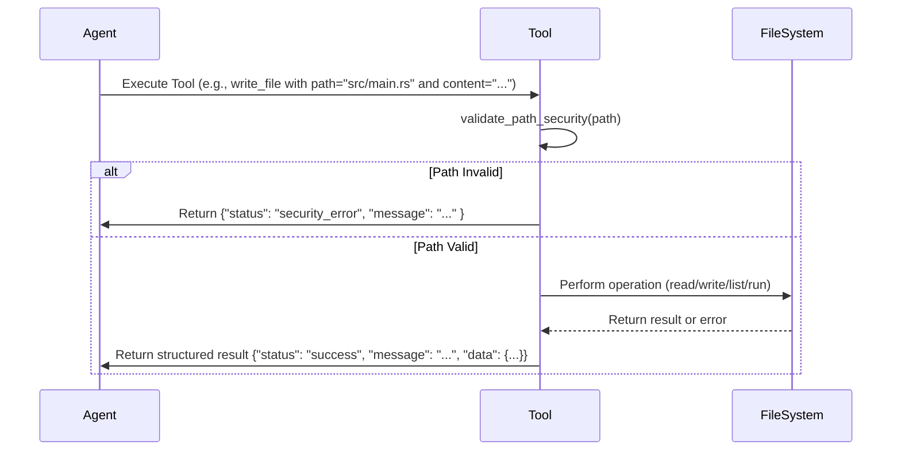

# Tooling & Operations: Secure, Session-Scoped Tooling for AI-Driven Software Development

## Overview

The Tooling & Operations domain in Cowork Forge serves as the critical interface between AI agents and the external environment, enabling secure, auditable, and controlled interactions with the file system, user input, data validation, and workflow control. This domain implements a suite of session-scoped tools that empower AI agents to perform essential operations while enforcing strict security policies, maintaining traceability, and preserving the system's core principle of simplicity enforcement.

All tools are designed with a consistent architecture: they receive structured JSON parameters, validate inputs before execution, and return standardized JSON responses with status, message, and relevant data. Tools operate within the context of a single development session, persisting artifacts to the `.cowork/sessions/<session_id>/` directory structure. This design ensures that every operation is traceable, reversible, and auditable, forming the backbone of Cowork Forge's human-in-the-loop (HITL) development workflow.

## Core Tool Categories and Implementation Details

### 1. File System Tools: Secure, Path-Restricted Operations

The File System Tools provide the foundational ability for agents to interact with the project's file structure, implementing a robust security model that prevents directory traversal attacks and unauthorized access.

**Implementation Architecture:**
- **Security Enforcement**: All file operations are guarded by `validate_path_security()`, a central function that enforces three critical rules:
  1. **Relative Paths Only**: Absolute paths (e.g., `/tmp`, `C:\\`) are strictly rejected.
  2. **No Parent Directory Access**: Any path containing `..` is blocked to prevent escaping the session directory.
  3. **Canonicalization and Scope Validation**: The system resolves the full path and verifies it is contained within the current working directory or the `.cowork` root folder.
- **Recursive Listing with Filtering**: The `ListFilesTool` uses the `walkdir` crate for recursive directory traversal, with a default maximum depth of 3 to prevent excessive resource consumption. It automatically filters out hidden files and directories (those starting with `.`) to reduce noise.
- **Automatic Directory Creation**: The `WriteFileTool` creates any necessary parent directories before writing a file, ensuring seamless file creation without requiring pre-existing folder structures.

**Key Tools:**
- **`ListFilesTool`**: Lists files and directories. Accepts parameters for `path` (default: current directory), `recursive` (boolean), and `max_depth` (integer). Returns a structured list of files and directories, excluding hidden files.
- **`ReadFileTool`**: Reads the content of a specified file. Returns the file content as a string or a security error if the path is invalid.
- **`WriteFileTool`**: Writes content to a file. Automatically creates parent directories if they do not exist. Returns success status or an error if the write fails.
- **`RunCommandTool`**: Executes shell commands with a critical safety feature: it detects and blocks long-running services (e.g., web servers like `python -m http.server`, `npm start`) using pattern matching. This prevents agents from accidentally launching services that could interfere with the development environment.

**Interaction Flow:**


### 2. Validation Tools: Ensuring Data Integrity and Structural Consistency

Validation Tools ensure that the structured data models generated by agents conform to the expected schema and that the implemented code satisfies the defined requirements, acting as automated quality gates.

**Implementation Architecture:**
- **Schema-Based Validation**: Tools like `CheckDataFormatTool` validate JSON files against predefined schemas for `requirements`, `features`, `design`, and `plan` data models. It checks for mandatory fields (e.g., `title` and `acceptance_criteria` for requirements) and reports specific errors.
- **Cross-Referential Validation**: Tools such as `CheckFeatureCoverageTool` and `CheckTaskDependenciesTool` perform semantic validation by cross-referencing different artifacts. For example, `CheckFeatureCoverageTool` verifies that every feature defined in the PRD is linked to at least one component in the design document.
- **Session-Scoped Context**: All validation tools are instantiated with a `session_id`, allowing them to load the correct session artifacts from the `.cowork/sessions/<session_id>/` directory.

**Key Tools:**
- **`CheckDataFormatTool`**: Validates the structure of session data files. Returns a list of specific validation errors (e.g., "title is empty") or confirms validity.
- **`CheckFeatureCoverageTool`**: Compares the list of features from the PRD against the components in the design document. Returns a list of uncovered features if any exist.
- **`CheckTaskDependenciesTool`**: Verifies that all task dependencies (e.g., Task B depends on Task A) are valid and that no circular dependencies exist within the implementation plan.

**Example Output:**
```json
{
  "status": "incomplete_coverage",
  "uncovered_features": ["feature-003", "feature-007"],
  "message": "2 features are not covered"
}
```

### 3. HITL Interaction Tools: Bridging AI and Human Judgment

HITL (Human-in-the-Loop) Tools are the primary mechanism for user intervention, enabling developers and product owners to review, approve, and provide feedback on AI-generated artifacts.

**Implementation Architecture:**
- **Two-Tiered Interaction Model**: Two complementary tools provide flexible interaction:
  - **`ReviewAndEditFileTool`**: A simpler tool that presents a preview and asks the user if they want to edit the file. If yes, it opens the file in the system's default editor (`$EDITOR`).
  - **`ReviewWithFeedbackTool`**: An advanced tool that presents a preview and prompts the user for text input. The user can type `edit` to open an editor, `pass` to approve without changes, or enter any other text to provide free-form feedback.
- **User Experience Design**: Both tools are designed for CLI interaction, showing a preview of the first 10-15 lines of the file to provide context without overwhelming the user. The `ReviewWithFeedbackTool` is the preferred tool for stages like PRD and Design review, as it captures actionable feedback for the AI agent.

**Key Tools:**
- **`ReviewAndEditFileTool`**: Used primarily in the Idea stage. Simple, binary interaction (edit or not).
- **`ReviewWithFeedbackTool`**: Used in PRD, Design, Plan, and Delivery stages. Captures nuanced feedback (`edit`, `pass`, or free text) that is fed back into the agent's next iteration.

**Interaction Flow:**
```mermaid
graph TD
    A[Agent generates PRD] --> B[ReviewWithFeedbackTool]
    B --> C{User Input}
    C -->|\"edit\"| D[Open Editor]
    D --> E[User edits and saves]
    E --> F[File updated on disk]
    C -->|\"pass\"| G[Continue workflow]
    C -->|\"Add a login page\"| H[Feedback stored as text]
    H --> I[Agent uses feedback in next iteration]
```

### 4. Control Tools: Enabling Adaptive Workflow and Agent Recovery

Control Tools provide the mechanisms for agents to signal the need for workflow changes, request human guidance, or record feedback, enabling resilience and adaptability.

**Implementation Architecture:**
- **Structured Feedback Recording**: Tools like `ProvideFeedbackTool` and `RequestReplanningTool` serialize feedback into a structured `Feedback` model, which is persisted to the session's `feedback.json` file. This creates a permanent audit trail of all agent-agent and agent-human interactions.
- **Replanning Trigger**: `RequestReplanningTool` is used when an agent encounters a fundamental architectural flaw. It records the issue type, severity, and details, and the system's orchestration layer can later use this to trigger a `goto_stage` command.
- **User Queries**: `AskUserTool` allows agents to pose direct questions to the user, though its use is minimized in favor of the more structured `ReviewWithFeedbackTool`.

**Key Tools:**
- **`ProvideFeedbackTool`**: Records structured feedback (type: `build_error`, `quality_issue`, `missing_requirement`, `suggestion`; severity: `critical`, `major`, `minor`) for agent learning.
- **`RequestReplanningTool`**: Signals a critical issue requiring a return to an earlier stage (e.g., design flaw). It records detailed analysis and is a key mechanism for preventing the propagation of architectural errors.
- **`AskUserTool`**: Allows agents to ask open-ended questions, though its use is discouraged in favor of more structured tools.

### 5. Artifact Tools: Persistent Documentation and Knowledge Management

Artifact Tools are responsible for the persistent storage and retrieval of key human-readable documents that form the project's living documentation.

**Implementation Architecture:**
- **Markdown Persistence**: All tools save content as `.md` files in the session's `artifacts/` directory (e.g., `artifacts/prd.md`, `artifacts/delivery_report.md`). This ensures that deliverables are in a universally readable format.
- **Idempotent Operations**: Each tool is designed to overwrite the file if it exists, ensuring the latest version is always saved.
- **Error Handling**: Tools handle cases where the LLM might include a leading space in the parameter key (`" content"` instead of `"content"`) for robustness.

**Key Tools:**
- **`SavePrdDocTool`**: Persists the Product Requirements Document.
- **`SaveDesignDocTool`**: Persists the System Design Document.
- **`SaveDeliveryReportTool`**: Generates and saves the final delivery report, summarizing the project's outcome.
- **`LoadFeedbackHistoryTool`**: Retrieves the complete history of feedback provided throughout the session, enabling agents to learn from past interactions.

### 6. Change Management and Pipeline Navigation Tools

These tools enable the system's advanced capabilities for incremental modification and non-linear workflow progression.

**Implementation Architecture:**
- **Change Request Analysis**: `SaveChangeRequestTool` and `LoadChangeRequestTool` manage a structured `ChangeRequest` object that captures the scope of a modification (which components, features, or documents are affected) and its risk assessment.
- **Stage Navigation**: The `GotoStageTool` is a critical control mechanism. When invoked, it updates the session's metadata (`session_meta.json`) to set a new `current_stage` and `restart_reason`. This does not immediately restart the pipeline; instead, it signals to the CLI or orchestrator that the next invocation should resume from the specified stage, skipping completed steps.

**Key Tools:**
- **`SaveChangeRequestTool`**: Saves the output of the Change Triage Agent, detailing the scope and risk of a proposed change.
- **`LoadChangeRequestTool`**: Loads the change request for the Code Patch Agent to understand what needs to be modified.
- **`GotoStageTool`**: Enables users to resume the workflow from any stage (e.g., `--goto-stage prd`). It updates session metadata to enable non-linear progression, a key feature for iterative refinement and recovery from failures.

## Integration and System Context

The Tooling & Operations domain is not an isolated component but the vital interface through which all other domains interact with the external world.

- **Core Workflow Orchestration** initiates tool execution as part of its agent pipelines. For example, after the PRD Actor generates a draft, the Pipeline Coordinator invokes `SavePrdDocTool` and then `ReviewWithFeedbackTool`.
- **Intelligent Agent Control** defines the *when* and *why* for tool use. Agent instructions (e.g., `PRD_CRITIC_INSTRUCTION`) explicitly state, "Use `CheckFeatureCoverageTool` to verify all features are covered."
- **Data & Artifact Management** provides the underlying storage layer. Tools like `SavePrdDocTool` call `save_artifact()` from the storage module to write to disk.
- **Infrastructure Support** provides the LLM client. While tools themselves do not directly call the LLM, the agent instructions that trigger them rely on the rate-limited LLM client for reasoning.

## Conclusion

The Tooling & Operations domain in Cowork Forge is a masterclass in secure, purpose-built tooling for AI-assisted development. By combining rigorous path security, structured data validation, intuitive human feedback mechanisms, and resilient workflow control, it transforms a simple CLI into a powerful, auditable, and human-guided development environment. Every tool is designed with a single, clear purpose, ensuring that the system remains simple, predictable, and trustworthy—core tenets of the Cowork Forge philosophy. This domain ensures that while AI handles the heavy lifting of generation and planning, human judgment remains the ultimate authority, safeguarding quality and alignment with user intent.