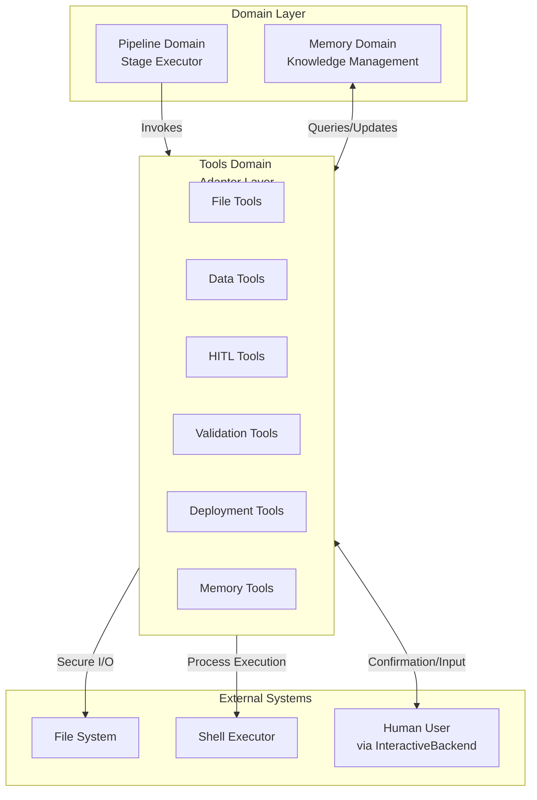
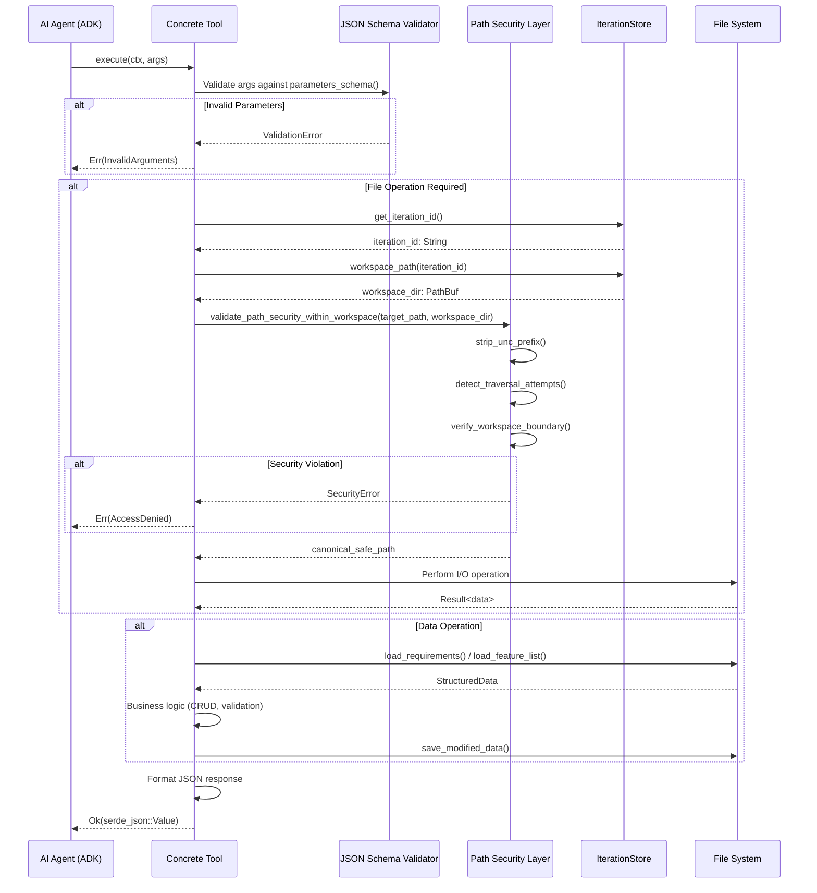

**Tools Domain Technical Documentation**
**Cowork Forge – AI-Native Iterative Development Platform**

**Generation Time:** 2026-02-14 05:17:26 (UTC)  
**Version:** 1.0  
**Domain:** Supporting Domain (Infrastructure)  
**Crate:** `cowork-core`

---

## 1. Executive Overview

The **Tools Domain** provides the comprehensive operational interface between AI agents and the host system within Cowork Forge. Acting as the execution layer for the 7-stage AI pipeline, this domain implements 30+ specialized tools adhering to the ADK (Agent Development Kit) `Tool` trait specification. These tools enable AI agents to perform secure file operations, manage structured project data, interact with human users through validation gates, query institutional memory, and execute deployment workflows.

**Key Architectural Value:**
- **Security-First Design**: Enforces strict workspace containment with path traversal prevention and UNC path normalization
- **Unified Interface**: Standardized `async_trait`-based tool contract enabling seamless agent integration
- **Cross-Platform Compatibility**: Handles Windows UNC paths and POSIX filesystem semantics uniformly
- **Human-in-the-Loop (HITL) Integration**: Bridges automated agent execution with human oversight through the `InteractiveBackend` abstraction

---

## 2. Architectural Positioning

Within Cowork Forge's Hexagonal Architecture, the Tools Domain operates as an **Infrastructure Adapter** that translates domain operations into system-level actions. It sits between the Pipeline Domain (which orchestrates AI agents) and external systems (filesystem, process executor, human users).



**Dependency Relationships:**
- **Upstream**: Pipeline Domain (via Stage Executor), Agent orchestration framework (`adk-rust`)
- **Downstream**: Persistence Domain (IterationStore, MemoryStore), Interaction Domain (InteractiveBackend), File System

---

## 3. Tool Taxonomy

The domain organizes 30+ tools into six functional categories, each addressing specific operational concerns within the AI-driven development lifecycle.

### 3.1 File Tools (`file_tools.rs`)
**Purpose**: Secure filesystem operations within workspace boundaries
- **ListFilesTool**: Directory traversal with pattern matching (utilizes `walkdir`)
- **ReadFileTool**: Full file content retrieval with encoding handling
- **ReadFileTruncatedTool**: Intelligent truncation for large files with line count limits
- **ReadFileWithLimitTool**: Call-count limited reading to prevent token exhaustion
- **WriteFileTool**: Atomic file writes with parent directory creation
- **RunCommandTool**: Shell execution with 30-second timeout and blocking command detection (prevents interactive commands like `vim`)

### 3.2 Data Tools (`data_tools.rs`)
**Purpose**: Structured data management for requirements, features, and tasks
- **Requirements Management**: `CreateRequirementTool`, `GetRequirementsTool` (REQ-ID prefixed)
- **Feature Management**: `AddFeatureTool`, `UpdateFeatureStatusTool`, `GetDesignDocumentTool` (FEAT-ID prefixed)
- **Task Management**: `CreateTaskTool`, `UpdateTaskStatusTool` (TASK-ID prefixed, supports pending→in_progress→completed/blocked workflow)
- **Component Management**: `AddComponentTool`, `GetImplementationPlanTool` (COMP-ID prefixed)
- **Status Workflow**: Enforces valid state transitions and dependency tracking

### 3.3 HITL Tools (`hitl_tools.rs`, `hitl_content_tools.rs`)
**Purpose**: Human-agent interaction for validation and refinement
- **ReviewAndEditFileTool**: Binary workflow (pass/edit) for file review with external editor integration
- **ReviewWithFeedbackFileTool**: Ternary workflow (pass/edit/feedback) enabling agent regeneration with human comments
- **ReviewAndEditContentTool**: Content-level review for generated artifacts (PRD, Design docs)
- **ReviewWithFeedbackContentTool**: Feedback-driven content refinement

### 3.4 Validation Tools (`validation_tools.rs`)
**Purpose**: Data integrity and consistency verification
- **CheckDataFormatTool**: JSON Schema validation for structured data files
- **CheckFeatureCoverageTool**: Bidirectional coverage analysis between features and requirements
- **CheckTaskDependenciesTool**: Circular dependency detection using Depth-First Search (DFS) algorithm

### 3.5 Deployment Tools (`deployment_tools.rs`)
**Purpose**: Safe promotion of workspace artifacts to project root
- **CopyWorkspaceToProjectTool**: Two-phase deployment strategy:
  - **Phase 1**: Orphaned file cleanup (removes files not in workspace, with protected paths: `.git/`, `config.toml`, `README.md`)
  - **Phase 2**: Extension-filtered copy (whitelist: `.html`, `.css`, `.js`, `.ts`, `.tsx`, `.json`, `.md`, images, fonts)

### 3.6 Memory Tools (`memory_tools.rs`)
**Purpose**: Knowledge persistence and retrieval across iterations
- **QueryMemoryTool**: Fuzzy keyword search across three scopes (project, iteration, smart-merged)
- **SaveInsightTool**: Capture iteration insights with categorization
- **SaveIssueTool**: Record technical debt and known issues
- **SaveLearningTool**: Document architectural learnings
- **PromoteToDecisionTool**: Elevate insights to architectural decisions
- **PromoteToPatternTool**: Elevate insights to reusable design patterns

### 3.7 PM Tools (`pm_tools.rs`)
**Purpose**: Project Manager Agent operational tools, supporting post-delivery user interaction
- **PMGotoStageTool**: Allows user to return to previous stages (idea, prd, design, plan, coding) for re-execution
- **PMCreateIterationTool**: Create new iteration for handling new requirements or modifications
- **PMRespondTool**: Send text response to user
- **PMSaveDecisionTool**: Save user decisions to project memory

> **Note**: PM tools are only available when iteration status is `Completed` (after Delivery stage), used for post-delivery project maintenance and requirement change scenarios.

---

## 4. Core Implementation Patterns

### 4.1 ADK Tool Trait Contract
All tools implement the standardized `Tool` trait from `adk_core`, ensuring interoperability with the agent framework:

```rust
#[async_trait]
pub trait Tool: Send + Sync {
    fn name(&self) -> &str;
    fn description(&self) -> &str;
    fn parameters_schema(&self) -> Value; // JSON Schema for validation
    
    async fn execute(
        &self, 
        ctx: Arc<dyn ToolContext>, 
        args: Value
    ) -> adk_core::Result<Value>;
}
```

**Key Implementation Details:**
- **Async Execution**: All tool operations are non-blocking using `async_trait` and Tokio runtime
- **JSON Schema Validation**: Parameters validated against declared schema before execution
- **Structured Output**: Results returned as `serde_json::Value` with consistent error wrapping
- **Context Injection**: `ToolContext` provides access to iteration ID and global state

### 4.2 Workspace Containment Architecture
**Security Model**: All file-system-touching tools enforce **workspace containment** to prevent directory traversal attacks and ensure project isolation.

**Validation Pipeline:**
1. **UNC Normalization**: Strips Windows UNC prefixes (`\\?\`) using `strip_unc_prefix()` for cross-platform path consistency
2. **Traversal Detection**: Rejects paths containing `..` components (directory escape attempts)
3. **Absolute Path Blocking**: Blocks absolute paths (e.g., `/etc/passwd`, `C:\Windows`) forcing relative path usage
4. **Boundary Verification**: Resolves canonical paths and verifies they reside within the iteration workspace

```rust
pub fn validate_path_security_within_workspace(
    path: &Path,
    workspace: &Path
) -> Result<PathBuf, ToolError> {
    let normalized = strip_unc_prefix(path);
    if normalized.components().any(|c| c == Component::ParentDir) {
        return Err(ToolError::SecurityViolation("Path traversal detected".into()));
    }
    // Additional absolute path and boundary checks...
}
```

### 4.3 Global Backend Integration
HITL tools require access to the user interface layer (CLI or GUI) through the `InteractiveBackend` trait. The domain uses a **global singleton pattern** (thread-safe via `Lazy<Mutex>`) to provide backend access without polluting tool signatures:

```rust
static INTERACTION_BACKEND: Lazy<Mutex<Option<Arc<dyn InteractiveBackend>>>> = 
    Lazy::new(|| Mutex::new(None));

pub fn set_interaction_backend(backend: Arc<dyn InteractiveBackend>) {
    *INTERACTION_BACKEND.lock().unwrap() = Some(backend);
}
```

---

## 5. Tool Execution Lifecycle

The following sequence illustrates the complete execution flow when an AI agent invokes a tool:



---

## 6. Domain-Specific Behaviors

### 6.1 Data Tools: ID Generation and Workflows
Data tools implement **structured ID generation** using the `generate_id()` utility:
- Requirements: `REQ-001`, `REQ-002`
- Features: `FEAT-001`
- Components: `COMP-001`
- Tasks: `TASK-001`

**Status Workflow Enforcement:**
Tasks enforce a finite state machine: `pending` → `in_progress` → (`completed` | `blocked`). Invalid transitions are rejected with descriptive errors.

### 6.2 Validation Tools: Dependency Analysis
The `CheckTaskDependenciesTool` implements **cycle detection** using DFS:
1. Builds adjacency list from task dependencies
2. Tracks visited nodes and recursion stack
3. Detects back-edges indicating circular dependencies
4. Returns detailed error messages identifying the cyclic chain

### 6.3 Deployment Tools: Safety Protocols
The deployment tool implements **destructive operation safety**:
- **Protected Paths**: Hardcoded exclusion of `.git/`, `README.md`, and `config.toml` from deletion
- **Extension Whitelisting**: Only copies file types explicitly approved for deployment (source maps, config files, and documentation excluded unless whitelisted)
- **Two-Phase Commit**: Cleanup phase executes only after successful workspace validation; copy phase executes only after successful cleanup

---

## 7. Integration with Adjacent Domains

### 7.1 Persistence Domain
Tools interact with persistence through **Store abstractions**:
- **IterationStore**: Resolves workspace paths and manages iteration metadata
- **MemoryStore**: Handles knowledge persistence for Memory Tools
- **Direct FS**: File Tools bypass stores for raw I/O but maintain path validation

### 7.2 Memory Domain
Memory Tools act as the **write path** for the Memory Domain:
- **Query Operations**: Delegate to `MemoryStore` with `MemoryQuery` filters (scope, category, keyword)
- **Write Operations**: Append to `IterationKnowledge` structures with automatic timestamping (`chrono`)
- **Promotion Logic**: Elevate insights to decisions/patterns using domain logic in `memory_tools.rs`

### 7.3 Interaction Domain
HITL Tools consume the `InteractiveBackend` trait:
- **CLI Implementation**: Terminal-based prompts using `dialoguer` with colored output (`colored` crate)
- **GUI Implementation**: Tauri event emission (`input_request` events) with oneshot channel response handling
- **Timeout Handling**: GUI backend implements 3000-second timeout for human responses to prevent indefinite blocking

---

## 8. Error Handling and Observability

### 8.1 Error Taxonomy
Tools return structured errors categorized as:
- **SecurityError**: Path violations, workspace escapes
- **ValidationError**: Schema mismatches, invalid state transitions
- **IOError**: Filesystem failures, permission denied
- **TimeoutError**: Command execution exceeding limits
- **UserCancelledError**: HITL interaction aborted by user

### 8.2 Logging and Transparency
All tool executions emit structured console output via `println!` macros for user visibility:
```rust
println!("[Tool] Writing file: {}", path.display());
println!("[Tool] Command output: {}", stdout);
```

This ensures transparent agent behavior in both CLI and GUI contexts (GUI captures stdout via Tauri process streams).

---

## 9. Extension Guidelines

To implement a new tool within this domain:

1. **Implement the Tool Trait**: Define `name()`, `description()`, and `parameters_schema()`
2. **Security Validation**: For filesystem operations, always use `validate_path_security_within_workspace()`
3. **Context Access**: Retrieve `iteration_id` from global storage for workspace-relative operations
4. **Error Mapping**: Convert internal errors to `adk_core::Result` with descriptive messages
5. **Registration**: Add to the tool registry in `tools/mod.rs` for agent discovery

**Example Pattern:**
```rust
pub struct MyNewTool;

#[async_trait]
impl Tool for MyNewTool {
    fn name(&self) -> &str { "my_new_tool" }
    
    async fn execute(&self, ctx: Arc<dyn ToolContext>, args: Value) -> Result<Value> {
        // Parameter extraction
        // Security validation (if FS involved)
        // Business logic execution
        // JSON result formatting
    }
}
```

---

## 10. Performance Considerations

- **Async Concurrency**: Tool execution is non-blocking, allowing the pipeline to handle multiple concurrent tool calls (subject to LLM rate limits)
- **File Truncation**: Large file handling uses `ReadFileTruncatedTool` to prevent token overflow in LLM contexts
- **Call Limits**: `ReadFileWithLimitTool` implements call-count tracking to prevent recursive file reading attacks
- **Caching**: IterationStore paths are resolved once per execution context and reused across tool calls

---

**End of Documentation**