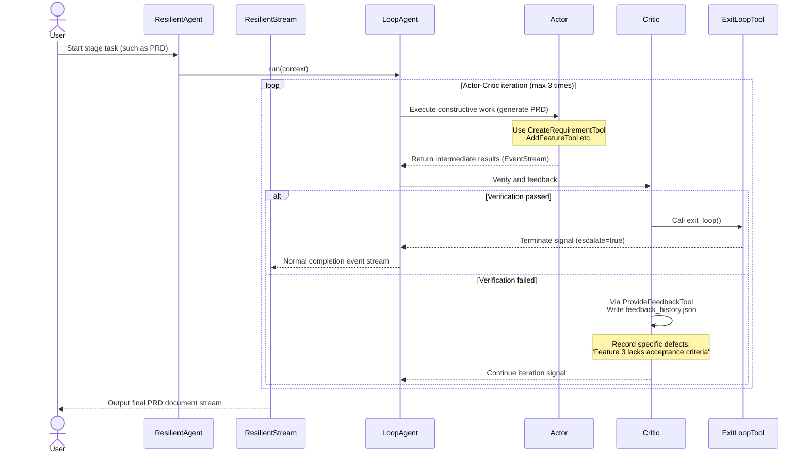
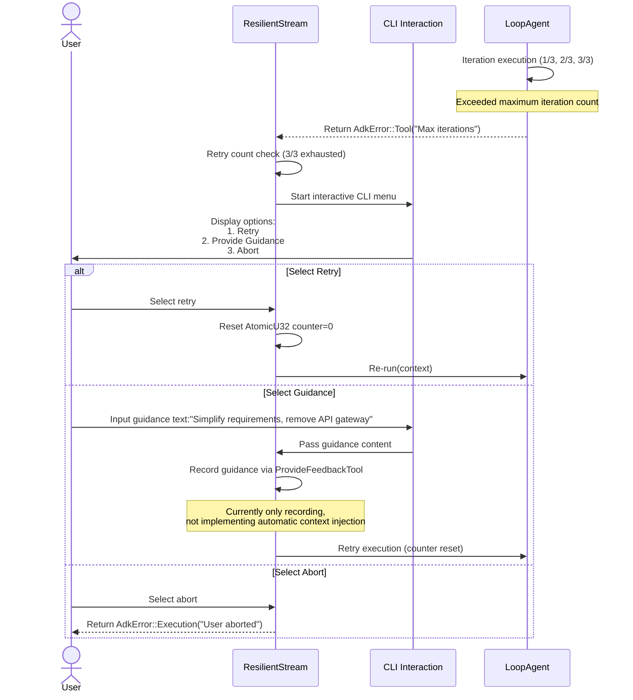

**Technical Document: AI Agent Orchestration Domain**

**Generation Time**: 2024-05-15 08:30:00 UTC  
**Version**: v1.0  
**Applicable Module**: `crates/cowork-core/src/agents/`

---

# AI Agent Orchestration Domain Technical Document

## 1. Overview

### 1.1 Domain Positioning

The **AI Agent Orchestration Domain** is the **core engine domain** of the Cowork Forge system, responsible for implementing multi-agent collaborative software development lifecycle (SDLC) automation. Built on the ADK (Agent Development Kit) framework, this domain adopts the **Actor-Critic dual-agent collaboration pattern**, providing specialized agent instances and orchestration capabilities for seven key stages from requirements conceptualization to project delivery (Idea → PRD → Design → Plan → Coding → Check → Delivery).

### 1.2 Core Value

| Value Dimension | Implementation Mechanism | Business Benefit |
|-----------------|-------------------------|------------------|
| **Quality Assurance** | Actor generation + Critic verification iteration loop | Prevents AI from generating low-quality or over-engineered design solutions |
| **Resilient Fault Tolerance** | ResilientAgent three-level fault tolerance (automatic retry → human decision → graceful abort) | Avoids agents falling into infinite loops or silent failures |
| **Controlled Collaboration** | HITL (Human-in-the-Loop) key node intervention | Ensures human control at PRD, Design, Plan key stages |
| **Stage Isolation** | StageExecutor escalate flag isolation | Supports LoopAgent independent exit without interrupting overall workflow |

### 1.3 Architecture Panorama

```mermaid
flowchart TB
    subgraph AgentFactory["Agent Factory Agent Factory"]
        direction TB
        
        subgraph Stage1["Idea Stage"]
            A1[idea_agent<br/>Single Agent]
        end
        
        subgraph Stage2["PRD Stage"]
            A2[prd_actor<br/>Construction]
            C2[prd_critic<br/>Verification]
            L2[prd_loop<br/>max_iter=3]
        end
        
        subgraph Stage3["Design Stage"]
            A3[design_actor<br/>Architecture design]
            C3[design_critic<br/>Simplicity verification]
            L3[design_loop<br/>max_iter=3]
        end
        
        subgraph Stage4["Plan Stage"]
            A4[plan_actor<br/>Task planning]
            C4[plan_critic<br/>Dependency verification]
            L4[plan_loop<br/>max_iter=3]
        end
        
        subgraph Stage5["Coding Stage"]
            A5[coding_actor<br/>Code implementation]
            C5[coding_critic<br/>Quality verification]
            L5[coding_loop<br/>max_iter=5]
        end
        
        subgraph Stage6["Check Stage"]
            A6[check_agent<br/>Permissive check]
        end
        
        subgraph Stage7["Delivery Stage"]
            A7[delivery_agent<br/>Delivery report]
        end
    end
    
    subgraph HITLLayer["HITL Resilient Layer"]
        R1[ResilientAgent<br/>max_retry=3]
        R2[ResilientAgent<br/>max_retry=3]
        R3[ResilientAgent<br/>max_retry=3]
        R4[ResilientAgent<br/>max_retry=3]
    end
    
    subgraph UserLayer["User Interaction Layer"]
        UI[CLI Interface<br/>dialoguer]
    end
    
    L2 --> A2 & C2
    L3 --> A3 & C3
    L4 --> A4 & C4
    L5 --> A5 & C5
    
    L2 -.wrap.-> R1
    L3 -.wrap.-> R2
    L4 -.wrap.-> R3
    L5 -.wrap.-> R4
    
    R1 & R2 & R3 & R4 -.HITL.-> UI
    
    style AgentFactory fill:#e1f5fe
    style HITLLayer fill:#fff3e0
    style UserLayer fill:#e8f5e9
    style Stage1 fill:#f3e5f5
    style Stage6 fill:#f3e5f5
    style Stage7 fill:#f3e5f5
```



---

## 2. Core Architecture Design

### 2.1 Actor-Critic Collaboration Pattern

The AI agent orchestration domain adopts the **Actor-Critic architecture** adapted for LLM-based agents:

- **Actor (Executor)**: Responsible for constructive work, such as generating PRD documents, creating architecture designs, writing code implementations. Actor is equipped with **write tools** (CreateRequirementTool, WriteFileTool, etc.).
- **Critic (Reviewer)**: Responsible for verification and feedback, checking Actor output completeness, consistency, and simplicity. Critic is equipped with **verification tools** (CheckFeatureCoverageTool, CheckTaskDependenciesTool) and **control tools** (ProvideFeedbackTool, ExitLoopTool).
- **LoopAgent (Loop Controller)**: Manages Actor and Critic iterative collaboration, constraining maximum iterations (3-5 times) to prevent infinite loops. Critic explicitly terminates loop by calling `ExitLoopTool`, or drives next iteration via `ProvideFeedbackTool` writing feedback.

**Constraint Mechanism**: In PRD, Design, Plan stages, Critic is instructed to execute **anti-loop check** (avoiding Actor-Critic falling into infinite mutual evaluation) and **simplicity verification** (such as Design stage mandatory requirement of 2-4 components).

### 2.2 ResilientAgent Elastic Decorator

All LoopAgents are wrapped by **ResilientAgent**, implementing error recovery and human-computer collaboration:

```rust
pub struct ResilientAgent {
    inner: Arc<dyn Agent>,
    max_retries: u32,        // Default 3
    retry_counter: AtomicU32, // Thread-safe counter
}
```

**Three-Level Fault Tolerance Strategy**:

1. **Automatic Retry Layer**: In `ResilientStream::poll_next()` intercept errors, automatically retry non-fatal errors (such as LLM temporary failures), maximum 3 times
2. **Human Decision Layer**: When detecting `"Max iterations"` error (Actor-Critic iterations exhausted without consensus), pause event stream, present interactive menu via `dialoguer` crate:
   - **Retry**: Reset counter, re-execute current LoopAgent
   - **Provide Guidance**: User inputs guidance text (such as "Simplify architecture, remove message queue"), recorded to feedback history then retry
   - **Abort**: Gracefully abort, return error to upper layer
3. **Stream-Level Interception**: `ResilientStream` wraps original `EventStream`, implementing non-blocking error detection and recovery in `poll_next`

### 2.3 StageExecutor Stage Isolation

To avoid LoopAgent calling `exit_loop()` terminating entire workflow, the system adopts **StageExecutor** instead of SequentialAgent:

```rust
pub struct StageExecutor {
    name: String,
    stages: Vec<(String, Arc<dyn Agent>)>,  // (Stage name, Agent)
}
```

**Key Design**: StageExecutor **ignores `event.actions.escalate` flag** when executing sub-agents, ensuring:
- LoopAgent's `ExitLoopTool` only terminates current stage loop
- Errors won't propagate upwards causing pipeline interruption
- Supports "iteration within stages, sequential execution between stages" mixed orchestration mode

---

## 3. Component Details

### 3.1 Agent Factory (Agent Factory)

Located at `agents/mod.rs`, providing 7 factory functions to create stage-specific agents:

| Factory Function | Stage | Agent Type | Special Configuration |
|-----------------|-------|------------|---------------------|
| `create_idea_agent` | Idea | Single Agent | Equipped with SaveIdeaTool, IncludeContents::None |
| `create_prd_loop` | PRD | LoopAgent | Actor+Critic, max_iter=3, equipped with requirement CRUD tools |
| `create_design_loop` | Design | LoopAgent | Actor+Critic, max_iter=3, equipped with design component tools |
| `create_plan_loop` | Plan | LoopAgent | Actor+Critic, max_iter=3, equipped with task planning tools |
| `create_coding_loop` | Coding | LoopAgent | Actor+Critic, max_iter=5, equipped with file operation and command execution tools |
| `create_check_agent` | Check | Single Agent | Permissive verification mode, read-only tool set |
| `create_delivery_agent` | Delivery | Single Agent | Report generation tools, summarizing previous stage artifacts |

**Configuration Conventions**:
- **Actor**: Use `IncludeContents::None`, avoid context pollution, force reading necessary information via tools
- **Critic**: Use default context inclusion strategy, can access complete file tree for verification
- **Tool Set**: Each stage Agent configured with session-scoped tools, achieving data isolation via `session_id`

### 3.2 HITL Elastic Layer (`agents/hitl.rs`)

Implements core infrastructure for human-computer collaboration:

**ResilientStream Structure**:
```rust
pub struct ResilientStream {
    inner: EventStream,
    retry_count: Arc<AtomicU32>,
    max_retries: u32,
    context: Arc<dyn InvocationContext>,
}
```

**Error Identification and Classification**:
- **Recoverable Errors**: Network timeout, LLM rate limiting → Automatic retry
- **Intervention-Required Errors**: `Max iterations` (iteration exhausted), `Tool execution failed` (tool execution failure) → Trigger HITL flow
- **Fatal Errors**: Permission denied, configuration error → Immediate abort

**User Interaction Protocol**:
When HITL is triggered, system presents menu via `dialoguer::Select`:
```
AI agent execution encountered repeated iteration limit (3/3)

Select operation:
> 1. Retry execution (Retry)
  2. Provide guidance suggestions (Provide Guidance)
  3. Abort execution (Abort)
```

### 3.3 Collaboration Protocol Implementation

**Actor-Critic Communication Protocol**:

1. **Actor Execution**: Based on system prompts (from instruction template domain) and available tools execute constructive tasks, output intermediate artifacts (such as PRD draft)
2. **Critic Evaluation**: Reads Actor output, executes verification tools to check constraint conditions (such as Design stage check "component count ≤ 4")
3. **Decision Branch**:
   - **Verification Passed**: Critic calls `ExitLoopTool`, LoopAgent terminates iteration, returns final result
   - **Verification Failed**: Critic calls `ProvideFeedbackTool` writes to `feedback_history.json`, records defect description and improvement suggestions, Actor enters next iteration

**Human-Computer Collaboration Integration Points**:
At PRD, Design, Plan stages, after Actor's first output triggers `ReviewWithFeedbackContentTool`, displaying content preview (first 12-15 lines), waiting for user selection:
- **edit**: Open system default editor (`$EDITOR`) to modify content, save and reload
- **pass**: Direct confirmation, enter Critic verification phase
- **feedback**: Capture text feedback, inject into next Actor context

---

## 4. Technical Implementation Details

### 4.1 Rust Implementation Characteristics

**Thread Safety**:
- Use `Arc<dyn Agent>` for agent shared ownership
- `AtomicU32` ensures retry counter thread safety
- All Agents implement `Send + Sync`, supporting asynchronous concurrent execution

**Asynchronous Stream Processing**:
```rust
impl Stream for ResilientStream {
    type Item = Result<Event, AdkError>;
    
    fn poll_next(mut self: Pin<&mut Self>, cx: &mut Context<'_>) -> Poll<Option<Self::Item>> {
        // Intercept error events, decide retry or trigger HITL based on type
        match self.inner.poll_next(cx) {
            Poll::Ready(Some(Err(e))) if is_recoverable(&e) => {
                self.handle_recoverable_error(e, cx)
            }
            Poll::Ready(Some(Err(e))) if is_hitl_trigger(&e) => {
                self.suspend_for_human_decision(e, cx)
            }
            other => other
        }
    }
}
```

### 4.2 ADK Framework Integration

**Core Trait Implementation**:
- `Agent`: All agent factory functions return `Arc<dyn Agent>`, unified `run()` method signature
- `Tool`: Tools from tool system domain injected to Agent via Arc
- `InvocationContext`: Passes session ID, project path, and other context

**LoopAgent Configuration**:
```rust
let loop_agent = LoopAgent::builder()
    .actor(actor_agent)
    .critic(critic_agent)
    .max_iterations(3)  // PRD/Design/Plan limit 3 times, Coding limit 5 times
    .exit_on_feedback(true)  // Critic provides feedback then continue loop
    .build();
```

### 4.3 Tool Chain Integration Pattern

Each stage Agent obtains tool set via **dependency injection**:

**PRD Stage Tool Configuration Example**:
```rust
let tools: Vec<Arc<dyn Tool>> = vec![
    Arc::new(CreateRequirementTool::new(session_id.clone())),
    Arc::new(AddFeatureTool::new(session_id.clone())),
    Arc::new(ReadFileTool::new()),  // Read previous stage artifacts
    Arc::new(ReviewWithFeedbackContentTool::new()),  // HITL review
    Arc::new(ProvideFeedbackTool::new(session_id.clone())),
];
```

**Permission Control**:
- **Actor**: Has write permissions (Create/Update/Write tools)
- **Critic**: Read-only permissions (Check/Validate tools) + control permissions (Feedback/Exit tools)
- **Check Agent**: Pure read-only, executes permissive verification (allows minor inconsistencies, only marks critical errors)

---

## 5. Interaction Sequences

### 5.1 Normal Execution Flow



### 5.2 Resilient Error Recovery Flow



---

## 6. Configuration and Extension

### 6.1 Agent Parameter Configuration

Configure each stage parameter via `AgentConfig` structure:

```rust
pub struct AgentConfig {
    pub max_iterations: u32,      // Iteration count limit
    pub temperature: f32,         // LLM temperature (Actor usually 0.7, Critic usually 0.3)
    pub include_contents: IncludeContents,  // Context inclusion strategy
    pub hitl_enabled: bool,       // Whether to enable HITL review for this stage
}
```

**Stage Differentiated Configuration**:
- **Idea Stage**: temperature=0.8 (creative), no Critic (single agent)
- **Design Stage**: Actor temp=0.7 (balanced creativity), Critic temp=0.2 (strict verification), mandatory component count ≤ 4
- **Coding Stage**: max_iterations=5 (code implementation more complex), equipped with RunCommandTool to execute build verification

### 6.2 Extension Guide

**Adding New Stage Agents**:
1. Add new factory function `create_custom_loop` in `agents/mod.rs`
2. Add Actor/Critic instruction templates in `instructions/` directory: `custom.rs`
3. Register stage-specific tools in `tools/mod.rs`
4. Insert new stage in `StageExecutor` in `pipeline/mod.rs`

**Customizing HITL Strategy**:

Customize human-computer collaboration trigger conditions by implementing `HitlStrategy` trait:
```rust
pub trait HitlStrategy {
    fn should_intervene(&self, event: &Event, retry_count: u32) -> bool;
    fn present_options(&self) -> Vec<HitlOption>;
}
```

---

## 7. Performance and Reliability

### 7.1 Resource Management

- **Streaming Processing**: All Agents return `EventStream`, supporting incremental output, avoiding large document memory occupation
- **Timeout Control**: Tool system domain's `RunCommandTool` sets 30-second timeout, preventing AI from generating blocking commands (such as `npm install`)
- **Rate Limiting**: Via LLM service domain's `RateLimitedLlm` decorator, default 2-second delay, ensuring <30 times/minute API calls

### 7.2 Fault Isolation

| Failure Scenario | Isolation Mechanism | Recovery Strategy |
|------------------|---------------------|-------------------|
| Single stage LoopAgent failure | StageExecutor isolation | ResilientAgent retry 3 times → HITL decision |
| LLM API timeout | RateLimiter wrapping | Automatic retry + backoff strategy |
| File IO permission error | Path security verification (file_tools.rs) | Immediate abort, report security violation |
| Memory shortage | Streaming architecture | Chunked processing of large files, avoid full load |

---

## 8. Summary

The AI agent orchestration domain achieves robust, controllable, high-quality AI-driven software development automation through **Actor-Critic dual-agent collaboration**, **ResilientAgent elastic fault tolerance**, and **StageExecutor stage isolation** three core mechanisms. This architecture ensures AI autonomy while preserving human control at key decision points through HITL mechanism, preventing over-engineering through simplicity constraints, serving as the technical cornerstone of Cowork Forge system achieving "automated software development" vision.

**Key Design Decisions Reviewed**:
1. **Why Choose StageExecutor over SequentialAgent**: Ensure LoopAgent's exit doesn't affect global flow, supporting intra-stage iterative optimization
2. **Why Separate Actor and Critic**: Decouple construction and verification responsibilities, avoiding AI acting as both athlete and referee leading to bias
3. **Why HITL Intervention at max_iterations**: Give AI sufficient autonomy (3-5 iterations), while introducing human supervision when falling into loops in time