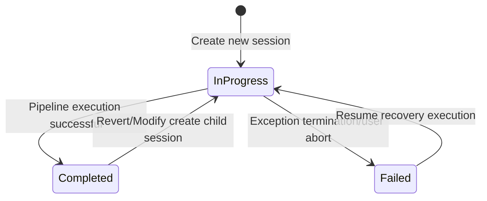

**Technical Document: CLI Interaction and Project Entry Domain**

**Generation Time**: 2024-01-15 08:30:00 UTC  
**Document Version**: v1.0  
**Applicable Scope**: Cowork Forge CLI Module (crates/cowork-cli)

---

## 1. Overview

The CLI Interaction and Project Entry Domain is the **command line interaction facade** and **project lifecycle orchestrator** of the Cowork Forge system. As the outermost component of the system, this domain bears core responsibilities of parsing user commands, initializing execution environment, managing session lifecycle, and coordinating downstream domain collaborative work.

Built on Rust asynchronous runtime, this module adopts layered architecture design, achieving unified entry control and execution orchestration capabilities for seven core AI agent stages (Idea → PRD → Design → Plan → Coding → Check → Delivery) through declarative CLI parsing, layered configuration strategy, and state machine-driven session management.

### 1.1 Core Responsibilities

| Responsibility Domain | Function Description | Key Implementation |
|----------------------|----------------------|-------------------|
| **Command Parsing** | Parse user's six core commands and global flags | `clap` derive macro implements type-safe parsing |
| **Configuration Management** | Hierarchical loading of LLM configuration and project configuration, supporting file/environment variable dual modes | TOML parsing + environment variable fallback strategy |
| **Session Lifecycle** | Manage Session ID generation, state machine transitions (InProgress/Completed/Failed), lineage tracking | Timestamp-derived ID + `.cowork/` directory persistence |
| **Execution Orchestration** | Start agent pipelines via ADK Runner, supporting synchronous/streaming dual-mode output | `adk_runner::Runner` asynchronous event stream processing |
| **Change Detection** | Project file fingerprint calculation, supporting incremental modification scenario difference comparison | `walkdir` + file metadata hashing |

### 1.2 Architecture Positioning

In Cowork Forge's layered architecture, the CLI domain is located at the **Interface Layer**, serving as the bridge between users and core domain layers (AI Agent Orchestration Domain, Pipeline Orchestration Domain):

```
User Terminal
    │
    ▼
[CLI Interaction and Project Entry Domain] ←──── Configuration/Session Management
    │
    ├──► [LLM Service Domain] ────────► External LLM API
    │
    └──► [Pipeline Orchestration Domain] ───────► [AI Agent Orchestration Domain]
              │
              ▼
        [Tool System Domain] ←───────► File System/Operating System
```

---

## 2. Command System Design

The system provides six core commands, covering full-scenario operational requirements throughout the software development lifecycle:

### 2.1 Command Matrix

| Command | Function Description | Applicable Scenarios | Key Parameters |
|---------|---------------------|---------------------|----------------|
| `cowork new` | Create new project session, execute complete seven-stage pipeline | Building new projects from scratch | `--project <name>`, `--idea <description>` |
| `cowork resume` | Continue execution from checkpoint, automatically detect completed stages | Interrupted recovery, exception resumption | `--session <id>` (optional, default latest) |
| `cowork revert` | Re-execute from specified stage | Major adjustments at design/planning stages | `--session <id>`, `--to <stage>` |
| `cowork modify` | Execute incremental changes based on existing project | Requirement changes, feature enhancements | `--project <name>`, `--change <description>` |
| `cowork status` | Query session status and history | Status monitoring, session management | `--project <name>` (optional) |
| `cowork init` | Initialize project configuration, generate default TOML file | First-time environment configuration | None |

### 2.2 Global Flags

```rust
#[derive(Parser)]
struct Cli {
    /// Configuration file path (TOML format)
    #[arg(short, long)]
    config: Option<PathBuf>,
    
    /// Detailed log output (Debug level)
    #[arg(short, long)]
    verbose: bool,
    
    /// LLM streaming output mode
    #[arg(short, long)]
    stream: bool,
    
    #[command(subcommand)]
    command: Commands,
}
```

**Design Considerations**:
- **Configuration Separation**: Supports multi-environment configuration (development/production/local LLM) via `-c` flag
- **Observability**: `-v` enables `tracing`'s DEBUG level, default only displays WARN and above
- **User Experience**: `-s` streaming mode real-time displays AI-generated content, reducing waiting anxiety

---

## 3. Core Submodule Implementation

### 3.1 Command Handler (Command Handler)

Based on `clap` 4.x derive macro implementing declarative command definition, achieving type-safe parameter parsing through zero-cost abstraction:

**Key Implementation Pattern**:
```rust
#[derive(Subcommand)]
enum Commands {
    /// Create new project
    New {
        /// Project idea description
        idea: String,
        /// Project name (optional, default timestamp)
        #[arg(short, long)]
        project: Option<String>,
    },
    /// Resume from checkpoint
    Resume {
        /// Target session ID (optional, default latest successful session)
        #[arg(short, long)]
        session: Option<String>,
    },
    // ... other commands
}

// Asynchronous command dispatch
async fn execute_command(cli: Cli) -> Result<()> {
    match cli.command {
        Commands::New { idea, project } => cmd_new(idea, project, cli.config).await,
        Commands::Resume { session } => cmd_resume(session, cli.config).await,
        // ...
    }
}
```

**Error Propagation Strategy**:
Adopts `anyhow` for full-link error context enhancement, ensuring error information includes current executing command type and session ID for easy troubleshooting.

### 3.2 Configuration Manager (Configuration Manager)

Implements **layered Fallback configuration strategy**, with priority from high to low:

1. **Command-line specified** (`-c/--config` explicit path)
2. **Current directory configuration file** (`./config.toml`)
3. **User-level global configuration** (`~/.cowork/config.toml`)
4. **Environment variables** (`COWORK_LLM_ENDPOINT`, `COWORK_API_KEY`)
5. **Default hard-coded** (Local Ollama default endpoint)

**Configuration Model**:
```rust
#[derive(Deserialize)]
struct ModelConfig {
    endpoint: String,
    api_key: String,
    model: String,
    timeout_secs: u64,
}

impl ModelConfig {
    /// File priority loading, fallback to environment variables on failure
    pub fn load_with_fallback(path: Option<PathBuf>) -> Result<Self> {
        if let Some(p) = path {
            Self::from_file(p)
        } else if let Ok(cfg) = Self::from_file("./config.toml") {
            Ok(cfg)
        } else {
            Self::from_env()
        }
    }
}
```

### 3.3 Session Manager (Session Manager)

The session manager is responsible for maintaining **stateful service sessions (Stateful Session)**, achieving inter-process state persistence via file system:

#### 3.3.1 Session Identification Strategy

Adopts **timestamp-derived ID** to generate unique session identifiers:
```rust
fn generate_session_id() -> String {
    format!("session-{}", chrono::Utc::now().timestamp())
}
```
**Advantages**: Naturally sorted by time, human-readable, avoiding UUID randomness cognitive burden.

#### 3.3.2 Session State Machine



**Session Lineage Tracking**:

Resume/Revert/Modify commands create **child sessions (Child Session)**, associating parent sessions via `base_session_id` field, forming session chains (Session Chain), supporting change traceability and version rollback.

```rust
struct SessionRecord {
    id: String,
    session_type: SessionType,      // New/Modify/Revert/Resume
    status: SessionStatus,          // InProgress/Completed/Failed
    base_session_id: Option<String>, // Parent session reference (lineage tracking)
    created_at: DateTime<Utc>,
    completed_at: Option<DateTime<Utc>>,
}
```

#### 3.3.3 Project File Fingerprint System

For incremental modification scenarios in `cowork modify`, implements **metadata-based lightweight fingerprint**:

```rust
type FileFingerprint = (u64, u64); // (file length, modification timestamp)

fn collect_project_fingerprints(project_dir: &Path) -> HashMap<String, FileFingerprint> {
    WalkDir::new(project_dir)
        .filter_entry(|e| !is_ignored_path(e)) // Exclude .cowork/, target/, node_modules/
        .filter_map(|e| e.ok())
        .filter(|e| e.file_type().is_file())
        .map(|e| {
            let meta = e.metadata()?;
            let fingerprint = (meta.len(), meta.modified()?.duration_since(UNIX_EPOCH)?.as_secs());
            (e.path().to_string_lossy().to_string(), fingerprint)
        })
        .collect()
}
```

**Change Detection Algorithm**:

By comparing fingerprint mappings before and after `cowork modify` command execution, precisely calculate `added`, `modified`, `deleted` file sets, stored in `PatchMetadata` for subsequent auditing.

---

## 4. Execution Orchestration and ADK Integration

### 4.1 Pipeline Factory Calls

The CLI domain serves as a **pipeline orchestration domain** client, creating different types of execution pipelines via factory functions:

| CLI Command | Pipeline Factory Function | Pipeline Type |
|-------------|---------------------------|--------------|
| `new` | `create_cowork_pipeline` | Seven-stage complete pipeline |
| `resume` | `create_resume_pipeline` | Checkpoint resumption pipeline (dynamically skip completed stages) |
| `revert` | `create_partial_pipeline` | Partial execution pipeline (start from specified stage) |
| `modify` | `create_modify_pipeline` | Incremental modification pipeline (Change Triage → Code Patch → Check) |

### 4.2 ADK Runner Execution Model

```rust
async fn execute_pipeline(
    pipeline: Arc<dyn Agent>,
    config: ModelConfig,
    session_id: String,
    stream_mode: bool,
) -> Result<()> {
    // 1. Build LLM client (with rate limiting)
    let llm = create_llm_client(config)?;
    
    // 2. Initialize ADK Runner
    let runner = Runner::new(RunnerConfig {
        agent: pipeline,
        session_service: Arc::new(InMemorySessionService::new()),
        // ... other configuration
    });
    
    // 3. Start asynchronous event stream
    let mut event_stream = runner.run("user", &session_id, Content::text("Start execution")).await?;
    
    // 4. Consume event stream
    while let Some(event) = event_stream.next().await {
        match event {
            Event::Content { content, .. } if stream_mode => {
                // Streaming mode: Real-time output to stdout
                print!("{}", content.text);
                stdout().flush()?;
            }
            Event::FunctionCall { name, args } => {
                tracing::debug!("Tool call: {} {:?}", name, args);
            }
            Event::Error { error } => {
                return Err(error.into());
            }
            _ => {}
        }
    }
    
    Ok(())
}
```

**Key Design**:
- **Session Service Isolation**: Each command execution uses independent `InMemorySessionService`, ensuring multi-session parallel safety
- **Streaming Output Support**: Real-time forwards LLM Token-level output via `EventStream`, reducing user wait perception
- **Graceful Shutdown**: Listens for pipeline completion events, ensuring all file handles and temporary resources correctly released

---

## 5. Storage and State Persistence

The CLI domain interacts with storage layer via `cowork_core::storage` module, maintaining `.cowork/` directory structure:

```
.cowork/
├── project_index.json          # Project-level session index (session list, current status)
├── config.toml                 # Project-level configuration file (optional)
└── sessions/
    ├── session-1672531200/     # Specific session directory
    │   ├── metadata.json       # Session metadata (type, status, parent session ID)
    │   ├── input.json          # Session initial input (idea, change description)
    │   ├── state.json          # Execution state (current stage, context)
    │   ├── feedback_history.json # HITL feedback history records
    │   └── patch_metadata.json # Incremental modification metadata (Modify command exclusive)
    └── session-1672531300/
        └── ...
```

**State Update Strategy**:
- **Optimistic Update**: Immediately mark status as `InProgress` when pipeline starts
- **Eventual Consistency**: Mark as `Completed` after pipeline successfully completes, or `Failed` on exception/abort
- **Atomic Write**: All JSON file writes adopt temporary file + rename strategy, preventing write interruption causing data corruption

---

## 6. Error Handling and Resilience Mechanisms

### 6.1 Layered Error Handling

| Level | Error Type | Handling Strategy |
|-------|-----------|-------------------|
| **CLI Parsing Layer** | Parameter format error, missing required fields | `clap` auto-generates help info and exits with code 2 |
| **Configuration Layer** | File doesn't exist, TOML parsing failure | Fallback to environment variables, still fails return user-friendly prompt |
| **Session Layer** | Session doesn't exist, status conflict | Prompt available session list (guided by `cowork status`) |
| **Execution Layer** | Agent execution failure, tool call error | Handled by downstream `ResilientAgent`, CLI responsible for final status marking |

### 6.2 Observability Implementation

Based on `tracing` framework for structured logging:

```rust
fn init_logging(verbose: bool) {
    let filter = if verbose {
        LevelFilter::DEBUG
    } else {
        // Default filter ADK internal crate INFO and below logs, reduce noise
        LevelFilter::WARN
            .add_directive("cowork_cli=info".parse().unwrap())
            .add_directive("cowork_core=info".parse().unwrap())
    };
    
    tracing_subscriber::fmt()
        .with_writer(std::io::stderr) // Force output to stderr, avoid polluting stdout
        .with_max_level(filter)
        .init();
}
```

**Logging Standards**:
- **stdout**: Only outputs user-friendly progress prompts (using emoji indicators: ✨ initialization, 🔄 executing, ✅ complete, ❌ error)
- **stderr**: All diagnostic logs, debug info, error stacks

---

## 7. Interface Contracts

### 7.1 External Interfaces (User Interface)

**Environment Dependencies**:
- Rust runtime environment (≥1.70)
- Writable file system permissions (create `.cowork/` directory)
- Network connection (access LLM API endpoint)
- Optional: System default editor (for `edit` operations in HITL review process)

**Exit Code Conventions**:
| Exit Code | Meaning |
|-----------|---------|
| 0 | Execution successful |
| 1 | Generic error (execution failed) |
| 2 | CLI parameter parsing error |
| 130 | User interrupt (Ctrl+C) |

### 7.2 Internal Interfaces (Core Domain Communication)

```rust
// Interface with pipeline orchestration domain
pub fn create_cowork_pipeline(
    config: ModelConfig,
    session_id: String,
) -> Arc<dyn Agent>;

// Interface with storage domain
pub fn init_session_from_base(
    new_session_id: String,
    base_session_id: String,
) -> Result<SessionContext>;

// Session management interface
pub fn mark_session_completed(session_id: &str) -> Result<()>;
pub fn mark_session_failed(session_id: &str, error: &str) -> Result<()>;
```

---

## 8. Typical Workflow Examples

### 8.1 Complete New Flow (Happy Path)

```bash
$ cowork new "Create a Rust CLI tool for managing todos" --project todo-cli
✨ Initialize new project: todo-cli
📝 Session ID: session-1672531200
🔄 Start AI agent pipeline...

[Idea] Organizing idea...
[Idea] ✓ Generated idea.md

[PRD] Actor analyzing requirements...
[PRD] Critic verifying...
[PRD] Waiting for human review...
# Interactive menu appears: edit / pass / feedback
> pass

[Design] Actor creating architecture...
[Design] Critic verifying simplicity...
...

✅ Project delivery complete! All artifacts saved to ./.cowork/sessions/session-1672531200/
```

### 8.2 Incremental Modification Flow

```bash
$ cowork modify --project todo-cli --change "Add priority label functionality"
🔍 Calculate project file fingerprints...
📦 Create change session session-1672534560 based on session session-1672531200
🔄 Execute change analysis...

[Change Triage] Analyzing impact scope:
  - Affected components: Task Model, CLI Parser
  - Risk level: Medium
  - Expected modified files: src/models.rs, src/cli.rs

[Code Patch] Execute incremental modification...
✅ Modification complete, generated change report
```

---

## 9. Performance and Constraints

### 9.1 Performance Characteristics

- **Startup Latency**: < 100ms (Rust native compilation, no runtime JIT)
- **Memory Usage**: Base ~20MB, grows with pipeline complexity during execution (mainly LLM context cache)
- **File Fingerprint Calculation**: < 1s (for projects with <10,000 files)

### 9.2 Usage Constraints

- **Single Instance Execution**: Only one active session allowed in same project directory at same time (via file lock)
- **Path Security**: All file operations restricted to project root directory, prohibiting path traversal (`../`) access to parent directory
- **Command Timeout**: Shell command execution defaults to 30-second timeout, preventing infinite blocking

---

## 10. Extension Guide

### 10.1 Adding New Commands

1. Add new variant to `Commands` enum
2. Implement corresponding `cmd_<name>` async handler function
3. If needing new pipeline type, implement `create_<name>_pipeline` in `cowork-core`
4. Update `execute_command` dispatch logic

### 10.2 Custom Configuration Source

Implement `ConfigProvider` trait to access external configuration centers (such as Consul, etcd):

```rust
trait ConfigProvider {
    async fn load(&self) -> Result<ModelConfig>;
}

// Add new branch in load_config
match provider {
    ConfigSource::File(p) => ModelConfig::from_file(p),
    ConfigSource::Env => ModelConfig::from_env(),
    ConfigSource::Custom(provider) => provider.load().await,
}
```

---

## Conclusion

The CLI interaction and project entry domain as the **portal layer** of Cowork Forge system, through carefully designed command system, robust session management, and transparent configuration strategy, provides users with intuitive and reliable AI-driven development entry. Its Rust zero-cost abstraction implementation ensures type safety while delivering near-native performance user experience, serving as a key link connecting human intent and AI execution capabilities.