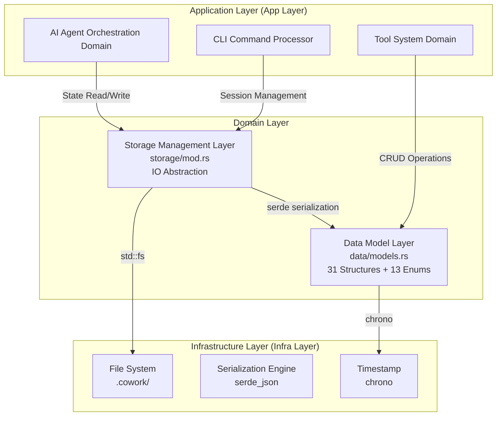
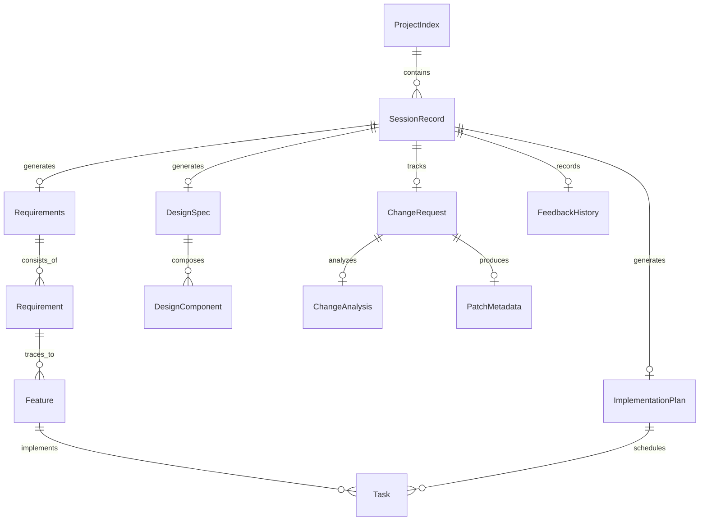

# Data and Storage Management Domain Technical Documentation

---

## 1. Domain Overview

### 1.1 Positioning and Responsibilities

The **Data and Storage Management Domain** is the data infrastructure layer of the Cowork Forge system, bearing responsibilities for data persistence, version control, and state management throughout the entire software development lifecycle (SDLC). This domain adopts a **file system native persistence** architecture, achieving AI agent collaboration data precipitation and traceability through structured JSON documents and Markdown artifacts.

**Core Responsibilities**:
- **Domain Modeling**: Define 31 core structures and 13 state enums covering six major domains: requirements, design, planning, code, sessions, and changes
- **Session Isolation**: Implement session-scope storage based on UUID, supporting non-interfering multi-project parallel development
- **State Machine Management**: Maintain session lifecycle state transitions: `InProgress` → `Completed`/`Failed`
- **Change Tracking**: Support state inheritance and artifact copying during incremental modification (Modify) and version rollback (Revert)
- **Artifact Persistence**: Manage `.cowork` directory metadata, design documents (PRD/Design), task lists, and other deliverables

### 1.2 Architecture Value

In Cowork Forge's Actor-Critic multi-agent collaboration architecture, this domain serves as the **Single Source of Truth**:

| Value Dimension | Implementation Mechanism | Business Benefit |
|-----------------|-------------------------|------------------|
| **Traceability** | Session-level directory isolation + timestamp metadata | Supports checkpoint recovery (Resume) and troubleshooting |
| **Human-Computer Collaboration** | FeedbackHistory persistence | Saves user review comments for AI iteration reference |
| **Security and Fault Tolerance** | Idempotent read mode (file missing returns default) | Avoids tool call failures due to missing files |
| **Incremental Evolution** | `init_session_from_base` inheritance mechanism | Modify mode fast forking based on original session |

---

## 2. Layered Architecture Design

The data and storage management domain adopts a **three-layer architecture** implementing separation of concerns:



### 2.1 Data Model Layer (Data Models)

Located at `crates/cowork-core/src/data/models.rs`, adopting **Domain-Driven Design (DDD)** paradigm, divided into six sub-domains by SDLC stage:

**Core Entity Relationship Diagram**:



**Key Data Structures**:

| Domain | Core Structure | Responsibility Description |
|--------|---------------|---------------------------|
| **Requirements Management** | `Requirements` / `Requirement` | Track requirement items, priorities, classifications, and acceptance criteria |
| **Feature Management** | `Feature` / `FeatureList` | Manage feature lifecycle (Planned→InProgress→Completed), support automatic state transitions |
| **Architecture Design** | `DesignSpec` / `DesignComponent` | Store simplicity architecture constraints (2-4 component limit), interface contracts, data models |
| **Task Planning** | `ImplementationPlan` / `Task` | Maintain 5-12 core task constraints, dependency graph, milestone planning |
| **Code Metadata** | `CodeMetadata` / `FileMetadata` | Record generated file list, build status, test coverage |
| **Session Management** | `SessionMeta` / `SessionRecord` | Manage session types (New/Modify/Revert), state machine, parent session references |
| **Change Management** | `ChangeRequest` / `PatchMetadata` | Support incremental modification impact analysis, risk rating, artifact update tracking |

### 2.2 Storage Management Layer (Storage Layer)

Located at `crates/cowork-core/src/storage/mod.rs`, encapsulating file IO details, providing **Repository Pattern** abstraction:

**Storage Topology**:

```
.cowork/
├── index.json                    # ProjectIndex: Project-level session index
└── sessions/
    └── {uuid}/
        ├── meta.json             # SessionMeta: Session metadata
        ├── input.json            # User original input
        ├── change_request.json   # Change request (Modify mode)
        ├── state/
        │   ├── requirements.json
        │   ├── feature_list.json
        │   ├── design_spec.json
        │   ├── implementation_plan.json
        │   ├── code_metadata.json
        │   └── feedback_history.json
        ├── artifacts/
        │   ├── idea.md
        │   ├── prd.md
        │   ├── design.md
        │   └── plan.md
        └── patch/
            └── metadata.json     # PatchMetadata: Incremental modification records
```

---

## 3. Key Mechanism Implementation

### 3.1 Session Lifecycle Management

The system supports four working modes (New/Resume/Modify/Revert), with the storage layer implementing flexible switching through `SessionType` enumeration and state inheritance mechanisms:

**State Machine Definition**:
```rust
pub enum SessionStatus {
    InProgress,    // In progress
    Completed,     // Completed
    Failed,        // Failed/aborted
}

pub enum SessionType {
    New,           // Brand new creation
    Change,        // Incremental modification (inherits baseline)
    Revert,        // Version rollback (inherits baseline)
}
```

**Session Inheritance Mechanism (Modify/Revert)**:

When executing `cowork modify --project <name>`, the storage layer performs the following atomic operations:

1. **Baseline Copy**: Deep copy original session's `state/` and `artifacts/` to new session directory via `init_session_from_base(new_id, base_id)`
2. **Metadata Fork**: New session records `base_session_id` pointer, forming session lineage chain
3. **Change Tracking**: Create `ChangeRequest` recording change intent, impact scope (PRD/Design/Plan/Code), risk level

**Session Recovery Logic (Resume)**:

The system automatically infers recovery point by detecting artifact existence, without requiring users to explicitly specify stage:

```rust
// Pseudo code example
if exists(code_files) {
    resume_from = "check"
} else if exists(implementation_plan) && exists(design_spec) {
    resume_from = "coding"
} else if exists(design_spec) {
    resume_from = "plan"
} else if exists(requirements) {
    resume_from = "design"
} else {
    resume_from = "prd"
}
```

### 3.2 Automatic State Transition

The storage layer implements **state machine-driven** automatic updates, reducing agent burden:

**Feature Status Automatic Deduction**:

`update_feature_status_if_needed()` method automatically updates `FeatureStatus` based on associated task completion status:

- All tasks Completed → Feature marked as Completed
- Any task InProgress → Feature marked as InProgress
- No associated tasks → Keep Planned

**Project Index Automatic Maintenance**:

When session completes, `mark_session_completed()` automatically updates `ProjectIndex`:
- Set session status to `Completed`
- Update `latest_successful_session` pointer
- Record completion timestamp

### 3.3 Security and Fault Tolerance Design

**Fail-Safe Read Mode**:

All `load_*()` methods follow **idempotency principle**: when file doesn't exist, return struct's `Default` implementation instead of throwing errors. This ensures AI tools don't fail on first call due to missing data.

```rust
// Implementation pattern example
pub fn load_requirements(session_id: &str) -> anyhow::Result<Requirements> {
    let path = get_state_path(session_id, "requirements.json");
    if !path.exists() {
        return Ok(Requirements::default()); // Empty collection instead of error
    }
    let content = fs::read_to_string(path)?;
    Ok(serde_json::from_str(&content)?)
}
```

**Atomic Write**:

Use `fs::write()` for single-file atomic writes,配合 JSON pretty output (`serde_json::to_string_pretty`) ensuring artifact readability for direct viewing of `.cowork` directory during manual review.

---

## 4. External Interface Specifications

### 4.1 Storage Layer API

The storage management layer provides the following capability interfaces to upper-level domains:

**Directory Management**:
- `get_cowork_dir() -> PathBuf`: Get project-level .cowork directory
- `get_session_dir(session_id: &str) -> PathBuf`: Get session-scope directory

**Project-Level Operations**:
- `load/save_project_index() -> ProjectIndex`: Manage session index and latest successful session pointer

**Session Lifecycle**:
- `init_session(session_id: &str, input: SessionInput)`: Initialize new session directory structure
- `init_session_from_base(new_id: &str, base_id: &str) -> Result<()>`: Create fork based on existing session (Modify/Revert mode)
- `mark_session_completed(session_id: &str)` / `mark_session_failed(session_id: &str)`: State machine transition

**Data Persistence (by Domain)**:
- `save/load_requirements()` / `save/load_design_spec()` / `save/load_implementation_plan()` / `save/load_code_metadata()`
- `save/load_session_meta()` / `save/load_feedback_history()`
- `save/load_change_request()` (Modify mode exclusive)

**Document Artifact Management**:
- `save_idea_doc()` / `save_prd_doc()` / `save_design_doc()` / `save_plan_doc()`: Store Markdown format design documents

**Intelligent Assistance**:
- `update_feature_status_if_needed(session_id: &str) -> Result<bool>`: Automatically update feature status based on task completion status

### 4.2 Data Model Builders

Key structures provide semantic constructors ensuring data integrity:

```rust
// Create change request with unique ID
impl ChangeRequest {
    pub fn new(session_id: String, idea: String, base_session_id: String) -> Self {
        Self {
            id: format!("CHG-{}-{}", 
                chrono::Utc::now().timestamp(), 
                generate_short_id()
            ),
            session_id,
            base_session_id,
            idea,
            created_at: chrono::Utc::now(),
            // ... other field defaults
        }
    }
}

// Project index initialization
impl ProjectIndex {
    pub fn new(project_name: String) -> Self {
        Self {
            project_name,
            sessions: Vec::new(),
            latest_successful_session: None,
            created_at: Utc::now(),
        }
    }
}
```

---

## 5. Collaboration with Peripheral Domains

The data and storage management domain, as the infrastructure layer, serves upper-level business domains through **dependency injection**:

### 5.1 Collaboration with CLI Interaction Domain

**Initialization Stage**:
- CLI creates project-level index via `init_project_index()`
- Generates UUID v4 as `session_id`, creates session directory skeleton

**Command Execution Stage**:
- `cowork status`: Reads `ProjectIndex` and `SessionRecord` to display project history
- `cowork resume`: Determines recovery point based on storage layer artifact detection logic
- `cowork revert --to <stage>`: Calls `init_session_from_base()` to create rollback session

### 5.2 Collaboration with Tool System Domain

Tool system implements **data operation tool set** (`data_tools.rs`) through storage layer:

- **CreateRequirementTool**: Calls `save_requirements()` to persist requirements
- **UpdateTaskStatusTool**: Triggers `update_feature_status_if_needed()` cascading update after updating task
- **SaveChangeRequestTool**: Persists change analysis results during Modify workflow

### 5.3 Collaboration with AI Agent Orchestration Domain

Agents operate storage indirectly through tools, implementing **state-aware** autonomous decision-making:

- **Checkpoint Recovery**: `StageExecutor` queries storage layer artifact existence during pipeline orchestration, dynamically building execution plans
- **Feedback Loop**: `FeedbackHistory` saves user review comments for `ResilientAgent` to load context during retry
- **Change Analysis**: `Change Triage Agent` reads baseline session's `DesignSpec` and `ImplementationPlan` to analyze change impact scope

---

## 6. Technical Implementation Details

### 6.1 Technology Stack Selection

| Component | Selection | Rationale |
|-----------|-----------|-----------|
| Serialization | `serde` + `serde_json` | Zero-cost abstraction, supports complex nested structures |
| Timestamp | `chrono` | UTC standard time, ISO 8601 format serialization |
| Error Handling | `anyhow` | Context-rich error propagation, adapts to ADK framework |
| File Operations | `std::fs` | Standard library atomic operations, cross-platform compatible |

### 6.2 Performance Considerations

**Read/Write Optimization**:
- **Copy-on-Write (COW) Strategy**: Modify/Revert mode only copies necessary state files (average < 100KB), not entire project codebase
- JSON pretty output increases readability, sacrificing some storage space (~20% inflation rate) for manual review convenience

**Concurrency Control**:
- Current version assumes single-user CLI scenario, no file lock mechanism yet
- Idempotent read strategy ensures concurrent read safety
- Future evolution suggests introducing `fs2::FileLock` to prevent multi-process concurrent writes

### 6.3 Extensibility Design

**Adding New Data Structures**:
1. Define struct in `models.rs`, implement `Serialize`/`Deserialize`
2. Add `save/load_<new_type>()` method pair in `storage/mod.rs`
3. Update `SessionMeta` or create independent state file

**Storage Backend Replacement**:

Current file system-based implementation can evolve to database storage through:

- Abstract `Storage` trait, hiding specific persistence mechanism
- Implement `DatabaseStorage` adapter, replacing file operations
- Keep data model layer unchanged, ensuring zero business logic intrusion

---

## 7. Summary

The data and storage management domain serves as the **data foundation** of Cowork Forge, achieving through simplified file system persistence solution:

1. **Session Isolation and Traceability**: UUID scope directory + project index, supporting multi-project parallel and checkpoint recovery
2. **Full SDLC Coverage**: 31 core structures precisely mapping to artifacts from each stage of software development lifecycle
3. **Resilient Fault Tolerance**: Fail-Safe read mode and state inheritance mechanism, ensuring robust AI collaboration workflow
4. **Change Native Support**: ChangeRequest + PatchMetadata provide data support for incremental modifications

The domain design follows **simplicity-first** principles, avoiding heavy database dependency, leveraging modern file system performance and JSON readability, achieving optimal balance between development efficiency and maintainability in CLI tool scenarios.