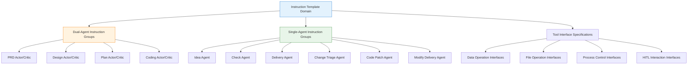
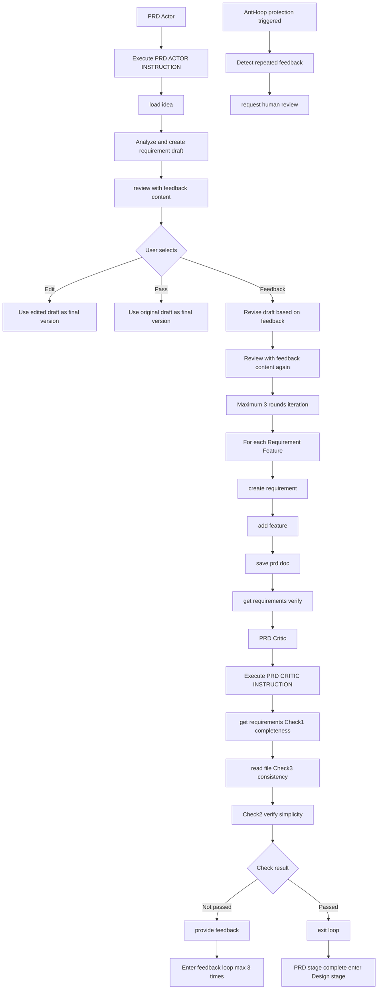

# Instruction Template Domain Technical Documentation

## 1. Overview

### 1.1 Definition and Positioning

The **Instruction Template Domain** is the core business domain of the Cowork Forge system, responsible for managing intelligent agent prompt templates (Prompt Templates) covering all stages of the software development lifecycle. Through structured instruction definitions, this domain standardizes AI agent behavior patterns in key stages such as requirements analysis, architecture design, task planning, and code implementation, ensuring consistency and output quality in multi-agent collaboration.

As the system's "central nervous system," the instruction template domain embeds the core design philosophy of **"Simplicity-First"**, preventing AI from generating over-engineered (Over-Engineering) architecture solutions through hard constraints.

### 1.2 Core Value

| Value Dimension | Specific Manifestation |
|-----------------|------------------------|
| **Behavior Standardization** | Defines unified behavior norms and output standards for 10 workflow stages |
| **Quality Constraints** | Embeds rules in instructions limiting component count (2-4), task count (5-12) |
| **Anti-Loop Protection** | Implements self-awareness mechanisms in Critic instructions to prevent infinite iterations |
| **Human-Computer Collaboration** | Inserts human review (HITL) triggers at key nodes |

### 1.3 Domain Boundaries

- **Included**: All agent system prompts, Actor-Critic interaction protocols, constraint rule definitions, tool call specifications
- **Not Included**: LLM API call implementation (belongs to LLM Service Domain), specific tool implementation logic (belongs to Tool System Domain), session state management (belongs to Data and Storage Management Domain)

## 2. Architecture Design

### 2.1 Overall Structure

The instruction template domain adopts a **modular constant definition architecture**, implementing hierarchical instruction management through Rust's module system:

```rust
// Module hierarchy structure
crates/cowork-core/src/instructions/
├── mod.rs           // Instruction aggregation module, uniformly exposes all instruction constants
├── idea.rs          // Idea Agent instructions (single agent)
├── prd.rs           // PRD stage instructions (Actor-Critic pair)
├── design.rs        // Design stage instructions (Actor-Critic pair)
├── plan.rs          // Plan stage instructions (Actor-Critic pair)
├── coding.rs        // Coding stage instructions (Actor-Critic pair)
├── check.rs         // Check Agent instructions (single agent)
├── delivery.rs      // Delivery Agent instructions (single agent)
├── modify.rs        // Change Triage Agent instructions (single agent)
├── code_patch.rs    // Code Patch Agent instructions (single agent)
└── modify_delivery.rs // Modify Delivery Agent instructions (single agent)
```

### 2.2 Actor-Critic Dual-Agent Mode

In the four key stages of PRD, Design, Plan, and Coding, the instruction template domain implements **Actor-Critic dual-agent collaboration mode**:

```
┌─────────────────────────────────────────────────────────────┐
│                        Stage Loop                           │
│  ┌──────────────┐                    ┌──────────────┐      │
│  │    Actor     │ ────(create)─────> │  Artifacts   │      │
│  │   (actor)    │                    │   (artifacts)│      │
│  └──────┬───────┘                    └──────┬───────┘      │
│         │                                   │              │
│         │<────────(validate)────────────────┘              │
│         │                                   │              │
│         │<────────(feedback loop)──────────┘              │
│         │                    max_iterations=3             │
│  ┌──────▼───────┐                                          │
│  │   Critic     │ ────(exit_loop/save)───> Next Stage     │
│  │  (critic)    │                                          │
│  └──────────────┘                                          │
└─────────────────────────────────────────────────────────────┘
```

**Instruction Responsibility Division**:
- **Actor Instructions**: Define 6-7 step workflows, responsible for content generation, calling creation tools (`create_*`), triggering human review at key steps
- **Critic Instructions**: Define 5-6 mandatory checklists, responsible for quality verification, calling read tools (`get_*`/`read_file`), controlling flow via `provide_feedback()` or `exit_loop()`

### 2.3 Architecture Flow Diagram



## 3. Core Implementation Mechanisms

### 3.1 Instruction Storage and Format

Instruction templates use **Rust constant strings** (`&'static str`), using raw string literals to preserve Markdown format and special characters:

```rust
// crates/cowork-core/src/instructions/prd.rs
pub const PRD_ACTOR_INSTRUCTION: &str = r#"
You are the PRD Actor, responsible for analyzing project requirements.
...
## Workflow
1. Use `load_idea()` to get idea document
2. Analyze requirements, create requirement draft (don't save directly)
3. Call `review_with_feedback_content()` for human review
...
## Constraint Rules
- Feature count: Core features not exceeding 5
- Complexity: Prohibit proposing microservices, cache layers, message queues, etc.
"#;
```

**Technical Characteristics**:
- **Compile-time Determination**: Uses Rust's `&'static str` for zero runtime overhead
- **Format Preservation**: Uses `r#"` wrapping to preserve Markdown code blocks, list hierarchy
- **Scale Control**: Single instruction length 1K-5K lines, ensuring behavioral description completeness

### 3.2 Simplicity-First Constraint Mechanism

Instruction templates prevent over-engineering through **explicit prohibition rules**:

| Constraint Dimension | Specific Rules | Applicable Stages |
|---------------------|----------------|-------------------|
| **Architecture Scale** | Component count limit 2-4 | Design Actor |
| **Task Granularity** | Core tasks limit 5-12 | Plan Actor |
| **Technology Selection** | Prohibit recommending Kubernetes, Redis, Kafka, etc. middleware | Design/Plan Actor |
| **Engineering Practices** | Prohibit generating test code, CI/CD configuration, performance optimization code | Coding Actor |
| **Deployment Related** | Prohibit Dockerfile, K8s YAML, etc. deployment configurations | Coding Actor |

**Constraint Implementation Method**:
Embed mandatory check items in instruction text, Critic Agent must verify:
```markdown
## Mandatory Checklist (Critic)
3. [ ] Check for non-core tasks (test/deployment/optimization)
   - If found: Mark as `over_engineering`, require deletion
```

### 3.3 Anti-Loop Protection Mechanism

To prevent Actor-Critic from falling into infinite feedback loops, self-aware detection logic is embedded in Critic instructions:

```rust
pub const PRD_CRITIC_INSTRUCTION: &str = r#"
...
## Anti-Loop Protection
If any of the following situations occur, immediately call `request_human_review()`:
1. Have given identical or similar modification suggestions 3 consecutive times
2. Actor repeatedly makes the same error
3. Unable to determine if requirements are met (ambiguity exists)

At this point, escalate to human review instead of continuing the loop.
"#;
```

## 4. Instruction Classification Details

### 4.1 Dual-Agent Instruction Groups (Actor-Critic Pairs)

#### 4.1.1 PRD Stage Instructions

**PRD Actor Instructions**:
- **Goal**: Transform idea document into structured requirement specification document
- **Key Steps**:
  1. Call `load_idea()` to load idea
  2. Create requirement and feature drafts (build in memory)
  3. Trigger `review_with_feedback_content()` human review (mandatory)
  4. Handle revisions based on review results (edit/pass/feedback)
  5. Call `save_prd_doc()` to save PRD document
  6. Use `get_requirements()` to verify save results

**PRD Critic Instructions**:
- **Verification Dimensions**:
  1. Requirement completeness check (via `get_requirements()`)
  2. Simplicity verification (no over-design)
  3. Document consistency check (compare `read_file("artifacts/prd.md")` with memory data)
- **Exit Condition**: All checks pass → call `exit_loop()`

#### 4.1.2 Design Stage Instructions

**Design Actor Instructions**:
- **Core Constraint**: Component count strictly limited to **2-4**
- **Output**: Architecture component diagram, component responsibility definitions, inter-component interface contracts
- **Review Point**: Architecture design must pass human review confirmation for component boundaries

**Design Critic Instructions**:
- **Specialized Checks**:
  - Component count verification (>4 then require merge)
  - Cyclic dependency detection (via `get_design()` analysis)
  - Simplicity verification (prohibit introducing message queues, cache layers, etc. non-essential components)

#### 4.1.3 Plan Stage Instructions

**Plan Actor Instructions**:
- **Task Count Constraint**: Core tasks **5-12**
- **Dependency Management**: Use `create_task()` to create tasks, explicitly define `dependencies` field
- **Exclusivity Rules**: Task scope limited to core feature implementation, explicitly excluding:
  - Unit test writing
  - Performance benchmarking
  - Deployment script development
  - Log monitoring system setup

**Plan Critic Instructions**:
- **Dependency Verification**: Detect cyclic dependencies via `CheckTaskDependenciesTool`
- **Coverage Check**: Verify all requirements have corresponding tasks (`CheckFeatureCoverageTool`)
- **Task Granularity Review**: Check if task descriptions are too broad (should be completable in one coding session)

#### 4.1.4 Coding Stage Instructions

**Coding Actor Instructions**:
- **Execution Mode**: Implement sequentially based on task list
- **Tool Chain**:
  - `get_plan()` to get implementation plan
  - `update_task_status()` to update task status (Todo→InProgress→Done)
  - `write_file()` to write code files
  - `read_file()` to read existing code (maintain style consistency)
- **Code Standards**:
  - Only implement business logic code
  - Prohibit creating test files (`*_test.go`, `*_spec.js`, etc.)
  - Prohibit adding performance optimization code (caching, connection pools, etc., unless explicitly required by requirements)

**Coding Critic Instructions**:
- **Verification Strategy**:
  1. Task completion check (all tasks status Done)
  2. Code quality check (file existence, syntax reasonableness)
  3. **Compliance Check**: Confirm no test code, deployment configurations mixed in

### 4.2 Single-Agent Instruction Groups

#### 4.2.1 Idea Agent Instructions

- **Responsibilities**: Transform user raw input into structured idea document
- **Process**: Understand input → Create summary → Save document → Human review → Handle edits
- **Specialty**: Only this stage and PRD/Design/Plan stages have mandatory HITL review

#### 4.2.2 Check Agent Instructions

- **Responsibilities**: Permissive quality check (Permissive Validation)
- **Characteristics**:
  - Non-blocking check (unlike Critic's cyclic feedback)
  - Verify file existence and basic completeness
  - Can trigger `request_replanning()` to request replanning

#### 4.2.3 Delivery Agent Instructions

- **Responsibilities**: Generate delivery report, summarizing complete process artifacts
- **Pre-check Requirements**: First confirm prerequisite stage completion via `get_requirements()`, `get_plan()`, etc.
- **Output Format**: Artifact inventory-like + project summary

#### 4.2.4 Incremental Modification Instruction Groups

**Change Triage Instructions**:
- **Analysis Dimensions**: Impact scope (PRD/Design/Plan/Code), risk level (Low/Medium/High)
- **Output**: Structured ChangeRequest object, saved to `save_change_request()`

**Code Patch Instructions**:
- **Execution Strategy**: Incremental code modification, required to follow existing code patterns
- **Constraints**: Only modify code directly related to change request, keep other parts unchanged

## 5. Tool Interface Specifications

The instruction template domain defines **tool interface directories** available to intelligent agents, these interfaces are implemented in the tool system domain:

### 5.1 Data Access Interfaces

```rust
// Load class (read-only)
load_idea() -> Option<Idea>
get_requirements() -> Vec<Requirement>
get_design() -> DesignSpec
get_plan() -> ImplementationPlan

// Create class (write)
create_requirement(title, description, priority) -> RequirementID
add_feature(name, description, acceptance_criteria) -> FeatureID
create_design_component(name, responsibility, interfaces) -> ComponentID
create_task(title, description, dependencies, estimated_effort) -> TaskID
update_task_status(task_id, status)
```

### 5.2 Document Artifact Interfaces

```rust
save_prd_doc(markdown_content) -> Result<PathBuf>
save_design_doc(markdown_content) -> Result<PathBuf>
save_delivery_report(content) -> Result<PathBuf>
```

### 5.3 Human-Computer Collaboration (HITL) Interfaces

```rust
// Content review (display first 12-15 lines, provide edit/pass/feedback options)
review_with_feedback_content(title, content, prompt) 
  -> Result<{action: "edit"|"pass"|"feedback", content: Option<String>}>

// Human upgrade (when loop or major ambiguity detected)
request_human_review(reason, context) -> Result<HumanResponse>
```

### 5.4 Process Control Interfaces

```rust
provide_feedback(feedback_type, message)  // Actor-Critic inter-feedback
exit_loop()                               // Critic confirms pass, end current Loop
goto_stage(stage_name)                    // Jump to specified stage (for recovery)
request_replanning(reason)                // Request rollback to Plan stage for replanning
```

## 6. Typical Interaction Flow Examples

Taking **PRD stage** as an example, showing how instruction templates coordinate Actor, Critic, and Human interactions:



## 7. Extension and Maintenance Guide

### 7.1 Adding New Stage Instructions

If needing to add new workflow stages (such as `Security Audit`):

1. **Create instruction file**: `crates/cowork-core/src/instructions/security.rs`
2. **Define Actor/Critic constants**:
   ```rust
   pub const SECURITY_ACTOR_INSTRUCTION: &str = r#"..."#;
   pub const SECURITY_CRITIC_INSTRUCTION: &str = r#"..."#;
   ```
3. **Expose in mod.rs**:
   ```rust
   pub mod security;
   pub use security::{SECURITY_ACTOR_INSTRUCTION, SECURITY_CRITIC_INSTRUCTION};
   ```
4. **Register in agent factory**: Create corresponding LoopAgent in `agents/mod.rs`

### 7.2 Modifying Constraint Rules

Adjusting simplicity constraints (such as relaxing component count limits):

- **Only modify Critic instructions**: Adjust count thresholds in checklists
- **Synchronously update Actor instructions**: Ensure creation stage constraints match Critic
- **Avoid modifying historical sessions**: Constraint changes only affect new sessions, `instructions` module is code-level configuration, non-retroactive

### 7.3 Instruction Version Management

Considering instruction template evolution, implementing **semantic version control** is recommended:

- Major behavior changes (such as new mandatory checks) → Major version upgrade
- Description optimization (no behavior logic change) → Minor version upgrade
- Typo correction → Patch version

Manage instruction versions via Git tags, facilitating rollback and A/B testing different instruction set effects.

## 8. Summary

The instruction template domain as the **intelligent behavior definition layer** of Cowork Forge, through structured Prompt Engineering implements:

1. **Standardized Agent Behavior**: Unified behavior specifications for 10 stages, ensuring end-to-end development process predictability
2. **Built-in Quality Mechanism**: Through Critic's mandatory checklists and simplicity-first constraints, preventing architecture corruption from the source
3. **Human-Computer Collaboration Integration**: Embeds HITL triggers at key quality checkpoints, achieving organic combination of AI efficiency and human judgment
4. **Resilient Fault Tolerance**: Anti-loop protection mechanisms and error recovery instructions, ensuring long-running stability

The domain design embodies the **"Prompt as Code"** philosophy, elevating AI behavior definition to the level of engineering management, serving as a core support domain for multi-agent collaboration system architecture.